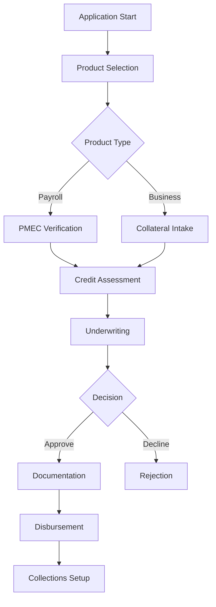
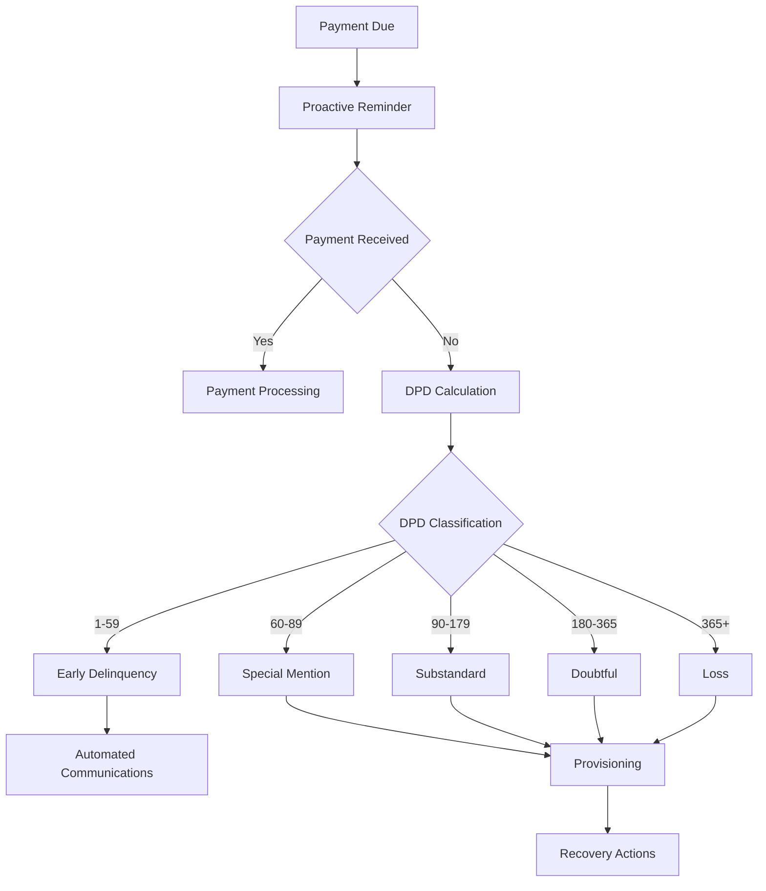
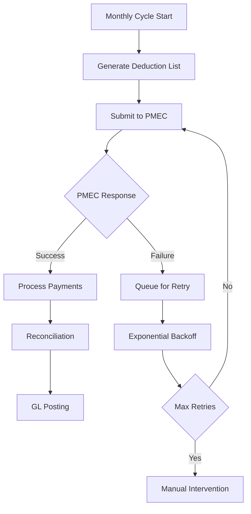
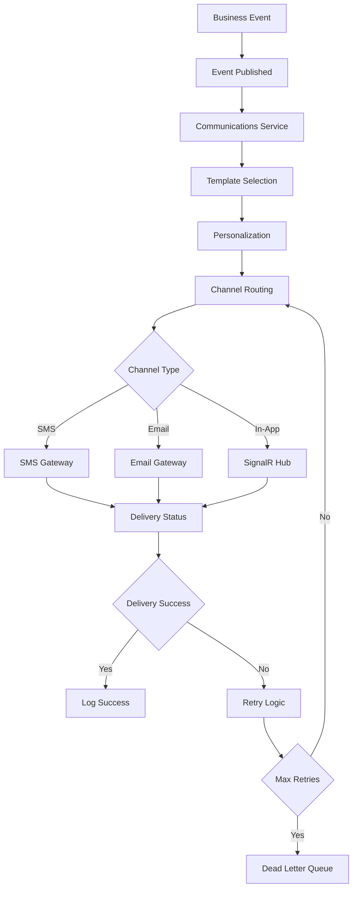

# Zambian Microfinance LMS Full-Stack Architecture Document

## Introduction

This document outlines the complete full-stack architecture for the Zambian Microfinance Loan Management System (LMS), incorporating all business rules, workflows, and compliance requirements defined across the domain specifications. This unified architecture covers both backend systems, frontend implementation, and their integration, serving as the single source of truth for AI-driven development.

This comprehensive approach combines traditional backend and frontend architecture concerns, streamlining the development process for a modern full-stack application where these concerns are increasingly intertwined, while ensuring strict compliance with Zambian regulatory requirements and business workflows.

### Starter Template or Existing Project

**N/A - Greenfield project** - This is a complete system built from scratch with no existing codebase dependencies.

### Change Log

| Date | Version | Description | Author |
|------|---------|-------------|---------|
| [Current Date] | 1.0 | Initial comprehensive architecture document incorporating all domain specifications | System Architect |

## High Level Architecture

### Technical Summary

The LMS system is architected as a cloud-native, microservices-based platform deployed on Kubernetes within Zambia's borders, ensuring complete data sovereignty. The frontend is built with Next.js for tablet-optimized loan officer interfaces, while the backend uses .NET 9 microservices with Camunda 8 workflow orchestration. The system integrates with PMEC for government payroll deductions, TransUnion for credit assessments, and Tingg for mobile money processing, all orchestrated through a comprehensive workflow engine that enforces business rules and regulatory compliance.

### Platform and Infrastructure Choice

**Platform:** Kubernetes on Zambian Infrastructure (Infratel Primary, Paratus Secondary)
**Key Services:** SQL Server Always On, Redis Cluster, RabbitMQ, Camunda 8, JasperReports, MinIO, HashiCorp Vault
**Deployment Host and Regions:** Infratel Data Center (Lusaka) - Primary, Paratus Data Center (Lusaka) - Secondary

### Repository Structure

**Structure:** Monorepo with microservices architecture
**Monorepo Tool:** Nx workspace for .NET and Next.js coordination
**Package Organization:** Domain-driven microservices with shared libraries

### High Level Architecture Diagram

```mermaid
graph TB
    subgraph "Client Layer"
        WEB[NextJS Web App<br/>Tablet-Optimized]
        CEO[CEO Offline Desktop<br/>Electron + Dual Auth]
    end

    subgraph "Kubernetes Cluster - Zambian Infrastructure"
        subgraph "API Gateway & Load Balancing"
            LB[Load Balancer]
            GATEWAY[API Gateway<br/>.NET 9 Minimal APIs]
        end
        
        subgraph "Core Microservices"
            AUTH[Identity Service<br/>JWT + Step-up Auth]
            CLIENT[Client Management<br/>KYC/AML Compliance]
            LOAN[Loan Origination<br/>Multi-Product Workflow]
            CREDIT[Credit Assessment<br/>TransUnion Integration]
            GL[General Ledger<br/>BoZ Compliance]
            PMEC_SERVICE[PMEC Anti-Corruption<br/>Layer + Queue]
            COLLECTIONS[Collections Service<br/>Automated Lifecycle]
            COMMUNICATIONS[Communications Service<br/>Multi-Channel Notifications]
            WORKFLOW[Camunda 8 (Zeebe)<br/>Business Process Engine]
            REPORT[Reporting Service<br/>JasperReports Integration]
            SYNC[Offline Sync Service<br/>Conflict Resolution]
        end

        subgraph "Message Queues & Caching"
            SERVICEBUS[RabbitMQ<br/>In-Country Messaging]
            REDIS[Redis Cache<br/>Performance Layer]
        end
    end

    subgraph "External Integration Layer"
        PMEC[PMEC Government System<br/>Payroll Deductions]
        TRANSUNION[TransUnion Zambia<br/>Credit Bureau API]
        TINGG[Tingg Payment Gateway<br/>Mobile Money]
        SMS[SMS Gateway Provider]
        BANK[Local Banking Systems]
    end

    subgraph "Primary Data Center - Infratel"
        PRIMARY_SQL[(SQL Server Always On<br/>Primary + Read Replica)]
        AUDIT_DB[(Separate Audit Database<br/>Compliance Isolation)]
        MINIO_PRIMARY[MinIO Object Storage<br/>Document Management]
        VAULT_PRIMARY[HashiCorp Vault<br/>Secrets Management]
    end

    subgraph "Secondary Data Center - Paratus"
        SECONDARY_SQL[(SQL Server Always On<br/>Async Secondary - 1hr RPO)]
        AUDIT_BACKUP[(Audit Database<br/>Backup Instance)]
        MINIO_SECONDARY[MinIO Backup<br/>10-year Retention]
        VAULT_SECONDARY[HashiCorp Vault<br/>Backup Instance]
    end

    subgraph "Background Processing"
        JOBS[Background Services<br/>Compliance Automation]
        DR_TEST[Semi-Annual DR Testing<br/>Manual Procedures]
    end

    subgraph "Monitoring & Compliance"
        MONITOR[Application Insights<br/>Performance Metrics]
        LOGS[Centralized Logging<br/>Operational Events]
        AUDIT_MONITOR[Audit Trail Monitor<br/>BoZ Compliance]
    end

    WEB --> LB
    CEO -.->|Encrypted Sync<br/>Conflict Resolution| SYNC
    WEB --> REPORT
    
    LB --> GATEWAY
    GATEWAY --> AUTH
    
    AUTH --> CLIENT
    AUTH --> LOAN  
    AUTH --> CREDIT
    AUTH --> GL
    AUTH --> COLLECTIONS
    AUTH --> COMMUNICATIONS
    AUTH --> REPORT
    
    CLIENT --> REDIS
    GL --> REDIS

    %% Orchestration links
    LOAN --> WORKFLOW
    CREDIT --> WORKFLOW
    PMEC_SERVICE --> WORKFLOW
    COLLECTIONS --> WORKFLOW
    COMMUNICATIONS --> WORKFLOW
    SYNC --> WORKFLOW
    WORKFLOW --> REPORT
    
    LOAN --> PMEC_SERVICE
    CREDIT --> SERVICEBUS
    PMEC_SERVICE --> SERVICEBUS
    COLLECTIONS --> SERVICEBUS
    COMMUNICATIONS --> SERVICEBUS
    
    PMEC_SERVICE -.->|Queue Resilience| PMEC
    CREDIT --> TRANSUNION
    COLLECTIONS --> TINGG
    COMMUNICATIONS --> SMS
    GL --> BANK
    
    CLIENT --> PRIMARY_SQL
    LOAN --> PRIMARY_SQL
    CREDIT --> PRIMARY_SQL
    GL --> PRIMARY_SQL
    COLLECTIONS --> PRIMARY_SQL
    COMMUNICATIONS --> PRIMARY_SQL
    
    REPORT --> PRIMARY_SQL
    JOBS --> PRIMARY_SQL
    
    AUTH --> AUDIT_DB
    CLIENT --> AUDIT_DB
    LOAN --> AUDIT_DB
    PMEC_SERVICE --> AUDIT_DB
    COLLECTIONS --> AUDIT_DB
    COMMUNICATIONS --> AUDIT_DB
    
    CLIENT --> MINIO_PRIMARY
    LOAN --> MINIO_PRIMARY
    
    PRIMARY_SQL -.->|Async Replication<br/>Manual Failover| SECONDARY_SQL
    AUDIT_DB -.->|Replication| AUDIT_BACKUP
    MINIO_PRIMARY -.->|Geo Replication| MINIO_SECONDARY
    VAULT_PRIMARY -.->|Backup Sync| VAULT_SECONDARY
    
    PMEC_SERVICE --> VAULT_PRIMARY
    CREDIT --> VAULT_PRIMARY
    TINGG --> VAULT_PRIMARY
    
    JOBS --> REDIS
    
    DR_TEST -.->|Semi-Annual<br/>Manual Testing| SECONDARY_SQL
    
    CLIENT --> MONITOR
    LOAN --> MONITOR
    GL --> MONITOR
    PMEC_SERVICE --> MONITOR
    COLLECTIONS --> MONITOR
    COMMUNICATIONS --> MONITOR
    
    AUDIT_DB --> AUDIT_MONITOR
    AUDIT_BACKUP --> AUDIT_MONITOR
```

### Architectural Patterns

- **Microservices Architecture:** Domain-driven services with clear boundaries - _Rationale:_ Enables independent scaling, deployment, and maintenance of complex business domains
- **Event-Driven Architecture:** Camunda 8 orchestration with RabbitMQ messaging - _Rationale:_ Ensures reliable business process execution and system resilience
- **CQRS Pattern:** Command/Query separation for loan origination - _Rationale:_ Optimizes read/write operations and enables complex business rule enforcement
- **Anti-Corruption Layer:** PMEC integration isolation - _Rationale:_ Protects core business logic from external system changes and failures
- **Repository Pattern:** Data access abstraction - _Rationale:_ Enables testing and future database migration flexibility
- **API Gateway Pattern:** Single entry point for all API calls - _Rationale:_ Centralized auth, rate limiting, and monitoring
- **Circuit Breaker Pattern:** External API resilience - _Rationale:_ Prevents cascade failures from external system outages
- **Saga Pattern:** Distributed transaction management - _Rationale:_ Ensures data consistency across microservices for complex business processes

## Tech Stack

### Technology Stack Table

| Category | Technology | Version | Purpose | Rationale |
|----------|------------|---------|---------|-----------|
| Frontend Language | TypeScript | 5.3+ | Type-safe frontend development | Ensures code quality and reduces runtime errors |
| Frontend Framework | Next.js | 15+ | React-based web application | Server-side rendering, excellent performance, tablet optimization |
| UI Component Library | Tailwind CSS + Custom Components | 3.4+ | Styling and component system | Rapid development, consistent design system |
| State Management | React Query + Zustand | 5.0+ / 4.4+ | Client state and server state management | Optimized data fetching and caching |
| Backend Language | C# | 12.0 (.NET 9) | Enterprise backend development | Strong typing, excellent performance, rich ecosystem |
| Backend Framework | ASP.NET Core | 9.0 | Web API development | Minimal APIs, built-in dependency injection, excellent performance |
| API Style | REST + GraphQL (future) | OpenAPI 3.0 | API design and documentation | Standard REST for current needs, GraphQL for future flexibility |
| Database | SQL Server | 2022 | Primary data storage | ACID compliance, excellent performance, Always On availability |
| Caching | Redis | 7.2+ | Performance optimization | Sub-second response times, session management |
| Message Queue | RabbitMQ | 3.12+ | Reliable messaging | In-country deployment, durable messaging, DLQ support |
| Workflow Engine | Camunda 8 (Zeebe) | 8.4+ | Business process orchestration | BPMN compliance, excellent monitoring, human task support |
| Reporting Engine | JasperReports Server | 8.0+ | Regulatory and business reporting | Pixel-perfect BoZ reports, scheduling, parameterization |
| Object Storage | MinIO | RELEASE.2024-01-16T16-07-38Z | Document and file storage | S3-compatible, in-country deployment, audit logging |
| Secrets Management | HashiCorp Vault | 1.15+ | Credential and secret management | Secure credential rotation, audit trails |
| Desktop Framework | Electron | 28+ | CEO offline application | Cross-platform, native performance, offline capabilities |
| Authentication | ASP.NET Core Identity | 9.0 | User authentication and authorization | Built-in security, step-up authentication, RBAC |
| Testing Framework | xUnit + Playwright | 3.0+ / 1.40+ | Backend and frontend testing | Comprehensive test coverage, E2E testing |
| Build Tool | .NET CLI + npm | 9.0 / 10.0+ | Build and package management | Native tooling, excellent performance |
| Deployment | Kubernetes + Helm | 1.28+ / 3.13+ | Container orchestration and deployment | Auto-scaling, rolling updates, health checks |
| Monitoring | Application Insights | Latest | Application performance monitoring | Comprehensive metrics, alerting, diagnostics |
| Logging | Serilog + ELK Stack | 3.1+ / 8.11+ | Structured logging and analysis | Centralized logging, searchable logs, compliance |

## System Architecture

### Core Microservices Architecture

#### 1. Identity Service
**Purpose:** User authentication, authorization, and session management
**Key Features:**
- JWT-based authentication with refresh tokens
- Step-up authentication for sensitive operations
- Role-based access control (RBAC) with branch context
- Session management with Redis-based token revocation
- Audit logging for all authentication events

**Business Rules Integration:**
- CEO authorization workflows for offline operations
- Branch-specific access controls
- Dual-control authentication for sensitive operations
- Compliance with Zambian Data Protection Act

#### 2. Client Management Service
**Purpose:** Customer profile management, KYC/AML compliance, and document handling
**Key Features:**
- Comprehensive customer profile management
- KYC document validation and storage
- Government employee verification via PMEC
- Document access logging for compliance
- 10-year retention policy enforcement

**Business Rules Integration:**
- BoZ KYC requirements enforcement
- PMEC employee verification workflows
- Document lifecycle management
- Cross-branch customer access with attribution

#### 3. Loan Origination Service
**Purpose:** Multi-product loan application processing and approval workflows
**Key Features:**
- Payroll-based (MOU) loan processing
- Collateral-based business loan processing
- Automated underwriting workflows
- Document management and validation
- Interest rate cap compliance (48% EAR)

**Business Rules Integration:**
- Money Lenders Act compliance (interest rate caps)
- Product-specific workflow orchestration
- Collateral management and valuation
- CEO offline authorization workflows

#### 4. Credit Assessment Service
**Purpose:** Credit bureau integration and risk assessment
**Key Features:**
- TransUnion Zambia API integration
- First-time applicant credit checks only
- Automated credit scoring
- Queue-based processing for reliability
- Cost optimization through intelligent routing

**Business Rules Integration:**
- First-time applicant classification
- Credit bureau cost management
- Automated retry mechanisms
- Audit trail for all credit decisions

#### 5. General Ledger Service
**Purpose:** Double-entry accounting and BoZ compliance
**Key Features:**
- Automated transaction posting
- BoZ-compliant chart of accounts
- Real-time balance calculations
- Automated provisioning calculations
- Regulatory reporting preparation

**Business Rules Integration:**
- Transaction processing rules enforcement
- BoZ prudential guidelines compliance
- Automated loan classification and provisioning
- Non-accrual status management

#### 6. PMEC Anti-Corruption Layer
**Purpose:** Government payroll system integration with resilience
**Key Features:**
- PMEC system integration
- Queue-based processing for downtime resilience
- Automated retry mechanisms
- Data transformation and validation
- Comprehensive audit logging

**Business Rules Integration:**
- Government employee verification
- Payroll deduction processing
- Exception handling and manual overrides
- Compliance with government data requirements

#### 7. Collections Service
**Purpose:** Automated collections lifecycle management
**Key Features:**
- Automated DPD calculation and classification
- BoZ-compliant loan classification
- Automated provisioning calculations
- Communication workflows
- Recovery process management

**Business Rules Integration:**
- BoZ loan classification rules (Current, Special Mention, Substandard, Doubtful, Loss)
- Automated provisioning rates (1%, 25%, 50%, 100%)
- Non-accrual status management
- Collections communication workflows

#### 8. Communications Service
**Purpose:** Centralized notification and communication management
**Key Features:**
- Multi-channel communication (SMS, Email, In-App, Push)
- Template management with personalization
- Event-driven and scheduled communication triggers
- Delivery status tracking and retry logic
- Customer communication preferences management

**Business Rules Integration:**
- Automated payment reminders and overdue notifications
- Loan origination workflow communications
- Collections lifecycle communication automation
- Regulatory compliance communication requirements
- Customer opt-out and preference management

#### 9. Reporting Service
**Purpose:** Regulatory and business reporting
**Key Features:**
- JasperReports Server integration
- BoZ prudential reporting
- Automated report scheduling
- Parameterized report generation
- Audit trail for all reports

**Business Rules Integration:**
- BoZ reporting requirements
- Automated report generation and submission
- Report access controls and audit trails
- Compliance monitoring and alerting

### Workflow Orchestration with Camunda 8

#### Business Process Models

**1. Loan Origination Workflow**


**2. Collections Lifecycle Workflow**


**3. PMEC Integration Workflow**


**4. Communications Workflow**


### Data Architecture

#### Core Data Models

**Client Management:**
```sql
-- Core client information
Client (id, nrc, firstName, lastName, dob, branchId, status, createdAt, updatedAt)
GovernmentEmployment (clientId, pmecNumber, employerId, salary, verifiedAt)
KycDocument (id, clientId, type, objectKey, checksum, retentionAt, createdBy, createdAt)
Address (id, clientId, type, address, city, province, postalCode, isPrimary)
Contact (id, clientId, type, value, isPrimary, verifiedAt)
```

**Loan Origination:**
```sql
-- Loan application and processing
LoanApplication (id, clientId, productType, principal, termMonths, rateAPR, status, createdAt, approvedAt)
LoanProduct (id, name, type, maxAmount, minAmount, maxTerm, minTerm, rateAPR, fees)
CollateralAsset (id, applicationId, type, description, value, insuredUntil, status)
UnderwritingNote (id, applicationId, underwriterId, decision, notes, createdAt)
ApprovalStep (id, applicationId, approverId, level, decision, comments, timestamp)
```

**Credit Assessment:**
```sql
-- Credit bureau integration
CreditReport (id, clientId, score, rawBlobKey, cost, requestedAt, returnedAt, status)
CreditAssessment (id, applicationId, reportId, decision, riskLevel, createdAt)
```

**General Ledger:**
```sql
-- Double-entry accounting
GLAccount (id, code, name, type, parentId, branchId, isActive)
JournalEntry (id, debitAccountId, creditAccountId, amount, currency, valueDate, ref, description, createdAt)
PostingRule (id, eventType, mappingJson, isActive)
```

**Collections:**
```sql
-- Collections lifecycle management
DeductionCycle (id, period, status, createdAt, completedAt)
DeductionItem (id, cycleId, loanId, expected, actual, variance, status)
Payment (id, loanId, amount, method, externalRef, postedAt, reconciledAt)
```

**Communications:**
```sql
-- Notification and communication management
CommunicationsLog (id, eventId, recipientId, recipientType, channel, templateId, content, personalizationData, status, gatewayResponse, createdAt, sentAt, deliveredAt, failureReason, retryCount, maxRetries)
NotificationTemplates (id, name, category, channel, language, subject, content, personalizationTokens, isActive, createdBy, createdAt, updatedBy, updatedAt, version)
InAppNotifications (id, userId, title, message, notificationType, actionUrl, isRead, createdAt, readAt, expiresAt)
CommunicationRouting (id, eventType, recipientType, channel, templateId, priority, isActive, createdAt)
CustomerCommunicationPreferences (id, customerId, preferenceType, enabled, channels, frequency, optOutDate, createdAt, updatedAt)
```

**Audit and Compliance:**
```sql
-- Comprehensive audit trail
AuditEvent (id, actorId, action, entity, entityId, timestamp, ip, detailsJson, branchId)
```

#### Data Storage Strategy

**Primary Database:** SQL Server Always On with primary and read replica
**Audit Database:** Separate database for compliance isolation
**Caching:** Redis for frequently accessed data (client lookups, GL balances)
**Document Storage:** MinIO with comprehensive access logging
**Backup Strategy:** Hourly backups with 1-hour RPO to secondary data center

### API Architecture

#### Internal API Design

**Client Management APIs:**
```http
GET /api/clients?query={search}&branchId={id}&page={n}&pageSize={n}
POST /api/clients
GET /api/clients/{id}
POST /api/clients/{id}/documents
PUT /api/clients/{id}/kyc
```

**Loan Origination APIs:**
```http
POST /api/origination/applications
GET /api/origination/applications/{id}
POST /api/origination/applications/{id}/approve
POST /api/origination/applications/{id}/documents
GET /api/origination/workflows/{instanceId}
```

**Collections APIs:**
```http
POST /api/collections/pemc/cycles
GET /api/collections/exceptions
POST /api/collections/payments
GET /api/collections/reports/dpd
```

**Communications APIs:**
```http
POST /api/communications/send
GET /api/communications/templates
POST /api/communications/templates
PUT /api/communications/templates/{id}
GET /api/communications/logs
GET /api/communications/preferences/{customerId}
PUT /api/communications/preferences/{customerId}
GET /api/communications/notifications
PUT /api/communications/notifications/{id}/read
```

**General Ledger APIs:**
```http
GET /api/gl/accounts/{id}/balance?asOf={date}
POST /api/gl/postings
GET /api/gl/reports/provisioning
GET /api/gl/reports/boz
```

#### External Integration APIs

**PMEC Integration:**
- VerifyEmployee: Government employee verification
- SubmitDeductions: Monthly payroll deduction submission
- FetchResults: Deduction processing results

**TransUnion Integration:**
- CreditReport: Credit bureau data retrieval
- Cost optimization through intelligent routing

**Tingg Payment Gateway:**
- PaymentIntents: Mobile money payment processing
- Payouts: Disbursement processing
- Webhooks: Payment status notifications

**SMS Gateway (Africa's Talking):**
- SendSMS: Customer notification delivery
- DeliveryStatus: Webhook callbacks for delivery confirmation
- Cost tracking and usage monitoring

### Security Architecture

#### Authentication and Authorization

**Multi-Factor Authentication:**
- Primary: Username/password with JWT tokens
- Step-up: TOTP or WebAuthn for sensitive operations
- Offline: Dual-control authentication for CEO operations

**Role-Based Access Control:**
- Loan Officer: Application processing, customer management
- Underwriter: Credit decisions, approval workflows
- Finance: GL management, reporting
- Collections: Payment processing, recovery actions
- Compliance: Audit access, regulatory reporting
- CEO: Offline authorization, risk limit configuration
- Admin: System configuration, user management

#### Data Security

**Encryption:**
- TLS 1.3 for all data in transit
- AES-256 encryption for data at rest
- Field-level encryption for sensitive PII
- SQLCipher for offline database encryption

**Access Controls:**
- Branch-context enforcement
- Principle of least privilege
- Regular access reviews
- Automated privilege escalation detection

### Infrastructure Architecture

#### Kubernetes Deployment

**Cluster Configuration:**
- 3+ nodes per data center
- Horizontal Pod Autoscaling (HPA)
- Resource quotas and limits
- Health checks and readiness probes

**Service Mesh:**
- Istio for service-to-service communication
- Traffic management and load balancing
- Security policies and mTLS
- Observability and monitoring

#### Data Center Architecture

**Primary Data Center (Infratel):**
- SQL Server Always On primary
- Redis cluster
- RabbitMQ cluster
- MinIO cluster
- HashiCorp Vault HA

**Secondary Data Center (Paratus):**
- SQL Server Always On secondary (async replication)
- Backup instances of all services
- 1-hour RPO with manual failover
- Semi-annual disaster recovery testing

### Monitoring and Observability

#### Application Monitoring

**Metrics Collection:**
- Application Insights for .NET services
- Custom metrics for business KPIs
- Performance counters and health checks
- User experience monitoring

**Logging Strategy:**
- Structured logging with Serilog
- Centralized log aggregation with ELK stack
- Log retention policies for compliance
- Real-time log analysis and alerting

#### Business Monitoring

**Compliance Monitoring:**
- Real-time BoZ compliance metrics
- Automated alerting for threshold breaches
- Regulatory reporting status tracking
- Audit trail monitoring

**Operational Monitoring:**
- Loan processing pipeline health
- PMEC integration status
- Collections performance metrics
- System availability and performance

## Implementation Roadmap

### Phase 1: Foundation (Months 1-2)
- Core microservices architecture setup
- Camunda 8 workflow engine deployment
- Basic authentication and authorization
- Database schema implementation
- PMEC Anti-Corruption Layer development

### Phase 2: Core Functionality (Months 3-4)
- Client management and KYC workflows
- Loan origination workflows
- Credit assessment integration
- General ledger implementation
- Basic reporting capabilities

### Phase 3: Advanced Features (Months 5-6)
- Collections lifecycle automation
- CEO offline command center
- Advanced reporting and analytics
- Security hardening and compliance
- Performance optimization

### Phase 4: Production Deployment (Months 7-8)
- Production environment setup
- User acceptance testing
- Staff training and documentation
- Go-live and production support
- Monitoring and maintenance procedures

## Risk Mitigation

### Technical Risks
- **PMEC Integration Failures:** Queue-based processing with manual overrides
- **Performance Degradation:** Intelligent caching and read replica strategies
- **Data Loss:** Comprehensive backup and disaster recovery procedures
- **Security Breaches:** Multi-layered security with continuous monitoring

### Business Risks
- **Regulatory Changes:** Flexible architecture supporting configuration changes
- **Staff Training:** Comprehensive training programs with ongoing support
- **Business Continuity:** Offline operation capabilities with manual procedures
- **Compliance Violations:** Automated compliance monitoring and alerting

## Success Metrics

### Technical Metrics
- **Availability:** 99.5% uptime SLA
- **Performance:** Sub-3 second page loads, sub-10 second dashboard responses
- **Scalability:** Support for 50+ concurrent users without degradation
- **Security:** Zero security incidents, 100% compliance audit pass rate

### Business Metrics
- **Loan Processing:** Sub-24 hour application-to-decision time
- **Collections:** >95% automated collection success rate
- **Compliance:** 100% on-time BoZ reporting submission
- **Customer Satisfaction:** >90% user satisfaction rating

---

This comprehensive architecture document serves as the definitive guide for building the Zambian Microfinance LMS system, incorporating all business rules, workflows, and compliance requirements while ensuring scalability, security, and regulatory compliance.
