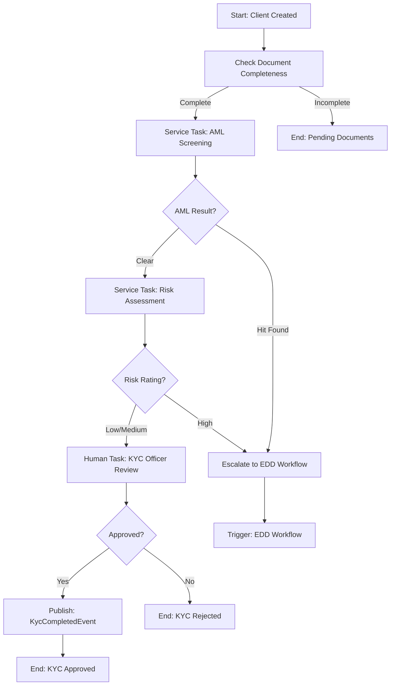
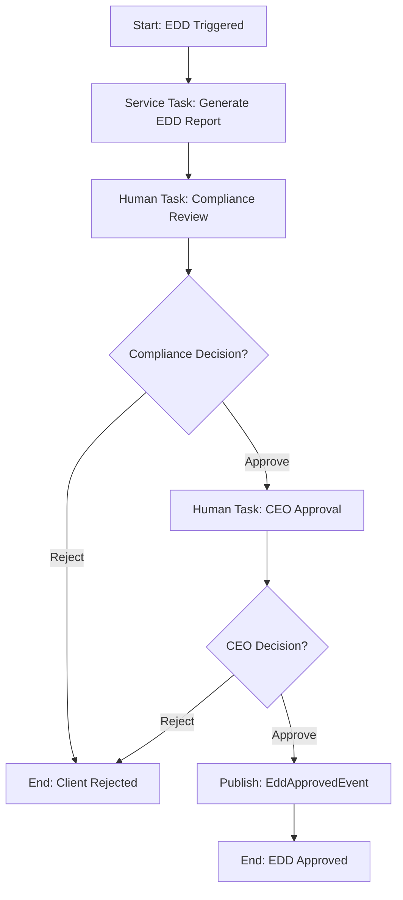
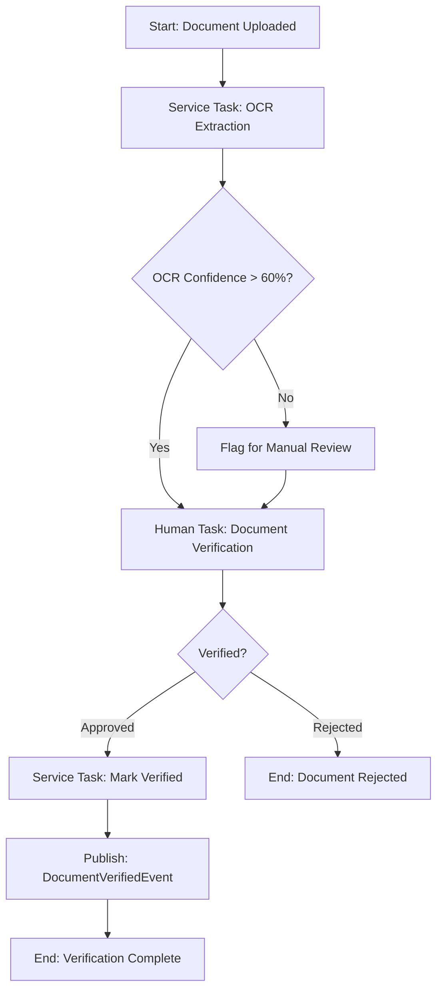

# Client Management Module - Brownfield Architecture Document

## Document Control

### Change Log

| Date       | Version | Description                                      | Author    |
|------------|---------|--------------------------------------------------|-----------|
| 2025-10-16 | 1.0     | Initial brownfield analysis and enhancement plan | Architect |

### Document Scope

This document captures the **CURRENT STATE** of the Client Management module and defines the **ENHANCEMENT ARCHITECTURE** to transform it from a basic data store into a comprehensive compliance engine. The enhancement covers:

- Unified customer records with full version history
- Document lifecycle management (MinIO + SQL metadata)
- KYC/AML workflow orchestration via Camunda
- Dual-control document verification
- Vault-based risk profiling engine
- Consent-based communication framework
- AdminService audit trail integration
- BoZ 7-year retention compliance

---

## Executive Summary

### Current State

The Client Management module (`apps\IntelliFin.ClientManagement\`) currently exists as a **minimal ASP.NET Core 9 service** with:
- Basic web application scaffold (Program.cs, appsettings.json)
- OpenTelemetry observability integration
- Health check endpoint
- **NO business logic, data models, or domain services yet implemented**

Related services that handle client-adjacent concerns:
- **IntelliFin.KycDocumentService**: Separate service for document upload/verification (already has MinIO integration)
- **IntelliFin.AdminService**: Centralized audit logging and compliance reporting
- **IntelliFin.Communications**: Multi-channel notification service (SMS, Email, In-App)

### Enhancement Vision

Transform Client Management into the **single source of truth** and **compliance engine** for all customer data with:

1. **Unified Customer Model**: One profile per customer across all branches, tracked by NRC/Payroll ID
2. **Temporal Versioning**: Full snapshot history (SCD-2) for every customer record change
3. **Document Lifecycle**: MinIO Object Lock + SQL metadata with dual-control verification
4. **Workflow Orchestration**: Camunda-driven KYC, AML, and EDD processes
5. **Risk Profiling**: Vault-based scoring rules with hot-reload capability
6. **Consent Management**: Customer communication preferences with audit trail
7. **Compliance-Ready**: BoZ 7-year retention, sanctions screening, PEP checks

---

## Quick Reference - Key Files and Entry Points

### Current Client Management Module Files

| File | Purpose | Status |
|------|---------|--------|
| `apps\IntelliFin.ClientManagement\Program.cs` | Service entry point | ✅ Minimal scaffold exists |
| `apps\IntelliFin.ClientManagement\appsettings.json` | Configuration | ✅ Basic OTEL config |
| `apps\IntelliFin.ClientManagement\IntelliFin.ClientManagement.csproj` | Project dependencies | ✅ References Shared.Observability |

### Related Service Files (Existing Patterns to Follow)

| Service | Key Files | Notes |
|---------|-----------|-------|
| **KycDocumentService** | `Models\KycDocument.cs`<br/>`Services\MinioDocumentStorageService.cs`<br/>`Services\IDocumentValidationService.cs` | ✅ MinIO integration working<br/>✅ Document metadata model<br/>✅ Hash verification |
| **AdminService** | `Models\AuditEvent.cs`<br/>`Services\IAuditService.cs` | ✅ Audit event structure<br/>✅ Batch logging capability<br/>✅ Chain integrity verification |
| **Communications** | `Services\EventRoutingService.cs`<br/>`Models\EmailModels.cs`<br/>`Models\SmsModels.cs` | ✅ Multi-channel delivery<br/>✅ Event-driven triggers<br/>✅ Template management |

### Enhancement Impact Areas

The following components will be **CREATED** during enhancement:

**New Directories:**
```
apps\IntelliFin.ClientManagement\
├── Controllers\
│   ├── ClientController.cs
│   ├── ClientDocumentController.cs
│   ├── KycController.cs
│   └── RiskProfileController.cs
├── Domain\
│   ├── Entities\
│   │   ├── Client.cs
│   │   ├── ClientVersion.cs
│   │   ├── ClientDocument.cs
│   │   ├── KycStatus.cs
│   │   ├── AmlScreening.cs
│   │   ├── RiskProfile.cs
│   │   └── CommunicationConsent.cs
│   ├── Events\
│   │   ├── ClientCreatedEvent.cs
│   │   ├── ClientUpdatedEvent.cs
│   │   ├── KycCompletedEvent.cs
│   │   ├── EddEscalatedEvent.cs
│   │   └── RiskProfileUpdatedEvent.cs
│   └── ValueObjects\
│       ├── Nrc.cs
│       ├── PayrollNumber.cs
│       └── ContactPreferences.cs
├── Services\
│   ├── ClientService.cs
│   ├── ClientVersioningService.cs
│   ├── DocumentLifecycleService.cs
│   ├── KycWorkflowService.cs
│   ├── RiskScoringService.cs
│   └── ConsentManagementService.cs
├── Workflows\
│   ├── CamundaWorkers\
│   │   ├── KycVerificationWorker.cs
│   │   ├── AmlScreeningWorker.cs
│   │   ├── DocumentDualControlWorker.cs
│   │   └── RiskAssessmentWorker.cs
│   └── WorkflowModels\
│       ├── KycWorkflowContext.cs
│       └── EddEscalationContext.cs
├── Infrastructure\
│   ├── Persistence\
│   │   ├── ClientManagementDbContext.cs
│   │   ├── Configurations\
│   │   └── Migrations\
│   └── VaultClient\
│       └── RiskConfigProvider.cs
└── Integration\
    ├── AdminServiceClient.cs
    ├── CommunicationsClient.cs
    └── PmecEventPublisher.cs
```

**New Database Tables** (SQL Server):
- `Clients` - Current customer records
- `ClientVersions` - Full history with SCD-2 temporal tracking
- `ClientDocuments` - Metadata for MinIO objects
- `KycStatuses` - KYC/AML compliance state
- `AmlScreenings` - Sanctions/PEP check results
- `RiskProfiles` - Computed risk scores
- `CommunicationConsents` - Channel preferences

**New Camunda BPMN Processes:**
- `client_kyc_v1.bpmn` - Standard KYC verification flow
- `client_edd_v1.bpmn` - Enhanced Due Diligence escalation
- `client_document_verification_v1.bpmn` - Dual-control document approval

**New Vault Secrets/Config:**
- `intellifin/client-management/risk-scoring-rules` (KV v2)
- `intellifin/client-management/sanctions-lists` (KV v2)

---

## High Level Architecture

### Technical Summary

**Runtime:** .NET 9.0 (C# 12)  
**Framework:** ASP.NET Core Minimal APIs  
**Database:** SQL Server 2022 (Always On)  
**Document Storage:** MinIO with Object Lock (WORM)  
**Workflow Engine:** Camunda 8 (Zeebe)  
**Secrets:** HashiCorp Vault (KV v2)  
**Messaging:** RabbitMQ  
**Observability:** OpenTelemetry → Application Insights  

### Current Tech Stack (From csproj)

| Category | Technology | Version | Notes |
|----------|------------|---------|-------|
| Runtime | .NET | 9.0 | Nullable enabled, implicit usings |
| Web Framework | ASP.NET Core | 9.0 | Minimal APIs |
| OpenAPI | Microsoft.AspNetCore.OpenApi | 9.0.7 | Auto-generated API docs |
| Observability | IntelliFin.Shared.Observability | Internal | Serilog + OTEL instrumentation |

### Enhancement Tech Stack (To Be Added)

| Category | Technology | Purpose |
|----------|------------|---------|
| ORM | Entity Framework Core | 9.0 | Data access + migrations |
| Validation | FluentValidation | 11.9+ | Input validation |
| Camunda Client | Zeebe .NET Client | 2.6+ | Workflow worker registration |
| MinIO Client | Minio.NET | 6.0+ | Object storage (reuse from KycDocumentService) |
| Vault Client | VaultSharp | 1.15+ | Config/secrets retrieval |
| Messaging | MassTransit + RabbitMQ | 8.2+ | Domain event publishing |
| HTTP Clients | Refit | 7.0+ | Typed HTTP clients for AdminService/Communications |

---

## Source Tree and Module Organization

### Current Project Structure (Minimal)

```
apps\IntelliFin.ClientManagement\
├── bin\                         # Build outputs (Debug/Release)
├── obj\                         # Intermediate build artifacts
├── Properties\
│   └── launchSettings.json      # Local dev settings
├── IntelliFin.ClientManagement.csproj
├── IntelliFin.ClientManagement.http  # HTTP request samples
├── Program.cs                   # ⚠️ MINIMAL - only health check
├── appsettings.json
└── appsettings.Development.json
```

**Current Program.cs (As-Is):**
```csharp
using IntelliFin.Shared.Observability;
var builder = WebApplication.CreateBuilder(args);

builder.Services.AddOpenTelemetryInstrumentation(builder.Configuration);
builder.Services.AddOpenApi();
builder.Services.AddHealthChecks();

var app = builder.Build();

if (app.Environment.IsDevelopment())
{
    app.MapOpenApi();
}

app.UseHttpsRedirection();
app.MapHealthChecks("/health");
app.MapGet("/", () => Results.Ok(new { name = "IntelliFin.ClientManagement", status = "OK" }));

app.Run();
```

### Enhancement Project Structure (Target)

```
apps\IntelliFin.ClientManagement\
├── Controllers\              # REST API controllers
├── Domain\
│   ├── Entities\            # Core domain models
│   ├── Events\              # Domain events (published to RabbitMQ)
│   └── ValueObjects\        # DDD value objects (Nrc, PayrollNumber)
├── Services\                # Business logic services
├── Workflows\
│   ├── CamundaWorkers\      # Zeebe job workers
│   └── WorkflowModels\      # Workflow context/DTOs
├── Infrastructure\
│   ├── Persistence\         # EF Core DbContext, configurations
│   └── VaultClient\         # Vault integration
├── Integration\             # HTTP clients for other services
├── Middleware\              # Custom middleware (audit, correlation)
├── Extensions\              # DI registration extensions
└── [existing files]
```

### Key Shared Libraries (Already Available)

| Library | Purpose | Usage in Client Management |
|---------|---------|---------------------------|
| `IntelliFin.Shared.Observability` | Serilog + OTEL | ✅ Already configured |
| `IntelliFin.Shared.Audit` | Audit abstractions | Will use for audit event creation |
| `IntelliFin.Shared.Authentication` | JWT validation | Will add for API auth |
| `IntelliFin.Shared.DomainModels` | Shared domain types | Will extend with Client types |
| `IntelliFin.Shared.Infrastructure` | Common infra utilities | Will use for DbContext base |
| `IntelliFin.Shared.Validation` | Validation helpers | Will use for input validation |

---

## Data Models and Database Architecture

### Core Domain Entities

#### 1. Client (Current Record - Primary Table)

**Purpose:** Single source of truth for customer profile (current state only)

```csharp
public class Client
{
    public Guid Id { get; set; }                    // Primary key
    public string Nrc { get; set; }                 // Unique - National Registration Card
    public string? PayrollNumber { get; set; }      // Reserved for PMEC integration
    public string FirstName { get; set; }
    public string LastName { get; set; }
    public string? OtherNames { get; set; }
    public DateTime DateOfBirth { get; set; }
    public string Gender { get; set; }              // M, F, Other
    public string MaritalStatus { get; set; }
    public string? Nationality { get; set; }
    
    // Employment (Reserved for PMEC)
    public string? Ministry { get; set; }           // Reserved field
    public string? EmployerType { get; set; }       // Reserved: Government, Private, Self
    public string? EmploymentStatus { get; set; }   // Reserved: Active, Suspended, Terminated
    
    // Contact
    public string PrimaryPhone { get; set; }
    public string? SecondaryPhone { get; set; }
    public string? Email { get; set; }
    public string PhysicalAddress { get; set; }
    public string City { get; set; }
    public string Province { get; set; }
    
    // Compliance
    public string KycStatus { get; set; }           // Pending, Approved, EDD_Required, Rejected
    public DateTime? KycCompletedAt { get; set; }
    public string? KycCompletedBy { get; set; }
    public string AmlRiskLevel { get; set; }        // Low, Medium, High
    public bool IsPep { get; set; }                 // Politically Exposed Person
    public bool IsSanctioned { get; set; }
    
    // Risk
    public string RiskRating { get; set; }          // Low, Medium, High
    public DateTime? RiskLastAssessedAt { get; set; }
    
    // Lifecycle
    public string Status { get; set; }              // Active, Inactive, Archived
    public Guid BranchId { get; set; }              // Originating branch
    public DateTime CreatedAt { get; set; }
    public string CreatedBy { get; set; }
    public DateTime UpdatedAt { get; set; }
    public string UpdatedBy { get; set; }
    public int VersionNumber { get; set; }          // Current version
    
    // Navigation
    public ICollection<ClientVersion> Versions { get; set; }
    public ICollection<ClientDocument> Documents { get; set; }
    public ICollection<CommunicationConsent> Consents { get; set; }
}
```

**Database Constraints:**
- Unique index on `Nrc`
- Unique index on `PayrollNumber` (when not null)
- Foreign key to `Branch` table
- Check constraint: `VersionNumber >= 1`

#### 2. ClientVersion (Historical Record - Temporal Table)

**Purpose:** Full snapshot history using SCD-2 (Slowly Changing Dimension Type 2)

```csharp
public class ClientVersion
{
    public Guid Id { get; set; }                    // Version record ID
    public Guid ClientId { get; set; }              // FK to Client
    public int VersionNumber { get; set; }          // Incremental version
    
    // Full snapshot of client data at this version
    public string Nrc { get; set; }
    public string? PayrollNumber { get; set; }
    public string FirstName { get; set; }
    public string LastName { get; set; }
    public string? OtherNames { get; set; }
    public DateTime DateOfBirth { get; set; }
    public string Gender { get; set; }
    public string MaritalStatus { get; set; }
    public string? Nationality { get; set; }
    public string? Ministry { get; set; }
    public string? EmployerType { get; set; }
    public string? EmploymentStatus { get; set; }
    public string PrimaryPhone { get; set; }
    public string? SecondaryPhone { get; set; }
    public string? Email { get; set; }
    public string PhysicalAddress { get; set; }
    public string City { get; set; }
    public string Province { get; set; }
    public string KycStatus { get; set; }
    public DateTime? KycCompletedAt { get; set; }
    public string? KycCompletedBy { get; set; }
    public string AmlRiskLevel { get; set; }
    public bool IsPep { get; set; }
    public bool IsSanctioned { get; set; }
    public string RiskRating { get; set; }
    public DateTime? RiskLastAssessedAt { get; set; }
    public string Status { get; set; }
    public Guid BranchId { get; set; }
    
    // Temporal tracking (SCD-2)
    public DateTime ValidFrom { get; set; }         // Start of version validity
    public DateTime? ValidTo { get; set; }          // End of validity (null = current)
    public bool IsCurrent { get; set; }             // Flag for current version
    
    // Change tracking
    public string ChangeSummaryJson { get; set; }   // JSON: {"fields": ["Phone", "Address"], "reason": "Customer request"}
    public string ChangeReason { get; set; }        // Free text reason
    public DateTime CreatedAt { get; set; }
    public string CreatedBy { get; set; }           // User who made the change
    public string? IpAddress { get; set; }
    public string? CorrelationId { get; set; }      // Audit correlation
    
    // Navigation
    public Client Client { get; set; }
}
```

**Database Constraints:**
- Composite unique index on `(ClientId, VersionNumber)`
- Index on `(ClientId, ValidFrom, ValidTo)` for temporal queries
- Index on `(ClientId, IsCurrent)` for fast current version lookup
- Check constraint: Only one version can have `IsCurrent = true` per ClientId

**Versioning Strategy:**
- **Full snapshot**: Every version stores complete client state (no deltas)
- **Change summary**: Lightweight JSON for quick diff view without deserializing full records
- **Temporal queries**: Use `ValidFrom/ValidTo` for point-in-time queries:
  ```sql
  SELECT * FROM ClientVersions 
  WHERE ClientId = @id 
  AND @asOfDate BETWEEN ValidFrom AND COALESCE(ValidTo, '9999-12-31')
  ```

#### 3. ClientDocument (MinIO Metadata - SQL Table)

**Purpose:** SQL metadata for documents stored in MinIO with dual-control tracking

```csharp
public class ClientDocument
{
    public Guid Id { get; set; }
    public Guid ClientId { get; set; }              // FK to Client
    
    // Document classification
    public string DocumentType { get; set; }        // NRC, Payslip, ProofOfResidence, etc.
    public string Category { get; set; }            // KYC, Loan, Compliance, General
    
    // MinIO storage
    public string ObjectKey { get; set; }           // MinIO object path
    public string BucketName { get; set; }          // MinIO bucket
    public string FileName { get; set; }            // Original filename
    public string ContentType { get; set; }         // MIME type
    public long FileSizeBytes { get; set; }
    public string FileHashSha256 { get; set; }      // Content hash
    
    // Dual-control workflow
    public string UploadStatus { get; set; }        // Uploaded, Verified, Rejected
    public DateTime UploadedAt { get; set; }
    public string UploadedBy { get; set; }          // Officer who uploaded
    public DateTime? VerifiedAt { get; set; }
    public string? VerifiedBy { get; set; }         // Different officer who verified
    public string? RejectionReason { get; set; }
    public string? CamundaProcessInstanceId { get; set; }  // Workflow tracking
    
    // Compliance
    public DateTime? ExpiryDate { get; set; }       // For documents with expiration (e.g., NRC)
    public DateTime RetentionUntil { get; set; }    // BoZ 7-year retention
    public bool IsArchived { get; set; }
    public DateTime? ArchivedAt { get; set; }
    
    // Metadata
    public string? ExtractedDataJson { get; set; }  // OCR results, NRC details, etc.
    public float? OcrConfidenceScore { get; set; }
    
    // Audit
    public DateTime CreatedAt { get; set; }
    public string? CorrelationId { get; set; }
    
    // Navigation
    public Client Client { get; set; }
}
```

**MinIO Integration:**
- **Object Lock:** Enabled on bucket with `COMPLIANCE` mode for BoZ retention
- **Lifecycle Policy:** Automatically delete objects after `RetentionUntil` expires
- **Access Logging:** Every read/write logged to AdminService audit

#### 4. KycStatus (Compliance State Machine)

**Purpose:** Track KYC/AML workflow state per client

```csharp
public class KycStatus
{
    public Guid Id { get; set; }
    public Guid ClientId { get; set; }              // FK to Client (unique)
    
    // KYC workflow state
    public string CurrentState { get; set; }        // Pending, InProgress, Completed, EDD_Required, Rejected
    public DateTime? KycStartedAt { get; set; }
    public DateTime? KycCompletedAt { get; set; }
    public string? KycCompletedBy { get; set; }
    public string? CamundaProcessInstanceId { get; set; }
    
    // Document completeness
    public bool HasNrc { get; set; }
    public bool HasProofOfAddress { get; set; }
    public bool HasPayslip { get; set; }
    public bool HasEmploymentLetter { get; set; }
    public bool IsDocumentComplete { get; set; }    // Computed field
    
    // AML screening
    public bool AmlScreeningComplete { get; set; }
    public DateTime? AmlScreenedAt { get; set; }
    public string? AmlScreenedBy { get; set; }
    
    // EDD tracking
    public bool RequiresEdd { get; set; }
    public string? EddReason { get; set; }          // PEP, Sanctions, HighRisk, TamperedDoc
    public DateTime? EddEscalatedAt { get; set; }
    public string? EddReportObjectKey { get; set; } // MinIO path to EDD report PDF
    public string? EddApprovedBy { get; set; }      // Compliance officer
    public string? EddCeoApprovedBy { get; set; }   // CEO sign-off
    public DateTime? EddApprovedAt { get; set; }
    
    // Audit
    public DateTime CreatedAt { get; set; }
    public DateTime UpdatedAt { get; set; }
    
    // Navigation
    public Client Client { get; set; }
    public ICollection<AmlScreening> AmlScreenings { get; set; }
}
```

#### 5. AmlScreening (Sanctions/PEP Check Results)

**Purpose:** Record each AML screening event (sanctions list, PEP check)

```csharp
public class AmlScreening
{
    public Guid Id { get; set; }
    public Guid KycStatusId { get; set; }           // FK to KycStatus
    
    public string ScreeningType { get; set; }       // Sanctions, PEP, Watchlist
    public string ScreeningProvider { get; set; }   // Manual, API_Future, BoZ_List
    public DateTime ScreenedAt { get; set; }
    public string ScreenedBy { get; set; }
    
    public bool IsMatch { get; set; }               // True if hit found
    public string? MatchDetails { get; set; }       // JSON with match details
    public string RiskLevel { get; set; }           // Clear, Low, Medium, High
    public string? Notes { get; set; }
    
    // Audit
    public string? CorrelationId { get; set; }
    
    // Navigation
    public KycStatus KycStatus { get; set; }
}
```

#### 6. RiskProfile (Vault-Computed Risk Score)

**Purpose:** Store computed risk scores with rule version traceability

```csharp
public class RiskProfile
{
    public Guid Id { get; set; }
    public Guid ClientId { get; set; }              // FK to Client (unique)
    
    // Risk score
    public string RiskRating { get; set; }          // Low, Medium, High
    public int RiskScore { get; set; }              // 0-100 numeric score
    public DateTime ComputedAt { get; set; }
    public string ComputedBy { get; set; }          // Worker name or "System"
    
    // Rule traceability
    public string RiskRulesVersion { get; set; }    // Vault config version/checksum
    public string RiskRulesChecksum { get; set; }   // SHA256 of rules JSON
    public string? RuleExecutionLog { get; set; }   // JSON: which rules fired
    
    // Input factors (for audit/debugging)
    public string InputFactorsJson { get; set; }    // JSON: KYC completeness, AML flags, etc.
    
    // Lifecycle
    public bool IsCurrent { get; set; }             // Latest risk assessment
    public DateTime? SupersededAt { get; set; }
    
    // Navigation
    public Client Client { get; set; }
}
```

**Vault-Based Risk Scoring:**
- **Config Path:** `intellifin/client-management/risk-scoring-rules`
- **Format:** JSONLogic or CEL (Common Expression Language) rules
- **Hot-Reload:** Service watches for config changes, reloads without restart
- **Example Rule JSON:**
  ```json
  {
    "version": "1.2.0",
    "checksum": "abc123...",
    "rules": {
      "kyc_incomplete": {"points": 20, "condition": "kycComplete == false"},
      "aml_hit": {"points": 50, "condition": "amlRiskLevel == 'High'"},
      "pep_flag": {"points": 30, "condition": "isPep == true"}
    },
    "thresholds": {
      "low": [0, 25],
      "medium": [26, 50],
      "high": [51, 100]
    }
  }
  ```

#### 7. CommunicationConsent (Consent-Based Notifications)

**Purpose:** Customer preferences for communication channels

```csharp
public class CommunicationConsent
{
    public Guid Id { get; set; }
    public Guid ClientId { get; set; }              // FK to Client
    
    public string ConsentType { get; set; }         // Marketing, Operational, Regulatory
    public bool SmsEnabled { get; set; }
    public bool EmailEnabled { get; set; }
    public bool InAppEnabled { get; set; }
    public bool CallEnabled { get; set; }
    
    // Consent lifecycle
    public DateTime ConsentGivenAt { get; set; }
    public string ConsentGivenBy { get; set; }      // ClientSelf, Officer
    public DateTime? ConsentRevokedAt { get; set; }
    public string? RevocationReason { get; set; }
    
    // Audit
    public string? CorrelationId { get; set; }
    
    // Navigation
    public Client Client { get; set; }
}
```

---

## Camunda Workflow Architecture

### Control-Plane Pattern (Reuse from AdminService)

**Key Conventions:**
- **Topic Naming:** `client.{process}.{taskName}` (e.g., `client.kyc.verify-documents`)
- **Correlation:** Always include `CorrelationId` in workflow variables
- **Error Handling:** Retries with exponential backoff → DLQ after max attempts
- **Audit:** Every human task completion → AdminService audit event
- **Worker Pattern:** Long-polling workers in background hosted service

### Workflow 1: Standard KYC Verification (`client_kyc_v1.bpmn`)

**Purpose:** Automated KYC verification for low-risk customers



**Camunda Service Tasks:**
- `CheckDocumentCompleteness` → Worker: `KycDocumentCheckWorker`
- `AmlScreening` → Worker: `AmlScreeningWorker`
- `RiskAssessment` → Worker: `RiskAssessmentWorker`

**Human Tasks:**
- `KycOfficerReview` → Assignee: `role:kyc-officer`
- Form fields: Approve/Reject, Comments

**Variables:**
```json
{
  "clientId": "guid",
  "correlationId": "string",
  "documentComplete": "boolean",
  "amlRiskLevel": "string",
  "riskRating": "string",
  "kycApproved": "boolean",
  "approverUserId": "string"
}
```

**Domain Events Published:**
- `ClientCreatedEvent` (trigger)
- `KycCompletedEvent` (success)
- `KycRejectedEvent` (failure)
- `EddEscalatedEvent` (escalation)

### Workflow 2: Enhanced Due Diligence (`client_edd_v1.bpmn`)

**Purpose:** Escalation path for high-risk customers or PEPs



**EDD Triggers:**
- AML screening hit (sanctions/PEP match)
- Risk score > High threshold
- Tampered document detected (OCR confidence < 60%)
- Manual escalation by KYC officer

**Human Tasks:**
- `ComplianceReview` → Assignee: `role:compliance-officer`
  - Cannot be same user who initiated KYC
  - Requires MFA step-up authentication
- `CeoApproval` → Assignee: `role:ceo` OR `role:ceo-offline` (fallback)
  - **Online:** Standard Camunda approval
  - **Offline:** CEO Desktop app + merge on reconnect

**EDD Report Generation:**
- Service task calls `EddReportGenerationWorker`
- Creates PDF with:
  - Client profile summary
  - AML screening details
  - Document verification status
  - Risk factors breakdown
- Stores PDF in MinIO → `ClientDocument.EddReportObjectKey`

### Workflow 3: Document Dual-Control (`client_document_verification_v1.bpmn`)

**Purpose:** Enforce two-person verification for KYC documents



**Dual-Control Enforcement:**
- Service-level check: `VerifiedBy != UploadedBy`
- Database constraint: Trigger prevents self-verification
- Audit: Both upload and verification logged to AdminService

**Worker: `DocumentDualControlWorker`**
- Validates OCR results
- Updates `ClientDocument.UploadStatus`
- Creates audit events

---

## Vault Integration for Risk Profiling

### Configuration Pattern (Follows System Admin Pattern)

**Vault Setup:**
- **Engine:** KV v2
- **Path:** `intellifin/client-management/risk-scoring-rules`
- **Injection:** Vault Agent sidecar OR Vault CSI driver
- **Access:** Read-only service account with policy:
  ```hcl
  path "intellifin/data/client-management/*" {
    capabilities = ["read"]
  }
  ```

### Hot-Reload Config Service

**Service:** `RiskConfigProvider.cs`

```csharp
public interface IRiskConfigProvider
{
    Task<RiskScoringConfig> GetCurrentConfigAsync();
    void RegisterConfigChangeCallback(Action<RiskScoringConfig> callback);
}

public class VaultRiskConfigProvider : IRiskConfigProvider
{
    private RiskScoringConfig _cachedConfig;
    private readonly IVaultClient _vaultClient;
    private readonly ILogger<VaultRiskConfigProvider> _logger;
    
    public async Task<RiskScoringConfig> GetCurrentConfigAsync()
    {
        // Poll Vault, check version/checksum
        // If changed: reload, log change, invoke callbacks
        // Return cached config
    }
}
```

**Config Change Workflow:**
1. Compliance team updates rules in Vault UI
2. Change request → Camunda approval workflow
3. Approval → GitOps commit updates Vault
4. `VaultRiskConfigProvider` detects change (polling every 60s)
5. Hot-reload: new config applied without service restart
6. Audit event: `RiskConfigUpdatedEvent` → AdminService

### Risk Scoring Logic

**Execution:** `RiskScoringService.cs`

```csharp
public async Task<RiskProfile> ComputeRiskAsync(Guid clientId)
{
    var client = await _clientRepo.GetWithDetailsAsync(clientId);
    var config = await _riskConfigProvider.GetCurrentConfigAsync();
    
    var factors = new {
        kycComplete = client.KycStatus?.IsDocumentComplete ?? false,
        amlRiskLevel = client.AmlRiskLevel,
        isPep = client.IsPep,
        hasSanctionsHit = client.IsSanctioned,
        documentCount = client.Documents.Count
    };
    
    // Execute JSONLogic/CEL rules
    var score = _ruleEngine.Evaluate(config.Rules, factors);
    var rating = _ruleEngine.GetRating(score, config.Thresholds);
    
    return new RiskProfile {
        RiskScore = score,
        RiskRating = rating,
        RiskRulesVersion = config.Version,
        RiskRulesChecksum = config.Checksum,
        InputFactorsJson = JsonSerializer.Serialize(factors),
        RuleExecutionLog = _ruleEngine.GetExecutionLog()
    };
}
```

---

## Integration Points and External Dependencies

### 1. AdminService Integration (Audit Trail)

**Purpose:** Every compliance action → immutable audit log

**Client:** `AdminServiceClient.cs` (Refit)

```csharp
public interface IAdminServiceClient
{
    [Post("/api/audit/events")]
    Task LogAuditEventAsync([Body] AuditEventDto auditEvent);
    
    [Post("/api/audit/events/batch")]
    Task LogAuditEventsBatchAsync([Body] List<AuditEventDto> auditEvents);
}
```

**Audit Event Structure:**
```csharp
public class AuditEventDto
{
    public string Actor { get; set; }               // UserId or System
    public string Action { get; set; }              // ClientCreated, KycApproved, DocumentVerified
    public string EntityType { get; set; }          // Client, ClientDocument, KycStatus
    public string EntityId { get; set; }            // GUID
    public string? CorrelationId { get; set; }
    public string? IpAddress { get; set; }
    public Dictionary<string, object> EventData { get; set; }  // Contextual data
}
```

**Events to Audit:**
- Client profile created/updated (with version number)
- Document uploaded/verified/rejected (with dual-control users)
- KYC status changes (with workflow instance ID)
- AML screening performed (with results)
- EDD escalated/approved (with approvers)
- Risk profile computed (with rules version)
- Consent granted/revoked (with timestamp)

### 2. CommunicationsService Integration (Notifications)

**Purpose:** Send templated notifications based on client events

**Client:** `CommunicationsClient.cs` (Refit)

```csharp
public interface ICommunicationsClient
{
    [Post("/api/communications/send")]
    Task SendNotificationAsync([Body] SendNotificationRequest request);
}
```

**Notification Triggers:**
| Event | Template | Channels |
|-------|----------|----------|
| KYC Approved | `kyc_approved` | SMS + Email |
| KYC Rejected | `kyc_rejected` | SMS + Email |
| Document Expiry Warning | `document_expiring_soon` | SMS |
| Loan Linked to Profile | `loan_created` | SMS |

**Consent Enforcement:**
- Before sending: Check `CommunicationConsent` table
- Filter by `ConsentType = 'Operational'` (KYC notifications are operational, not marketing)
- Respect channel preferences (SMS/Email/InApp)

### 3. PMEC Integration (Future - Reserved Touchpoints)

**Purpose:** Client Management publishes events; PMECService consumes

**Reserved Fields (No Logic Yet):**
- `Client.PayrollNumber`
- `Client.Ministry`
- `Client.EmployerType`
- `Client.EmploymentStatus`

**Domain Events (Publish Only):**
```csharp
public class ClientPayrollLinkedEvent
{
    public Guid ClientId { get; set; }
    public string PayrollNumber { get; set; }
    public string Ministry { get; set; }
    public DateTime LinkedAt { get; set; }
}

public class ClientPayrollUpdatedEvent
{
    public Guid ClientId { get; set; }
    public string PayrollNumber { get; set; }
    public string? OldMinistry { get; set; }
    public string NewMinistry { get; set; }
    public DateTime UpdatedAt { get; set; }
}
```

**Contract:**
- Events published to RabbitMQ exchange: `client.events`
- Routing keys: `client.payroll.linked`, `client.payroll.updated`
- PMECService subscribes when implemented
- **No Anti-Corruption Layer modeling in Client Management**

### 4. MinIO Document Storage

**Bucket Configuration:**
```yaml
Bucket: intellifin-kyc-documents
Region: us-east-1 (local)
Versioning: Enabled
Object Lock: COMPLIANCE mode
Lifecycle:
  - Expiration: Based on RetentionUntil metadata
  - Transition: None (no cold storage yet)
Access Logging: Enabled → AdminService audit
```

**Retention Policy:**
- **BoZ Requirement:** 7 years from last transaction
- **Implementation:**
  - On document upload: Set `RetentionUntil = NOW() + 7 years`
  - MinIO Object Lock prevents deletion until retention expires
  - Lifecycle policy purges after expiration automatically
  - Application never issues direct delete commands

**Access Pattern:**
```csharp
// Upload with retention
await _documentStorage.StoreDocumentAsync(stream, fileName, contentType, new Dictionary<string, string> {
    { "x-amz-object-lock-retain-until-date", retentionDate.ToString("yyyy-MM-ddTHH:mm:ss.fffZ") },
    { "x-amz-object-lock-mode", "COMPLIANCE" }
});

// Retrieve (generates pre-signed URL, expires in 15 minutes)
var url = await _documentStorage.GetDocumentUrlAsync(objectKey, TimeSpan.FromMinutes(15));
```

---

## Technical Debt and Known Issues

### Current System Constraints

#### 1. Separate KycDocumentService Exists

**Issue:** Document management is currently split between `IntelliFin.KycDocumentService` and the to-be-enhanced `IntelliFin.ClientManagement`.

**Impact:**
- Potential duplication of document metadata models
- Two services managing MinIO buckets independently
- Risk of inconsistent dual-control enforcement

**Mitigation Strategy:**
- **Phase 1:** Client Management consumes KycDocumentService as HTTP dependency (don't duplicate MinIO logic)
- **Phase 2:** Deprecate KycDocumentService, migrate functionality into Client Management
- **Phase 3:** Archive old service once migration complete

**Migration Path:**
```
Current:  KycDocumentService (standalone) 
         ↓
Phase 1: ClientManagement → calls → KycDocumentService (HTTP)
         ↓
Phase 2: ClientManagement (integrated DocumentLifecycleService)
         KycDocumentService (deprecated, read-only mode)
         ↓
Phase 3: KycDocumentService (archived)
```

#### 2. No EF Core DbContext Yet

**Issue:** Client Management service has no database access configured.

**Action Required:**
1. Add EF Core NuGet packages
2. Create `ClientManagementDbContext` in `Infrastructure/Persistence`
3. Define entity configurations (fluent API)
4. Generate initial migration
5. Update `Program.cs` with DI registration

**Connection String Pattern (from other services):**
```json
{
  "ConnectionStrings": {
    "ClientManagementDb": "Server=intellifin-sql;Database=IntelliFin.ClientManagement;User Id=client_svc;Password={vault:intellifin/db-passwords/client-svc};MultipleActiveResultSets=true;"
  }
}
```

#### 3. No Camunda Worker Infrastructure

**Issue:** Service doesn't have Zeebe client configured or worker hosting.

**Action Required:**
1. Add `Zeebe.Client` NuGet package
2. Create `CamundaWorkerHostedService` (BackgroundService)
3. Implement worker registration pattern:
   ```csharp
   public class KycVerificationWorker : IJobHandler
   {
       public async Task HandleJob(IJobClient jobClient, IJob job)
       {
           var clientId = job.Variables["clientId"];
           // Execute KYC verification logic
           await jobClient.CompleteJob(job.Key, new { verified = true });
       }
   }
   ```
4. Register workers in DI with topic subscriptions

**Camunda Connection Config:**
```json
{
  "Camunda": {
    "GatewayAddress": "http://camunda-zeebe-gateway:26500",
    "WorkerName": "IntelliFin.ClientManagement",
    "Topics": [
      "client.kyc.verify-documents",
      "client.kyc.aml-screening",
      "client.kyc.risk-assessment",
      "client.edd.generate-report"
    ]
  }
}
```

#### 4. Vault Client Not Configured

**Issue:** No Vault integration for risk scoring config retrieval.

**Action Required:**
1. Add `VaultSharp` NuGet package
2. Create `VaultRiskConfigProvider` service
3. Implement polling/caching mechanism:
   - Poll Vault every 60 seconds
   - Compare version/checksum
   - If changed: reload config, log event, invoke callbacks
4. Register in DI as singleton

**Vault Configuration:**
```json
{
  "Vault": {
    "Address": "http://vault:8200",
    "RoleName": "client-management-service",
    "ConfigPath": "intellifin/data/client-management/risk-scoring-rules"
  }
}
```

#### 5. Missing Shared Library References

**Issue:** Service doesn't reference all required shared libraries.

**Action Required - Add Project References:**
```xml
<ItemGroup>
  <ProjectReference Include="..\..\libs\IntelliFin.Shared.Authentication\IntelliFin.Shared.Authentication.csproj" />
  <ProjectReference Include="..\..\libs\IntelliFin.Shared.Audit\IntelliFin.Shared.Audit.csproj" />
  <ProjectReference Include="..\..\libs\IntelliFin.Shared.DomainModels\IntelliFin.Shared.DomainModels.csproj" />
  <ProjectReference Include="..\..\libs\IntelliFin.Shared.Infrastructure\IntelliFin.Shared.Infrastructure.csproj" />
  <ProjectReference Include="..\..\libs\IntelliFin.Shared.Validation\IntelliFin.Shared.Validation.csproj" />
</ItemGroup>
```

---

## Development and Deployment

### Local Development Setup

#### 1. Prerequisites
- .NET 9 SDK
- Docker Desktop (for SQL Server, MinIO, Camunda, Vault, RabbitMQ)
- SQL Server Management Studio or Azure Data Studio
- Postman or `IntelliFin.ClientManagement.http` file

#### 2. Infrastructure Dependencies (Docker Compose)

**Required Containers:**
```yaml
services:
  sql-server:
    image: mcr.microsoft.com/mssql/server:2022-latest
    ports: ["1433:1433"]
  
  minio:
    image: minio/minio:latest
    command: server /data --console-address ":9001"
    ports: ["9000:9000", "9001:9001"]
  
  camunda:
    image: camunda/zeebe:8.4
    ports: ["26500:26500", "8080:8080"]
  
  vault:
    image: hashicorp/vault:1.15
    ports: ["8200:8200"]
  
  rabbitmq:
    image: rabbitmq:3.12-management
    ports: ["5672:5672", "15672:15672"]
```

#### 3. Database Setup

**Create Database:**
```sql
CREATE DATABASE [IntelliFin.ClientManagement];
CREATE LOGIN client_svc WITH PASSWORD = 'Dev123!';
CREATE USER client_svc FOR LOGIN client_svc;
EXEC sp_addrolemember 'db_owner', 'client_svc';
```

**Run Migrations:**
```bash
cd apps/IntelliFin.ClientManagement
dotnet ef migrations add InitialCreate
dotnet ef database update
```

#### 4. MinIO Setup

**Create Bucket:**
```bash
mc alias set local http://localhost:9000 minioadmin minioadmin
mc mb local/intellifin-kyc-documents
mc retention set --default COMPLIANCE "7d" local/intellifin-kyc-documents
mc version enable local/intellifin-kyc-documents
```

#### 5. Vault Setup

**Initialize Secrets:**
```bash
# Enable KV v2 engine
vault secrets enable -path=intellifin kv-v2

# Write risk scoring config
vault kv put intellifin/client-management/risk-scoring-rules \
  version=1.0.0 \
  checksum=abc123 \
  rules='{"kyc_incomplete": {"points": 20}}'

# Create policy
vault policy write client-management-ro - <<EOF
path "intellifin/data/client-management/*" {
  capabilities = ["read"]
}
EOF

# Create service token
vault token create -policy=client-management-ro -period=768h
```

#### 6. Camunda Setup

**Deploy BPMNs:**
```bash
# Using Camunda Modeler or zbctl CLI
zbctl deploy apps/IntelliFin.ClientManagement/Workflows/BPMN/client_kyc_v1.bpmn
zbctl deploy apps/IntelliFin.ClientManagement/Workflows/BPMN/client_edd_v1.bpmn
zbctl deploy apps/IntelliFin.ClientManagement/Workflows/BPMN/client_document_verification_v1.bpmn
```

#### 7. Environment Variables (.env or appsettings.Development.json)

```json
{
  "ConnectionStrings": {
    "ClientManagementDb": "Server=localhost,1433;Database=IntelliFin.ClientManagement;User Id=client_svc;Password=Dev123!;TrustServerCertificate=true;"
  },
  "MinIO": {
    "Endpoint": "localhost:9000",
    "AccessKey": "minioadmin",
    "SecretKey": "minioadmin",
    "BucketName": "intellifin-kyc-documents",
    "UseSSL": false
  },
  "Camunda": {
    "GatewayAddress": "http://localhost:26500",
    "WorkerName": "IntelliFin.ClientManagement.Dev"
  },
  "Vault": {
    "Address": "http://localhost:8200",
    "Token": "{dev-token-from-setup}"
  },
  "RabbitMQ": {
    "Host": "localhost",
    "Username": "guest",
    "Password": "guest"
  },
  "AdminService": {
    "BaseUrl": "http://localhost:5001"
  },
  "CommunicationsService": {
    "BaseUrl": "http://localhost:5002"
  }
}
```

### Build and Run

```bash
# Restore dependencies
dotnet restore

# Build
dotnet build

# Run
dotnet run --project apps/IntelliFin.ClientManagement

# Or with hot reload
dotnet watch run --project apps/IntelliFin.ClientManagement
```

### Testing

**Unit Tests:**
```bash
dotnet test tests/IntelliFin.ClientManagement.Tests
```

**Integration Tests (require Docker):**
```bash
dotnet test tests/IntelliFin.ClientManagement.IntegrationTests --settings test.runsettings
```

### Deployment (Kubernetes)

**Helm Chart Structure:**
```
helm/intellifin-client-management/
├── Chart.yaml
├── values.yaml
├── templates/
│   ├── deployment.yaml
│   ├── service.yaml
│   ├── configmap.yaml
│   ├── secret.yaml (Vault-injected)
│   └── servicemonitor.yaml (Prometheus)
```

**Key Deployment Configs:**
- **Resources:** 2 vCPU, 4GB RAM (baseline), HPA max 10 replicas
- **Health Checks:** `/health` endpoint, readiness delay 30s
- **Secrets:** Vault Agent sidecar injects DB password, MinIO keys
- **Observability:** OTEL traces → Application Insights, Serilog → ELK

---

## Testing Strategy

### Unit Testing (xUnit)

**Coverage Goals:**
- Domain entities: 100% (simple models)
- Services: 90% (business logic)
- Workflows: 80% (worker handlers)

**Test Structure:**
```
tests/IntelliFin.ClientManagement.Tests/
├── Domain/
│   ├── ClientTests.cs
│   └── ClientVersionTests.cs
├── Services/
│   ├── ClientVersioningServiceTests.cs
│   ├── KycWorkflowServiceTests.cs
│   └── RiskScoringServiceTests.cs
└── Workflows/
    └── KycVerificationWorkerTests.cs
```

**Mocking Strategy:**
- Use Moq for repository/service mocks
- Use NSubstitute for complex interface mocks
- Use TestContainers for integration tests (SQL Server, MinIO)

### Integration Testing

**TestContainers Setup:**
```csharp
public class ClientManagementIntegrationTests : IAsyncLifetime
{
    private readonly MsSqlContainer _sqlContainer;
    private readonly MinioContainer _minioContainer;
    
    public async Task InitializeAsync()
    {
        await _sqlContainer.StartAsync();
        await _minioContainer.StartAsync();
        // Run migrations, seed test data
    }
}
```

**Test Scenarios:**
- Client CRUD with versioning
- Document upload → dual-control verification
- KYC workflow end-to-end (mocked Camunda)
- Risk scoring with test Vault config

### Manual Testing (Postman/HTTP File)

**Sample Requests in `IntelliFin.ClientManagement.http`:**
```http
### Create Client
POST http://localhost:5000/api/clients
Content-Type: application/json

{
  "nrc": "123456/78/9",
  "firstName": "John",
  "lastName": "Banda",
  "dateOfBirth": "1990-01-15",
  "phone": "+260977123456"
}

### Upload Document
POST http://localhost:5000/api/clients/{{clientId}}/documents
Content-Type: multipart/form-data

--boundary
Content-Disposition: form-data; name="file"; filename="nrc.pdf"
Content-Type: application/pdf

[binary data]
--boundary--
```

---

## Compliance and Security

### BoZ Compliance Checklist

- [x] **KYC Verification:** Dual-control workflow enforced
- [x] **AML Screening:** Sanctions/PEP checks before approval
- [x] **Document Retention:** 7-year WORM enforcement in MinIO
- [x] **Audit Trail:** Immutable logs in AdminService (chain integrity)
- [x] **Risk Assessment:** Automated scoring with rule traceability
- [x] **Data Privacy:** Field-level encryption for sensitive PII (future)
- [x] **Access Controls:** Branch-context enforcement, RBAC

### Security Controls

**Authentication:**
- JWT bearer tokens from IdentityService
- Claims-based authorization (roles, branch context)
- MFA step-up for EDD approvals

**Data Protection:**
- TLS 1.3 for all API calls
- SQL Server Transparent Data Encryption (TDE)
- MinIO encryption at rest (SSE-S3)
- Vault for secrets management

**Audit Logging:**
- Every API call → correlation ID
- Every DB write → audit event to AdminService
- Every document access → MinIO access log + audit event
- Every workflow task → Camunda audit trail

---

## Known Risks and Mitigation

### Risk 1: KycDocumentService Migration Complexity

**Risk:** Merging two services could break existing integrations.

**Mitigation:**
- Use HTTP client to call KycDocumentService initially
- Deprecate gracefully over 3 sprints
- Feature flag to toggle between services
- Parallel run for 2 weeks before cutover

### Risk 2: Camunda Workflow Version Conflicts

**Risk:** Updating BPMN breaks in-flight workflows.

**Mitigation:**
- Deploy new BPMN versions alongside old (e.g., `client_kyc_v2.bpmn`)
- Let in-flight workflows complete on old version
- Migrate new clients to new version via process instance routing
- Monitor dual-version execution for 1 week

### Risk 3: Vault Hot-Reload Causing Incorrect Scores

**Risk:** Rule change mid-execution produces inconsistent risk scores.

**Mitigation:**
- Lock config version per scoring execution (snapshot at start)
- Log config version/checksum in `RiskProfile` table
- Audit log shows exactly which rules were used
- Allow recompute command to fix historical scores

### Risk 4: MinIO Object Lock Prevents Legitimate Deletes

**Risk:** Compliance mode prevents deletion even with valid business reason.

**Mitigation:**
- Use MinIO Legal Hold for cases requiring delete (requires admin override)
- Document override process: CEO approval + audit justification
- Soft-delete pattern: Mark `IsArchived = true` in SQL, keep object in MinIO
- Lifecycle policy handles purge after retention expires

---

## Appendix - Useful Commands and Scripts

### EF Core Migrations

```bash
# Add new migration
dotnet ef migrations add MigrationName --project apps/IntelliFin.ClientManagement

# Update database
dotnet ef database update --project apps/IntelliFin.ClientManagement

# Rollback to specific migration
dotnet ef database update MigrationName --project apps/IntelliFin.ClientManagement

# Generate SQL script (for production)
dotnet ef migrations script --project apps/IntelliFin.ClientManagement --output migration.sql
```

### MinIO CLI Commands

```bash
# List documents for client
mc ls local/intellifin-kyc-documents/clients/{clientId}/

# Check object retention
mc retention info local/intellifin-kyc-documents/path/to/doc.pdf

# Set legal hold (admin only)
mc legalhold set local/intellifin-kyc-documents/path/to/doc.pdf

# View access logs
mc admin trace local --verbose
```

### Vault CLI Commands

```bash
# Read current risk config
vault kv get intellifin/client-management/risk-scoring-rules

# Update risk config (requires approval)
vault kv put intellifin/client-management/risk-scoring-rules \
  version=1.1.0 \
  checksum=def456 \
  rules=@risk-rules.json

# Check service token permissions
vault token lookup
```

### Camunda CLI (zbctl)

```bash
# List deployed workflows
zbctl list workflows

# Start KYC workflow manually
zbctl create instance client_kyc_v1 --variables '{"clientId":"guid"}'

# List active workflow instances
zbctl list instances

# Cancel workflow instance
zbctl cancel instance {instanceId}
```

### Health Checks

```bash
# Service health
curl http://localhost:5000/health

# Database connectivity
curl http://localhost:5000/health/db

# MinIO connectivity
curl http://localhost:5000/health/minio

# Camunda connectivity
curl http://localhost:5000/health/camunda
```

---

## Next Steps

This brownfield architecture document captures the **CURRENT STATE** (minimal scaffold) and the **ENHANCEMENT PLAN** (compliance engine). The next steps in the workflow are:

1. **PM Agent:** Create comprehensive PRD based on this architecture
2. **PO Agent:** Validate PRD + architecture for completeness
3. **Architect (if needed):** Create formal Architecture.md if PRD requires additional detail
4. **SM Agent:** Break down PRD into implementable stories

**Document Location:** Save to `docs\domains\client-management\brownfield-architecture.md`

---

**Document Status:** ✅ COMPLETE - Ready for PRD Creation  
**Author:** Architect Winston  
**Date:** 2025-10-16
