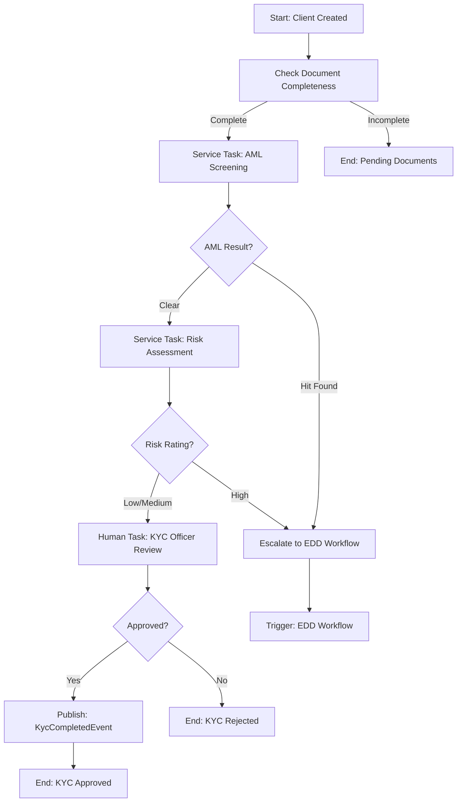

# Story 1.11: KYC Verification Workflow Implementation (client_kyc_v1.bpmn)

## Status
Draft

## Story
**As a** KYC Officer,  
**I want** an automated KYC workflow that checks document completeness, performs AML screening, and assigns human review tasks,  
**so that** KYC verification follows a consistent, auditable process.

## Acceptance Criteria
1. `client_kyc_v1.bpmn` BPMN process created in `Workflows/BPMN/` with:
   - Start event: Triggered by ClientCreatedEvent
   - Service task: Check document completeness
   - Exclusive gateway: Complete vs Incomplete
   - Service task: AML screening (if complete)
   - Exclusive gateway: AML result (Clear vs Hit)
   - Service task: Risk assessment (if AML clear)
   - Human task: KYC officer review
   - End events: Approved, Rejected, EDD_Required
2. Camunda workers created:
   - `KycDocumentCheckWorker` for topic `client.kyc.check-documents`
   - `AmlScreeningWorker` for topic `client.kyc.aml-screening`
   - `RiskAssessmentWorker` for topic `client.kyc.risk-assessment`
3. `KycDocumentCheckWorker` implementation:
   - Query ClientDocument table for client
   - Set workflow variables: hasNrc, hasProofOfAddress, hasPayslip, documentComplete
   - Update KycStatus.IsDocumentComplete
4. Human task form created in Camunda for KYC officer review with fields: Approve (boolean), Comments (string)
5. Domain events published:
   - `KycCompletedEvent` when approved
   - `KycRejectedEvent` when rejected
   - `EddEscalatedEvent` when escalated
6. Integration tests with Camunda Test SDK validate full workflow execution

## Tasks / Subtasks

- [ ] **Task 1: Create BPMN Process Definition** (AC: 1)
  - [ ] Create `client_kyc_v1.bpmn` file in `Workflows/BPMN/`
  - [ ] Design BPMN process with Camunda Modeler:
    - **Start Event:** `StartEvent_ClientCreated` (Message start event)
    - **Service Task:** `ServiceTask_CheckDocuments` (Topic: `client.kyc.check-documents`)
    - **Exclusive Gateway:** `Gateway_DocumentComplete` (Condition: `documentComplete == true`)
    - **Service Task:** `ServiceTask_AmlScreening` (Topic: `client.kyc.aml-screening`)
    - **Exclusive Gateway:** `Gateway_AmlResult` (Condition: `amlRiskLevel != 'High'`)
    - **Service Task:** `ServiceTask_RiskAssessment` (Topic: `client.kyc.risk-assessment`)
    - **User Task:** `UserTask_KycReview` (Assignee: `role:kyc-officer`)
    - **Exclusive Gateway:** `Gateway_KycDecision` (Condition: `approved == true`)
    - **End Events:** `EndEvent_Approved`, `EndEvent_Rejected`, `EndEvent_EddRequired`
  - [ ] Configure process variables:
    - Input: `clientId` (string), `correlationId` (string)
    - Working: `hasNrc`, `hasProofOfAddress`, `hasPayslip`, `documentComplete`
    - Working: `amlRiskLevel`, `sanctionsHit`, `pepMatch`, `riskRating`
    - Output: `approved` (boolean), `rejectionReason`, `escalateToEdd`
  - [ ] Add BPMN documentation and labels for all elements
  - [ ] Validate BPMN syntax with Camunda Modeler

- [ ] **Task 2: Create KycDocumentCheckWorker** (AC: 2, 3)
  - [ ] Create `KycDocumentCheckWorker.cs` in `Workflows/CamundaWorkers/`
  - [ ] Implement `ICamundaJobHandler` interface:
    - `GetTopicName()` returns `"client.kyc.check-documents"`
    - `GetJobType()` returns `"io.intellifin.kyc.check-documents"`
  - [ ] Implement `HandleJobAsync` method:
    - Extract `clientId` from job variables
    - Query `ClientDocument` table for documents belonging to client
    - Check document types: Count NRC, ProofOfAddress, Payslip, EmploymentLetter documents
    - Set boolean flags: `hasNrc`, `hasProofOfAddress`, `hasPayslip`, `hasEmploymentLetter`
    - Calculate `documentComplete = hasNrc && hasProofOfAddress && (hasPayslip || hasEmploymentLetter)`
    - Update `KycStatus` entity with document flags and `IsDocumentComplete`
    - Complete job with workflow variables
  - [ ] Add error handling and structured logging
  - [ ] Register worker in DI container
  - [ ] Create unit tests for document checking logic

- [ ] **Task 3: Create AmlScreeningWorker** (AC: 2)
  - [ ] Create `AmlScreeningWorker.cs` in `Workflows/CamundaWorkers/`
  - [ ] Implement `ICamundaJobHandler` interface:
    - `GetTopicName()` returns `"client.kyc.aml-screening"`
    - `GetJobType()` returns `"io.intellifin.kyc.aml-screening"`
  - [ ] Implement `HandleJobAsync` method:
    - Extract `clientId` from job variables
    - Load client data for AML screening
    - Perform sanctions list checking (manual implementation initially)
    - Perform PEP (Politically Exposed Person) checking
    - Create `AmlScreening` record with results
    - Calculate risk level: Clear (no hits), Medium (minor hits), High (sanctions/PEP)
    - Set workflow variables: `amlRiskLevel`, `sanctionsHit`, `pepMatch`
    - Update `KycStatus.AmlScreeningComplete = true`
    - Complete job with screening results
  - [ ] Add comprehensive logging for compliance audit
  - [ ] Create unit tests with mock AML data
  - [ ] Register worker in DI container

- [ ] **Task 4: Create RiskAssessmentWorker** (AC: 2)
  - [ ] Create `RiskAssessmentWorker.cs` in `Workflows/CamundaWorkers/`
  - [ ] Implement `ICamundaJobHandler` interface:
    - `GetTopicName()` returns `"client.kyc.risk-assessment"`
    - `GetJobType()` returns `"io.intellifin.kyc.risk-assessment"`
  - [ ] Implement `HandleJobAsync` method:
    - Extract `clientId` and AML results from job variables
    - Calculate basic risk score based on:
      - Document completeness (weight: 20%)
      - AML risk level (weight: 50%)
      - Client profile factors (weight: 30%)
    - Map risk score to rating: Low (0-25), Medium (26-50), High (51-100)
    - Create `RiskProfile` record (simplified version for now)
    - Set workflow variables: `riskRating`, `riskScore`
    - Complete job with risk assessment results
  - [ ] Note: This will be enhanced in Story 1.13 with Vault-based rules
  - [ ] Add unit tests for risk calculation logic
  - [ ] Register worker in DI container

- [ ] **Task 5: Create KYC Human Task Form** (AC: 4)
  - [ ] Create `kyc-officer-review-form.json` in `Workflows/Forms/`
  - [ ] Define Camunda form schema:
    - **Field 1:** `approved` (Boolean checkbox) - "Approve this KYC application"
    - **Field 2:** `comments` (Text area) - "Review comments" (required)
    - **Field 3:** `rejectionReason` (Select dropdown) - Options: "Incomplete Documents", "Invalid Documents", "AML Concerns", "Other"
    - **Read-only fields:** Client name, documents status, AML results, risk rating
  - [ ] Configure form validation:
    - If `approved = false`, `rejectionReason` is required
    - `comments` field always required (min 10 characters)
  - [ ] Associate form with `UserTask_KycReview` in BPMN
  - [ ] Add form styling and user experience considerations
  - [ ] Test form rendering in Camunda Tasklist

- [ ] **Task 6: Implement Domain Event Publishing** (AC: 5)
  - [ ] Create domain events in `Domain/Events/`:
    - `KycCompletedEvent.cs` - Published when KYC approved
    - `KycRejectedEvent.cs` - Published when KYC rejected  
    - `EddEscalatedEvent.cs` - Published when escalated to EDD
  - [ ] Define event properties:
    - `KycCompletedEvent`: ClientId, KycStatusId, CompletedBy, CompletedAt, ProcessInstanceId
    - `KycRejectedEvent`: ClientId, KycStatusId, RejectedBy, RejectionReason, ProcessInstanceId
    - `EddEscalatedEvent`: ClientId, KycStatusId, EscalationReason, EscalatedAt, ProcessInstanceId
  - [ ] Create `KycWorkflowEventPublisher` service to publish events
  - [ ] Configure MassTransit to publish to RabbitMQ exchange `client.events`
  - [ ] Add routing keys: `client.kyc.completed`, `client.kyc.rejected`, `client.kyc.edd-escalated`
  - [ ] Integrate event publishing into workflow completion logic

- [ ] **Task 7: Create Workflow Completion Handler** 
  - [ ] Create `KycWorkflowCompletionWorker.cs` for workflow end events
  - [ ] Handle `EndEvent_Approved`:
    - Update `KycStatus.CurrentState = "Completed"`
    - Set `KycCompletedAt = DateTime.UtcNow`
    - Set `KycCompletedBy` from user task completion
    - Publish `KycCompletedEvent`
    - Log audit event to AdminService
  - [ ] Handle `EndEvent_Rejected`:
    - Update `KycStatus.CurrentState = "Rejected"`
    - Set rejection reason and completed by info
    - Publish `KycRejectedEvent`
    - Log audit event to AdminService
  - [ ] Handle `EndEvent_EddRequired`:
    - Update `KycStatus.CurrentState = "EDD_Required"`
    - Set `RequiresEdd = true` and escalation reason
    - Publish `EddEscalatedEvent` 
    - Log audit event to AdminService
  - [ ] Add comprehensive error handling and retry logic

- [ ] **Task 8: Create Workflow Trigger Integration**
  - [ ] Create `KycWorkflowTriggerService.cs` in `Services/`
  - [ ] Implement method `StartKycWorkflowAsync(Guid clientId, string correlationId)`:
    - Create Zeebe process instance for `client_kyc_v1` 
    - Pass `clientId` and `correlationId` as variables
    - Update `KycStatus.CamundaProcessInstanceId`
    - Return process instance details
  - [ ] Update `KycWorkflowService.InitiateKycAsync` to trigger workflow:
    - After creating KycStatus, call `StartKycWorkflowAsync`
    - Update KYC state from Pending to InProgress
  - [ ] Handle workflow start failures gracefully
  - [ ] Add integration tests for workflow triggering

- [ ] **Task 9: Create AML Screening Data Model**
  - [ ] Create `AmlScreening.cs` entity in `Domain/Entities/` (if not exists from Story 1.10)
  - [ ] Add properties:
    - `Guid Id`, `Guid KycStatusId` (FK)
    - `string ScreeningType` (Sanctions, PEP, Watchlist)
    - `string ScreeningProvider` (Manual, API_Future)
    - `DateTime ScreenedAt`, `string ScreenedBy`
    - `bool IsMatch`, `string? MatchDetails` (JSON)
    - `string RiskLevel` (Clear, Low, Medium, High)
    - `string? Notes`, `string? CorrelationId`
  - [ ] Create `AmlScreeningConfiguration.cs` EF Core configuration
  - [ ] Add `DbSet<AmlScreening>` to `ClientManagementDbContext`
  - [ ] Create migration for AML screening table
  - [ ] Add navigation property to `KycStatus.AmlScreenings`

- [ ] **Task 10: Implement Manual AML Screening Logic**
  - [ ] Create `IAmlScreeningService.cs` interface in `Services/`
  - [ ] Create `ManualAmlScreeningService.cs` implementation:
    - `PerformSanctionsScreeningAsync` - Check against hardcoded sanctions list
    - `PerformPepScreeningAsync` - Check against PEP database (mock initially)
    - `RecordScreeningResultAsync` - Save results to database
  - [ ] Implement basic screening logic:
    - Sanctions: Check client name against OFAC/UN sanctions lists (hardcoded)
    - PEP: Check against political figures database (mock data)
    - Watchlist: Internal high-risk customer list
  - [ ] Add comprehensive audit logging for all screening activities
  - [ ] Register service in DI container
  - [ ] Create unit tests with mock screening data

- [ ] **Task 11: Create BPMN Deployment Pipeline**
  - [ ] Create `BpmnDeploymentService.cs` for deploying BPMN processes
  - [ ] Implement deployment logic:
    - Read BPMN files from `Workflows/BPMN/` directory
    - Deploy to Zeebe cluster using `IZeebeClient.NewDeployCommand()`
    - Handle deployment errors and version conflicts
    - Log successful deployments
  - [ ] Create deployment health check to verify BPMN processes are active
  - [ ] Add deployment as part of service startup (or separate init container)
  - [ ] Create rollback mechanism for failed deployments
  - [ ] Add integration tests for BPMN deployment

- [ ] **Task 12: Create Comprehensive Integration Tests** (AC: 6)
  - [ ] Create `KycWorkflowIntegrationTests.cs` test class
  - [ ] Set up test infrastructure:
    - TestContainers for SQL Server database
    - Embedded Zeebe test environment or WireMock
    - Test data: Clients, documents, mock AML data
  - [ ] Test complete workflow scenarios:
    - **Happy Path:** Client created → Documents complete → AML clear → Risk low → Officer approval → KYC completed
    - **Document Incomplete:** Client created → Missing documents → Workflow pauses → Documents added → Continues
    - **AML Hit Path:** Client created → Documents complete → AML hit → Escalate to EDD
    - **Officer Rejection:** Client created → Documents complete → AML clear → Officer rejects → KYC rejected
  - [ ] Test workflow variables are passed correctly between tasks
  - [ ] Test error handling and retry mechanisms
  - [ ] Test domain event publishing at workflow completion
  - [ ] Verify database state changes throughout workflow execution

- [ ] **Task 13: Update Service Registration and Configuration**
  - [ ] Update `Extensions/ServiceCollectionExtensions.cs` to register:
    - All new Camunda workers (`KycDocumentCheckWorker`, etc.)
    - AML screening service
    - Workflow trigger service
    - BPMN deployment service
  - [ ] Update `Program.cs` to:
    - Deploy BPMN processes on startup
    - Register domain event publishers
    - Configure MassTransit for event publishing
  - [ ] Add configuration validation for required Camunda settings
  - [ ] Ensure proper service lifecycle and dependency injection

- [ ] **Task 14: Create Worker Error Handling and Monitoring**
  - [ ] Implement error handling patterns in all workers:
    - Try-catch blocks with specific error types
    - Retry logic with exponential backoff
    - DLQ handling after max retries
    - Correlation ID propagation for debugging
  - [ ] Add structured logging to all workers:
    - Log job start/completion with timing
    - Log business decisions and calculations
    - Log errors with full context
  - [ ] Create metrics for workflow monitoring:
    - Jobs processed by worker type
    - Job processing duration
    - Error rates and retry counts
    - Workflow completion rates
  - [ ] Add health checks for each worker type

## Dev Notes

### BPMN Workflow Design
**Source:** [docs/domains/client-management/brownfield-architecture.md#workflow-1-standard-kyc-verification]

**Process Overview:**
The `client_kyc_v1.bpmn` implements automated KYC verification for standard-risk customers, with escalation paths for high-risk scenarios.

**Workflow Flow:**


### Worker Implementation Patterns
**Source:** [docs/domains/client-management/brownfield-architecture.md#camunda-service-tasks]

**Base Worker Pattern:**
```csharp
public class KycDocumentCheckWorker : ICamundaJobHandler
{
    private readonly ILogger<KycDocumentCheckWorker> _logger;
    private readonly ClientManagementDbContext _context;
    private readonly IKycWorkflowService _kycService;

    public string GetTopicName() => "client.kyc.check-documents";
    public string GetJobType() => "io.intellifin.kyc.check-documents";

    public async Task HandleJobAsync(IJobClient jobClient, IJob job)
    {
        var correlationId = job.Variables.GetValueOrDefault("correlationId", Guid.NewGuid().ToString());
        
        using var logScope = _logger.BeginScope(new Dictionary<string, object>
        {
            ["CorrelationId"] = correlationId,
            ["JobKey"] = job.Key,
            ["ProcessInstanceKey"] = job.ProcessInstanceKey
        });

        try
        {
            var clientId = job.Variables["clientId"].ToString();
            
            // Execute business logic
            var result = await CheckDocumentCompleteness(Guid.Parse(clientId));
            
            // Complete job with results
            await jobClient.CompleteJob(job.Key, result.Variables);
            
            _logger.LogInformation("Document check completed successfully");
        }
        catch (Exception ex)
        {
            _logger.LogError(ex, "Document check failed");
            
            // Fail job with retry
            await jobClient.FailJob(job.Key, new FailJobRequest
            {
                ErrorMessage = ex.Message,
                Retries = job.Retries - 1,
                RetryBackoffMs = CalculateBackoff(job.Retries)
            });
        }
    }
}
```

### Document Completeness Logic
**Business Rules for Document Validation:**

**Required Documents:**
- **NRC (National Registration Card):** Must be valid, not expired
- **Proof of Address:** Utility bill, bank statement (< 3 months old)
- **Employment Proof:** Payslip OR employment letter

**Validation Logic:**
```csharp
private async Task<DocumentCheckResult> CheckDocumentCompleteness(Guid clientId)
{
    var documents = await _context.ClientDocuments
        .Where(d => d.ClientId == clientId && d.UploadStatus == "Verified")
        .ToListAsync();
    
    var hasNrc = documents.Any(d => d.DocumentType == "NRC");
    var hasProofOfAddress = documents.Any(d => d.DocumentType == "ProofOfAddress");
    var hasPayslip = documents.Any(d => d.DocumentType == "Payslip");
    var hasEmploymentLetter = documents.Any(d => d.DocumentType == "EmploymentLetter");
    
    var documentComplete = hasNrc && hasProofOfAddress && (hasPayslip || hasEmploymentLetter);
    
    // Update KYC status
    await _kycService.UpdateDocumentStatusAsync(clientId, hasNrc, hasProofOfAddress, 
        hasPayslip, hasEmploymentLetter);
    
    return new DocumentCheckResult
    {
        Variables = new Dictionary<string, object>
        {
            ["hasNrc"] = hasNrc,
            ["hasProofOfAddress"] = hasProofOfAddress,
            ["hasPayslip"] = hasPayslip,
            ["hasEmploymentLetter"] = hasEmploymentLetter,
            ["documentComplete"] = documentComplete
        }
    };
}
```

### AML Screening Implementation
**Source:** [docs/domains/client-management/prd.md#fr8-aml-sanctions-and-pep-screening]

**Screening Types:**
1. **Sanctions Screening:** OFAC, UN, EU sanctions lists
2. **PEP Screening:** Politically Exposed Persons database
3. **Watchlist Screening:** Internal high-risk customers

**Implementation (Manual Phase 1):**
```csharp
public async Task<AmlScreeningResult> PerformAmlScreeningAsync(Guid clientId)
{
    var client = await _context.Clients.FindAsync(clientId);
    var results = new List<AmlScreening>();
    
    // Sanctions screening
    var sanctionsResult = await ScreenAgainstSanctionsList(client);
    results.Add(sanctionsResult);
    
    // PEP screening  
    var pepResult = await ScreenAgainstPepDatabase(client);
    results.Add(pepResult);
    
    // Calculate overall risk
    var overallRisk = CalculateAmlRisk(results);
    
    // Save results
    await _context.AmlScreenings.AddRangeAsync(results);
    await _context.SaveChangesAsync();
    
    return new AmlScreeningResult
    {
        RiskLevel = overallRisk,
        SanctionsHit = sanctionsResult.IsMatch,
        PepMatch = pepResult.IsMatch,
        Variables = new Dictionary<string, object>
        {
            ["amlRiskLevel"] = overallRisk.ToString(),
            ["sanctionsHit"] = sanctionsResult.IsMatch,
            ["pepMatch"] = pepResult.IsMatch
        }
    };
}
```

### Risk Assessment (Simplified for Now)
**Note:** This will be enhanced in Story 1.13 with Vault-based rules

**Basic Risk Calculation:**
```csharp
private int CalculateBasicRiskScore(string amlRiskLevel, bool documentComplete, 
    ClientProfile client)
{
    int score = 0;
    
    // Document completeness factor (20%)
    if (!documentComplete) score += 20;
    
    // AML risk factor (50%)
    score += amlRiskLevel switch
    {
        "Clear" => 0,
        "Low" => 10,
        "Medium" => 25,
        "High" => 50,
        _ => 0
    };
    
    // Client profile factors (30%)
    if (client.IsPep) score += 15;
    if (client.IsHighValueCustomer) score += 10;
    if (client.HasPreviousReports) score += 5;
    
    return Math.Min(score, 100); // Cap at 100
}
```

### Human Task Configuration
**Camunda User Task Definition:**
```xml
<userTask id="UserTask_KycReview" name="KYC Officer Review">
  <assignee>role:kyc-officer</assignee>
  <formKey>kyc-officer-review-form</formKey>
  <documentation>
    Review client KYC application based on:
    - Document completeness and validity
    - AML screening results  
    - Risk assessment score
    - Any additional compliance concerns
  </documentation>
</userTask>
```

**Form Configuration:**
```json
{
  "components": [
    {
      "key": "clientSummary",
      "type": "textfield", 
      "label": "Client",
      "readonly": true,
      "defaultValue": "#{clientName} (#{clientNrc})"
    },
    {
      "key": "documentStatus",
      "type": "textfield",
      "label": "Documents",
      "readonly": true,
      "defaultValue": "#{documentComplete ? 'Complete' : 'Incomplete'}"
    },
    {
      "key": "amlResults",
      "type": "textfield",
      "label": "AML Risk",
      "readonly": true,
      "defaultValue": "#{amlRiskLevel}"
    },
    {
      "key": "approved",
      "type": "checkbox",
      "label": "Approve KYC Application"
    },
    {
      "key": "comments",
      "type": "textarea",
      "label": "Review Comments",
      "validate": {
        "required": true,
        "minLength": 10
      }
    },
    {
      "key": "rejectionReason",
      "type": "select",
      "label": "Rejection Reason",
      "conditional": {
        "show": "!approved"
      },
      "values": [
        {"label": "Incomplete Documents", "value": "incomplete_documents"},
        {"label": "Invalid Documents", "value": "invalid_documents"}, 
        {"label": "AML Concerns", "value": "aml_concerns"},
        {"label": "Other", "value": "other"}
      ]
    }
  ]
}
```

### Domain Event Schema
**Event Publishing to RabbitMQ:**

**KycCompletedEvent:**
```csharp
public class KycCompletedEvent
{
    public Guid ClientId { get; set; }
    public Guid KycStatusId { get; set; }
    public string CompletedBy { get; set; }
    public DateTime CompletedAt { get; set; }
    public string ProcessInstanceId { get; set; }
    public string CorrelationId { get; set; }
    public Dictionary<string, object> Metadata { get; set; }
}
```

**Event Configuration:**
- **Exchange:** `client.events`
- **Routing Keys:** `client.kyc.completed`, `client.kyc.rejected`, `client.kyc.edd-escalated`
- **Message Schema Version:** `v1.0`
- **Persistence:** Durable messages for audit compliance

### Integration with Previous Stories
**KYC Status Integration (Story 1.10):**
- Workers update `KycStatus` entity throughout workflow
- State transitions: Pending → InProgress → Completed/Rejected/EDD_Required
- `CamundaProcessInstanceId` tracks workflow execution

**Document Integration (Stories 1.6-1.8):**
- `KycDocumentCheckWorker` queries `ClientDocument` table
- Only considers documents with `UploadStatus = "Verified"` (dual-control passed)
- Document types mapped to workflow variables

**Camunda Infrastructure (Story 1.9):**
- Uses `CamundaWorkerHostedService` for worker registration
- Leverages error handling and DLQ patterns
- Health checks include workflow deployment status

### Workflow Variables Reference
**Input Variables:**
- `clientId` (string) - Client identifier
- `correlationId` (string) - Request correlation for audit

**Document Check Variables:**
- `hasNrc` (boolean)
- `hasProofOfAddress` (boolean)
- `hasPayslip` (boolean)
- `hasEmploymentLetter` (boolean)
- `documentComplete` (boolean)

**AML Screening Variables:**
- `amlRiskLevel` (string) - Clear, Low, Medium, High
- `sanctionsHit` (boolean)
- `pepMatch` (boolean)

**Risk Assessment Variables:**
- `riskScore` (number) - 0-100
- `riskRating` (string) - Low, Medium, High

**Human Task Variables:**
- `approved` (boolean) - Officer decision
- `comments` (string) - Review notes
- `rejectionReason` (string) - If rejected

### BPMN Deployment Strategy
**Deployment Configuration:**
```csharp
public async Task DeployBpmnProcessesAsync()
{
    var bpmnFiles = Directory.GetFiles("Workflows/BPMN", "*.bpmn");
    
    foreach (var bpmnFile in bpmnFiles)
    {
        try 
        {
            var bpmnContent = await File.ReadAllBytesAsync(bpmnFile);
            var fileName = Path.GetFileName(bpmnFile);
            
            var deployment = await _zeebeClient
                .NewDeployCommand()
                .AddResourceBytes(bpmnContent, fileName)
                .Send();
                
            _logger.LogInformation("Successfully deployed {BpmnFile} with key {ProcessKey}", 
                fileName, deployment.Processes.First().BpmnProcessId);
        }
        catch (Exception ex)
        {
            _logger.LogError(ex, "Failed to deploy BPMN file {BpmnFile}", bpmnFile);
            throw;
        }
    }
}
```

### Project Structure After This Story
```
apps/IntelliFin.ClientManagement/
├── Workflows/
│   ├── BPMN/
│   │   └── client_kyc_v1.bpmn                  # NEW - BPMN process definition
│   ├── Forms/
│   │   └── kyc-officer-review-form.json        # NEW - Human task form
│   └── CamundaWorkers/
│       ├── KycDocumentCheckWorker.cs           # NEW - Document validation
│       ├── AmlScreeningWorker.cs               # NEW - AML screening
│       ├── RiskAssessmentWorker.cs             # NEW - Risk calculation
│       └── KycWorkflowCompletionWorker.cs      # NEW - Workflow completion
├── Domain/
│   ├── Entities/
│   │   └── AmlScreening.cs                     # NEW - AML screening results
│   └── Events/
│       ├── KycCompletedEvent.cs                # NEW - Domain event
│       ├── KycRejectedEvent.cs                 # NEW - Domain event
│       └── EddEscalatedEvent.cs                # NEW - Domain event
├── Services/
│   ├── IAmlScreeningService.cs                 # NEW - AML service interface
│   ├── ManualAmlScreeningService.cs            # NEW - AML implementation
│   ├── KycWorkflowTriggerService.cs            # NEW - Workflow trigger
│   └── BpmnDeploymentService.cs                # NEW - BPMN deployment
├── Infrastructure/
│   └── Persistence/
│       ├── Configurations/
│       │   └── AmlScreeningConfiguration.cs    # NEW - EF configuration
│       └── Migrations/
│           └── {timestamp}_AddAmlScreening.cs  # NEW - Migration
└── [existing files from Stories 1.1-1.10]
```

## Testing

### Testing Standards
**Source:** [docs/domains/client-management/prd.md#workflow-tests]

- **Test Framework:** xUnit with Camunda Test SDK for workflow validation
- **Coverage Target:** 80% for Camunda workers (as specified for workflow components)
- **Integration Tests:** TestContainers + embedded Zeebe or WireMock for Camunda
- **Workflow Testing:** End-to-end BPMN execution with real/mocked workers

### Specific Test Cases for This Story

**Unit Tests - Camunda Workers:**
1. **KycDocumentCheckWorker:**
   - Documents complete: All required documents present and verified
   - Documents incomplete: Missing NRC, proof of address, or employment proof
   - Error handling: Invalid client ID, database connection failures
   - Variable setting: Correct workflow variables returned

2. **AmlScreeningWorker:**  
   - Sanctions screening: Hit detection and risk level calculation
   - PEP screening: Political exposure detection
   - Clear screening: No hits, low risk assignment
   - Error handling: External service failures, data validation

3. **RiskAssessmentWorker:**
   - Risk calculation: Correct scoring based on input factors
   - Risk rating mapping: Score ranges to Low/Medium/High ratings
   - Edge cases: Missing data, invalid inputs
   - Variable propagation: Correct workflow variables set

**Integration Tests - Workflow Execution:**
1. **Complete Happy Path:**
   - Start: Client created event triggers workflow
   - Document Check: All documents present → documentComplete = true
   - AML Screening: No hits → amlRiskLevel = Clear
   - Risk Assessment: Low risk → riskRating = Low
   - Human Task: Officer approves → approved = true
   - End: KycCompletedEvent published, KycStatus = Completed

2. **Document Incomplete Path:**
   - Start: Client created, missing documents
   - Document Check: hasNrc = false → documentComplete = false
   - End: Workflow terminates at EndEvent_PendingDocuments

3. **AML Hit Escalation Path:**
   - Start: Client created, documents complete
   - AML Screening: Sanctions hit → amlRiskLevel = High
   - End: EddEscalatedEvent published, workflow routes to EDD

4. **Officer Rejection Path:**
   - Complete workflow up to human task
   - Human Task: Officer rejects → approved = false
   - End: KycRejectedEvent published, KycStatus = Rejected

**Integration Tests - Event Publishing:**
1. **Domain Event Verification:**
   - KycCompletedEvent published with correct properties
   - KycRejectedEvent includes rejection reason
   - EddEscalatedEvent includes escalation details
   - Events routed to correct RabbitMQ queues

2. **Database State Verification:**
   - KycStatus updated correctly throughout workflow
   - AmlScreening records created with proper data
   - Audit events logged to AdminService (if integrated)

**Performance Tests:**
1. **Workflow Throughput:**
   - Process 100 concurrent KYC workflows
   - Measure end-to-end completion time
   - Verify no resource leaks or deadlocks

2. **Worker Performance:**
   - Document check completes in < 2 seconds
   - AML screening completes in < 5 seconds  
   - Risk assessment completes in < 1 second

### Test File Structure
```
tests/IntelliFin.ClientManagement.Tests/
├── Workflows/
│   ├── CamundaWorkers/
│   │   ├── KycDocumentCheckWorkerTests.cs
│   │   ├── AmlScreeningWorkerTests.cs
│   │   ├── RiskAssessmentWorkerTests.cs
│   │   └── KycWorkflowCompletionWorkerTests.cs
│   └── Services/
│       ├── ManualAmlScreeningServiceTests.cs
│       └── BpmnDeploymentServiceTests.cs

tests/IntelliFin.ClientManagement.IntegrationTests/
├── Workflows/
│   ├── KycWorkflowEndToEndTests.cs
│   ├── BpmnDeploymentIntegrationTests.cs
│   └── DomainEventPublishingTests.cs
```

## Change Log

| Date | Version | Description | Author |
|------|---------|-------------|--------|
| 2025-10-17 | 1.0 | Initial story creation | Bob (SM) |

## Dev Agent Record
*This section will be populated by the development agent during implementation.*

### Agent Model Used
*To be filled by dev agent*

### Debug Log References
*To be filled by dev agent*

### Completion Notes List
*To be filled by dev agent*

### File List
*To be filled by dev agent*

## QA Results
*This section will be populated by the QA agent after implementation review.*