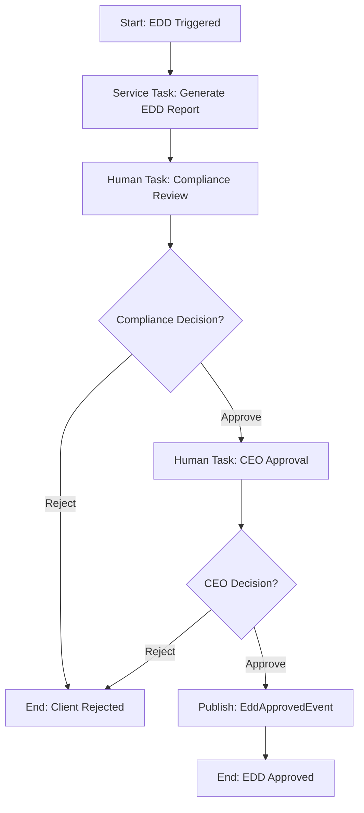

# Story 1.12: AML Screening and Enhanced Due Diligence (EDD) Workflow

## Status
Draft

## Story
**As a** Compliance Officer,  
**I want** to screen clients against sanctions lists and PEP databases, and escalate high-risk clients to Enhanced Due Diligence,  
**so that** we comply with BoZ AML requirements and prevent onboarding sanctioned individuals.

## Acceptance Criteria
1. `AmlScreening` entity created in `Domain/Entities` with fields: Id, KycStatusId, ScreeningType, ScreeningProvider, ScreenedAt, ScreenedBy, IsMatch, MatchDetails, RiskLevel, Notes
2. `AmlScreeningService` created with methods: PerformSanctionsScreeningAsync, PerformPepScreeningAsync, RecordScreeningResultAsync
3. `AmlScreeningWorker` implementation for topic `client.kyc.aml-screening`:
   - Call AmlScreeningService to perform sanctions and PEP checks (manual list initially)
   - Create AmlScreening records
   - Set workflow variables: amlRiskLevel (Clear, Low, Medium, High), sanctionsHit (bool), pepMatch (bool)
   - Update KycStatus.AmlScreeningComplete = true
   - If High risk: Set workflow variable escalateToEdd = true
4. `client_edd_v1.bpmn` BPMN process created with:
   - Start event: Triggered by EddEscalatedEvent
   - Service task: Generate EDD report PDF
   - Human task: Compliance officer review
   - Human task: CEO approval (if compliance approves)
   - End events: Approved, Rejected
5. `EddReportGenerationWorker` created for topic `client.edd.generate-report`:
   - Create PDF with client profile, AML screening results, document verification status, risk factors
   - Store PDF in MinIO
   - Set ClientDocument.EddReportObjectKey
6. Integration tests validate EDD escalation path

## Tasks / Subtasks

- [ ] **Task 1: Create AML Screening Entity and Configuration** (AC: 1)
  - [ ] Create `AmlScreening.cs` entity in `Domain/Entities/` (if not already exists from Story 1.11)
  - [ ] Add properties:
    - `Guid Id` (Primary key)
    - `Guid KycStatusId` (Foreign key to KycStatus)
    - `string ScreeningType` (Sanctions, PEP, Watchlist, Internal)
    - `string ScreeningProvider` (Manual_v1, OFAC_API, WorldCheck_API, Internal)
    - `DateTime ScreenedAt`
    - `string ScreenedBy` (User ID who performed screening)
    - `bool IsMatch` (True if hit found)
    - `string? MatchDetails` (JSON with match information)
    - `string RiskLevel` (Clear, Low, Medium, High)
    - `string? Notes` (Additional screening notes)
    - `string? CorrelationId` (For audit tracking)
  - [ ] Add navigation property to `KycStatus.AmlScreenings` collection
  - [ ] Create `AmlScreeningConfiguration.cs` EF Core configuration:
    - Configure table mapping and relationships
    - Add indexes for performance: (KycStatusId, ScreeningType), (ScreenedAt)
    - Configure string field lengths and constraints
  - [ ] Create EF Core migration for AmlScreening table
  - [ ] Update `ClientManagementDbContext` to include `DbSet<AmlScreening>`

- [ ] **Task 2: Create AML Screening Service Interface and Implementation** (AC: 2)
  - [ ] Create `IAmlScreeningService.cs` interface in `Services/`:
    - `Task<AmlScreeningResult> PerformSanctionsScreeningAsync(Client client, string correlationId)`
    - `Task<AmlScreeningResult> PerformPepScreeningAsync(Client client, string correlationId)`
    - `Task<AmlScreeningResult> PerformWatchlistScreeningAsync(Client client, string correlationId)`
    - `Task RecordScreeningResultAsync(Guid kycStatusId, AmlScreeningResult result)`
    - `Task<OverallAmlRisk> CalculateOverallRiskAsync(Guid kycStatusId)`
  - [ ] Create `ManualAmlScreeningService.cs` implementation:
    - Implement hardcoded sanctions list checking (OFAC, UN, EU basic lists)
    - Implement mock PEP database checking with Zambian political figures
    - Implement internal watchlist checking
    - Add comprehensive audit logging for all screening activities
    - Include fuzzy name matching logic for better hit detection
  - [ ] Create DTOs: `AmlScreeningResult`, `OverallAmlRisk`, `MatchDetails`
  - [ ] Register service in DI container
  - [ ] Add unit tests with mock data for various screening scenarios

- [ ] **Task 3: Implement Enhanced AML Screening Worker** (AC: 3)
  - [ ] Update `AmlScreeningWorker.cs` (created in Story 1.11) with enhanced logic:
    - Extract client data from database using clientId
    - Call `AmlScreeningService.PerformSanctionsScreeningAsync`
    - Call `AmlScreeningService.PerformPepScreeningAsync`
    - Call `AmlScreeningService.PerformWatchlistScreeningAsync`
    - Record all screening results to database
    - Calculate overall AML risk level based on combined results
  - [ ] Implement EDD escalation logic:
    - If any screening returns High risk → escalateToEdd = true
    - If multiple Medium risks → escalateToEdd = true
    - If sanctions hit → escalateToEdd = true, regardless of other factors
  - [ ] Set workflow variables for BPMN process:
    - `amlRiskLevel`: Overall risk (Clear, Low, Medium, High)
    - `sanctionsHit`: Boolean indicating sanctions match
    - `pepMatch`: Boolean indicating PEP match
    - `watchlistHit`: Boolean indicating internal watchlist match
    - `escalateToEdd`: Boolean triggering EDD workflow
  - [ ] Update `KycStatus.AmlScreeningComplete = true` after completion
  - [ ] Add comprehensive error handling and retry logic
  - [ ] Create unit tests for all screening combinations and EDD escalation scenarios

- [ ] **Task 4: Create EDD BPMN Process Definition** (AC: 4)
  - [ ] Create `client_edd_v1.bpmn` file in `Workflows/BPMN/`
  - [ ] Design EDD BPMN process:
    - **Start Event:** `StartEvent_EddTriggered` (Message start event triggered by EddEscalatedEvent)
    - **Service Task:** `ServiceTask_GenerateEddReport` (Topic: `client.edd.generate-report`)
    - **Human Task:** `UserTask_ComplianceReview` (Assignee: `role:compliance-officer`)
    - **Exclusive Gateway:** `Gateway_ComplianceDecision` (Condition: `complianceApproved == true`)
    - **Human Task:** `UserTask_CeoApproval` (Assignee: `role:ceo`)
    - **Exclusive Gateway:** `Gateway_CeoDecision` (Condition: `ceoApproved == true`)
    - **End Events:** `EndEvent_EddApproved`, `EndEvent_EddRejected`
  - [ ] Configure process variables:
    - Input: `clientId`, `kycStatusId`, `escalationReason`, `correlationId`
    - Working: `eddReportGenerated`, `complianceApproved`, `ceoApproved`
    - Working: `complianceComments`, `ceoComments`, `finalDecision`
    - Output: `eddApproved`, `rejectionReason`, `approvedBy`
  - [ ] Add BPMN documentation for all tasks and gateways
  - [ ] Validate BPMN syntax and deploy to test environment

- [ ] **Task 5: Create EDD Report Generation Worker** (AC: 5)
  - [ ] Create `EddReportGenerationWorker.cs` in `Workflows/CamundaWorkers/`
  - [ ] Implement `ICamundaJobHandler` interface:
    - `GetTopicName()` returns `"client.edd.generate-report"`
    - `GetJobType()` returns `"io.intellifin.edd.generate-report"`
  - [ ] Implement `HandleJobAsync` method:
    - Extract `clientId` and `kycStatusId` from job variables
    - Gather comprehensive client data: profile, documents, AML results, risk factors
    - Generate PDF report with sections:
      - Client summary and basic information
      - Document verification status and issues
      - AML screening detailed results
      - Risk assessment breakdown
      - Escalation reasons and recommendations
    - Store PDF in MinIO with appropriate retention (7 years)
    - Update `KycStatus.EddReportObjectKey` with MinIO object key
    - Complete job with variables: `eddReportGenerated = true`, `reportObjectKey`
  - [ ] Use PDF generation library (e.g., iTextSharp, PuppeteerSharp) for report creation
  - [ ] Add error handling for PDF generation and MinIO storage failures
  - [ ] Create unit tests with mock data for various EDD scenarios

- [ ] **Task 6: Create EDD Human Task Forms**
  - [ ] Create `compliance-officer-edd-review-form.json` in `Workflows/Forms/`
  - [ ] Define form for compliance officer review:
    - **Read-only sections:** Client profile, AML results, risk factors, EDD report download link
    - **Decision field:** `complianceApproved` (Boolean) - "Approve for CEO review"
    - **Comments field:** `complianceComments` (Text area, required) - "Compliance review notes"
    - **Recommendation field:** `complianceRecommendation` (Select) - "Approve", "Reject", "Request Additional Info"
  - [ ] Create `ceo-edd-approval-form.json` in `Workflows/Forms/`
  - [ ] Define form for CEO final approval:
    - **Read-only sections:** All previous sections plus compliance officer recommendation
    - **Decision field:** `ceoApproved` (Boolean) - "Final approval for client onboarding"
    - **Comments field:** `ceoComments` (Text area, required) - "CEO decision rationale"
    - **Risk acceptance:** `riskAcceptanceLevel` (Select) - "Standard", "Enhanced Monitoring", "Restricted Services"
  - [ ] Add form validation and conditional field display
  - [ ] Test forms in Camunda Tasklist UI

- [ ] **Task 7: Create EDD Domain Events and Event Handlers**
  - [ ] Create domain events in `Domain/Events/`:
    - `EddReportGeneratedEvent` - Published when EDD report is created
    - `EddComplianceReviewedEvent` - Published when compliance officer completes review
    - `EddApprovedEvent` - Published when CEO approves EDD
    - `EddRejectedEvent` - Published when EDD is rejected at any stage
  - [ ] Define event properties with all necessary context:
    - `EddApprovedEvent`: ClientId, KycStatusId, ApprovedBy, CeoApprovedBy, ApprovedAt, RiskAcceptanceLevel
    - `EddRejectedEvent`: ClientId, KycStatusId, RejectedBy, RejectionReason, RejectedAt, Stage
  - [ ] Create event handlers to update KYC status:
    - `EddApprovedEvent` → Update `KycStatus.CurrentState = "Completed"`, set approval fields
    - `EddRejectedEvent` → Update `KycStatus.CurrentState = "Rejected"`, set rejection fields
  - [ ] Configure MassTransit routing keys: `client.edd.approved`, `client.edd.rejected`
  - [ ] Add integration tests for event publishing and handling

- [ ] **Task 8: Create EDD Workflow Completion Workers**
  - [ ] Create `EddWorkflowCompletionWorker.cs` for EDD end events
  - [ ] Handle `EndEvent_EddApproved`:
    - Update `KycStatus.CurrentState = "Completed"`
    - Set `EddApprovedBy`, `EddCeoApprovedBy`, `EddApprovedAt`
    - Set `RiskAcceptanceLevel` from CEO decision
    - Publish `EddApprovedEvent`
    - Log comprehensive audit event to AdminService
  - [ ] Handle `EndEvent_EddRejected`:
    - Update `KycStatus.CurrentState = "Rejected"`
    - Set rejection stage (Compliance or CEO) and reason
    - Publish `EddRejectedEvent`
    - Log audit event with full decision trail
  - [ ] Add error handling and retry logic for database updates
  - [ ] Create unit tests for all completion scenarios

- [ ] **Task 9: Implement Sanctions and PEP Data Management**
  - [ ] Create `SanctionsList.cs` static data class with hardcoded lists:
    - OFAC Specially Designated Nationals (SDN) list (sample entries)
    - UN Security Council Consolidated List (sample entries)
    - EU Consolidated Sanctions List (sample entries)
    - Include aliases and alternative spellings
  - [ ] Create `PepDatabase.cs` static data class with Zambian political figures:
    - Government ministers and officials
    - Members of Parliament
    - Judges and judicial officers
    - Military and police leadership
    - State-owned enterprise executives
  - [ ] Implement fuzzy matching algorithms:
    - Levenshtein distance for name similarity
    - Soundex for phonetic matching
    - Handle cultural name variations (Zambian naming patterns)
  - [ ] Create `MatchResult` class with confidence scoring (0-100)
  - [ ] Add unit tests for matching accuracy and edge cases
  - [ ] Document data update procedures for future API integration

- [ ] **Task 10: Create EDD Escalation Trigger Integration**
  - [ ] Update `KycWorkflowService` to handle EDD escalation:
    - Add method `EscalateToEddAsync(Guid kycStatusId, string reason, string correlationId)`
    - Update KYC status to "EDD_Required"
    - Set escalation reason and timestamp
    - Trigger EDD BPMN workflow start
  - [ ] Integrate with main KYC workflow (client_kyc_v1.bpmn):
    - When `escalateToEdd = true` in AML screening results
    - Call `EscalateToEddAsync` before workflow termination
    - Set `KycStatus.CamundaProcessInstanceId` for EDD workflow
  - [ ] Handle EDD workflow failures gracefully:
    - Retry mechanism for workflow start failures
    - Fallback to manual EDD process if automated workflow fails
    - Alert compliance team of EDD workflow issues
  - [ ] Create integration tests for EDD escalation from main KYC workflow

- [ ] **Task 11: Create AML Data Seeding and Test Data**
  - [ ] Create `AmlTestDataSeeder.cs` for development and testing:
    - Sample clients with various risk profiles
    - Known matches for sanctions, PEP, and watchlist testing
    - Edge cases: similar names, common names, false positives
  - [ ] Create seed data for integration testing:
    - High-risk client: Matches sanctions list
    - Medium-risk client: PEP match but no sanctions
    - Low-risk client: Clean screening results
    - Edge case clients: Similar names to sanctioned individuals
  - [ ] Add seed data command or migration for development database
  - [ ] Document test scenarios and expected outcomes
  - [ ] Create cleanup procedures for test data

- [ ] **Task 12: Implement EDD Report PDF Generation**
  - [ ] Choose and configure PDF generation library (recommend iTextSharp or PuppeteerSharp)
  - [ ] Create `EddReportGenerator.cs` service:
    - Method `GenerateEddReportAsync(Guid clientId, Guid kycStatusId)`
    - Gather all necessary data from database
    - Generate structured PDF with sections and styling
  - [ ] Design EDD report template:
    - **Executive Summary:** Risk level, key findings, recommendation
    - **Client Profile:** Personal details, contact info, business activities
    - **Document Analysis:** Status of required documents, verification issues
    - **AML Screening Results:** Detailed findings for each screening type
    - **Risk Assessment:** Scoring breakdown and contributing factors
    - **Recommendation:** Suggested actions and monitoring requirements
  - [ ] Add charts and visual indicators for risk levels
  - [ ] Include audit trail: who performed each screening, when, results
  - [ ] Store PDF in MinIO with proper retention and access controls
  - [ ] Create unit tests for PDF generation with various client scenarios

- [ ] **Task 13: Create Comprehensive Integration Tests** (AC: 6)
  - [ ] Create `EddWorkflowIntegrationTests.cs` test class
  - [ ] Set up test infrastructure:
    - TestContainers for SQL Server and MinIO
    - Embedded Zeebe or WireMock for Camunda testing
    - Test data: High-risk clients, AML data, mock PDF generation
  - [ ] Test complete EDD escalation scenarios:
    - **Sanctions Hit:** Client matches sanctions → Escalate → Compliance reject → EDD rejected
    - **PEP Approval:** Client is PEP → Escalate → Compliance approve → CEO approve → EDD approved  
    - **High Risk with CEO Override:** Multiple risk factors → Compliance approve → CEO approve with enhanced monitoring
    - **EDD Report Generation:** Verify PDF created and stored correctly in MinIO
  - [ ] Test workflow variable propagation between KYC and EDD processes
  - [ ] Test error handling: PDF generation failures, MinIO storage issues
  - [ ] Test domain event publishing: Correct events published at each stage
  - [ ] Verify database state changes throughout EDD process
  - [ ] Test performance: EDD workflow completes within reasonable time limits

- [ ] **Task 14: Update Service Registration and Configuration**
  - [ ] Update `Extensions/ServiceCollectionExtensions.cs` to register:
    - `IAmlScreeningService` and `ManualAmlScreeningService`
    - `EddReportGenerator` and PDF generation dependencies
    - All new EDD-related Camunda workers
    - Domain event handlers for EDD events
  - [ ] Update `Program.cs` configuration:
    - Register EDD BPMN deployment
    - Configure PDF generation library
    - Add EDD-specific health checks
  - [ ] Add configuration validation for EDD-related settings
  - [ ] Update `BpmnDeploymentService` to deploy both KYC and EDD workflows
  - [ ] Ensure proper service lifecycle and dependency injection

- [ ] **Task 15: Create AML and EDD Monitoring and Metrics**
  - [ ] Add metrics collection for AML screening:
    - Number of screenings performed by type
    - Hit rates for sanctions, PEP, watchlist
    - False positive rates (for future tuning)
    - Screening processing time by type
  - [ ] Add metrics for EDD workflow:
    - EDD escalation rate (percentage of KYCs escalated)
    - EDD approval rate by stage (compliance vs CEO)
    - Time to complete EDD process
    - EDD report generation success rate
  - [ ] Create alerts for critical issues:
    - High number of sanctions hits (potential data issue)
    - EDD workflow failures
    - PDF generation failures
    - Unusual approval/rejection patterns
  - [ ] Add structured logging for compliance reporting:
    - All screening activities with correlation IDs
    - EDD escalation decisions with full context
    - Approval/rejection audit trail
  - [ ] Create dashboards for compliance monitoring (future story)

## Dev Notes

### AML Screening Architecture
**Source:** [docs/domains/client-management/brownfield-architecture.md#aml-screening-and-enhanced-due-diligence]

**Screening Types Overview:**
1. **Sanctions Screening:** Check against OFAC, UN, EU sanctions lists
2. **PEP Screening:** Identify Politically Exposed Persons
3. **Watchlist Screening:** Internal high-risk customer database
4. **Adverse Media:** News and media screening (future enhancement)

**Risk Level Calculation:**
```csharp
public OverallAmlRisk CalculateOverallRisk(List<AmlScreening> screenings)
{
    var riskScore = 0;
    var escalateToEdd = false;
    
    foreach (var screening in screenings)
    {
        switch (screening.RiskLevel)
        {
            case "High":
                riskScore += 50;
                escalateToEdd = true; // Any High risk triggers EDD
                break;
            case "Medium":
                riskScore += 25;
                break;
            case "Low":
                riskScore += 10;
                break;
        }
        
        // Sanctions hit always triggers EDD regardless of score
        if (screening.ScreeningType == "Sanctions" && screening.IsMatch)
        {
            escalateToEdd = true;
            riskScore = Math.Max(riskScore, 75); // Ensure High risk
        }
    }
    
    // Multiple medium risks also trigger EDD
    var mediumRiskCount = screenings.Count(s => s.RiskLevel == "Medium");
    if (mediumRiskCount >= 2) escalateToEdd = true;
    
    var overallLevel = riskScore switch
    {
        < 20 => "Clear",
        < 40 => "Low", 
        < 60 => "Medium",
        _ => "High"
    };
    
    return new OverallAmlRisk
    {
        RiskLevel = overallLevel,
        RiskScore = Math.Min(riskScore, 100),
        EscalateToEdd = escalateToEdd,
        ScreeningsPerformed = screenings.Count
    };
}
```

### EDD Workflow Design
**Source:** [docs/domains/client-management/brownfield-architecture.md#workflow-2-enhanced-due-diligence]

**EDD Process Flow:**


**EDD Triggers:**
- AML screening hit (sanctions/PEP match)
- Risk score > High threshold (>60)
- Multiple medium risks (≥2 medium risk screenings)
- Tampered document detected (OCR confidence < 60%)
- Manual escalation by KYC officer
- Unusual client profile patterns

### Manual AML Implementation (Phase 1)
**Sanctions List Structure:**
```csharp
public static class SanctionsList
{
    public static readonly List<SanctionedEntity> OfacList = new()
    {
        new() { 
            Name = "JOHN DOE", 
            Aliases = new[] { "Johnny Doe", "J. Doe" },
            EntityType = "Individual",
            Program = "OFAC-SDN",
            Country = "XX"
        },
        // ... more entries
    };
    
    public static readonly List<SanctionedEntity> UnList = new()
    {
        // UN Security Council Consolidated List entries
    };
    
    public static readonly List<SanctionedEntity> EuList = new()
    {
        // EU Consolidated Sanctions List entries
    };
}
```

**PEP Database for Zambia:**
```csharp
public static class ZambianPepDatabase
{
    public static readonly List<PoliticallyExposedPerson> GovernmentOfficials = new()
    {
        new() {
            Name = "Sample Minister Name",
            Position = "Minister of Finance",
            Ministry = "Ministry of Finance",
            AppointmentDate = new DateTime(2021, 8, 24),
            IsActive = true,
            RiskLevel = "High"
        },
        // ... more entries for actual Zambian officials
    };
    
    public static readonly List<PoliticallyExposedPerson> ParliamentMembers = new()
    {
        // Members of National Assembly and other legislators
    };
    
    public static readonly List<PoliticallyExposedPerson> JudicialOfficers = new()
    {
        // Judges, magistrates, other judicial positions
    };
}
```

### EDD Report Structure
**PDF Report Sections:**

1. **Executive Summary**
   - Overall risk assessment
   - Key findings summary
   - Final recommendation
   - Required monitoring level

2. **Client Profile Analysis**
   - Personal and business information
   - Geographic risk factors
   - Business activities and sectors
   - Previous banking relationships

3. **Document Verification Results**
   - Document completeness status
   - Verification issues or concerns
   - OCR confidence scores
   - Document authenticity assessment

4. **AML Screening Detailed Results**
   - Sanctions screening results with specific matches
   - PEP screening findings and political connections
   - Watchlist hits and historical concerns
   - Media mentions and adverse publicity

5. **Risk Assessment Breakdown**
   - Quantitative risk scoring
   - Contributing risk factors
   - Mitigating factors
   - Comparative risk analysis

6. **Compliance Recommendation**
   - Onboarding recommendation
   - Required monitoring procedures
   - Transaction limits or restrictions
   - Review frequency requirements

### Database Schema Updates
**AmlScreening Table:**
```sql
CREATE TABLE AmlScreenings (
    Id uniqueidentifier PRIMARY KEY DEFAULT NEWSEQUENTIALID(),
    KycStatusId uniqueidentifier NOT NULL,
    ScreeningType varchar(50) NOT NULL CHECK (ScreeningType IN ('Sanctions', 'PEP', 'Watchlist', 'Internal')),
    ScreeningProvider varchar(100) NOT NULL,
    ScreenedAt datetime2(7) NOT NULL DEFAULT GETUTCDATE(),
    ScreenedBy varchar(256) NOT NULL,
    IsMatch bit NOT NULL DEFAULT 0,
    MatchDetails nvarchar(max), -- JSON
    RiskLevel varchar(20) NOT NULL CHECK (RiskLevel IN ('Clear', 'Low', 'Medium', 'High')),
    Notes nvarchar(1000),
    CorrelationId varchar(128),
    
    CONSTRAINT FK_AmlScreenings_KycStatusId FOREIGN KEY (KycStatusId) REFERENCES KycStatuses(Id) ON DELETE CASCADE
);

CREATE INDEX IX_AmlScreenings_KycStatusId_ScreeningType ON AmlScreenings(KycStatusId, ScreeningType);
CREATE INDEX IX_AmlScreenings_ScreenedAt ON AmlScreenings(ScreenedAt);
CREATE INDEX IX_AmlScreenings_RiskLevel ON AmlScreenings(RiskLevel);
```

**KycStatus Table Updates:**
```sql
-- Additional EDD-related columns (if not already added in Story 1.10)
ALTER TABLE KycStatuses ADD
    EddEscalatedAt datetime2(7),
    EddEscalationReason varchar(200),
    EddReportObjectKey varchar(500),
    EddApprovedBy varchar(256),
    EddCeoApprovedBy varchar(256),
    EddApprovedAt datetime2(7),
    RiskAcceptanceLevel varchar(50) CHECK (RiskAcceptanceLevel IN ('Standard', 'Enhanced Monitoring', 'Restricted Services'));
```

### Integration with Previous Stories
**KYC Workflow Integration (Story 1.11):**
- `AmlScreeningWorker` updated with comprehensive screening logic
- EDD escalation triggers from main KYC workflow
- Domain events connect KYC and EDD processes
- Process instance tracking across workflow boundaries

**KYC State Management (Story 1.10):**
- EDD workflow updates same `KycStatus` entity
- State transitions: InProgress → EDD_Required → Completed/Rejected
- Audit trail maintained throughout both workflows

**Document Management (Stories 1.6-1.8):**
- EDD report stored as `ClientDocument` with special type
- Integration with MinIO retention policies
- Document verification status included in EDD analysis

### Fuzzy Matching Implementation
**Name Matching Algorithms:**
```csharp
public class FuzzyNameMatcher
{
    public MatchResult CalculateMatch(string clientName, string sanctionedName)
    {
        var exactMatch = string.Equals(clientName, sanctionedName, StringComparison.OrdinalIgnoreCase);
        if (exactMatch) return new MatchResult { Confidence = 100, MatchType = "Exact" };
        
        var levenshteinDistance = CalculateLevenshteinDistance(clientName, sanctionedName);
        var levenshteinSimilarity = 1.0 - (double)levenshteinDistance / Math.Max(clientName.Length, sanctionedName.Length);
        
        var soundexMatch = Soundex(clientName) == Soundex(sanctionedName);
        var soundexBonus = soundexMatch ? 20 : 0;
        
        var totalConfidence = (int)((levenshteinSimilarity * 80) + soundexBonus);
        
        return new MatchResult
        {
            Confidence = Math.Min(totalConfidence, 99), // Reserve 100 for exact matches
            MatchType = soundexMatch ? "Phonetic" : "Similar",
            LevenshteinDistance = levenshteinDistance,
            SoundexMatch = soundexMatch
        };
    }
}
```

### Event-Driven Architecture Integration
**Domain Events Flow:**
1. **KYC Workflow:** `AmlScreeningWorker` detects high risk → publishes `EddEscalatedEvent`
2. **EDD Workflow:** Triggered by `EddEscalatedEvent` → starts `client_edd_v1.bpmn`
3. **EDD Completion:** Publishes `EddApprovedEvent` or `EddRejectedEvent`
4. **Notification System:** (Story 1.14) Consumes events to notify stakeholders
5. **Audit System:** All events logged to AdminService for compliance trail

### Human Task Assignments
**Role-Based Task Assignment:**
- **Compliance Officer:** EDD review and preliminary approval
  - Cannot approve EDD for clients they initially processed (separation of duties)
  - Must provide detailed risk assessment and recommendation
  - Can request additional information or documentation

- **CEO Approval:** Final sign-off for EDD cases
  - **Online Approval:** Standard Camunda human task
  - **Offline Fallback:** CEO Desktop app integration (future)
  - MFA step-up required for high-value or high-risk approvals
  - Can override compliance recommendation with documented rationale

### Performance and Scalability Considerations
**Screening Performance:**
- Batch processing for multiple clients
- Caching of frequently accessed sanctions data
- Async processing to avoid blocking main workflow
- Timeout handling for external API calls (future)

**EDD Report Generation:**
- Lazy loading of client data to minimize memory usage
- PDF generation in background worker to avoid UI blocking
- Compression and optimization for MinIO storage
- Progress tracking for long-running report generation

### Project Structure After This Story
```
apps/IntelliFin.ClientManagement/
├── Workflows/
│   ├── BPMN/
│   │   ├── client_kyc_v1.bpmn                      # EXISTING
│   │   └── client_edd_v1.bpmn                      # NEW - EDD process
│   ├── Forms/
│   │   ├── kyc-officer-review-form.json            # EXISTING
│   │   ├── compliance-officer-edd-review-form.json # NEW - Compliance review
│   │   └── ceo-edd-approval-form.json              # NEW - CEO approval
│   └── CamundaWorkers/
│       ├── AmlScreeningWorker.cs                   # UPDATED - Enhanced logic
│       ├── EddReportGenerationWorker.cs            # NEW - Report generation
│       └── EddWorkflowCompletionWorker.cs          # NEW - EDD completion
├── Domain/
│   ├── Entities/
│   │   └── AmlScreening.cs                         # NEW - Screening results
│   └── Events/
│       ├── EddReportGeneratedEvent.cs              # NEW - Domain event
│       ├── EddApprovedEvent.cs                     # NEW - Domain event
│       └── EddRejectedEvent.cs                     # NEW - Domain event
├── Services/
│   ├── IAmlScreeningService.cs                     # NEW - AML interface
│   ├── ManualAmlScreeningService.cs                # NEW - AML implementation
│   ├── EddReportGenerator.cs                       # NEW - PDF generation
│   └── FuzzyNameMatcher.cs                         # NEW - Matching logic
├── Data/
│   ├── SanctionsList.cs                           # NEW - Static sanctions data
│   ├── ZambianPepDatabase.cs                      # NEW - PEP data
│   └── AmlTestDataSeeder.cs                       # NEW - Test data
├── Infrastructure/
│   └── Persistence/
│       ├── Configurations/
│       │   └── AmlScreeningConfiguration.cs        # NEW - EF configuration
│       └── Migrations/
│           └── {timestamp}_AddAmlScreening.cs      # NEW - Migration
└── [existing files from Stories 1.1-1.11]
```

## Testing

### Testing Standards
**Source:** [docs/domains/client-management/prd.md#testing-integration-strategy]

- **Test Framework:** xUnit with Camunda Test SDK for workflow validation
- **Coverage Target:** 100% for AML screening logic (critical compliance feature)
- **Integration Tests:** TestContainers for full EDD workflow testing
- **Test Data:** Comprehensive AML test scenarios with known outcomes

### Specific Test Cases for This Story

**Unit Tests - AML Screening Service:**
1. **Sanctions Screening:**
   - Exact name match → High risk, escalate to EDD
   - Fuzzy name match (high confidence) → Medium risk
   - Phonetic match via Soundex → Low risk
   - No match → Clear risk
   - Multiple aliases testing → Correct match detection

2. **PEP Screening:**
   - Active government minister → High risk, escalate to EDD
   - Former official (term ended) → Medium risk
   - Family member of PEP → Low risk
   - No political connection → Clear risk

3. **Risk Level Calculation:**
   - Single High risk → Escalate to EDD
   - Multiple Medium risks → Escalate to EDD  
   - Sanctions hit regardless of confidence → Escalate to EDD
   - Mixed risk levels → Correct overall calculation

**Unit Tests - Fuzzy Name Matching:**
1. **Exact Matches:** 100% confidence score
2. **Similar Names:** Levenshtein distance calculation accuracy
3. **Phonetic Matches:** Soundex algorithm correctness
4. **Cultural Variations:** Zambian naming patterns and aliases
5. **Edge Cases:** Empty strings, special characters, very long names

**Integration Tests - EDD Workflow:**
1. **Complete EDD Approval Path:**
   - High-risk client triggers EDD
   - EDD report generated and stored in MinIO
   - Compliance officer approves with conditions
   - CEO provides final approval
   - KycStatus updated to Completed with EDD approval details
   - EddApprovedEvent published with correct data

2. **EDD Rejection Scenarios:**
   - Compliance officer rejection → EddRejectedEvent, KycStatus = Rejected
   - CEO rejection after compliance approval → Proper audit trail
   - Verify rejection reasons captured correctly

3. **EDD Report Generation:**
   - PDF created with all required sections
   - Client data populated correctly
   - AML screening results included
   - Report stored in MinIO with proper retention
   - ObjectKey updated in KycStatus

**Performance Tests:**
1. **AML Screening Performance:**
   - Screen 1000 names against sanctions list in < 10 seconds
   - PEP screening completes in < 2 seconds per client
   - Memory usage remains stable during batch processing

2. **EDD Report Generation:**
   - PDF generation completes in < 30 seconds for complex cases
   - MinIO upload completes in < 5 seconds for typical report size
   - Concurrent report generation doesn't cause resource issues

### Test File Structure
```
tests/IntelliFin.ClientManagement.Tests/
├── Services/
│   ├── ManualAmlScreeningServiceTests.cs
│   ├── FuzzyNameMatcherTests.cs
│   └── EddReportGeneratorTests.cs
├── Workflows/
│   ├── CamundaWorkers/
│   │   ├── AmlScreeningWorkerTests.cs
│   │   ├── EddReportGenerationWorkerTests.cs
│   │   └── EddWorkflowCompletionWorkerTests.cs
└── Data/
    ├── SanctionsListTests.cs
    └── ZambianPepDatabaseTests.cs

tests/IntelliFin.ClientManagement.IntegrationTests/
├── Workflows/
│   ├── EddWorkflowEndToEndTests.cs
│   ├── AmlEddIntegrationTests.cs
│   └── EddReportGenerationIntegrationTests.cs
└── Services/
    └── AmlScreeningIntegrationTests.cs
```

## Change Log

| Date | Version | Description | Author |
|------|---------|-------------|--------|
| 2025-10-17 | 1.0 | Initial story creation | Bob (SM) |

## Dev Agent Record
*This section will be populated by the development agent during implementation.*

### Agent Model Used
*To be filled by dev agent*

### Debug Log References
*To be filled by dev agent*

### Completion Notes List
*To be filled by dev agent*

### File List
*To be filled by dev agent*

## QA Results
*This section will be populated by the QA agent after implementation review.*