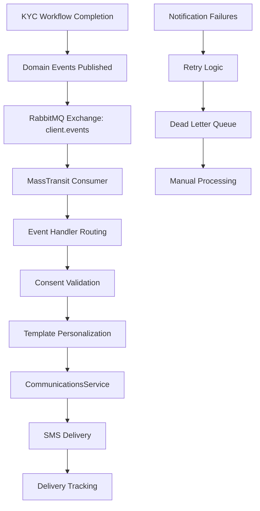

# Story 1.14: Event-Driven Notification Triggers for KYC Status Changes

## Status
Draft

## Story
**As a** Customer,  
**I want** to receive SMS notifications when my KYC status changes (Approved, Rejected, EDD Required),  
**so that** I know the status of my loan application without having to call the branch.

## Acceptance Criteria
1. Domain event handlers created for:
   - `KycCompletedEvent` → Trigger notification with template `kyc_approved`
   - `KycRejectedEvent` → Trigger notification with template `kyc_rejected`
   - `EddEscalatedEvent` → Trigger notification with template `kyc_edd_required`
2. `NotificationService` created with SendKycStatusNotificationAsync method:
   - Retrieve client and consent preferences
   - Check ConsentType=Operational and SmsEnabled=true
   - Call CommunicationsClient with appropriate template and personalization data (ClientName, KycStatus)
3. MassTransit consumers created in `Consumers/` folder for each event
4. RabbitMQ configuration added: exchange `client.events`, routing keys `client.kyc.*`
5. Integration tests with MassTransit In-Memory test harness validate event publishing and consumption
6. Notification retry logic: 3 retries with exponential backoff, DLQ after failures

## Tasks / Subtasks

- [ ] **Task 1: Create Domain Event Handlers Infrastructure** (AC: 1)
  - [ ] Create `EventHandlers/` folder in project root
  - [ ] Create base `IDomainEventHandler<TEvent>` interface:
    - `Task HandleAsync(TEvent domainEvent, CancellationToken cancellationToken)`
  - [ ] Create event handler registration extension method:
    - `AddDomainEventHandlers(this IServiceCollection services)`
    - Automatically register all handlers implementing the interface
  - [ ] Configure MassTransit for RabbitMQ integration:
    - Exchange: `client.events`
    - Routing keys pattern: `client.kyc.*`
    - Message durability and persistence settings
  - [ ] Add correlation ID propagation for audit trail
  - [ ] Create base classes for common event handling patterns

- [ ] **Task 2: Create NotificationService for KYC Communications** (AC: 2)
  - [ ] Create `INotificationService.cs` interface in `Services/`:
    - `Task SendKycStatusNotificationAsync(Guid clientId, string templateId, Dictionary<string, object> personalizations)`
    - `Task<bool> CheckNotificationConsentAsync(Guid clientId, NotificationChannel channel)`
    - `Task<NotificationResult> SendNotificationWithRetryAsync(NotificationRequest request)`
  - [ ] Create `KycNotificationService.cs` implementation:
    - Inject `ICommunicationsClient` and `ClientManagementDbContext`
    - Implement consent checking logic
    - Build personalization data from client information
    - Handle notification failures and retry logic
  - [ ] Create notification DTOs:
    - `NotificationRequest` with template, recipient, channel, data
    - `NotificationResult` with success status, errors, retry count
    - `PersonalizationData` with client-specific variables
  - [ ] Add comprehensive logging for notification compliance
  - [ ] Create unit tests for consent checking and personalization logic

- [ ] **Task 3: Create KYC Completed Event Handler** (AC: 3)
  - [ ] Create `KycCompletedEventHandler.cs` in `EventHandlers/`:
    - Implement `IDomainEventHandler<KycCompletedEvent>`
    - Extract client ID and completion details from event
    - Call `NotificationService.SendKycStatusNotificationAsync` with `kyc_approved` template
    - Handle notification failures gracefully
  - [ ] Create personalization data for KYC approved template:
    - `ClientName`: Client's full name
    - `CompletionDate`: Formatted completion date
    - `NextSteps`: Information about loan application process
    - `BranchContact`: Branch contact information
  - [ ] Add error handling and logging:
    - Log notification attempts and results
    - Handle cases where client consent is revoked
    - Implement fallback mechanisms for critical notifications
  - [ ] Create unit tests with mock dependencies
  - [ ] Register event handler in DI container

- [ ] **Task 4: Create KYC Rejected Event Handler** (AC: 3)
  - [ ] Create `KycRejectedEventHandler.cs` in `EventHandlers/`:
    - Implement `IDomainEventHandler<KycRejectedEvent>`
    - Extract rejection details and reason from event
    - Call notification service with `kyc_rejected` template
    - Include rejection reason in personalization data
  - [ ] Create personalization data for KYC rejected template:
    - `ClientName`: Client's full name
    - `RejectionDate`: Formatted rejection date
    - `RejectionReason`: Human-readable rejection reason
    - `ReapplyInstructions`: Steps to reapply for KYC
    - `BranchContact`: Branch support information
  - [ ] Add sensitive data handling:
    - Sanitize rejection reasons for customer communication
    - Avoid exposing internal process details
    - Include helpful guidance for resolution
  - [ ] Create unit tests for various rejection scenarios
  - [ ] Register event handler in DI container

- [ ] **Task 5: Create EDD Escalation Event Handler** (AC: 3)
  - [ ] Create `EddEscalatedEventHandler.cs` in `EventHandlers/`:
    - Implement `IDomainEventHandler<EddEscalatedEvent>`
    - Handle EDD escalation with appropriate messaging
    - Call notification service with `kyc_edd_required` template
    - Include timeline expectations in notification
  - [ ] Create personalization data for EDD notification:
    - `ClientName`: Client's full name
    - `EscalationDate`: When EDD was triggered
    - `ExpectedTimeframe`: Expected duration for EDD review
    - `RequiredActions`: Any actions needed from client
    - `ContactInformation`: Compliance team contact details
  - [ ] Handle sensitive messaging:
    - Professional language for compliance requirements
    - Clear explanation without alarming customer
    - Transparent timeline and process expectations
  - [ ] Create unit tests for EDD escalation scenarios
  - [ ] Register event handler in DI container

- [ ] **Task 6: Create MassTransit Consumer Configuration** (AC: 4)
  - [ ] Create `Consumers/` folder for MassTransit consumers
  - [ ] Create `KycEventConsumer.cs` class:
    - Implement `IConsumer<KycCompletedEvent>`, `IConsumer<KycRejectedEvent>`, `IConsumer<EddEscalatedEvent>`
    - Route events to appropriate domain event handlers
    - Add correlation ID and tracing support
    - Handle consumer-level errors and retries
  - [ ] Configure RabbitMQ exchange and routing:
    - Exchange: `client.events` (fanout or topic)
    - Routing keys: `client.kyc.completed`, `client.kyc.rejected`, `client.kyc.edd-escalated`
    - Queue naming: `client-management.kyc-notifications`
    - Dead letter queue: `client-management.kyc-notifications.dlq`
  - [ ] Add message serialization and deserialization:
    - JSON serialization with proper type handling
    - Version compatibility for message schema evolution
    - Error handling for malformed messages
  - [ ] Create integration tests for message consumption

- [ ] **Task 7: Implement Notification Templates and Personalization**
  - [ ] Create template configuration for KYC notifications:
    - Template IDs: `kyc_approved`, `kyc_rejected`, `kyc_edd_required`
    - Placeholder variables for personalization
    - Multi-language support preparation (English initially)
  - [ ] Design SMS message content:
    - **KYC Approved:** "Good news {ClientName}! Your KYC verification is complete. Your loan application will now proceed to the next stage. Contact us at {BranchContact} for updates."
    - **KYC Rejected:** "Hello {ClientName}, your KYC verification requires additional documentation. Reason: {RejectionReason}. Please visit your branch or call {BranchContact} for assistance."
    - **EDD Required:** "Hello {ClientName}, your application requires additional compliance review. This process typically takes {ExpectedTimeframe}. We'll contact you with updates at {ContactInformation}."
  - [ ] Create `TemplatePersonalizer.cs` service:
    - Replace placeholders with actual client data
    - Format dates, numbers, and other data types appropriately
    - Handle missing personalization data gracefully
  - [ ] Add template validation and testing:
    - Validate all required placeholders are provided
    - Test message length limits for SMS
    - Verify personalization data formatting
  - [ ] Document template variables and usage

- [ ] **Task 8: Implement Consent-Based Notification Filtering** 
  - [ ] Update `NotificationService` with consent checking:
    - Query `CommunicationConsent` table before sending
    - Check `ConsentType = 'Operational'` and `SmsEnabled = true`
    - Log consent-blocked notifications for compliance
    - Handle cases where consent is revoked mid-process
  - [ ] Create consent bypass for critical notifications:
    - Define critical notification types (e.g., security alerts)
    - Allow bypass with enhanced logging and approval
    - Document legal basis for consent bypasses
  - [ ] Add consent audit trail:
    - Log when consent is checked and result
    - Track consent changes during notification process
    - Provide audit reports for consent compliance
  - [ ] Create unit tests for various consent scenarios:
    - Consented customer receives notification
    - Non-consented customer notification blocked
    - Consent revoked during processing
    - Critical notification bypass scenarios

- [ ] **Task 9: Implement Retry Logic and Dead Letter Queue Handling** (AC: 6)
  - [ ] Create `NotificationRetryService.cs`:
    - Implement exponential backoff retry strategy
    - Retry attempts: 1s, 3s, 9s delays (3 total retries)
    - Track retry attempts and failure reasons
    - Send to DLQ after maximum retries exceeded
  - [ ] Configure DLQ processing:
    - Separate queue for failed notifications: `client-management.notifications.dlq`
    - DLQ consumer for manual processing and analysis
    - Alert mechanisms for DLQ message accumulation
    - Requeue capability for resolved issues
  - [ ] Add failure categorization:
    - Temporary failures: Network issues, service unavailable
    - Permanent failures: Invalid phone numbers, blocked recipients
    - Configuration failures: Missing templates, invalid data
  - [ ] Create monitoring and alerting:
    - Metrics for notification success/failure rates
    - Alerts for high failure rates or DLQ buildup
    - Dashboard for notification system health
  - [ ] Create integration tests for retry scenarios

- [ ] **Task 10: Create Notification Analytics and Reporting**
  - [ ] Create `NotificationAnalyticsService.cs`:
    - Track notification delivery rates by template type
    - Monitor consent blocking rates
    - Measure average delivery time and retry rates
    - Generate compliance reports for notification activities
  - [ ] Add notification tracking:
    - Unique notification ID for each message
    - Delivery status tracking (sent, delivered, failed)
    - Click/response tracking for actionable notifications
    - Aggregate statistics for business intelligence
  - [ ] Create reporting API endpoints:
    - `GET /api/notifications/analytics/delivery-rates`
    - `GET /api/notifications/analytics/consent-compliance`
    - `GET /api/notifications/analytics/template-performance`
  - [ ] Add real-time dashboards:
    - Live notification processing status
    - Template performance metrics
    - Consent compliance trends
    - System health indicators
  - [ ] Create scheduled reports for compliance documentation

- [ ] **Task 11: Create Integration Tests with MassTransit Test Harness** (AC: 5)
  - [ ] Create `NotificationIntegrationTests.cs` test class
  - [ ] Set up MassTransit In-Memory test harness:
    - Configure in-memory transport for testing
    - Mock CommunicationsClient for controlled testing
    - Test database with sample clients and consent data
  - [ ] Test complete event-to-notification workflows:
    - Publish `KycCompletedEvent` → Verify notification sent with correct template
    - Publish `KycRejectedEvent` → Verify rejection notification with reason
    - Publish `EddEscalatedEvent` → Verify EDD notification with timeline
  - [ ] Test consent enforcement:
    - Client with SMS consent → Notification sent
    - Client without SMS consent → Notification blocked, logged
    - Client with revoked consent → Appropriate handling
  - [ ] Test error handling and retry scenarios:
    - CommunicationsService unavailable → Retry logic engaged
    - Invalid template → Proper error handling
    - DLQ processing after max retries
  - [ ] Test message ordering and deduplication:
    - Multiple events for same client handled correctly
    - Duplicate messages handled appropriately
    - Event ordering preserved where necessary

- [ ] **Task 12: Create EDD-Specific Notification Enhancements**
  - [ ] Create additional EDD-related event handlers:
    - `EddApprovedEventHandler` → Notify client of final approval
    - `EddRejectedEventHandler` → Notify client of EDD rejection
    - `EddReportGeneratedEventHandler` → Internal notifications to compliance team
  - [ ] Design EDD notification templates:
    - **EDD Approved:** Professional approval message with next steps
    - **EDD Rejected:** Sensitive rejection message with support information
    - **EDD Delayed:** Process update notifications for extended timelines
  - [ ] Add compliance team notifications:
    - Internal notifications for EDD milestones
    - Escalation notifications for overdue EDD reviews
    - Summary notifications for EDD completion rates
  - [ ] Create notification scheduling:
    - Delayed notifications for EDD timeline updates
    - Reminder notifications for pending actions
    - Follow-up notifications based on client responses
  - [ ] Add multi-channel support preparation:
    - SMS for immediate notifications
    - Email for detailed information (future)
    - In-app notifications for logged-in users (future)

- [ ] **Task 13: Update Service Registration and Configuration**
  - [ ] Update `Extensions/ServiceCollectionExtensions.cs`:
    - Register `INotificationService` and `KycNotificationService`
    - Register all domain event handlers
    - Configure MassTransit with RabbitMQ settings
    - Register notification analytics services
  - [ ] Update `Program.cs` configuration:
    - Add RabbitMQ connection configuration
    - Configure MassTransit consumers and endpoints
    - Add notification system health checks
    - Register background services for DLQ processing
  - [ ] Add configuration validation:
    - Validate RabbitMQ connection settings
    - Verify CommunicationsService integration
    - Check notification template availability
  - [ ] Configure monitoring and logging:
    - Structured logging for all notification activities
    - Metrics collection for notification system performance
    - Integration with existing observability stack

- [ ] **Task 14: Create Notification System Monitoring**
  - [ ] Add comprehensive metrics collection:
    - Notifications sent per hour by template type
    - Delivery success and failure rates
    - Consent blocking statistics
    - Retry attempts and DLQ utilization
  - [ ] Create health checks for notification system:
    - RabbitMQ connectivity and queue status
    - CommunicationsService availability
    - Template configuration validation
    - DLQ backlog monitoring
  - [ ] Add alerts for critical issues:
    - High notification failure rates (>10%)
    - DLQ message accumulation (>100 messages)
    - CommunicationsService connectivity issues
    - Unusual consent blocking patterns
  - [ ] Create operational dashboards:
    - Real-time notification processing metrics
    - Template performance and engagement rates
    - System health and error rate trends
    - Compliance reporting for audit purposes
  - [ ] Document monitoring procedures and escalation paths

- [ ] **Task 15: Create Documentation and Runbooks**
  - [ ] Create notification system documentation:
    - Architecture overview and message flows
    - Template configuration and personalization guide
    - Consent management and compliance procedures
    - Troubleshooting guide for common issues
  - [ ] Create operational runbooks:
    - DLQ processing and message requeue procedures
    - Template updates and testing processes
    - Consent compliance verification steps
    - Incident response for notification outages
  - [ ] Document integration patterns:
    - Adding new notification templates
    - Integrating additional event types
    - Multi-channel notification setup
    - Testing and validation procedures
  - [ ] Create training materials:
    - Notification system overview for operations team
    - Compliance requirements and procedures
    - Monitoring and alerting guide
    - Emergency response procedures

## Dev Notes

### Event-Driven Architecture Overview
**Source:** [docs/domains/client-management/brownfield-architecture.md#event-driven-architecture-integration]

**Event Flow Architecture:**


**Domain Events Integration:**
- Events published from Stories 1.11 (KYC workflow) and 1.12 (EDD workflow)
- MassTransit handles message routing and delivery guarantees
- Event handlers provide decoupled notification processing
- Consent management ensures GDPR/privacy compliance

### Notification Service Architecture
**Core Service Implementation:**
```csharp
public class KycNotificationService : INotificationService
{
    private readonly ICommunicationsClient _communicationsClient;
    private readonly ClientManagementDbContext _context;
    private readonly ILogger<KycNotificationService> _logger;
    
    public async Task SendKycStatusNotificationAsync(
        Guid clientId, 
        string templateId, 
        Dictionary<string, object> personalizations)
    {
        // Check consent first
        var hasConsent = await CheckNotificationConsentAsync(clientId, NotificationChannel.SMS);
        if (!hasConsent)
        {
            _logger.LogInformation("Notification blocked due to consent: {ClientId}, {Template}", 
                clientId, templateId);
            return;
        }
        
        // Get client information
        var client = await _context.Clients.FindAsync(clientId);
        if (client == null) throw new ClientNotFoundException(clientId);
        
        // Build notification request
        var request = new SendNotificationRequest
        {
            TemplateId = templateId,
            RecipientId = clientId.ToString(),
            Channel = "SMS",
            PersonalizationData = personalizations
        };
        
        // Send with retry logic
        await SendNotificationWithRetryAsync(request);
    }
    
    public async Task<bool> CheckNotificationConsentAsync(Guid clientId, NotificationChannel channel)
    {
        var consent = await _context.CommunicationConsents
            .FirstOrDefaultAsync(c => c.ClientId == clientId && c.ConsentType == "Operational");
            
        return consent?.SmsEnabled == true && consent.ConsentRevokedAt == null;
    }
}
```

### Message Templates and Personalization
**Template Definitions:**

**KYC Approved Template (`kyc_approved`):**
```text
Good news {ClientName}! Your KYC verification is complete as of {CompletionDate}. 
Your loan application will proceed to the next stage. 
For updates, contact your branch at {BranchContact}. - IntelliFin
```

**KYC Rejected Template (`kyc_rejected`):**
```text
Hello {ClientName}, your KYC verification requires additional review. 
{RejectionReason}. Please visit your branch or call {BranchContact} for assistance. 
Reference: {ApplicationId} - IntelliFin
```

**EDD Required Template (`kyc_edd_required`):**
```text
Hello {ClientName}, your application requires additional compliance review. 
This process typically takes {ExpectedTimeframe}. 
We will update you on progress. Contact: {ContactInformation} - IntelliFin
```

**Personalization Data Structure:**
```csharp
public class PersonalizationData
{
    public string ClientName { get; set; }
    public string CompletionDate { get; set; }
    public string RejectionReason { get; set; }
    public string ExpectedTimeframe { get; set; }
    public string BranchContact { get; set; }
    public string ContactInformation { get; set; }
    public string ApplicationId { get; set; }
    public Dictionary<string, object> CustomFields { get; set; }
}
```

### MassTransit Configuration
**RabbitMQ Setup:**
```csharp
services.AddMassTransit(x =>
{
    x.AddConsumer<KycEventConsumer>();
    
    x.UsingRabbitMq((context, cfg) =>
    {
        cfg.Host("rabbitmq://localhost", h =>
        {
            h.Username("guest");
            h.Password("guest");
        });
        
        cfg.ReceiveEndpoint("client-management.kyc-notifications", e =>
        {
            e.ConfigureConsumer<KycEventConsumer>(context);
            e.Bind("client.events", s =>
            {
                s.RoutingKey = "client.kyc.*";
                s.ExchangeType = "topic";
            });
            
            // Retry configuration
            e.UseMessageRetry(r => r.Exponential(3, TimeSpan.FromSeconds(1), TimeSpan.FromSeconds(10), TimeSpan.FromSeconds(2)));
            
            // Dead letter queue
            e.ConfigureDeadLetterQueueDeadLetterTransport();
        });
        
        cfg.ConfigureEndpoints(context);
    });
});
```

### Event Handler Implementation Pattern
**Base Event Handler:**
```csharp
public abstract class BaseKycEventHandler<TEvent> : IDomainEventHandler<TEvent>
    where TEvent : class
{
    protected readonly INotificationService _notificationService;
    protected readonly ILogger _logger;
    
    protected BaseKycEventHandler(
        INotificationService notificationService,
        ILogger logger)
    {
        _notificationService = notificationService;
        _logger = logger;
    }
    
    public abstract Task HandleAsync(TEvent domainEvent, CancellationToken cancellationToken);
    
    protected async Task<Dictionary<string, object>> BuildPersonalizationDataAsync(
        Guid clientId, 
        Dictionary<string, object> eventSpecificData)
    {
        var baseData = new Dictionary<string, object>
        {
            ["ClientName"] = await GetClientNameAsync(clientId),
            ["BranchContact"] = "0977-123-456", // From configuration
            ["CompanyName"] = "IntelliFin"
        };
        
        foreach (var kvp in eventSpecificData)
        {
            baseData[kvp.Key] = kvp.Value;
        }
        
        return baseData;
    }
}
```

**Specific Event Handler:**
```csharp
public class KycCompletedEventHandler : BaseKycEventHandler<KycCompletedEvent>
{
    public KycCompletedEventHandler(
        INotificationService notificationService,
        ILogger<KycCompletedEventHandler> logger)
        : base(notificationService, logger)
    {
    }
    
    public override async Task HandleAsync(KycCompletedEvent domainEvent, CancellationToken cancellationToken)
    {
        _logger.LogInformation("Processing KYC completed notification for client {ClientId}", 
            domainEvent.ClientId);
        
        try
        {
            var eventData = new Dictionary<string, object>
            {
                ["CompletionDate"] = domainEvent.CompletedAt.ToString("MMMM dd, yyyy"),
                ["CompletedBy"] = domainEvent.CompletedBy,
                ["ProcessInstanceId"] = domainEvent.ProcessInstanceId
            };
            
            var personalizationData = await BuildPersonalizationDataAsync(domainEvent.ClientId, eventData);
            
            await _notificationService.SendKycStatusNotificationAsync(
                domainEvent.ClientId,
                "kyc_approved",
                personalizationData);
                
            _logger.LogInformation("KYC completion notification sent successfully for client {ClientId}", 
                domainEvent.ClientId);
        }
        catch (Exception ex)
        {
            _logger.LogError(ex, "Failed to send KYC completion notification for client {ClientId}", 
                domainEvent.ClientId);
            throw; // Re-throw to trigger retry mechanism
        }
    }
}
```

### Consent Management Integration
**Source:** [docs/domains/client-management/prd.md#fr11-communication-consent-management]

**Consent Validation Logic:**
```csharp
public async Task<bool> CheckNotificationConsentAsync(Guid clientId, NotificationChannel channel)
{
    var consent = await _context.CommunicationConsents
        .Where(c => c.ClientId == clientId)
        .Where(c => c.ConsentType == "Operational") // KYC notifications are operational
        .Where(c => c.ConsentRevokedAt == null) // Not revoked
        .FirstOrDefaultAsync();
    
    if (consent == null)
    {
        _logger.LogWarning("No operational consent found for client {ClientId}", clientId);
        return false;
    }
    
    return channel switch
    {
        NotificationChannel.SMS => consent.SmsEnabled,
        NotificationChannel.Email => consent.EmailEnabled,
        NotificationChannel.InApp => consent.InAppEnabled,
        _ => false
    };
}
```

**Consent Bypass for Critical Notifications:**
```csharp
public async Task SendCriticalNotificationAsync(
    Guid clientId, 
    string templateId, 
    Dictionary<string, object> personalizations,
    string bypassReason)
{
    // Log consent bypass with justification
    _logger.LogWarning("Sending critical notification bypassing consent for client {ClientId}. Reason: {BypassReason}", 
        clientId, bypassReason);
    
    // Send notification regardless of consent status
    var request = new SendNotificationRequest
    {
        TemplateId = templateId,
        RecipientId = clientId.ToString(),
        Channel = "SMS",
        PersonalizationData = personalizations,
        IsCritical = true,
        BypassReason = bypassReason
    };
    
    await SendNotificationWithRetryAsync(request);
    
    // Log for compliance audit
    await _auditService.LogConsentBypassAsync(clientId, templateId, bypassReason);
}
```

### Retry Logic and DLQ Implementation
**Retry Strategy:**
```csharp
public async Task<NotificationResult> SendNotificationWithRetryAsync(NotificationRequest request)
{
    var maxRetries = 3;
    var retryDelays = new[] { TimeSpan.FromSeconds(1), TimeSpan.FromSeconds(3), TimeSpan.FromSeconds(9) };
    
    for (int attempt = 0; attempt <= maxRetries; attempt++)
    {
        try
        {
            await _communicationsClient.SendNotificationAsync(request);
            
            return new NotificationResult
            {
                Success = true,
                AttemptCount = attempt + 1,
                FinalAttemptAt = DateTime.UtcNow
            };
        }
        catch (Exception ex) when (attempt < maxRetries && IsRetryableException(ex))
        {
            _logger.LogWarning("Notification attempt {Attempt} failed for {TemplateId}, retrying in {Delay}ms. Error: {Error}",
                attempt + 1, request.TemplateId, retryDelays[attempt].TotalMilliseconds, ex.Message);
                
            await Task.Delay(retryDelays[attempt]);
        }
        catch (Exception ex)
        {
            _logger.LogError(ex, "Notification failed permanently for {TemplateId} after {Attempts} attempts",
                request.TemplateId, attempt + 1);
                
            // Send to DLQ for manual processing
            await SendToDlqAsync(request, ex);
            
            return new NotificationResult
            {
                Success = false,
                AttemptCount = attempt + 1,
                FinalError = ex.Message,
                SentToDlq = true
            };
        }
    }
    
    // Should not reach here, but handle gracefully
    return new NotificationResult { Success = false, AttemptCount = maxRetries + 1 };
}
```

### Integration with Previous Stories
**KYC Workflow Integration (Stories 1.11-1.12):**
- Domain events published from workflow completion workers
- Event correlation IDs maintained for audit trail
- Notification timing aligned with workflow stages

**Communication Consent (Story 1.7):**
- Consent validation before every notification
- Audit trail for consent-blocked notifications
- Support for consent updates during processing

**Client Management (Stories 1.3-1.4):**
- Client data used for personalization
- Branch context for contact information
- Customer journey tracking through notifications

### Analytics and Reporting
**Notification Metrics:**
```csharp
public class NotificationAnalytics
{
    public int TotalNotificationsSent { get; set; }
    public int NotificationsBlocked { get; set; }
    public Dictionary<string, int> NotificationsByTemplate { get; set; }
    public Dictionary<string, double> DeliveryRatesByTemplate { get; set; }
    public int RetryAttempts { get; set; }
    public int DlqMessages { get; set; }
    public double AverageDeliveryTime { get; set; }
    public Dictionary<string, int> FailureReasons { get; set; }
}
```

**Compliance Reporting:**
- Daily consent compliance report
- Notification delivery success rates
- Template performance analysis
- Regulatory reporting for communication activities

### Project Structure After This Story
```
apps/IntelliFin.ClientManagement/
├── EventHandlers/
│   ├── IDomainEventHandler.cs                      # NEW - Base handler interface
│   ├── KycCompletedEventHandler.cs                 # NEW - KYC completion handler
│   ├── KycRejectedEventHandler.cs                  # NEW - KYC rejection handler
│   ├── EddEscalatedEventHandler.cs                 # NEW - EDD escalation handler
│   ├── EddApprovedEventHandler.cs                  # NEW - EDD approval handler
│   └── EddRejectedEventHandler.cs                  # NEW - EDD rejection handler
├── Consumers/
│   └── KycEventConsumer.cs                         # NEW - MassTransit consumer
├── Services/
│   ├── INotificationService.cs                     # NEW - Notification interface
│   ├── KycNotificationService.cs                   # NEW - Notification implementation
│   ├── NotificationRetryService.cs                 # NEW - Retry logic
│   ├── NotificationAnalyticsService.cs             # NEW - Analytics service
│   └── TemplatePersonalizer.cs                     # NEW - Template processing
├── Models/
│   ├── NotificationRequest.cs                      # NEW - Request model
│   ├── NotificationResult.cs                       # NEW - Result model
│   ├── PersonalizationData.cs                      # NEW - Template data
│   └── NotificationAnalytics.cs                    # NEW - Analytics model
└── [existing files from Stories 1.1-1.13]
```

## Testing

### Testing Standards
**Source:** [docs/domains/client-management/prd.md#testing-integration-strategy]

- **Test Framework:** xUnit with MassTransit In-Memory test harness
- **Coverage Target:** 90% for notification service (business critical)
- **Integration Tests:** End-to-end event publishing and consumption
- **Performance Tests:** High-volume notification processing

### Specific Test Cases for This Story

**Unit Tests - Notification Service:**
1. **Consent Validation:**
   - Client with SMS consent → Notification allowed
   - Client without consent → Notification blocked, logged
   - Client with revoked consent → Notification blocked
   - Critical notification bypass → Consent ignored with audit

2. **Template Personalization:**
   - All template variables replaced correctly
   - Missing personalization data handled gracefully
   - Date and number formatting applied properly
   - Template length validation for SMS limits

3. **Retry Logic:**
   - Temporary failure → Retry with exponential backoff
   - Permanent failure → Sent to DLQ immediately
   - Max retries exceeded → Final failure, DLQ processing
   - Retry success → Proper result tracking

**Integration Tests - Event-to-Notification Flow:**
1. **KYC Completed Event:**
   - Event published → Handler triggered → Consent checked → Notification sent
   - Verify correct template used (`kyc_approved`)
   - Verify personalization data populated correctly
   - Verify audit logging of notification attempt

2. **KYC Rejected Event:**
   - Event with rejection reason → Appropriate notification sent
   - Rejection reason sanitized for customer communication
   - Verify template used (`kyc_rejected`)
   - Support contact information included

3. **EDD Escalated Event:**
   - High-risk client triggers EDD → EDD notification sent
   - Professional messaging without alarming language
   - Timeline expectations communicated clearly
   - Compliance contact information provided

**Performance Tests:**
1. **High-Volume Processing:**
   - Process 1000 notification events in < 60 seconds
   - Memory usage stable during batch processing
   - No message loss during high-throughput periods
   - Proper queue management under load

2. **Retry Performance:**
   - Retry logic doesn't cause blocking
   - DLQ processing doesn't impact main flow
   - Exponential backoff prevents system overload
   - Failed notifications don't accumulate indefinitely

### Test File Structure
```
tests/IntelliFin.ClientManagement.Tests/
├── EventHandlers/
│   ├── KycCompletedEventHandlerTests.cs
│   ├── KycRejectedEventHandlerTests.cs
│   └── EddEscalatedEventHandlerTests.cs
├── Services/
│   ├── KycNotificationServiceTests.cs
│   ├── NotificationRetryServiceTests.cs
│   └── TemplatePersonalizerTests.cs
└── Consumers/
    └── KycEventConsumerTests.cs

tests/IntelliFin.ClientManagement.IntegrationTests/
├── Notifications/
│   ├── NotificationIntegrationTests.cs
│   ├── EventToNotificationFlowTests.cs
│   └── NotificationPerformanceTests.cs
└── Messaging/
    └── MassTransitIntegrationTests.cs
```

## Change Log

| Date | Version | Description | Author |
|------|---------|-------------|--------|
| 2025-10-17 | 1.0 | Initial story creation | Bob (SM) |

## Dev Agent Record
*This section will be populated by the development agent during implementation.*

### Agent Model Used
*To be filled by dev agent*

### Debug Log References
*To be filled by dev agent*

### Completion Notes List
*To be filled by dev agent*

### File List
*To be filled by dev agent*

## QA Results
*This section will be populated by the QA agent after implementation review.*