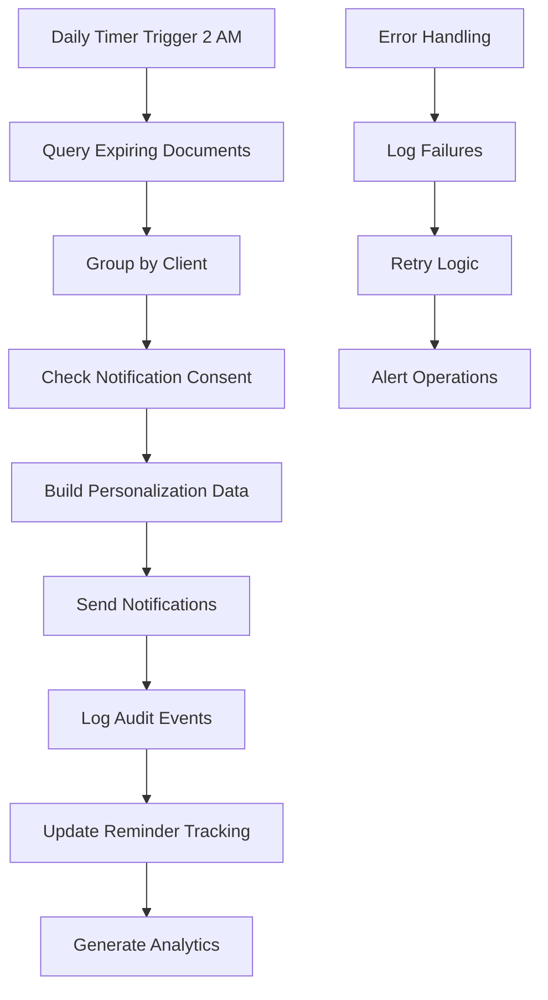

# Story 1.15: Document Expiry Monitoring and Reminder Notifications

## Status
Draft

## Story
**As a** Branch Manager,  
**I want** to receive automated alerts when client KYC documents are approaching expiry,  
**so that** I can proactively request updated documents and maintain compliance.

## Acceptance Criteria
1. `DocumentExpiryMonitoringService` created as BackgroundService running daily at 2 AM
2. Query logic: SELECT documents WHERE ExpiryDate IS NOT NULL AND ExpiryDate BETWEEN NOW() AND NOW() + 30 days AND IsArchived=false
3. For each expiring document:
   - Call NotificationService to send notification with template `document_expiring_soon`
   - Personalization data: ClientName, DocumentType, ExpiryDate, DaysRemaining
   - Check consent before sending
4. Audit event logged: DocumentExpiryReminderSent
5. Configuration setting: `DocumentExpiryReminderDays` (default 30) to customize warning period
6. Unit tests with mocked current date validate reminder logic

## Tasks / Subtasks

- [ ] **Task 1: Create DocumentExpiryMonitoringService** (AC: 1)
  - [ ] Create `DocumentExpiryMonitoringService.cs` as BackgroundService in `Services/`
  - [ ] Implement daily scheduling at 2 AM using Timer or HostedService pattern
  - [ ] Add configuration options:
    - `DocumentExpirySettings.ReminderDays` (default: 30)
    - `DocumentExpirySettings.RunTimeUtc` (default: "02:00")
    - `DocumentExpirySettings.IsEnabled` (default: true)
    - `DocumentExpirySettings.MaxDocumentsPerBatch` (default: 100)
  - [ ] Create cancellation token support for graceful shutdown
  - [ ] Add structured logging for monitoring and troubleshooting
  - [ ] Register service in DI container as BackgroundService
  - [ ] Add health check to monitor service status and last run time

- [ ] **Task 2: Implement Document Expiry Query Logic** (AC: 2)
  - [ ] Create `IDocumentExpiryRepository.cs` interface in `Repositories/`:
    - `Task<List<ExpiringDocument>> GetExpiringDocumentsAsync(int reminderDays)`
    - `Task<List<ExpiringDocument>> GetExpiredDocumentsAsync()`
    - `Task<bool> MarkReminderSentAsync(Guid documentId, DateTime sentAt)`
  - [ ] Create `DocumentExpiryRepository.cs` implementation:
    - Query ClientDocuments table with expiry date filtering
    - Include client information via navigation properties
    - Filter out archived documents and already processed reminders
    - Order by expiry date (most urgent first)
    - Support batch processing with configurable limits
  - [ ] Create `ExpiringDocument` DTO:
    - `Guid DocumentId`, `Guid ClientId`, `string ClientName`
    - `string DocumentType`, `DateTime ExpiryDate`, `int DaysRemaining`
    - `string ClientPhone`, `string BranchContact`
    - `DateTime? LastReminderSent`, `int RemindersSent`
  - [ ] Add database indexes for performance optimization
  - [ ] Create unit tests for query logic with various expiry scenarios

- [ ] **Task 3: Create Document Expiry Notification Templates** (AC: 3)
  - [ ] Design `document_expiring_soon` SMS template:
    - "Hello {ClientName}, your {DocumentType} expires on {ExpiryDate} ({DaysRemaining} days). Please bring updated documents to your branch. Contact: {BranchContact} - IntelliFin"
  - [ ] Design `document_expired` SMS template:
    - "Hello {ClientName}, your {DocumentType} has expired as of {ExpiryDate}. Please provide updated documents immediately to maintain your account status. Contact: {BranchContact} - IntelliFin"
  - [ ] Create internal alert template `document_expiry_alert`:
    - For branch managers and relationship officers
    - "Client {ClientName} has {DocumentType} expiring in {DaysRemaining} days. Please follow up for document renewal. Client: {ClientPhone}"
  - [ ] Add template personalization service:
    - Format dates in user-friendly format
    - Calculate days remaining accurately
    - Handle edge cases (same day expiry, negative days)
    - Include branch-specific contact information
  - [ ] Create template validation and testing framework

- [ ] **Task 4: Implement Expiry Reminder Processing Logic** (AC: 3, 4)
  - [ ] Create `ProcessDocumentRemindersAsync` method in monitoring service:
    - Get expiring documents from repository
    - Group by client to avoid duplicate notifications
    - Check notification consent for each client
    - Build personalization data for each document type
    - Send notifications via NotificationService
    - Log audit events for compliance tracking
  - [ ] Implement deduplication logic:
    - One notification per client per day (multiple documents grouped)
    - Track last reminder sent date to avoid spam
    - Escalate urgency based on days remaining
    - Different messaging for immediate vs future expiry
  - [ ] Add error handling and retry logic:
    - Continue processing if individual notification fails
    - Log failed notifications for manual follow-up
    - Retry failed notifications with exponential backoff
    - Alert operations team for persistent failures
  - [ ] Create comprehensive audit logging:
    - Log DocumentExpiryReminderSent for each notification
    - Include client ID, document ID, expiry date, days remaining
    - Track reminder frequency and success rates
  - [ ] Add batch processing support for large datasets

- [ ] **Task 5: Create Document Expiry Configuration Management** (AC: 5)
  - [ ] Create `DocumentExpiryOptions.cs` configuration class:
    - `int ReminderDays` - Days before expiry to send reminder
    - `TimeSpan RunTime` - Daily execution time
    - `bool IsEnabled` - Enable/disable monitoring
    - `int MaxBatchSize` - Maximum documents per processing batch
    - `int MaxReminders` - Maximum reminders per document
    - `List<string> CriticalDocumentTypes` - Documents requiring immediate alerts
  - [ ] Add configuration validation:
    - ReminderDays between 1 and 365
    - RunTime in valid 24-hour format
    - MaxBatchSize reasonable for system capacity
    - CriticalDocumentTypes match valid document types
  - [ ] Create configuration hot-reload support:
    - Monitor appsettings.json for changes
    - Update monitoring schedule dynamically
    - Log configuration changes for audit
  - [ ] Add configuration API endpoints:
    - GET /api/admin/document-expiry/config
    - PUT /api/admin/document-expiry/config
    - POST /api/admin/document-expiry/run-now (manual trigger)
  - [ ] Create unit tests for configuration validation

- [ ] **Task 6: Implement Advanced Document Type Handling**
  - [ ] Create `DocumentExpiryRules.cs` configuration:
    - Map document types to expiry reminder schedules
    - Different reminder periods for different document types
    - Critical documents (NRC, Passport) get more frequent reminders
    - Non-critical documents get standard reminders
  - [ ] Add document type-specific logic:
    - **NRC:** 30, 14, 7, 1 days before expiry + day of expiry
    - **Passport:** 90, 30, 14 days before expiry
    - **Employment Letter:** 30, 7 days before expiry
    - **Bank Statement:** 14, 3 days before expiry
    - **Utility Bill:** 30, 14, 7 days before expiry
  - [ ] Create escalation workflows:
    - Different notification recipients based on urgency
    - Internal alerts to compliance team for critical documents
    - Automatic KYC status updates for expired critical documents
  - [ ] Add regulatory compliance tracking:
    - Track compliance status based on document expiry
    - Generate regulatory reports for expired documents
    - Alert compliance team of regulatory violations
  - [ ] Create unit tests for document type-specific logic

- [ ] **Task 7: Create Client Document Expiry Dashboard** 
  - [ ] Create `DocumentExpiryController.cs` API endpoints:
    - `GET /api/documents/expiry/summary` - Expiry summary statistics
    - `GET /api/documents/expiry/upcoming` - Documents expiring soon
    - `GET /api/documents/expiry/expired` - Already expired documents
    - `GET /api/clients/{id}/documents/expiry` - Client-specific expiry status
  - [ ] Create response DTOs:
    - `DocumentExpirySummary` with counts by time period
    - `ExpiringDocumentResponse` with client and document details
    - `ClientDocumentExpiryStatus` with compliance assessment
  - [ ] Add filtering and sorting options:
    - Filter by document type, client, branch, expiry date range
    - Sort by expiry date, client name, document type
    - Pagination support for large datasets
  - [ ] Create caching for performance:
    - Cache expensive queries for dashboard data
    - Refresh cache when documents are updated
    - Different cache durations based on data sensitivity
  - [ ] Add API documentation and examples

- [ ] **Task 8: Implement Notification Consent Integration**
  - [ ] Update document expiry notifications to respect consent:
    - Check CommunicationConsent before sending reminders
    - Handle consent revocation during processing
    - Log consent-blocked notifications for compliance
    - Provide alternative notification methods for non-consented clients
  - [ ] Create consent bypass for critical compliance notifications:
    - Define critical document types requiring mandatory notifications
    - Document legal basis for consent bypass
    - Enhanced logging and approval process for bypasses
    - Notify clients of mandatory compliance communications
  - [ ] Add multi-channel notification support:
    - SMS for immediate urgent reminders
    - Email for detailed document lists and instructions
    - In-app notifications for logged-in clients
    - Physical mail for non-digital clients (tracked separately)
  - [ ] Create consent-aware batch processing:
    - Separate consented and non-consented clients
    - Different processing logic for each group
    - Comprehensive reporting on consent compliance
  - [ ] Add unit tests for consent integration scenarios

- [ ] **Task 9: Create Document Expiry Analytics and Reporting**
  - [ ] Create `DocumentExpiryAnalyticsService.cs`:
    - Calculate document expiry trends and patterns
    - Track reminder effectiveness and response rates
    - Generate compliance reports for regulatory purposes
    - Monitor system performance and processing statistics
  - [ ] Implement analytics calculations:
    - Document expiry rates by type and time period
    - Client responsiveness to expiry reminders
    - Branch performance in document renewal follow-up
    - Compliance risk assessment based on expiry patterns
  - [ ] Create reporting API endpoints:
    - `GET /api/analytics/document-expiry/trends` - Expiry trends over time
    - `GET /api/analytics/document-expiry/compliance` - Compliance statistics
    - `GET /api/analytics/document-expiry/performance` - System performance metrics
  - [ ] Add scheduled reporting:
    - Daily expiry summary reports for branch managers
    - Weekly compliance reports for compliance team
    - Monthly trend analysis for business intelligence
  - [ ] Create analytics dashboard integration points

- [ ] **Task 10: Implement Document Renewal Workflow Integration**
  - [ ] Create document renewal tracking:
    - Track when clients respond to expiry reminders
    - Link new document uploads to expiry notifications
    - Update expiry dates when documents are renewed
    - Close expiry monitoring tasks when resolved
  - [ ] Add workflow state management:
    - Document states: Valid, Expiring, Expired, Renewed, Replaced
    - State transition tracking with timestamps
    - Automated state updates based on document actions
    - Integration with KYC workflow for expired documents
  - [ ] Create renewal process automation:
    - Automatic KYC re-initiation for expired critical documents
    - Workflow triggers for document replacement requirements
    - Integration with existing dual-control verification process
  - [ ] Add performance metrics:
    - Time from reminder to document renewal
    - Success rates of renewal reminders by document type
    - Client engagement metrics with renewal processes
  - [ ] Create integration tests for renewal workflows

- [ ] **Task 11: Create Unit Tests with Date Mocking** (AC: 6)
  - [ ] Create `DocumentExpiryMonitoringServiceTests.cs` test class
  - [ ] Set up date/time mocking framework:
    - Use `IDateTimeProvider` interface for testable date operations
    - Mock current date to test various expiry scenarios
    - Test leap years, month boundaries, timezone handling
  - [ ] Test expiry detection logic:
    - Documents expiring in 30 days → Included in results
    - Documents expiring in 31 days → Excluded from results
    - Documents expiring today → Included with urgent priority
    - Already expired documents → Separate handling logic
    - Documents with no expiry date → Excluded from processing
  - [ ] Test reminder frequency logic:
    - First reminder at 30 days → Should send
    - Second reminder at 29 days → Should not send (too soon)
    - Reminder at 14 days → Should send (different threshold)
    - Multiple documents for same client → Grouped properly
  - [ ] Test edge cases:
    - Document uploaded after reminder scheduled → Handle gracefully  
    - Client consent revoked mid-processing → Respect consent
    - System date changes during processing → Consistent results
    - Database connectivity issues → Proper error handling
  - [ ] Create integration tests with real database and time scenarios

- [ ] **Task 12: Create Background Job Monitoring and Health Checks**
  - [ ] Create health check for DocumentExpiryMonitoringService:
    - Verify service is running and responsive
    - Check last execution time (should be within 25 hours)
    - Validate configuration parameters
    - Test database connectivity for expiry queries
  - [ ] Add performance monitoring:
    - Track processing time for expiry monitoring runs
    - Monitor memory usage during batch processing
    - Count documents processed and notifications sent
    - Alert on processing delays or failures
  - [ ] Create operational dashboards:
    - Service status and last run information
    - Processing statistics and performance trends
    - Error rates and failure patterns
    - Queue depths and processing backlogs
  - [ ] Add alerting for critical issues:
    - Service not running for more than 25 hours
    - High error rates in document processing
    - Unusual spikes in expiring documents
    - Database performance issues affecting processing
  - [ ] Document monitoring procedures and escalation paths

- [ ] **Task 13: Create Document Expiry API for External Integrations**
  - [ ] Create external API endpoints for document expiry management:
    - `GET /api/external/document-expiry/client/{nrc}` - Expiry status by NRC
    - `POST /api/external/document-expiry/batch` - Batch expiry status queries
    - `PUT /api/external/document-expiry/extend/{documentId}` - Extend document validity
  - [ ] Add API authentication and authorization:
    - API key authentication for external systems
    - Role-based access control for different operations
    - Rate limiting to prevent system abuse
    - Audit logging for all external API calls
  - [ ] Create webhook support for expiry notifications:
    - Configurable webhook endpoints for external systems
    - Event notifications for document expiry milestones
    - Retry logic for webhook delivery failures
    - Webhook security with signed payloads
  - [ ] Add data export capabilities:
    - CSV export for bulk document expiry data
    - PDF reports for compliance documentation
    - Integration with existing reporting systems
  - [ ] Create API documentation and client examples

- [ ] **Task 14: Update Service Registration and Configuration**
  - [ ] Update `Extensions/ServiceCollectionExtensions.cs`:
    - Register `DocumentExpiryMonitoringService` as BackgroundService
    - Register `IDocumentExpiryRepository` and implementation
    - Register analytics and notification services
    - Configure document expiry options binding
  - [ ] Update `Program.cs` configuration:
    - Add document expiry configuration section
    - Register health checks for expiry monitoring
    - Configure background service lifecycle
    - Add logging and monitoring integrations
  - [ ] Add configuration validation:
    - Validate document expiry settings at startup
    - Check database connectivity for expiry queries
    - Verify notification service integration
    - Validate document type mappings
  - [ ] Configure monitoring and alerting:
    - Structured logging for document expiry events
    - Metrics collection for processing statistics
    - Integration with existing observability stack
    - Performance counter registration

- [ ] **Task 15: Create Documentation and Operational Procedures**
  - [ ] Create document expiry monitoring documentation:
    - System architecture and processing flow
    - Configuration options and customization guide
    - Notification templates and personalization variables
    - Troubleshooting guide for common issues
  - [ ] Create operational runbooks:
    - Daily monitoring procedures and health checks
    - Incident response for processing failures
    - Configuration change procedures
    - Performance tuning and optimization guide
  - [ ] Document business processes:
    - Document renewal procedures for branch staff
    - Compliance requirements and regulatory guidelines
    - Client communication protocols for expiry management
    - Integration points with other systems
  - [ ] Create training materials:
    - Branch manager guide for document expiry management
    - Compliance team procedures for expiry monitoring
    - Technical documentation for system administrators
    - API integration guide for external developers

## Dev Notes

### Document Expiry Monitoring Architecture
**Source:** [docs/domains/client-management/prd.md#fr15-document-expiry-monitoring]

**Background Service Pattern:**
The document expiry monitoring system runs as a BackgroundService that executes daily at 2 AM UTC. This timing ensures processing occurs during low-activity periods and provides sufficient time for notifications to be processed before business hours.

**Processing Flow:**


### Document Expiry Query Implementation
**Core Query Logic:**
```csharp
public async Task<List<ExpiringDocument>> GetExpiringDocumentsAsync(int reminderDays)
{
    var cutoffDate = DateTime.UtcNow.AddDays(reminderDays);
    var today = DateTime.UtcNow.Date;
    
    return await _context.ClientDocuments
        .Where(d => d.ExpiryDate.HasValue)
        .Where(d => d.ExpiryDate.Value.Date >= today) // Not already expired
        .Where(d => d.ExpiryDate.Value.Date <= cutoffDate.Date) // Within reminder period
        .Where(d => !d.IsArchived) // Not archived
        .Where(d => d.UploadStatus == "Verified") // Only verified documents
        .Include(d => d.Client)
        .Select(d => new ExpiringDocument
        {
            DocumentId = d.Id,
            ClientId = d.ClientId,
            ClientName = $"{d.Client.FirstName} {d.Client.LastName}",
            DocumentType = d.DocumentType,
            ExpiryDate = d.ExpiryDate.Value,
            DaysRemaining = (d.ExpiryDate.Value.Date - today).Days,
            ClientPhone = d.Client.PrimaryPhone,
            LastReminderSent = d.LastReminderSent,
            RemindersSent = d.RemindersSent
        })
        .OrderBy(d => d.ExpiryDate)
        .ToListAsync();
}
```

### Document Type-Specific Reminder Rules
**Reminder Schedules:**
```csharp
public static class DocumentExpiryRules
{
    public static readonly Dictionary<string, int[]> ReminderSchedules = new()
    {
        ["NRC"] = new[] { 30, 14, 7, 1, 0 }, // National Registration Card - critical
        ["Passport"] = new[] { 90, 30, 14 }, // Passport - important for travel
        ["DrivingLicense"] = new[] { 30, 14, 7 }, // Driving License
        ["EmploymentLetter"] = new[] { 30, 7 }, // Employment documentation
        ["BankStatement"] = new[] { 14, 3 }, // Financial statements
        ["UtilityBill"] = new[] { 30, 14, 7 }, // Address verification
        ["PaySlip"] = new[] { 30, 14 }, // Income verification
    };
    
    public static readonly HashSet<string> CriticalDocuments = new()
    {
        "NRC", "Passport", "DrivingLicense"
    };
    
    public static bool ShouldSendReminder(string documentType, int daysRemaining, DateTime? lastReminderSent)
    {
        if (!ReminderSchedules.ContainsKey(documentType))
            return false;
            
        var schedule = ReminderSchedules[documentType];
        if (!schedule.Contains(daysRemaining))
            return false;
            
        // Avoid sending duplicate reminders on the same day
        if (lastReminderSent?.Date == DateTime.UtcNow.Date)
            return false;
            
        return true;
    }
}
```

### Background Service Implementation
**DocumentExpiryMonitoringService:**
```csharp
public class DocumentExpiryMonitoringService : BackgroundService
{
    private readonly IServiceProvider _serviceProvider;
    private readonly DocumentExpiryOptions _options;
    private readonly ILogger<DocumentExpiryMonitoringService> _logger;
    
    protected override async Task ExecuteAsync(CancellationToken stoppingToken)
    {
        while (!stoppingToken.IsCancellationRequested)
        {
            try
            {
                var now = DateTime.UtcNow;
                var targetTime = now.Date.Add(_options.RunTime);
                
                // If target time has passed today, schedule for tomorrow
                if (targetTime <= now)
                {
                    targetTime = targetTime.AddDays(1);
                }
                
                var delay = targetTime - now;
                _logger.LogInformation("Document expiry monitoring scheduled to run in {Delay} at {TargetTime}", 
                    delay, targetTime);
                
                await Task.Delay(delay, stoppingToken);
                
                if (!stoppingToken.IsCancellationRequested)
                {
                    await ProcessDocumentRemindersAsync();
                }
            }
            catch (Exception ex)
            {
                _logger.LogError(ex, "Error in document expiry monitoring service");
                // Wait 1 hour before retrying to avoid tight error loops
                await Task.Delay(TimeSpan.FromHours(1), stoppingToken);
            }
        }
    }
    
    private async Task ProcessDocumentRemindersAsync()
    {
        using var scope = _serviceProvider.CreateScope();
        var repository = scope.ServiceProvider.GetRequiredService<IDocumentExpiryRepository>();
        var notificationService = scope.ServiceProvider.GetRequiredService<INotificationService>();
        
        _logger.LogInformation("Starting document expiry monitoring process");
        var processedCount = 0;
        var notificationsSent = 0;
        
        try
        {
            var expiringDocuments = await repository.GetExpiringDocumentsAsync(_options.ReminderDays);
            
            // Group by client to avoid multiple notifications per client per day
            var clientGroups = expiringDocuments.GroupBy(d => d.ClientId);
            
            foreach (var clientGroup in clientGroups)
            {
                var client = clientGroup.First();
                var documents = clientGroup.ToList();
                
                // Check if we should send reminder for any document
                var documentsNeedingReminders = documents
                    .Where(d => DocumentExpiryRules.ShouldSendReminder(d.DocumentType, d.DaysRemaining, d.LastReminderSent))
                    .ToList();
                
                if (documentsNeedingReminders.Any())
                {
                    await SendExpiryReminderAsync(client, documentsNeedingReminders, notificationService);
                    notificationsSent++;
                    
                    // Update reminder sent tracking
                    foreach (var doc in documentsNeedingReminders)
                    {
                        await repository.MarkReminderSentAsync(doc.DocumentId, DateTime.UtcNow);
                    }
                }
                
                processedCount += documents.Count;
            }
            
            _logger.LogInformation("Document expiry monitoring completed. Processed: {ProcessedCount}, Notifications sent: {NotificationsSent}", 
                processedCount, notificationsSent);
        }
        catch (Exception ex)
        {
            _logger.LogError(ex, "Error processing document expiry reminders");
            throw;
        }
    }
}
```

### Notification Template Implementation
**Template Personalization:**
```csharp
public async Task SendExpiryReminderAsync(
    ExpiringDocument client, 
    List<ExpiringDocument> expiringDocuments, 
    INotificationService notificationService)
{
    var personalizations = new Dictionary<string, object>
    {
        ["ClientName"] = client.ClientName,
        ["BranchContact"] = "0977-123-456", // From configuration
        ["CompanyName"] = "IntelliFin"
    };
    
    if (expiringDocuments.Count == 1)
    {
        // Single document expiring
        var doc = expiringDocuments.First();
        personalizations.Add("DocumentType", doc.DocumentType);
        personalizations.Add("ExpiryDate", doc.ExpiryDate.ToString("MMMM dd, yyyy"));
        personalizations.Add("DaysRemaining", doc.DaysRemaining.ToString());
        
        await notificationService.SendKycStatusNotificationAsync(
            client.ClientId, 
            "document_expiring_soon", 
            personalizations);
    }
    else
    {
        // Multiple documents expiring
        var documentList = string.Join(", ", expiringDocuments.Select(d => d.DocumentType));
        var earliestExpiry = expiringDocuments.Min(d => d.ExpiryDate);
        var minDaysRemaining = expiringDocuments.Min(d => d.DaysRemaining);
        
        personalizations.Add("DocumentType", $"{expiringDocuments.Count} documents ({documentList})");
        personalizations.Add("ExpiryDate", earliestExpiry.ToString("MMMM dd, yyyy"));
        personalizations.Add("DaysRemaining", minDaysRemaining.ToString());
        
        await notificationService.SendKycStatusNotificationAsync(
            client.ClientId, 
            "multiple_documents_expiring", 
            personalizations);
    }
}
```

### Configuration Management
**DocumentExpiryOptions:**
```csharp
public class DocumentExpiryOptions
{
    public const string SectionName = "DocumentExpiry";
    
    public int ReminderDays { get; set; } = 30;
    public TimeSpan RunTime { get; set; } = new TimeSpan(2, 0, 0); // 2 AM
    public bool IsEnabled { get; set; } = true;
    public int MaxBatchSize { get; set; } = 100;
    public int MaxRemindersPerDocument { get; set; } = 5;
    public List<string> CriticalDocumentTypes { get; set; } = new() { "NRC", "Passport" };
    
    // Document-specific reminder schedules
    public Dictionary<string, int[]> CustomReminderSchedules { get; set; } = new();
    
    // Notification settings
    public bool SendInternalAlerts { get; set; } = true;
    public List<string> InternalAlertRecipients { get; set; } = new();
    
    // Performance settings
    public int ProcessingDelayMs { get; set; } = 1000; // Delay between notifications
    public int RetryAttempts { get; set; } = 3;
    public TimeSpan RetryDelay { get; set; } = TimeSpan.FromMinutes(5);
}
```

### Integration with Previous Stories
**Notification Service Integration (Story 1.14):**
- Uses existing notification infrastructure for expiry reminders
- Respects communication consent preferences
- Leverages retry logic and DLQ handling
- Maintains audit trail for notification compliance

**Document Management Integration (Stories 1.6-1.8):**
- Queries ClientDocument table with expiry date filtering
- Considers document verification status (only verified documents)
- Integrates with document lifecycle management
- Updates reminder tracking in document metadata

**Client Management Integration (Stories 1.3-1.4):**
- Uses client information for personalization
- Respects client consent preferences
- Integrates with branch context for contact information

### Performance Optimization
**Database Query Optimization:**
```sql
-- Indexes for document expiry queries
CREATE INDEX IX_ClientDocuments_ExpiryDate_Status 
ON ClientDocuments (ExpiryDate, UploadStatus, IsArchived) 
WHERE ExpiryDate IS NOT NULL;

CREATE INDEX IX_ClientDocuments_ReminderTracking 
ON ClientDocuments (LastReminderSent, RemindersSent) 
WHERE ExpiryDate IS NOT NULL;
```

**Batch Processing Strategy:**
- Process documents in configurable batch sizes (default: 100)
- Add processing delays between notifications to avoid overwhelming systems
- Group notifications by client to reduce message volume
- Use connection pooling for database operations

### Monitoring and Health Checks
**Health Check Implementation:**
```csharp
public class DocumentExpiryHealthCheck : IHealthCheck
{
    public async Task<HealthCheckResult> CheckHealthAsync(HealthCheckContext context, CancellationToken cancellationToken = default)
    {
        try
        {
            // Check if service ran within acceptable time window (25 hours)
            var lastRun = await GetLastRunTimeAsync();
            var hoursAgo = (DateTime.UtcNow - lastRun).TotalHours;
            
            if (hoursAgo > 25)
            {
                return HealthCheckResult.Degraded($"Document expiry monitoring last ran {hoursAgo:F1} hours ago");
            }
            
            // Check configuration validity
            if (!await ValidateConfigurationAsync())
            {
                return HealthCheckResult.Unhealthy("Invalid document expiry configuration detected");
            }
            
            // Check database connectivity
            await TestDatabaseConnectivityAsync();
            
            return HealthCheckResult.Healthy($"Document expiry monitoring healthy, last run: {hoursAgo:F1} hours ago");
        }
        catch (Exception ex)
        {
            return HealthCheckResult.Unhealthy($"Document expiry monitoring health check failed: {ex.Message}", ex);
        }
    }
}
```

### Analytics and Reporting
**Expiry Analytics Implementation:**
```csharp
public class DocumentExpiryAnalytics
{
    public int TotalDocumentsMonitored { get; set; }
    public int DocumentsExpiringWithin30Days { get; set; }
    public int DocumentsExpiredLastMonth { get; set; }
    public int RemindersToday { get; set; }
    public double ReminderResponseRate { get; set; }
    public Dictionary<string, int> ExpiryCountsByDocumentType { get; set; }
    public Dictionary<string, double> RenewalRatesByDocumentType { get; set; }
    public List<ClientExpiryRisk> HighRiskClients { get; set; }
}
```

### Project Structure After This Story
```
apps/IntelliFin.ClientManagement/
├── Services/
│   ├── DocumentExpiryMonitoringService.cs          # NEW - Background monitoring
│   ├── DocumentExpiryAnalyticsService.cs           # NEW - Analytics service
│   └── IDocumentExpiryRepository.cs                # NEW - Repository interface
├── Repositories/
│   └── DocumentExpiryRepository.cs                 # NEW - Data access
├── Controllers/
│   ├── DocumentExpiryController.cs                 # NEW - Expiry API endpoints
│   └── AdminController.cs                          # UPDATED - Add expiry config
├── Models/
│   ├── ExpiringDocument.cs                         # NEW - Expiry DTO
│   ├── DocumentExpiryOptions.cs                    # NEW - Configuration
│   └── DocumentExpiryAnalytics.cs                  # NEW - Analytics model
├── Configuration/
│   └── DocumentExpiryRules.cs                      # NEW - Business rules
├── HealthChecks/
│   └── DocumentExpiryHealthCheck.cs                # NEW - Health monitoring
└── [existing files from Stories 1.1-1.14]
```

## Testing

### Testing Standards
**Source:** [docs/domains/client-management/prd.md#testing-integration-strategy]

- **Test Framework:** xUnit with mocked date/time provider
- **Coverage Target:** 85% for background service (operational critical)
- **Integration Tests:** TestContainers for database expiry scenarios
- **Performance Tests:** Large-scale document processing simulation

### Specific Test Cases for This Story

**Unit Tests - Document Expiry Service:**
1. **Date-Based Expiry Detection:**
   - Documents expiring in exactly 30 days → Included in reminder batch
   - Documents expiring in 29 days → Included if reminder schedule allows
   - Documents expiring tomorrow → Urgent priority handling
   - Documents expired yesterday → Separate expired document handling
   - No expiry date set → Excluded from processing

2. **Reminder Frequency Logic:**
   - First reminder at 30 days → Should send
   - Second reminder at 29 days → Should not send (too frequent)
   - Reminder at 14 days → Should send (new threshold)
   - Maximum reminders reached → Should not send additional
   - Client consent revoked → Should not send, log appropriately

3. **Document Type Rules:**
   - NRC expiring → Multiple reminder schedule (30, 14, 7, 1, 0 days)
   - Bank statement expiring → Limited reminders (14, 3 days)
   - Invalid document type → Graceful handling with default rules
   - Critical vs non-critical document handling

**Integration Tests - Full Processing Workflow:**
1. **Complete Daily Processing:**
   - Service wakes at 2 AM → Processes expiring documents → Sends notifications
   - Batch processing of 1000+ documents completes within reasonable time
   - Database transactions handled correctly with rollback on errors
   - Audit logging captures all processing events

2. **Error Handling and Recovery:**
   - Database connectivity issues → Service retries gracefully
   - Notification service failures → Individual notifications don't block batch
   - Invalid document data → Continues processing other documents
   - Service shutdown during processing → Graceful cancellation

3. **Configuration and Scheduling:**
   - Configuration changes applied without service restart
   - Timezone handling for global deployments
   - Manual trigger functionality works correctly
   - Health checks accurately reflect service status

**Performance Tests:**
1. **Large Dataset Processing:**
   - Process 10,000 expiring documents in < 10 minutes
   - Memory usage remains stable during large batch processing
   - Database query performance optimized with proper indexes
   - Notification rate limiting prevents service overload

2. **Concurrent Operation:**
   - Service handles overlapping execution attempts gracefully
   - Database locking doesn't cause deadlocks
   - Multiple notification channels don't interfere
   - System resources managed efficiently under load

### Test File Structure
```
tests/IntelliFin.ClientManagement.Tests/
├── Services/
│   ├── DocumentExpiryMonitoringServiceTests.cs
│   ├── DocumentExpiryAnalyticsServiceTests.cs
│   └── DocumentExpiryRulesTests.cs
├── Repositories/
│   └── DocumentExpiryRepositoryTests.cs
├── HealthChecks/
│   └── DocumentExpiryHealthCheckTests.cs
└── Controllers/
    └── DocumentExpiryControllerTests.cs

tests/IntelliFin.ClientManagement.IntegrationTests/
├── Services/
│   ├── DocumentExpiryIntegrationTests.cs
│   └── DocumentExpiryPerformanceTests.cs
└── BackgroundServices/
    └── DocumentExpiryMonitoringIntegrationTests.cs
```

## Change Log

| Date | Version | Description | Author |
|------|---------|-------------|--------|
| 2025-10-17 | 1.0 | Initial story creation | Bob (SM) |

## Dev Agent Record
*This section will be populated by the development agent during implementation.*

### Agent Model Used
*To be filled by dev agent*

### Debug Log References
*To be filled by dev agent*

### Completion Notes List
*To be filled by dev agent*

### File List
*To be filled by dev agent*

## QA Results
*This section will be populated by the QA agent after implementation review.*