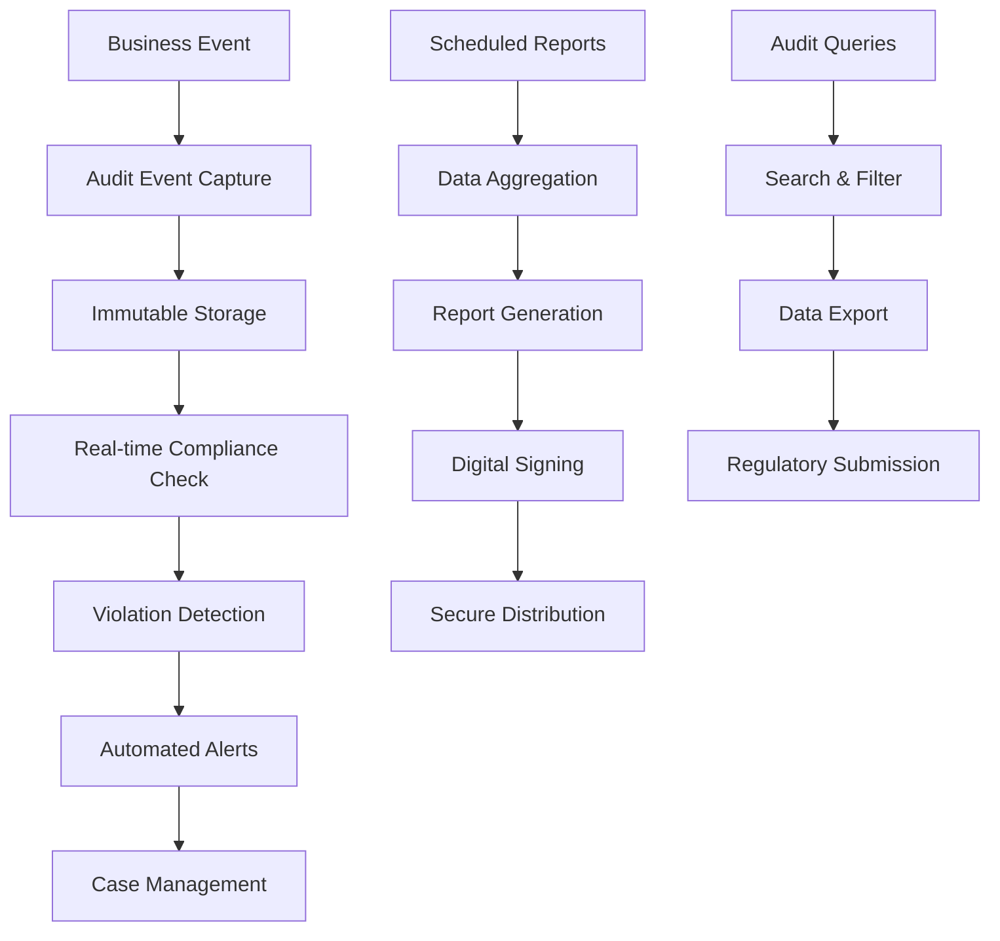

# Story 1.16: Regulatory Compliance Reporting and Audit Trail Generation

## Status
Draft

## Story
**As a** Compliance Officer,  
**I want** automated regulatory compliance reports and comprehensive audit trails for all client management activities,  
**so that** I can demonstrate regulatory compliance and respond to audits efficiently.

## Acceptance Criteria
1. `ComplianceReportingService` created with scheduled report generation capabilities
2. Audit trail system captures all client lifecycle events with immutable storage
3. Regulatory reports generated automatically: KYC Compliance Report, AML Activity Report, Document Status Report
4. Export functionality: PDF reports with digital signatures, CSV data exports, regulatory XML formats
5. Audit query API with filtering by date range, client, event type, compliance domain
6. Data retention policies: 7 years for KYC events, 5 years for document events, permanent for AML events
7. Integration tests validate report accuracy and audit trail completeness

## Tasks / Subtasks

- [ ] **Task 1: Create Comprehensive Audit Trail System** (AC: 2)
  - [ ] Create `IAuditService.cs` interface in `Services/`:
    - `Task LogEventAsync(AuditEvent auditEvent)`
    - `Task<List<AuditEvent>> QueryEventsAsync(AuditQueryRequest request)`
    - `Task<AuditTrail> GetClientAuditTrailAsync(Guid clientId, DateTime? from, DateTime? to)`
    - `Task<ComplianceAuditSummary> GetComplianceSummaryAsync(string domain, DateTime from, DateTime to)`
  - [ ] Create `AuditService.cs` implementation:
    - Immutable audit log storage with event sourcing pattern
    - Cryptographic hashing for tamper detection
    - High-performance batch insertion for audit events
    - Structured logging integration for correlation
    - Real-time audit event streaming for monitoring
  - [ ] Create audit event models:
    - `AuditEvent` base class with standard fields
    - `ClientAuditEvent`, `DocumentAuditEvent`, `KycAuditEvent`, `AmlAuditEvent` specialized classes
    - Event correlation IDs for transaction tracking
    - User context and IP address capture
    - Sensitive data masking for PII compliance
  - [ ] Create audit database schema:
    - `AuditEvents` table with partitioning by date
    - Indexes for high-performance queries
    - Write-only permissions for audit data
    - Database-level audit logging
  - [ ] Add audit event interception:
    - MediatR pipeline behavior for automatic audit logging
    - Controller action filters for API call auditing
    - Database change tracking for entity modifications
    - Background service activity logging

- [ ] **Task 2: Implement Regulatory Report Templates** (AC: 3)
  - [ ] Create `IComplianceReportGenerator.cs` interface:
    - `Task<KycComplianceReport> GenerateKycReportAsync(DateTime from, DateTime to, string? branchId)`
    - `Task<AmlActivityReport> GenerateAmlReportAsync(DateTime from, DateTime to)`
    - `Task<DocumentStatusReport> GenerateDocumentReportAsync(DateTime asOfDate)`
    - `Task<RegulatorySubmissionReport> GenerateSubmissionReportAsync(string reportType, Dictionary<string, object> parameters)`
  - [ ] Create KYC Compliance Report generator:
    - Client onboarding statistics and timelines
    - KYC verification status and completion rates
    - Document collection and verification metrics
    - Risk assessment distribution and outcomes
    - Exception handling and remediation tracking
    - Branch-wise and period-over-period analysis
  - [ ] Create AML Activity Report generator:
    - Sanctions screening results and hit rates
    - PEP identification and enhanced due diligence
    - Suspicious activity monitoring and reporting
    - Transaction monitoring alerts and dispositions
    - False positive rates and tuning metrics
    - Regulatory filing status and submissions
  - [ ] Create Document Status Report generator:
    - Document collection completeness by client segment
    - Document expiry tracking and renewal rates
    - Verification status and processing times
    - Quality control metrics and rejection rates
    - Compliance gaps and remediation plans
  - [ ] Add report customization framework:
    - Configurable report parameters and filters
    - Template-based report generation with variables
    - Multi-language support for international regulations
    - Brand customization for white-label deployments

- [ ] **Task 3: Create Compliance Reporting Service** (AC: 1)
  - [ ] Create `ComplianceReportingService.cs` as BackgroundService:
    - Scheduled report generation based on regulatory calendar
    - Configurable report frequencies (daily, weekly, monthly, quarterly)
    - Report distribution to stakeholders via email and secure portals
    - Error handling and retry logic for failed report generation
    - Performance monitoring and resource usage tracking
  - [ ] Implement report scheduling engine:
    - Cron-based scheduling for complex regulatory timelines
    - Holiday calendar integration for reporting adjustments
    - Manual trigger capabilities for ad-hoc reports
    - Dependency management between related reports
    - Parallel processing for multiple concurrent reports
  - [ ] Add report validation and quality checks:
    - Data consistency validation across report sections
    - Historical comparison and anomaly detection
    - Completeness checks for required regulatory fields
    - Cross-reference validation with source systems
    - Automated testing of report calculations
  - [ ] Create report storage and archival:
    - Secure storage with encryption at rest
    - Version control for report revisions
    - Long-term archival for regulatory retention
    - Access controls and audit logging for report access
    - Disaster recovery and backup procedures

- [ ] **Task 4: Implement Report Export Capabilities** (AC: 4)
  - [ ] Create `IReportExportService.cs` interface:
    - `Task<Stream> ExportToPdfAsync(IComplianceReport report, ExportOptions options)`
    - `Task<Stream> ExportToCsvAsync(IComplianceReport report, CsvExportOptions options)`
    - `Task<Stream> ExportToXmlAsync(IComplianceReport report, XmlSchema schema)`
    - `Task<Stream> ExportToExcelAsync(IComplianceReport report, ExcelExportOptions options)`
  - [ ] Implement PDF export with digital signatures:
    - Professional report templates with company branding
    - Digital signature integration with PKI certificates
    - Password protection for sensitive reports
    - Watermarking for confidential documents
    - Accessibility compliance (PDF/A standards)
  - [ ] Create CSV data export functionality:
    - Configurable field selection and ordering
    - Data formatting for regulatory requirements
    - Large dataset streaming for memory efficiency
    - Character encoding support for international data
    - Validation of exported data integrity
  - [ ] Add regulatory XML format support:
    - XBRL support for financial regulatory reporting
    - ISO 20022 messages for payment system reporting
    - Custom XML schemas for local regulatory bodies
    - Schema validation and error reporting
    - Transformation pipelines for format conversion
  - [ ] Implement secure export mechanisms:
    - Encrypted file transfer protocols (SFTP, HTTPS)
    - API-based export for system integrations
    - Batch export scheduling for large datasets
    - Export audit logging and tracking
    - Data loss prevention controls

- [ ] **Task 5: Create Audit Query and Analysis API** (AC: 5)
  - [ ] Create `AuditController.cs` with comprehensive query endpoints:
    - `GET /api/audit/events` - Paginated audit event search
    - `GET /api/audit/clients/{clientId}/trail` - Client-specific audit trail
    - `GET /api/audit/compliance/{domain}/summary` - Compliance domain analysis
    - `GET /api/audit/statistics` - Audit statistics and trends
    - `POST /api/audit/export` - Bulk audit data export
  - [ ] Implement advanced filtering capabilities:
    - Date range filtering with timezone support
    - Multi-value filtering by event type, user, client
    - Text search across event descriptions and metadata
    - Risk-level filtering for compliance focus
    - Correlation ID tracking for transaction analysis
  - [ ] Add audit data visualization support:
    - Timeline visualization for client audit trails
    - Heatmaps for compliance activity patterns
    - Trend analysis for audit event frequencies
    - Anomaly detection highlighting for investigation
    - Interactive drill-down capabilities
  - [ ] Create audit performance optimization:
    - Database query optimization with proper indexing
    - Caching for frequently accessed audit summaries
    - Pagination with cursor-based navigation
    - Asynchronous processing for large result sets
    - Compression for audit data transfers
  - [ ] Add audit data export formats:
    - JSON export for system integrations
    - CSV export for spreadsheet analysis
    - PDF reports for audit documentation
    - XML export for regulatory submissions

- [ ] **Task 6: Implement Data Retention and Archival Policies** (AC: 6)
  - [ ] Create `DataRetentionService.cs` for policy enforcement:
    - Automated data lifecycle management
    - Policy-based retention rule evaluation
    - Secure data archival to cold storage
    - Compliant data deletion after retention period
    - Exception handling for legal hold requirements
  - [ ] Define retention policy configuration:
    - KYC events: 7-year retention with hot storage for 2 years
    - Document events: 5-year retention with quarterly archival
    - AML events: Permanent retention with tiered storage
    - Audit events: 10-year retention with annual archival
    - Client communications: 3-year retention with monthly archival
  - [ ] Implement archival automation:
    - Scheduled archival jobs with configurable frequency
    - Data compression and encryption for archived data
    - Integrity verification for archived data
    - Restoration procedures for archived data access
    - Cost optimization for cloud storage tiers
  - [ ] Add compliance validation:
    - Regulatory requirement mapping to retention policies
    - Audit trail for data retention activities
    - Exception reporting for retention policy violations
    - Legal hold management and tracking
    - Cross-border data residency compliance
  - [ ] Create data recovery procedures:
    - Point-in-time recovery for audit data
    - Disaster recovery testing for archived data
    - Data restoration SLAs for compliance requests
    - Emergency access procedures for investigations

- [ ] **Task 7: Create Regulatory Calendar and Submission Tracking**
  - [ ] Create `RegulatoryCalendarService.cs`:
    - Regulatory deadline tracking and alerts
    - Submission status monitoring and workflows
    - Holiday calendar integration for deadline adjustments
    - Multi-jurisdiction regulatory requirement management
    - Automated reminder notifications to compliance team
  - [ ] Implement submission workflow management:
    - Report preparation and review workflows
    - Multi-level approval processes for regulatory submissions
    - Version control and change tracking for submissions
    - Integration with external regulatory portals
    - Submission confirmation and tracking
  - [ ] Add regulatory requirement library:
    - Configurable regulatory rules and thresholds
    - Regulatory update notifications and impact assessment
    - Cross-reference mapping between requirements and reports
    - Compliance checklist generation and tracking
    - Regulatory change management workflows
  - [ ] Create deadline management:
    - Automated calculation of regulatory deadlines
    - Grace period and extension handling
    - Priority-based task scheduling for compliance team
    - Escalation procedures for missed deadlines
    - Dashboard visualization for upcoming deadlines

- [ ] **Task 8: Implement Real-Time Compliance Monitoring**
  - [ ] Create `ComplianceMonitoringService.cs`:
    - Real-time compliance violation detection
    - Threshold-based alerting for compliance metrics
    - Automated escalation workflows for violations
    - Integration with existing notification system
    - Performance dashboards for compliance KPIs
  - [ ] Add compliance rule engine:
    - Configurable compliance rules with business logic
    - Real-time evaluation against incoming events
    - Complex rule conditions with multiple criteria
    - Rule versioning and historical tracking
    - Testing framework for compliance rules
  - [ ] Implement violation management:
    - Automatic violation case creation and tracking
    - Assignment workflows for violation remediation
    - SLA tracking for violation resolution
    - Escalation procedures for overdue violations
    - Reporting on violation trends and patterns
  - [ ] Create compliance dashboards:
    - Executive summary dashboard for senior management
    - Operational dashboard for compliance team
    - Branch-level compliance scorecards
    - Trend analysis and predictive compliance alerts
    - Integration with existing BI tools

- [ ] **Task 9: Add Advanced Audit Analytics and Intelligence**
  - [ ] Create `AuditAnalyticsService.cs`:
    - Pattern recognition in audit events
    - Anomaly detection for unusual activities
    - Risk scoring based on audit event patterns
    - Predictive analytics for compliance issues
    - Machine learning integration for fraud detection
  - [ ] Implement behavioral analytics:
    - User behavior profiling from audit events
    - Deviation detection from normal patterns
    - Risk-based authentication triggers
    - Insider threat detection algorithms
    - Automated investigation workflows
  - [ ] Add compliance trend analysis:
    - Time-series analysis of compliance metrics
    - Seasonal pattern recognition in violations
    - Predictive modeling for compliance failures
    - Correlation analysis between audit events
    - Statistical reporting for management
  - [ ] Create intelligent alerting:
    - Machine learning-based alert prioritization
    - False positive reduction algorithms
    - Context-aware alert descriptions
    - Automated alert correlation and grouping
    - Feedback loops for alert tuning

- [ ] **Task 10: Implement Regulatory Reporting API Integrations**
  - [ ] Create external regulatory API integrations:
    - Central bank reporting system connections
    - AML/CTF regulatory portal integrations
    - KYC utility provider connections
    - International sanctions list updates
    - Regulatory notification services
  - [ ] Add API security and reliability:
    - OAuth 2.0 and certificate-based authentication
    - Rate limiting and throttling controls
    - Circuit breaker patterns for external dependencies
    - Retry logic with exponential backoff
    - Monitoring and alerting for API failures
  - [ ] Implement data transformation services:
    - Internal data model to regulatory format mapping
    - Field validation and data quality checks
    - Error handling and correction workflows
    - Batch processing for large data submissions
    - Real-time validation against regulatory schemas
  - [ ] Create submission tracking and confirmation:
    - Submission receipt confirmation handling
    - Status polling for submission processing
    - Error message parsing and user notification
    - Resubmission workflows for failed submissions
    - Audit logging for all regulatory interactions

- [ ] **Task 11: Create Compliance Report Designer and Templates**
  - [ ] Create visual report designer interface:
    - Drag-and-drop report layout designer
    - Template library with pre-built regulatory formats
    - Data source configuration and field mapping
    - Conditional formatting and business rules
    - Preview and testing capabilities
  - [ ] Implement template management system:
    - Version control for report templates
    - Template sharing and collaboration features
    - Approval workflows for template changes
    - Template performance monitoring
    - Backup and recovery for template definitions
  - [ ] Add dynamic content generation:
    - Parameter-driven report customization
    - Runtime data binding and calculations
    - Multi-language template support
    - Conditional content inclusion based on data
    - Interactive elements for digital reports
  - [ ] Create template testing framework:
    - Automated testing of template logic
    - Data quality validation for template outputs
    - Performance testing for complex templates
    - Regression testing for template changes
    - User acceptance testing workflows

- [ ] **Task 12: Implement Cross-Border Compliance Features**
  - [ ] Add multi-jurisdiction compliance support:
    - Country-specific regulatory rule sets
    - Cross-border data residency compliance
    - Multi-currency reporting capabilities
    - Time zone handling for global operations
    - Cultural and language localization
  - [ ] Create international regulatory mapping:
    - Common regulatory framework abstraction
    - Country-specific implementation adapters
    - Regulatory equivalency mapping
    - Cross-border reporting consolidation
    - International sanctions screening
  - [ ] Implement data sovereignty controls:
    - Geographic data storage restrictions
    - Cross-border data transfer controls
    - Data localization compliance monitoring
    - Privacy regulation compliance (GDPR, CCPA)
    - Right to be forgotten implementation
  - [ ] Add multi-entity consolidation:
    - Group-level compliance reporting
    - Entity relationship management
    - Consolidated risk assessments
    - Inter-entity transaction monitoring
    - Corporate structure compliance tracking

- [ ] **Task 13: Create Unit and Integration Tests** (AC: 7)
  - [ ] Create `ComplianceReportingServiceTests.cs` test class:
    - Test report generation with various date ranges
    - Validate report data accuracy against source systems
    - Test error handling for data quality issues
    - Performance testing for large dataset reports
    - Concurrent report generation testing
  - [ ] Create `AuditServiceTests.cs` test class:
    - Test audit event logging and retrieval
    - Validate audit trail completeness and accuracy
    - Test audit data integrity and tamper detection
    - Performance testing for high-volume audit logging
    - Concurrency testing for audit event processing
  - [ ] Create integration tests for regulatory APIs:
    - Test external API integrations with mock services
    - Validate data transformation accuracy
    - Test error handling and retry mechanisms
    - Performance testing for bulk submissions
    - Security testing for API authentication
  - [ ] Create end-to-end compliance workflow tests:
    - Complete compliance reporting lifecycle testing
    - Cross-system integration testing
    - User workflow testing for compliance officers
    - Data consistency validation across systems
    - Regulatory submission process testing
  - [ ] Add compliance test data management:
    - Synthetic data generation for testing
    - Test data anonymization and masking
    - Compliance test scenario libraries
    - Automated test data cleanup procedures
    - Test environment data isolation

- [ ] **Task 14: Update Service Registration and Configuration**
  - [ ] Update `Extensions/ServiceCollectionExtensions.cs`:
    - Register `IAuditService` and `AuditService`
    - Register `IComplianceReportGenerator` implementations
    - Register `ComplianceReportingService` as BackgroundService
    - Configure retention policy services and schedulers
  - [ ] Update `Program.cs` configuration:
    - Add compliance reporting configuration section
    - Register health checks for compliance services
    - Configure audit database connections
    - Add regulatory API configurations
  - [ ] Add configuration validation:
    - Validate retention policy configurations
    - Check regulatory API connection settings
    - Verify report template configurations
    - Validate audit database permissions
  - [ ] Configure monitoring and alerting:
    - Structured logging for compliance events
    - Metrics collection for compliance performance
    - Health check registration for all services
    - Alert configuration for compliance violations

- [ ] **Task 15: Create Documentation and Operational Procedures**
  - [ ] Create compliance reporting documentation:
    - Regulatory reporting guide and procedures
    - Audit trail interpretation and analysis guide
    - Data retention policy documentation
    - Compliance monitoring and alerting guide
  - [ ] Create operational runbooks:
    - Daily compliance monitoring procedures
    - Incident response for compliance violations
    - Regulatory submission procedures
    - Audit data recovery procedures
  - [ ] Document regulatory integrations:
    - External API integration guide
    - Regulatory format specifications
    - Error handling and troubleshooting guide
    - Data mapping and transformation rules
  - [ ] Create training materials:
    - Compliance officer training on system usage
    - Technical documentation for system administrators
    - Audit and investigation procedures
    - Regulatory update procedures and impact assessment

## Dev Notes

### Compliance Reporting Architecture
**Source:** [docs/domains/client-management/prd.md#fr16-regulatory-compliance-reporting]

**Event-Driven Audit Architecture:**
The audit system uses an event-sourcing pattern where all business events are captured immutably. This ensures complete audit trail coverage and enables point-in-time state reconstruction for compliance investigations.

**Processing Flow:**


### Audit Event Model Design
**Core Audit Event Structure:**
```csharp
public abstract class AuditEvent
{
    public Guid EventId { get; init; } = Guid.NewGuid();
    public DateTime Timestamp { get; init; } = DateTime.UtcNow;
    public string EventType { get; init; } = null!;
    public string CorrelationId { get; init; } = null!;
    public string UserId { get; init; } = null!;
    public string UserName { get; init; } = null!;
    public string IpAddress { get; init; } = null!;
    public string UserAgent { get; init; } = null!;
    public Dictionary<string, object> EventData { get; init; } = new();
    public Dictionary<string, object> Metadata { get; init; } = new();
    public string Hash { get; init; } = null!; // For tamper detection
    
    // Compliance classification
    public string ComplianceDomain { get; init; } = null!; // KYC, AML, Document, etc.
    public string RiskLevel { get; init; } = "Medium";
    public List<string> RegulatoryTags { get; init; } = new();
    public bool RequiresReporting { get; init; } = false;
    public DateTime? RetentionUntil { get; init; }
}

public class ClientAuditEvent : AuditEvent
{
    public Guid ClientId { get; init; }
    public string ClientNrc { get; init; } = null!;
    public string ClientName { get; init; } = null!;
    public string BranchCode { get; init; } = null!;
    public string PreviousState { get; init; } = null!;
    public string NewState { get; init; } = null!;
    public List<string> ChangedFields { get; init; } = new();
}

public class KycAuditEvent : ClientAuditEvent
{
    public string KycStatus { get; init; } = null!;
    public string VerificationLevel { get; init; } = null!;
    public string RiskAssessment { get; init; } = null!;
    public List<string> DocumentsVerified { get; init; } = new();
    public string ReviewerComments { get; init; } = null!;
}

public class AmlAuditEvent : ClientAuditEvent
{
    public string ScreeningType { get; init; } = null!; // Sanctions, PEP, Adverse Media
    public string ScreeningResult { get; init; } = null!;
    public List<string> MatchedLists { get; init; } = new();
    public string DispositionReason { get; init; } = null!;
    public string ReviewerDecision { get; init; } = null!;
    public bool RequiresEdd { get; init; }
}

public class DocumentAuditEvent : ClientAuditEvent
{
    public Guid DocumentId { get; init; }
    public string DocumentType { get; init; } = null!;
    public string DocumentAction { get; init; } = null!; // Upload, Verify, Expire, Replace
    public string VerificationStatus { get; init; } = null!;
    public string QualityScore { get; init; } = null!;
    public List<string> ValidationErrors { get; init; } = new();
}
```

### Compliance Report Generation Engine
**Report Generation Architecture:**
```csharp
public interface IComplianceReportGenerator
{
    Task<KycComplianceReport> GenerateKycReportAsync(ComplianceReportRequest request);
    Task<AmlActivityReport> GenerateAmlReportAsync(ComplianceReportRequest request);
    Task<DocumentStatusReport> GenerateDocumentReportAsync(ComplianceReportRequest request);
}

public class ComplianceReportRequest
{
    public DateTime FromDate { get; init; }
    public DateTime ToDate { get; init; }
    public string? BranchFilter { get; init; }
    public List<string>? ClientSegments { get; init; }
    public string ReportFormat { get; init; } = "Standard";
    public Dictionary<string, object> Parameters { get; init; } = new();
    public bool IncludeDetails { get; init; } = false;
    public string Language { get; init; } = "EN";
    public string Jurisdiction { get; init; } = "ZM";
}

// KYC Compliance Report Implementation
public class KycComplianceReportGenerator : IComplianceReportGenerator<KycComplianceReport>
{
    public async Task<KycComplianceReport> GenerateAsync(ComplianceReportRequest request)
    {
        // Query audit events for KYC activities
        var kycEvents = await _auditService.QueryEventsAsync(new AuditQueryRequest
        {
            ComplianceDomain = "KYC",
            FromDate = request.FromDate,
            ToDate = request.ToDate,
            BranchFilter = request.BranchFilter
        });
        
        // Generate comprehensive KYC statistics
        var report = new KycComplianceReport
        {
            ReportId = Guid.NewGuid(),
            GeneratedAt = DateTime.UtcNow,
            ReportPeriod = new ReportPeriod(request.FromDate, request.ToDate),
            
            // Overall KYC Statistics
            TotalClientsOnboarded = await GetTotalClientsOnboarded(request),
            KycCompletionRate = await CalculateKycCompletionRate(request),
            AverageKycProcessingTime = await CalculateAverageProcessingTime(request),
            
            // Verification Statistics
            DocumentVerificationStats = await GenerateDocumentVerificationStats(request),
            RiskAssessmentDistribution = await GenerateRiskDistribution(request),
            ExceptionAndRejectionStats = await GenerateExceptionStats(request),
            
            // Compliance Metrics
            RegulatoryTimelineCompliance = await CalculateTimelineCompliance(request),
            QualityControlMetrics = await GenerateQualityMetrics(request),
            BranchPerformanceAnalysis = await GenerateBranchAnalysis(request),
            
            // Detailed Event Logs (if requested)
            DetailedAuditEvents = request.IncludeDetails ? kycEvents : new List<AuditEvent>()
        };
        
        return report;
    }
}
```

### Regulatory Report Templates
**KYC Compliance Report Structure:**
```csharp
public class KycComplianceReport : IComplianceReport
{
    public Guid ReportId { get; init; }
    public DateTime GeneratedAt { get; init; }
    public ReportPeriod Period { get; init; } = null!;
    public string Jurisdiction { get; init; } = null!;
    public string ReportVersion { get; init; } = "1.0";
    
    // Executive Summary
    public KycExecutiveSummary ExecutiveSummary { get; init; } = null!;
    
    // Onboarding Statistics
    public int TotalClientsOnboarded { get; init; }
    public int TotalApplicationsReceived { get; init; }
    public decimal KycCompletionRate { get; init; }
    public TimeSpan AverageKycProcessingTime { get; init; }
    
    // Document Collection and Verification
    public DocumentVerificationStatistics DocumentVerificationStats { get; init; } = null!;
    public Dictionary<string, int> DocumentCollectionByType { get; init; } = new();
    public decimal DocumentVerificationAccuracy { get; init; }
    
    // Risk Assessment
    public Dictionary<string, int> RiskAssessmentDistribution { get; init; } = new();
    public List<HighRiskClientSummary> HighRiskClients { get; init; } = new();
    public int EddCasesInitiated { get; init; }
    
    // Compliance Metrics
    public decimal RegulatoryTimelineCompliance { get; init; }
    public List<ComplianceException> OutstandingExceptions { get; init; } = new();
    public QualityControlMetrics QualityMetrics { get; init; } = null!;
    
    // Trend Analysis
    public List<KycTrendData> MonthlyTrends { get; init; } = new();
    public ComparisonAnalysis YearOverYearComparison { get; init; } = null!;
    
    // Branch Performance
    public List<BranchKycPerformance> BranchPerformance { get; init; } = new();
    
    // Detailed Data (optional)
    public List<AuditEvent>? DetailedAuditEvents { get; init; }
    
    // Report Metadata
    public ReportSignature DigitalSignature { get; init; } = null!;
    public List<string> DataSources { get; init; } = new();
    public string GeneratedBy { get; init; } = null!;
}

public class AmlActivityReport : IComplianceReport
{
    public Guid ReportId { get; init; }
    public DateTime GeneratedAt { get; init; }
    public ReportPeriod Period { get; init; } = null!;
    
    // Sanctions Screening
    public SanctionsScreeningStatistics SanctionsStats { get; init; } = null!;
    public int TotalScreeningChecks { get; init; }
    public int TotalHitsIdentified { get; init; }
    public decimal FalsePositiveRate { get; init; }
    
    // PEP Screening
    public PepScreeningStatistics PepStats { get; init; } = null!;
    public int PepIdentifications { get; init; }
    public int EddCasesFromPep { get; init; }
    
    // Enhanced Due Diligence
    public EddStatistics EddStats { get; init; } = null!;
    public TimeSpan AverageEddCompletionTime { get; init; }
    public List<EddCaseSummary> CompletedEddCases { get; init; } = new();
    
    // Suspicious Activity
    public SarStatistics SarStats { get; init; } = null!;
    public int SuspiciousActivityReports { get; init; }
    public List<SarSummary> FiledSars { get; init; } = new();
    
    // Transaction Monitoring
    public TransactionMonitoringStats TransactionStats { get; init; } = null!;
    public int AlertsGenerated { get; init; }
    public int AlertsInvestigated { get; init; }
    public decimal AlertDispositionRate { get; init; }
    
    // Regulatory Filings
    public List<RegulatoryFiling> Filings { get; init; } = new();
    public FilingComplianceStatus FilingStatus { get; init; } = null!;
}
```

### Audit Service Implementation
**High-Performance Audit Logging:**
```csharp
public class AuditService : IAuditService
{
    private readonly IDbContextFactory<AuditDbContext> _contextFactory;
    private readonly ILogger<AuditService> _logger;
    private readonly IConfiguration _configuration;
    private readonly IServiceBus _serviceBus; // For real-time streaming
    
    public async Task LogEventAsync(AuditEvent auditEvent)
    {
        try
        {
            // Add cryptographic hash for tamper detection
            auditEvent.Hash = CalculateEventHash(auditEvent);
            
            // Set retention date based on compliance domain
            auditEvent.RetentionUntil = CalculateRetentionDate(auditEvent.ComplianceDomain);
            
            // Batch insertion for performance
            using var context = _contextFactory.CreateDbContext();
            await context.AuditEvents.AddAsync(auditEvent);
            await context.SaveChangesAsync();
            
            // Stream to real-time monitoring if high-risk event
            if (auditEvent.RiskLevel == "High" || auditEvent.RequiresReporting)
            {
                await _serviceBus.Publish(new AuditEventPublished 
                { 
                    EventId = auditEvent.EventId,
                    EventType = auditEvent.EventType,
                    ComplianceDomain = auditEvent.ComplianceDomain,
                    RiskLevel = auditEvent.RiskLevel,
                    Timestamp = auditEvent.Timestamp
                });
            }
            
            _logger.LogInformation("Audit event logged: {EventType} for {ComplianceDomain}", 
                auditEvent.EventType, auditEvent.ComplianceDomain);
        }
        catch (Exception ex)
        {
            _logger.LogError(ex, "Failed to log audit event: {EventType}", auditEvent.EventType);
            // Critical: audit logging failures should not fail business operations
            // but should be escalated for immediate attention
            await _serviceBus.Publish(new AuditLoggingFailure 
            { 
                EventType = auditEvent.EventType,
                Error = ex.Message,
                Timestamp = DateTime.UtcNow
            });
        }
    }
    
    public async Task<List<AuditEvent>> QueryEventsAsync(AuditQueryRequest request)
    {
        using var context = _contextFactory.CreateDbContext();
        
        var query = context.AuditEvents.AsQueryable();
        
        // Apply filters
        if (request.FromDate.HasValue)
            query = query.Where(e => e.Timestamp >= request.FromDate.Value);
            
        if (request.ToDate.HasValue)
            query = query.Where(e => e.Timestamp <= request.ToDate.Value);
            
        if (!string.IsNullOrEmpty(request.ComplianceDomain))
            query = query.Where(e => e.ComplianceDomain == request.ComplianceDomain);
            
        if (request.EventTypes?.Any() == true)
            query = query.Where(e => request.EventTypes.Contains(e.EventType));
            
        if (request.ClientId.HasValue)
            query = query.Where(e => ((ClientAuditEvent)e).ClientId == request.ClientId.Value);
            
        // Apply ordering and pagination
        query = query.OrderByDescending(e => e.Timestamp);
        
        if (request.Skip > 0)
            query = query.Skip(request.Skip);
            
        if (request.Take > 0)
            query = query.Take(request.Take);
        
        return await query.ToListAsync();
    }
    
    private string CalculateEventHash(AuditEvent auditEvent)
    {
        var hashInput = $"{auditEvent.EventId}|{auditEvent.Timestamp:O}|{auditEvent.EventType}|{auditEvent.UserId}|{JsonSerializer.Serialize(auditEvent.EventData)}";
        using var sha256 = SHA256.Create();
        var hashBytes = sha256.ComputeHash(Encoding.UTF8.GetBytes(hashInput));
        return Convert.ToBase64String(hashBytes);
    }
    
    private DateTime? CalculateRetentionDate(string complianceDomain)
    {
        var retentionYears = complianceDomain switch
        {
            "KYC" => 7,
            "Document" => 5,
            "AML" => null, // Permanent retention
            "Client" => 7,
            "Transaction" => 5,
            _ => 5 // Default retention
        };
        
        return retentionYears.HasValue 
            ? DateTime.UtcNow.AddYears(retentionYears.Value)
            : null;
    }
}
```

### Data Retention and Archival System
**Retention Policy Implementation:**
```csharp
public class DataRetentionService : BackgroundService
{
    private readonly IServiceProvider _serviceProvider;
    private readonly DataRetentionOptions _options;
    private readonly ILogger<DataRetentionService> _logger;
    
    protected override async Task ExecuteAsync(CancellationToken stoppingToken)
    {
        // Run retention policy evaluation monthly
        while (!stoppingToken.IsCancellationRequested)
        {
            try
            {
                await ProcessRetentionPoliciesAsync();
                
                // Wait for next monthly cycle
                var nextRun = DateTime.UtcNow.AddMonths(1).Date;
                var delay = nextRun - DateTime.UtcNow;
                await Task.Delay(delay, stoppingToken);
            }
            catch (Exception ex)
            {
                _logger.LogError(ex, "Error in data retention service");
                await Task.Delay(TimeSpan.FromHours(1), stoppingToken);
            }
        }
    }
    
    private async Task ProcessRetentionPoliciesAsync()
    {
        using var scope = _serviceProvider.CreateScope();
        var auditContext = scope.ServiceProvider.GetRequiredService<AuditDbContext>();
        var archivalService = scope.ServiceProvider.GetRequiredService<IArchivalService>();
        
        // Identify data for archival (older than 2 years, still within retention)
        var archivalCandidates = await auditContext.AuditEvents
            .Where(e => e.Timestamp < DateTime.UtcNow.AddYears(-2))
            .Where(e => e.RetentionUntil == null || e.RetentionUntil > DateTime.UtcNow)
            .Where(e => !e.IsArchived)
            .Take(10000) // Process in batches
            .ToListAsync();
            
        if (archivalCandidates.Any())
        {
            await archivalService.ArchiveEventsAsync(archivalCandidates);
            _logger.LogInformation("Archived {Count} audit events", archivalCandidates.Count);
        }
        
        // Identify data for deletion (past retention period)
        var deletionCandidates = await auditContext.AuditEvents
            .Where(e => e.RetentionUntil.HasValue && e.RetentionUntil < DateTime.UtcNow)
            .Where(e => !e.HasLegalHold) // Don't delete data under legal hold
            .Take(1000) // Process in smaller batches for deletion
            .ToListAsync();
            
        if (deletionCandidates.Any())
        {
            // Secure deletion with audit logging
            await SecureDeleteEventsAsync(deletionCandidates);
            _logger.LogInformation("Securely deleted {Count} audit events", deletionCandidates.Count);
        }
    }
}

public class RetentionPolicy
{
    public string ComplianceDomain { get; init; } = null!;
    public int RetentionYears { get; init; }
    public int HotStorageYears { get; init; } = 2; // Keep in primary database
    public bool RequiresPermanentRetention { get; init; } = false;
    public List<string> ExceptionEventTypes { get; init; } = new(); // Events with different retention
    public bool AllowAutomaticDeletion { get; init; } = true;
}
```

### Report Export and Digital Signature
**PDF Export with Digital Signatures:**
```csharp
public class PdfReportExporter : IReportExportService
{
    private readonly IDigitalSignatureService _signatureService;
    private readonly IPdfGenerator _pdfGenerator;
    
    public async Task<Stream> ExportToPdfAsync(IComplianceReport report, ExportOptions options)
    {
        // Generate PDF content using template
        var pdfTemplate = await GetReportTemplate(report.GetType().Name);
        var pdfContent = await _pdfGenerator.GenerateAsync(pdfTemplate, report);
        
        // Apply digital signature if required
        if (options.RequireDigitalSignature)
        {
            var certificate = await _signatureService.GetSigningCertificateAsync();
            pdfContent = await _signatureService.SignPdfAsync(pdfContent, certificate, new SigningOptions
            {
                SignerName = options.SignerName ?? "IntelliFin Compliance System",
                Reason = $"Regulatory compliance report generated on {DateTime.UtcNow:yyyy-MM-dd}",
                Location = "IntelliFin Headquarters",
                ContactInfo = "compliance@intellifin.com",
                SignatureAppearance = SignatureAppearanceOptions.IncludeDateTime | SignatureAppearanceOptions.IncludeLogo
            });
        }
        
        // Add watermark for confidential documents
        if (options.AddWatermark)
        {
            pdfContent = await AddWatermarkAsync(pdfContent, "CONFIDENTIAL - REGULATORY REPORT");
        }
        
        // Password protection if required
        if (!string.IsNullOrEmpty(options.Password))
        {
            pdfContent = await _pdfGenerator.AddPasswordProtectionAsync(pdfContent, options.Password);
        }
        
        return new MemoryStream(pdfContent);
    }
}
```

### Integration with Previous Stories
**Notification Integration (Story 1.14):**
- Compliance violation alerts sent through existing notification system
- Regulatory deadline reminders and submission confirmations
- Escalation workflows for compliance issues

**Document Management Integration (Stories 1.6-1.8):**
- Document lifecycle events captured in audit trail
- Document expiry integration with compliance reporting
- Document quality metrics included in compliance reports

**AML and EDD Integration (Story 1.12):**
- AML screening results included in regulatory reports
- EDD case tracking and completion reporting
- Sanctions and PEP screening statistics

**KYC Workflow Integration (Stories 1.1-1.11):**
- Complete KYC lifecycle audit trail
- KYC completion and timeline compliance reporting
- Risk assessment distribution analysis

### Performance Optimization
**Database Optimization:**
```sql
-- Audit events table partitioning by date
CREATE PARTITION SCHEME AuditEventPartitionScheme AS PARTITION AuditEventPartitionFunction 
TO ([PRIMARY], [AuditArchive2023], [AuditArchive2022], [AuditCold]);

-- Optimized indexes for audit queries
CREATE INDEX IX_AuditEvents_ComplianceDomain_Timestamp 
ON AuditEvents (ComplianceDomain, Timestamp DESC) 
INCLUDE (EventType, ClientId, RiskLevel);

CREATE INDEX IX_AuditEvents_ClientId_Timestamp 
ON AuditEvents (ClientId, Timestamp DESC) 
WHERE ComplianceDomain IN ('KYC', 'AML', 'Document');

-- Archive table for cold storage
CREATE TABLE AuditEventsArchive (
    -- Same structure as AuditEvents
    -- Stored in compressed format
) WITH (DATA_COMPRESSION = PAGE);
```

**Caching Strategy:**
- Report template caching with Redis
- Frequently accessed audit summaries cached
- Regulatory rule definitions cached with invalidation
- Dashboard metrics cached with 15-minute refresh

### Project Structure After This Story
```
apps/IntelliFin.ClientManagement/
├── Services/
│   ├── IAuditService.cs                            # NEW - Audit service interface
│   ├── AuditService.cs                             # NEW - Audit logging implementation
│   ├── IComplianceReportGenerator.cs               # NEW - Report generation interface
│   ├── ComplianceReportingService.cs               # NEW - Background reporting service
│   ├── DataRetentionService.cs                     # NEW - Data retention automation
│   ├── ComplianceMonitoringService.cs              # NEW - Real-time monitoring
│   └── RegulatoryCalendarService.cs                # NEW - Regulatory deadlines
├── Repositories/
│   ├── IAuditRepository.cs                         # NEW - Audit data access
│   └── AuditRepository.cs                          # NEW - Audit queries
├── Controllers/
│   ├── AuditController.cs                          # NEW - Audit query APIs
│   ├── ComplianceReportsController.cs              # NEW - Report management APIs
│   └── RegulatoryController.cs                     # NEW - Regulatory submission APIs
├── Models/
│   ├── AuditEvent.cs                               # NEW - Audit event models
│   ├── ComplianceReports/                          # NEW - Report models
│   │   ├── KycComplianceReport.cs
│   │   ├── AmlActivityReport.cs
│   │   └── DocumentStatusReport.cs
│   ├── ComplianceReportRequest.cs                  # NEW - Report parameters
│   └── RetentionPolicy.cs                          # NEW - Data retention config
├── Exporters/
│   ├── IReportExportService.cs                     # NEW - Export service interface
│   ├── PdfReportExporter.cs                       # NEW - PDF export with signatures
│   ├── CsvReportExporter.cs                       # NEW - CSV data export
│   └── XmlReportExporter.cs                       # NEW - Regulatory XML formats
├── Analytics/
│   ├── AuditAnalyticsService.cs                    # NEW - Audit intelligence
│   └── ComplianceIntelligence.cs                   # NEW - Predictive compliance
├── Configuration/
│   ├── ComplianceReportingOptions.cs               # NEW - Reporting configuration
│   └── DataRetentionOptions.cs                     # NEW - Retention policies
├── HealthChecks/
│   ├── ComplianceReportingHealthCheck.cs           # NEW - Health monitoring
│   └── AuditServiceHealthCheck.cs                  # NEW - Audit system health
├── Data/
│   └── AuditDbContext.cs                           # NEW - Audit database context
└── [existing files from Stories 1.1-1.15]
```

## Testing

### Testing Standards
**Source:** [docs/domains/client-management/prd.md#testing-integration-strategy]

- **Test Framework:** xUnit with comprehensive audit event testing
- **Coverage Target:** 90% for compliance-critical services
- **Integration Tests:** End-to-end compliance workflow testing
- **Performance Tests:** Large-scale audit logging and report generation

### Specific Test Cases for This Story

**Unit Tests - Audit Service:**
1. **Audit Event Logging:**
   - Single audit event logging → Stored with correct metadata
   - Batch audit event logging → All events processed correctly
   - Audit event with PII → Sensitive data properly masked
   - High-risk event logging → Real-time alerts triggered
   - Audit logging failure → Business operation continues, failure logged

2. **Audit Event Integrity:**
   - Event hash calculation → Tamper detection works correctly
   - Event modification attempt → Integrity violation detected
   - Event correlation → Related events properly linked
   - Event retention calculation → Correct retention dates set

3. **Audit Query Functionality:**
   - Date range queries → Correct events returned
   - Compliance domain filtering → Domain-specific events only
   - Client-specific queries → All client events retrieved
   - Performance with large datasets → Queries complete within SLA

**Unit Tests - Compliance Reporting:**
1. **Report Generation:**
   - KYC compliance report → All required sections populated
   - AML activity report → Screening statistics accurate
   - Document status report → Document metrics correct
   - Custom report parameters → Filters applied correctly

2. **Report Data Accuracy:**
   - Cross-system data consistency → Source data matches report
   - Calculation accuracy → Statistical calculations verified
   - Time period handling → Date boundaries respected
   - Branch filtering → Correct branch data included

3. **Report Export Formats:**
   - PDF export with signature → Signed PDF generated
   - CSV export → Data properly formatted
   - XML regulatory format → Schema validation passes
   - Export with large datasets → Memory usage controlled

**Integration Tests - End-to-End Workflows:**
1. **Complete Compliance Lifecycle:**
   - Client onboarding → Full audit trail captured
   - KYC completion → Compliance report includes client
   - AML screening → Screening results in AML report
   - Document expiry → Document status report updated

2. **Regulatory Submission Process:**
   - Report generation → Automated report creation
   - Report review → Approval workflow completed
   - Report submission → External API integration works
   - Submission confirmation → Status tracking updated

3. **Data Retention and Archival:**
   - Retention policy application → Correct data identified for archival
   - Archival process → Data moved to cold storage
   - Data retrieval from archive → Archived data accessible
   - Secure deletion → Expired data permanently deleted

**Performance Tests:**
1. **High-Volume Audit Logging:**
   - 10,000 audit events per minute → System handles load
   - Concurrent audit logging → No data loss or corruption
   - Memory usage during batch logging → Within acceptable limits
   - Database performance impact → Query performance maintained

2. **Large-Scale Report Generation:**
   - Annual compliance report with 100,000+ events → Generates within SLA
   - Multiple concurrent report generations → System remains responsive
   - Report with complex calculations → Completes accurately
   - Export of large reports → Memory usage controlled

**Security and Compliance Tests:**
1. **Audit Trail Security:**
   - Unauthorized audit modification attempt → Access denied
   - Audit data encryption → Data encrypted at rest
   - Access logging → All audit access logged
   - Data export security → Exported data properly protected

2. **Regulatory Compliance:**
   - Data retention compliance → Retention policies enforced
   - Cross-border data handling → Data residency rules respected
   - PII handling in reports → Sensitive data appropriately masked
   - Digital signature validation → Report signatures valid

### Test File Structure
```
tests/IntelliFin.ClientManagement.Tests/
├── Services/
│   ├── AuditServiceTests.cs
│   ├── ComplianceReportingServiceTests.cs
│   ├── DataRetentionServiceTests.cs
│   └── ComplianceMonitoringServiceTests.cs
├── Repositories/
│   └── AuditRepositoryTests.cs
├── Controllers/
│   ├── AuditControllerTests.cs
│   └── ComplianceReportsControllerTests.cs
├── Exporters/
│   ├── PdfReportExporterTests.cs
│   ├── CsvReportExporterTests.cs
│   └── XmlReportExporterTests.cs
├── Analytics/
│   └── AuditAnalyticsServiceTests.cs
└── Models/
    └── ComplianceReportTests.cs

tests/IntelliFin.ClientManagement.IntegrationTests/
├── ComplianceWorkflowTests.cs
├── AuditTrailIntegrationTests.cs
├── RegulatorySubmissionTests.cs
├── DataRetentionIntegrationTests.cs
└── PerformanceTests/
    ├── AuditLoggingPerformanceTests.cs
    └── ReportGenerationPerformanceTests.cs
```

## Change Log

| Date | Version | Description | Author |
|------|---------|-------------|--------|
| 2025-10-17 | 1.0 | Initial story creation | Bob (SM) |

## Dev Agent Record
*This section will be populated by the development agent during implementation.*

### Agent Model Used
*To be filled by dev agent*

### Debug Log References
*To be filled by dev agent*

### Completion Notes List
*To be filled by dev agent*

### File List
*To be filled by dev agent*

## QA Results
*This section will be populated by the QA agent after implementation review.*