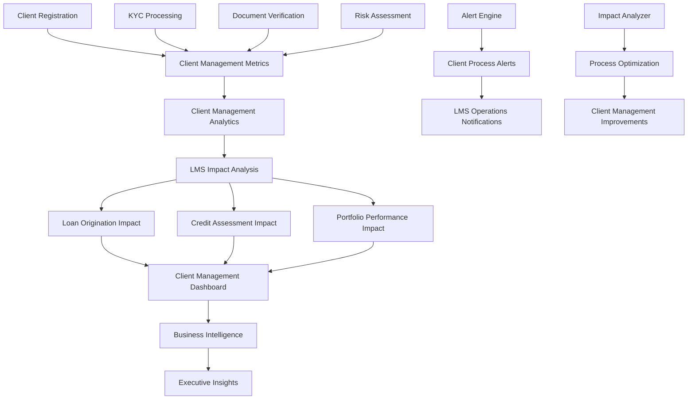

# Story 1.17: Performance Monitoring and System Analytics Dashboard

## Status
Draft

## Story
**As a** System Administrator and Business Analyst,  
**I want** comprehensive performance monitoring and analytics dashboards for client management processes within the IntelliFin Loan Management System,  
**so that** I can monitor how client onboarding, KYC, and document verification performance impacts loan origination, credit assessment, and overall LMS operations.

## Acceptance Criteria
1. `ClientManagementMetricsService` created with real-time metrics collection for client management processes and their impact on LMS operations
2. Client management health dashboard displaying KPIs: client onboarding performance, KYC processing times, document verification rates, and downstream LMS impact
3. Business analytics dashboard showing client management insights within LMS context: onboarding-to-loan conversion rates, KYC completion impact on loan processing, client risk assessment effectiveness
4. Automated alerting system for performance thresholds and anomalies
5. Custom metrics API for business-specific KPIs and real-time dashboard updates
6. Performance optimization recommendations based on historical analysis
7. Integration tests validate metrics accuracy and dashboard functionality

## Tasks / Subtasks

- [ ] **Task 1: Create Client Management Metrics Collection System** (AC: 1)
  - [ ] Create `IClientManagementMetricsService.cs` interface in `Services/`:
    - `Task RecordMetricAsync(string metricName, double value, Dictionary<string, object>? tags)`
    - `Task IncrementCounterAsync(string counterName, Dictionary<string, object>? tags)`
    - `Task RecordTimingAsync(string operation, TimeSpan duration, Dictionary<string, object>? tags)`
    - `Task<MetricsSnapshot> GetMetricsSnapshotAsync(DateTime from, DateTime to, List<string>? metricNames)`
  - [ ] Create `ClientManagementMetricsService.cs` implementation:
    - High-performance metrics collection for client management processes
    - Track client onboarding funnel performance and bottlenecks
    - Monitor KYC processing times and their impact on loan application delays
    - Measure document verification quality and its effect on credit assessment
    - Real-time metrics for client management process health
  - [ ] Add client management specific metrics collection:
    - Client registration and onboarding completion rates
    - KYC workflow step completion times and success rates
    - Document verification processing times and quality scores
    - Client risk assessment calculation performance
    - Integration points with loan origination system performance
  - [ ] Create metrics interception infrastructure:
    - ASP.NET Core middleware for HTTP metrics
    - Entity Framework interceptors for database metrics
    - MediatR pipeline behaviors for command/query metrics
    - Custom attributes for method-level performance tracking
  - [ ] Implement metrics storage optimization:
    - Time-series database integration (InfluxDB or TimescaleDB)
    - Data retention policies for different metric granularities
    - Compression and archival for historical metrics
    - High-availability setup for metrics infrastructure

- [ ] **Task 2: Develop Client Management Performance Dashboard** (AC: 2)
  - [ ] Create `ClientManagementDashboardController.cs` API endpoints:
    - `GET /api/client-management/metrics/onboarding` - Client onboarding performance metrics
    - `GET /api/client-management/metrics/kyc-processing` - KYC workflow performance and impact on loans
    - `GET /api/client-management/metrics/document-verification` - Document processing performance
    - `GET /api/client-management/metrics/lms-impact` - Client management impact on loan processing
    - `GET /api/client-management/metrics/realtime` - Real-time client management metrics
  - [ ] Implement client management dashboard components:
    - Client onboarding funnel visualization with conversion rates to loan applications
    - KYC processing pipeline showing bottlenecks and their impact on loan processing delays
    - Document verification quality trends and correlation with credit assessment accuracy
    - Client risk score distribution and its predictive effectiveness for loan defaults
    - Real-time client management process health indicators
  - [ ] Add client management KPIs with LMS context:
    - **Onboarding Efficiency:** Time from client registration to loan application eligibility
    - **KYC Processing Impact:** Average delay in loan processing due to incomplete KYC
    - **Document Quality Impact:** Correlation between document verification scores and loan approval rates
    - **Risk Assessment Accuracy:** Predictive power of client risk scores for loan performance
    - **Conversion Metrics:** Client-to-loan application conversion rates and timing
  - [ ] Create interactive dashboard features:
    - Time range selection for historical analysis
    - Drill-down capabilities from summary to detailed metrics
    - Custom metric filters and grouping options
    - Export capabilities for reporting and analysis
    - Real-time updates with WebSocket connections
  - [ ] Implement dashboard personalization:
    - User-specific dashboard layouts and preferences
    - Role-based access to different metric categories
    - Customizable alert thresholds and notifications
    - Favorite metrics and dashboard bookmarking

- [ ] **Task 3: Create Business Analytics Dashboard** (AC: 3)
  - [ ] Create `BusinessAnalyticsController.cs` API endpoints:
    - `GET /api/analytics/client-onboarding/trends` - Client onboarding analytics
    - `GET /api/analytics/kyc-processing/metrics` - KYC workflow performance
    - `GET /api/analytics/document-verification/stats` - Document processing analytics
    - `GET /api/analytics/compliance/summary` - Compliance metrics overview
    - `GET /api/analytics/branch/performance` - Branch performance comparison
  - [ ] Implement client onboarding analytics:
    - New client registration trends by time period
    - Onboarding funnel analysis with conversion rates
    - Time-to-completion metrics for KYC processes
    - Geographic distribution of new clients
    - Channel effectiveness analysis (branch, online, mobile)
  - [ ] Create KYC processing analytics:
    - KYC completion rates by branch and time period
    - Processing time distributions and bottleneck identification
    - Verification accuracy metrics and quality trends
    - Risk assessment distribution and patterns
    - Exception handling and remediation statistics
  - [ ] Add document verification analytics:
    - Document upload and verification volumes
    - Verification success rates by document type
    - Processing time analysis for document workflows
    - Quality control metrics and rejection patterns
    - Document expiry and renewal tracking
  - [ ] Implement compliance analytics:
    - AML screening statistics and hit rates
    - Regulatory compliance dashboard with key metrics
    - Audit trail completeness and data quality metrics
    - Compliance violation trends and resolution times
    - Regulatory reporting status and submission tracking
  - [ ] Create branch performance analytics:
    - Branch-wise comparison of key metrics
    - Staff productivity and performance indicators
    - Customer satisfaction and experience metrics
    - Operational efficiency benchmarking
    - Resource utilization and capacity planning

- [ ] **Task 4: Implement Automated Alerting System** (AC: 4)
  - [ ] Create `IAlertingService.cs` interface:
    - `Task CreateAlertRuleAsync(AlertRule rule)`
    - `Task EvaluateAlertRulesAsync()`
    - `Task TriggerAlertAsync(AlertEvent alertEvent)`
    - `Task AcknowledgeAlertAsync(Guid alertId, string userId, string notes)`
    - `Task<List<ActiveAlert>> GetActiveAlertsAsync()`
  - [ ] Create `AlertingService.cs` implementation:
    - Real-time alert rule evaluation engine
    - Multi-condition alert rules with complex logic
    - Alert escalation workflows with time-based triggers
    - Alert suppression to prevent notification flooding
    - Integration with existing notification system
  - [ ] Define system performance alert rules:
    - **Response Time Alerts:** API response time > 2 seconds for 5 minutes
    - **Error Rate Alerts:** HTTP 5xx rate > 5% over 10 minutes
    - **Resource Alerts:** CPU usage > 80% for 15 minutes
    - **Availability Alerts:** Service health check failures
    - **Database Alerts:** Connection pool exhaustion, slow queries
  - [ ] Create business process alert rules:
    - **KYC Processing Alerts:** Processing time exceeding SLAs
    - **Document Verification Alerts:** High rejection rates or processing delays
    - **Compliance Alerts:** Missing regulatory submissions, audit violations
    - **Client Experience Alerts:** High abandonment rates, error patterns
    - **Capacity Alerts:** Processing queue backlogs, resource constraints
  - [ ] Implement alert management features:
    - Alert severity levels (Critical, High, Medium, Low)
    - Alert grouping and correlation to reduce noise
    - Customizable alert notification channels (email, SMS, Slack)
    - Alert acknowledgment and resolution tracking
    - Alert history and trend analysis
  - [ ] Add intelligent alerting features:
    - Anomaly detection for unusual patterns
    - Baseline learning for dynamic thresholds
    - Alert fatigue prevention with smart suppression
    - Predictive alerting for trending issues
    - Context-aware alert descriptions with suggested actions

- [ ] **Task 5: Create Custom Metrics API** (AC: 5)
  - [ ] Create `CustomMetricsController.cs` API endpoints:
    - `POST /api/metrics/custom/record` - Record custom business metrics
    - `GET /api/metrics/custom/query` - Query custom metrics with filters
    - `POST /api/metrics/custom/dashboard` - Create custom dashboard definitions
    - `GET /api/metrics/custom/dashboards` - List available custom dashboards
    - `PUT /api/metrics/custom/dashboards/{id}` - Update dashboard configurations
  - [ ] Implement business-specific metrics collection:
    - **Client Metrics:** Registration rates, demographic analysis, churn rates
    - **Process Metrics:** Workflow completion times, exception rates, quality scores
    - **Financial Metrics:** Processing costs, resource utilization efficiency
    - **Compliance Metrics:** Audit coverage, violation rates, remediation times
    - **User Experience Metrics:** Task completion rates, error frequencies, satisfaction scores
  - [ ] Create custom dashboard builder:
    - Drag-and-drop dashboard design interface
    - Pre-built chart templates for common metrics
    - Real-time data binding with automatic refresh
    - Custom time range and filtering options
    - Dashboard sharing and collaboration features
  - [ ] Add metrics calculation engine:
    - Configurable aggregation functions (sum, average, count, percentiles)
    - Time-window calculations with customizable intervals
    - Cross-metric calculations and derived metrics
    - Trend analysis and forecasting capabilities
    - Comparative analysis between time periods
  - [ ] Implement real-time dashboard updates:
    - WebSocket connections for live metric streaming
    - Efficient data serialization for dashboard updates
    - Client-side caching for improved performance
    - Offline capability with automatic synchronization
    - Mobile-responsive dashboard layouts

- [ ] **Task 6: Develop Performance Optimization Recommendations** (AC: 6)
  - [ ] Create `PerformanceAnalyzerService.cs`:
    - Historical performance data analysis
    - Bottleneck identification and root cause analysis
    - Resource utilization optimization recommendations
    - Performance trend prediction and capacity planning
    - Automated performance tuning suggestions
  - [ ] Implement performance analysis algorithms:
    - **Response Time Analysis:** Identify slow endpoints and database queries
    - **Resource Analysis:** Detect memory leaks, CPU bottlenecks, I/O issues
    - **Concurrency Analysis:** Identify thread contention and locking issues
    - **Database Analysis:** Query optimization opportunities, index recommendations
    - **Caching Analysis:** Cache hit rates and optimization opportunities
  - [ ] Create optimization recommendation engine:
    - Prioritized list of performance improvements
    - Impact assessment and effort estimation
    - Implementation guidance and best practices
    - Risk assessment for proposed changes
    - ROI calculations for optimization initiatives
  - [ ] Add automated optimization features:
    - Database query plan analysis and recommendations
    - Cache configuration optimization based on usage patterns
    - Resource allocation recommendations for scaling
    - Configuration tuning suggestions for application settings
    - Alert threshold optimization based on historical patterns
  - [ ] Implement performance benchmarking:
    - Baseline performance establishment and tracking
    - Performance regression detection
    - A/B testing support for optimization validation
    - Benchmark comparison with industry standards
    - Performance goal tracking and achievement monitoring

- [ ] **Task 7: Create Advanced Analytics and Reporting**
  - [ ] Create `AdvancedAnalyticsService.cs`:
    - Statistical analysis of system and business metrics
    - Machine learning-based pattern recognition
    - Predictive analytics for capacity planning
    - Correlation analysis between different metrics
    - Seasonal trend analysis and forecasting
  - [ ] Implement predictive analytics:
    - **Capacity Forecasting:** Predict resource needs based on growth trends
    - **Performance Forecasting:** Anticipate system bottlenecks
    - **Business Forecasting:** Predict client onboarding volumes
    - **Maintenance Forecasting:** Predict system maintenance needs
    - **Risk Forecasting:** Identify potential compliance or operational risks
  - [ ] Add advanced reporting features:
    - Automated report generation with customizable templates
    - Executive summary reports with key insights
    - Detailed technical reports for system optimization
    - Compliance reports for audit and regulatory purposes
    - Performance comparison reports across time periods
  - [ ] Create data visualization enhancements:
    - Interactive charts with drill-down capabilities
    - Heat maps for pattern identification
    - Geographic visualization for location-based metrics
    - Network diagrams for system dependency visualization
    - Timeline visualizations for event correlation
  - [ ] Implement intelligent insights:
    - Automated anomaly detection with explanations
    - Pattern recognition with business impact assessment
    - Recommendation engine for operational improvements
    - Alert correlation for root cause analysis
    - Trend analysis with actionable insights

- [ ] **Task 8: Implement System Performance Optimization**
  - [ ] Create performance monitoring for critical paths:
    - Client registration and KYC completion workflows
    - Document upload and verification processes
    - AML screening and EDD workflows
    - Compliance reporting and audit trail generation
    - Background job processing and scheduling
  - [ ] Add database performance monitoring:
    - Query execution time tracking and optimization
    - Connection pool monitoring and tuning
    - Index usage analysis and recommendations
    - Deadlock detection and resolution
    - Database growth and capacity monitoring
  - [ ] Implement application performance optimization:
    - Memory usage profiling and leak detection
    - CPU usage analysis and optimization opportunities
    - Thread pool monitoring and configuration tuning
    - Garbage collection analysis and optimization
    - Caching strategy optimization and hit rate improvement
  - [ ] Create infrastructure monitoring:
    - Server resource utilization and capacity planning
    - Network latency and throughput monitoring
    - Storage performance and capacity monitoring
    - Load balancer health and traffic distribution
    - Container and orchestration platform monitoring
  - [ ] Add performance testing integration:
    - Automated performance testing in CI/CD pipeline
    - Load testing scenarios for critical workflows
    - Stress testing for capacity validation
    - Endurance testing for stability verification
    - Performance regression testing

- [ ] **Task 9: Create Operational Intelligence Dashboard**
  - [ ] Create real-time operations dashboard:
    - Live system status with health indicators
    - Active processing queues and throughput metrics
    - Current user activity and session statistics
    - System resource utilization in real-time
    - Critical alert summaries and incident status
  - [ ] Add operational workflow monitoring:
    - KYC workflow progress and bottleneck identification
    - Document processing pipeline status and delays
    - AML screening queue depths and processing rates
    - Compliance task tracking and deadline management
    - Background job status and error monitoring
  - [ ] Implement user activity analytics:
    - User session tracking and behavior analysis
    - Feature usage statistics and adoption rates
    - Error patterns and user experience issues
    - Performance impact of user actions
    - Security event monitoring and anomaly detection
  - [ ] Create capacity management dashboard:
    - Resource utilization trends and forecasting
    - Processing capacity versus demand analysis
    - Scaling recommendations based on usage patterns
    - Infrastructure cost optimization opportunities
    - Service level agreement (SLA) compliance tracking
  - [ ] Add incident management integration:
    - Incident detection and automatic case creation
    - Incident escalation workflows and notifications
    - Root cause analysis tools and documentation
    - Post-incident review and improvement tracking
    - Mean time to resolution (MTTR) analytics

- [ ] **Task 10: Implement External System Integration Monitoring**
  - [ ] Create external API monitoring:
    - Third-party service health and availability tracking
    - API response time and error rate monitoring
    - Rate limiting and quota utilization tracking
    - Data quality monitoring for external data feeds
    - Circuit breaker status and recovery monitoring
  - [ ] Add database and infrastructure monitoring:
    - Database cluster health and replication status
    - Message queue health and message processing rates
    - File storage system monitoring and capacity tracking
    - Email service delivery rates and bounce monitoring
    - SMS service delivery success and failure tracking
  - [ ] Implement dependency mapping:
    - Service dependency visualization and health propagation
    - Critical path analysis for business processes
    - Failure impact assessment and blast radius calculation
    - Dependency change tracking and risk assessment
    - Recovery time estimation and planning
  - [ ] Create integration performance analytics:
    - Data flow monitoring between systems
    - Integration error patterns and resolution tracking
    - Data synchronization monitoring and conflict resolution
    - Batch processing success rates and timing analysis
    - Real-time integration throughput and latency metrics
  - [ ] Add vendor and SLA monitoring:
    - External vendor SLA compliance tracking
    - Cost monitoring for external services and APIs
    - Contract utilization and renewal planning
    - Vendor performance benchmarking and comparison
    - Risk assessment for vendor dependencies

- [ ] **Task 11: Create Mobile and API Analytics**
  - [ ] Implement API usage analytics:
    - Endpoint usage patterns and popularity metrics
    - API consumer identification and usage tracking
    - Rate limiting effectiveness and abuse detection
    - API version adoption and migration tracking
    - Error rate analysis by endpoint and consumer
  - [ ] Add mobile application monitoring:
    - Mobile app performance and crash tracking
    - User engagement and feature usage analytics
    - Network performance impact on mobile users
    - Device and platform distribution analysis
    - Push notification delivery and engagement rates
  - [ ] Create client application monitoring:
    - Web application performance monitoring
    - User journey tracking and conversion analysis
    - JavaScript error monitoring and resolution
    - Page load time analysis and optimization
    - Browser and device compatibility monitoring
  - [ ] Implement API security monitoring:
    - Authentication and authorization success rates
    - Suspicious activity pattern detection
    - API key usage monitoring and lifecycle management
    - Data access pattern analysis for security risks
    - Compliance monitoring for data access regulations

- [ ] **Task 12: Create Unit and Integration Tests** (AC: 7)
  - [ ] Create `PerformanceMonitoringServiceTests.cs` test class:
    - Test metrics collection accuracy and performance
    - Validate time-series data storage and retrieval
    - Test metrics aggregation and rollup calculations
    - Performance testing for high-volume metrics ingestion
    - Concurrent metrics collection testing
  - [ ] Create dashboard functionality tests:
    - Test real-time dashboard updates via WebSocket
    - Validate chart data accuracy and refresh rates
    - Test custom dashboard creation and configuration
    - User interface responsiveness and performance testing
    - Mobile dashboard compatibility testing
  - [ ] Create alerting system tests:
    - Test alert rule evaluation and triggering
    - Validate alert escalation and notification workflows
    - Test alert suppression and correlation logic
    - Integration testing with notification services
    - Performance testing for large-scale alert processing
  - [ ] Create analytics calculation tests:
    - Test business analytics accuracy against source data
    - Validate predictive analytics model performance
    - Test performance optimization recommendation accuracy
    - Statistical analysis validation and edge case handling
    - Integration testing with external analytics services
  - [ ] Add end-to-end monitoring tests:
    - Complete system monitoring workflow testing
    - Cross-component metrics validation
    - Dashboard and alerting integration testing
    - Performance impact testing for monitoring overhead
    - Disaster recovery testing for monitoring infrastructure

- [ ] **Task 13: Implement Client Management Impact Analysis on LMS Operations**
  - [ ] Create `ClientLmsImpactAnalysisService.cs`:
    - Correlate client onboarding performance with loan application processing efficiency
    - Analyze KYC completion quality impact on credit assessment accuracy
    - Track document verification delays and their effect on loan approval timelines
    - Measure client risk assessment effectiveness in predicting loan performance
  - [ ] Add client management impact analytics:
    - Client onboarding bottleneck analysis and loan application delays
    - KYC quality scores correlation with loan default rates
    - Document verification time impact on overall loan processing SLAs
    - Client segmentation effectiveness for loan product recommendations
  - [ ] Create client management business intelligence:
    - Executive dashboard showing client management ROI on loan operations
    - Operational metrics linking client processes to loan profitability
    - Client lifecycle analytics from registration to loan portfolio performance
    - Revenue impact analysis of client management process improvements
  - [ ] Implement client management specific alerting:
    - Client onboarding delays affecting loan pipeline
    - KYC processing backlogs impacting credit assessment
    - Document quality issues affecting loan approval accuracy
    - Client risk score anomalies requiring loan review

- [ ] **Task 14: Update Service Registration and Configuration**
  - [ ] Update `Extensions/ServiceCollectionExtensions.cs`:
    - Register `IPerformanceMetricsService` and implementation
    - Register alerting service and notification integrations
    - Register analytics services and background processors
    - Configure metrics storage and time-series database connections
  - [ ] Update `Program.cs` configuration:
    - Add performance monitoring configuration section
    - Register SignalR for real-time dashboard updates
    - Configure metrics collection middleware and interceptors
    - Add health checks for monitoring infrastructure components
  - [ ] Add monitoring configuration:
    - Metrics collection intervals and retention policies
    - Alert rule configurations and notification settings
    - Dashboard default layouts and user preferences
    - Performance optimization thresholds and recommendations
  - [ ] Configure observability integration:
    - Structured logging for monitoring events
    - Distributed tracing for cross-service monitoring
    - Application insights and telemetry collection
    - Custom metrics export to external monitoring systems

- [ ] **Task 15: Create Documentation and Training Materials**
  - [ ] Create monitoring system documentation:
    - System architecture and component overview
    - Metrics collection and storage design
    - Dashboard usage guide and best practices
    - Alert configuration and management procedures
  - [ ] Create operational procedures:
    - Daily monitoring and health check procedures
    - Performance optimization workflow and guidelines
    - Incident response procedures using monitoring data
    - Capacity planning and scaling decision processes
  - [ ] Document analytics and reporting:
    - Business analytics interpretation and usage guide
    - Custom dashboard creation and sharing procedures
    - Performance benchmarking and optimization guide
    - Advanced analytics features and use cases
  - [ ] Create training materials:
    - System administrator training for monitoring tools
    - Business analyst training for analytics dashboards
    - Developer training for custom metrics integration
    - End-user training for performance monitoring awareness

## Dev Notes

### Client Management Observability Architecture
**Source:** [docs/domains/client-management/prd.md#fr17-performance-monitoring]

**Client Management Metrics Architecture:**
The client management observability system provides deep insights into how client processes impact the broader IntelliFin Loan Management System. It focuses on tracking client onboarding, KYC, and document verification performance and their downstream effects on loan origination, credit assessment, and portfolio performance.

**Client Management Impact Flow within LMS:**


### Metrics Collection Implementation
**Core Metrics Service:**
```csharp
public class PerformanceMetricsService : IPerformanceMetricsService
{
    private readonly IMetricsBuffer _metricsBuffer;
    private readonly ITimeSeriesDatabase _timeSeriesDb;
    private readonly IHubContext<MetricsHub> _hubContext;
    private readonly ILogger<PerformanceMetricsService> _logger;
    
    public async Task RecordMetricAsync(string metricName, double value, Dictionary<string, object>? tags = null)
    {
        var metric = new MetricEntry
        {
            Name = metricName,
            Value = value,
            Timestamp = DateTime.UtcNow,
            Tags = tags ?? new Dictionary<string, object>()
        };
        
        // Add to in-memory buffer for fast collection
        await _metricsBuffer.AddAsync(metric);
        
        // Stream to real-time dashboard if critical metric
        if (IsCriticalMetric(metricName))
        {
            await _hubContext.Clients.All.SendAsync("MetricUpdate", new
            {
                MetricName = metricName,
                Value = value,
                Timestamp = metric.Timestamp,
                Tags = tags
            });
        }
        
        _logger.LogDebug("Recorded metric: {MetricName} = {Value}", metricName, value);
    }
    
    public async Task IncrementCounterAsync(string counterName, Dictionary<string, object>? tags = null)
    {
        await RecordMetricAsync($"counter.{counterName}", 1, tags);
    }
    
    public async Task RecordTimingAsync(string operation, TimeSpan duration, Dictionary<string, object>? tags = null)
    {
        var timingTags = tags ?? new Dictionary<string, object>();
        timingTags["operation"] = operation;
        
        await RecordMetricAsync("operation.duration", duration.TotalMilliseconds, timingTags);
        
        // Also record operation count
        await RecordMetricAsync("operation.count", 1, timingTags);
    }
}

// Metrics collection middleware
public class MetricsCollectionMiddleware
{
    private readonly RequestDelegate _next;
    private readonly IPerformanceMetricsService _metricsService;
    
    public async Task InvokeAsync(HttpContext context)
    {
        var stopwatch = Stopwatch.StartNew();
        var endpoint = context.Request.Path.Value ?? "unknown";
        var method = context.Request.Method;
        
        try
        {
            await _next(context);
            
            stopwatch.Stop();
            var tags = new Dictionary<string, object>
            {
                ["endpoint"] = endpoint,
                ["method"] = method,
                ["status_code"] = context.Response.StatusCode,
                ["success"] = context.Response.StatusCode < 400
            };
            
            await _metricsService.RecordTimingAsync("http.request", stopwatch.Elapsed, tags);
            await _metricsService.IncrementCounterAsync("http.requests", tags);
        }
        catch (Exception ex)
        {
            stopwatch.Stop();
            var tags = new Dictionary<string, object>
            {
                ["endpoint"] = endpoint,
                ["method"] = method,
                ["status_code"] = 500,
                ["success"] = false,
                ["exception_type"] = ex.GetType().Name
            };
            
            await _metricsService.RecordTimingAsync("http.request", stopwatch.Elapsed, tags);
            await _metricsService.IncrementCounterAsync("http.requests", tags);
            await _metricsService.IncrementCounterAsync("http.errors", tags);
            
            throw;
        }
    }
}
```

### Dashboard Implementation
**System Health Dashboard:**
```csharp
public class SystemHealthController : ControllerBase
{
    private readonly IPerformanceMetricsService _metricsService;
    private readonly IHealthCheckService _healthCheckService;
    private readonly IAlertingService _alertingService;
    
    [HttpGet("health/summary")]
    public async Task<IActionResult> GetHealthSummary()
    {
        var healthReport = await _healthCheckService.CheckHealthAsync();
        var activeAlerts = await _alertingService.GetActiveAlertsAsync();
        
        // Get key metrics for the last hour
        var metricsSnapshot = await _metricsService.GetMetricsSnapshotAsync(
            DateTime.UtcNow.AddHours(-1), 
            DateTime.UtcNow,
            new List<string> 
            { 
                "http.request.duration.p95",
                "http.request.count", 
                "http.errors.count",
                "system.cpu.usage",
                "system.memory.usage"
            });
        
        return Ok(new SystemHealthSummary
        {
            OverallStatus = healthReport.Status.ToString(),
            ServicesHealthy = healthReport.Entries.Count(e => e.Value.Status == HealthStatus.Healthy),
            ServicesTotal = healthReport.Entries.Count,
            ActiveAlertsCount = activeAlerts.Count(a => a.Severity == AlertSeverity.Critical),
            ResponseTime = new ResponseTimeMetrics
            {
                AverageMs = metricsSnapshot.GetMetricValue("http.request.duration.avg"),
                P95Ms = metricsSnapshot.GetMetricValue("http.request.duration.p95"),
                P99Ms = metricsSnapshot.GetMetricValue("http.request.duration.p99")
            },
            RequestVolume = new RequestVolumeMetrics
            {
                TotalRequests = (int)metricsSnapshot.GetMetricValue("http.request.count"),
                RequestsPerMinute = (int)metricsSnapshot.GetMetricValue("http.request.rate"),
                ErrorRate = metricsSnapshot.GetMetricValue("http.errors.rate")
            },
            SystemResources = new SystemResourceMetrics
            {
                CpuUsagePercent = metricsSnapshot.GetMetricValue("system.cpu.usage"),
                MemoryUsagePercent = metricsSnapshot.GetMetricValue("system.memory.usage"),
                DiskUsagePercent = metricsSnapshot.GetMetricValue("system.disk.usage")
            }
        });
    }
    
    [HttpGet("metrics/realtime")]
    public async Task<IActionResult> GetRealtimeMetrics([FromQuery] List<string> metricNames)
    {
        var metrics = new Dictionary<string, object>();
        
        foreach (var metricName in metricNames)
        {
            var latestValue = await _metricsService.GetLatestMetricValueAsync(metricName);
            metrics[metricName] = latestValue;
        }
        
        return Ok(new
        {
            Timestamp = DateTime.UtcNow,
            Metrics = metrics
        });
    }
}
```

### Business Analytics Implementation
**Analytics Service:**
```csharp
public class BusinessAnalyticsService : IBusinessAnalyticsService
{
    private readonly IClientManagementDbContext _context;
    private readonly IAuditService _auditService;
    private readonly IPerformanceMetricsService _metricsService;
    
    public async Task<ClientOnboardingAnalytics> GetClientOnboardingAnalyticsAsync(DateTime from, DateTime to, string? branchFilter = null)
    {
        var query = _context.Clients.Where(c => c.CreatedAt >= from && c.CreatedAt <= to);
        
        if (!string.IsNullOrEmpty(branchFilter))
        {
            query = query.Where(c => c.BranchCode == branchFilter);
        }
        
        var clients = await query.ToListAsync();
        
        // Calculate onboarding funnel
        var registrationCount = clients.Count;
        var kycStartedCount = clients.Count(c => c.KycStatus != "NotStarted");
        var kycCompletedCount = clients.Count(c => c.KycStatus == "Completed");
        var activatedCount = clients.Count(c => c.Status == "Active");
        
        // Time-to-completion analysis
        var completedClients = clients.Where(c => c.KycCompletedAt.HasValue).ToList();
        var avgTimeToComplete = completedClients.Any() 
            ? TimeSpan.FromMilliseconds(completedClients.Average(c => (c.KycCompletedAt!.Value - c.CreatedAt).TotalMilliseconds))
            : TimeSpan.Zero;
        
        // Geographic distribution
        var geographicDistribution = clients
            .GroupBy(c => c.Address?.City ?? "Unknown")
            .ToDictionary(g => g.Key, g => g.Count());
        
        // Channel effectiveness
        var channelDistribution = clients
            .GroupBy(c => c.RegistrationChannel ?? "Unknown")
            .ToDictionary(g => g.Key, g => new ChannelStats
            {
                RegistrationCount = g.Count(),
                CompletionRate = g.Count(c => c.KycStatus == "Completed") / (double)g.Count() * 100
            });
        
        return new ClientOnboardingAnalytics
        {
            Period = new ReportPeriod(from, to),
            OnboardingFunnel = new OnboardingFunnel
            {
                RegistrationCount = registrationCount,
                KycStartedCount = kycStartedCount,
                KycCompletedCount = kycCompletedCount,
                ActivatedCount = activatedCount,
                ConversionRate = registrationCount > 0 ? (double)activatedCount / registrationCount * 100 : 0
            },
            TimeToCompletion = new TimeToCompletionMetrics
            {
                AverageTime = avgTimeToComplete,
                MedianTime = CalculateMedianTimeToCompletion(completedClients),
                P95Time = CalculatePercentileTimeToCompletion(completedClients, 95)
            },
            GeographicDistribution = geographicDistribution,
            ChannelEffectiveness = channelDistribution
        };
    }
    
    public async Task<KycProcessingMetrics> GetKycProcessingMetricsAsync(DateTime from, DateTime to)
    {
        // Query audit events for KYC activities
        var kycEvents = await _auditService.QueryEventsAsync(new AuditQueryRequest
        {
            ComplianceDomain = "KYC",
            FromDate = from,
            ToDate = to,
            EventTypes = new List<string> { "KycStarted", "KycCompleted", "KycRejected", "DocumentVerified" }
        });
        
        // Calculate processing metrics
        var kycStartedEvents = kycEvents.Where(e => e.EventType == "KycStarted").ToList();
        var kycCompletedEvents = kycEvents.Where(e => e.EventType == "KycCompleted").ToList();
        var kycRejectedEvents = kycEvents.Where(e => e.EventType == "KycRejected").ToList();
        
        var processingTimes = CalculateKycProcessingTimes(kycStartedEvents, kycCompletedEvents);
        
        return new KycProcessingMetrics
        {
            Period = new ReportPeriod(from, to),
            TotalKycProcesses = kycStartedEvents.Count,
            CompletedCount = kycCompletedEvents.Count,
            RejectedCount = kycRejectedEvents.Count,
            CompletionRate = kycStartedEvents.Count > 0 ? (double)kycCompletedEvents.Count / kycStartedEvents.Count * 100 : 0,
            AverageProcessingTime = processingTimes.Any() ? TimeSpan.FromMilliseconds(processingTimes.Average()) : TimeSpan.Zero,
            MedianProcessingTime = CalculateMedianProcessingTime(processingTimes),
            ProcessingTimeDistribution = CalculateProcessingTimeDistribution(processingTimes),
            BottleneckAnalysis = await AnalyzeKycBottlenecks(kycEvents)
        };
    }
}
```

### Alerting System Implementation
**Alert Rule Engine:**
```csharp
public class AlertingService : IAlertingService
{
    private readonly IPerformanceMetricsService _metricsService;
    private readonly INotificationService _notificationService;
    private readonly IAlertRepository _alertRepository;
    private readonly ILogger<AlertingService> _logger;
    
    public async Task EvaluateAlertRulesAsync()
    {
        var alertRules = await _alertRepository.GetActiveAlertRulesAsync();
        
        foreach (var rule in alertRules)
        {
            try
            {
                var shouldTrigger = await EvaluateAlertRule(rule);
                
                if (shouldTrigger)
                {
                    var existingAlert = await _alertRepository.GetActiveAlertByRuleAsync(rule.Id);
                    
                    if (existingAlert == null)
                    {
                        // Create new alert
                        var alert = new AlertEvent
                        {
                            Id = Guid.NewGuid(),
                            RuleId = rule.Id,
                            Severity = rule.Severity,
                            Title = rule.Title,
                            Description = await GenerateAlertDescription(rule),
                            TriggeredAt = DateTime.UtcNow,
                            Status = AlertStatus.Active
                        };
                        
                        await _alertRepository.CreateAlertAsync(alert);
                        await TriggerAlertAsync(alert);
                    }
                    else
                    {
                        // Update existing alert
                        existingAlert.LastOccurrenceAt = DateTime.UtcNow;
                        existingAlert.OccurrenceCount++;
                        await _alertRepository.UpdateAlertAsync(existingAlert);
                        
                        // Check for escalation
                        if (ShouldEscalateAlert(existingAlert, rule))
                        {
                            await EscalateAlertAsync(existingAlert, rule);
                        }
                    }
                }
            }
            catch (Exception ex)
            {
                _logger.LogError(ex, "Error evaluating alert rule {RuleId}: {RuleName}", rule.Id, rule.Name);
            }
        }
    }
    
    private async Task<bool> EvaluateAlertRule(AlertRule rule)
    {
        var metrics = await _metricsService.GetMetricsSnapshotAsync(
            DateTime.UtcNow.AddMinutes(-rule.EvaluationWindowMinutes),
            DateTime.UtcNow,
            rule.MetricNames);
        
        return rule.Conditions.All(condition => EvaluateCondition(condition, metrics));
    }
    
    private bool EvaluateCondition(AlertCondition condition, MetricsSnapshot metrics)
    {
        var metricValue = metrics.GetMetricValue(condition.MetricName);
        
        return condition.Operator switch
        {
            AlertOperator.GreaterThan => metricValue > condition.Threshold,
            AlertOperator.LessThan => metricValue < condition.Threshold,
            AlertOperator.Equals => Math.Abs(metricValue - condition.Threshold) < 0.001,
            AlertOperator.GreaterThanOrEqual => metricValue >= condition.Threshold,
            AlertOperator.LessThanOrEqual => metricValue <= condition.Threshold,
            _ => false
        };
    }
}

public class AlertRule
{
    public Guid Id { get; set; }
    public string Name { get; set; } = null!;
    public string Title { get; set; } = null!;
    public string Description { get; set; } = null!;
    public AlertSeverity Severity { get; set; }
    public List<string> MetricNames { get; set; } = new();
    public List<AlertCondition> Conditions { get; set; } = new();
    public int EvaluationWindowMinutes { get; set; } = 5;
    public int EvaluationIntervalMinutes { get; set; } = 1;
    public int EscalationTimeoutMinutes { get; set; } = 30;
    public List<string> NotificationChannels { get; set; } = new();
    public bool IsEnabled { get; set; } = true;
}
```

### Integration with Previous Stories and Other Modules
**Client Management Module Integration:**
- KYC workflow performance metrics and analytics
- Document processing performance monitoring
- Client onboarding funnel analysis

**AML and Compliance Integration:**
- AML screening performance metrics
- Compliance reporting generation monitoring
- Audit trail performance and storage analytics

**Notification System Integration:**
- Alert delivery through existing notification channels
- Performance metrics for notification delivery
- User engagement analytics for notifications

**Cross-Module Integration:**
- Loan processing module performance correlation with client onboarding metrics
- Payment module transaction metrics linked to client risk assessments
- Reporting module integration for cross-module business intelligence
- User management module activity linked to client management operations
- Product catalog module metrics related to client product assignments

### Performance Optimization
**Database Optimization:**
```sql
-- Time-series metrics table with partitioning
CREATE TABLE Metrics (
    Timestamp DATETIME2 NOT NULL,
    MetricName NVARCHAR(255) NOT NULL,
    Value FLOAT NOT NULL,
    Tags NVARCHAR(MAX),
    INDEX IX_Metrics_Timestamp_Name (Timestamp, MetricName)
) WITH (DATA_COMPRESSION = PAGE);

-- Partitioning by month for efficient archival
CREATE PARTITION FUNCTION MetricsPartitionFunction (DATETIME2)
AS RANGE RIGHT FOR VALUES (
    '2024-01-01', '2024-02-01', '2024-03-01' -- Add monthly partitions
);

-- Pre-aggregated metrics for dashboard performance
CREATE TABLE MetricsAggregates (
    AggregateTimestamp DATETIME2 NOT NULL,
    MetricName NVARCHAR(255) NOT NULL,
    AggregationType NVARCHAR(50) NOT NULL, -- 'avg', 'sum', 'count', 'p95', etc.
    Value FLOAT NOT NULL,
    WindowSize INT NOT NULL, -- in minutes
    INDEX IX_MetricsAggregates_Lookup (AggregateTimestamp, MetricName, AggregationType)
);
```

### Project Structure After This Story
```
apps/IntelliFin.Core/
├── Services/
│   ├── Monitoring/
│   │   ├── IPerformanceMetricsService.cs            # NEW - Platform-wide metrics collection interface
│   │   ├── PerformanceMetricsService.cs             # NEW - Platform-wide metrics implementation
│   │   ├── SystemHealthMonitoringService.cs         # NEW - Cross-module health monitoring
│   │   └── CrossModuleCorrelationService.cs         # NEW - Multi-module metrics correlation

apps/IntelliFin.ClientManagement/
├── Services/
│   ├── Monitoring/
│   ├── IBusinessAnalyticsService.cs               # NEW - Analytics interface
│   ├── BusinessAnalyticsService.cs                # NEW - Business analytics
│   ├── IAlertingService.cs                        # NEW - Alerting interface
│   ├── AlertingService.cs                         # NEW - Alert management
│   └── PerformanceAnalyzerService.cs              # NEW - Performance optimization
├── Controllers/
│   ├── SystemHealthController.cs                  # NEW - Health dashboard APIs
│   ├── BusinessAnalyticsController.cs             # NEW - Analytics APIs
│   ├── CustomMetricsController.cs                 # NEW - Custom metrics APIs
│   └── AlertManagementController.cs               # NEW - Alert management APIs
├── Hubs/
│   ├── MetricsHub.cs                              # NEW - Real-time metrics SignalR
│   └── DashboardHub.cs                           # NEW - Dashboard updates
├── Models/
│   ├── Metrics/                                   # NEW - Metrics models
│   │   ├── MetricEntry.cs
│   │   ├── MetricsSnapshot.cs
│   │   └── SystemHealthSummary.cs
│   ├── Analytics/                                 # NEW - Analytics models
│   │   ├── ClientOnboardingAnalytics.cs
│   │   ├── KycProcessingMetrics.cs
│   │   └── BusinessAnalyticsModels.cs
│   ├── Alerts/                                    # NEW - Alert models
│   │   ├── AlertRule.cs
│   │   ├── AlertEvent.cs
│   │   └── AlertCondition.cs
│   └── Dashboards/                                # NEW - Dashboard models
│       ├── DashboardDefinition.cs
│       └── ChartConfiguration.cs
├── Middleware/
│   ├── MetricsCollectionMiddleware.cs             # NEW - HTTP metrics collection
│   └── PerformanceTrackingMiddleware.cs          # NEW - Performance tracking
├── BackgroundServices/
│   ├── MetricsAggregationService.cs              # NEW - Metrics rollup processing
│   ├── AlertEvaluationService.cs                 # NEW - Alert rule evaluation
│   └── PerformanceOptimizationService.cs         # NEW - Optimization recommendations
├── Repositories/
│   ├── IMetricsRepository.cs                      # NEW - Metrics data access
│   ├── MetricsRepository.cs                       # NEW - Time-series storage
│   ├── IAlertRepository.cs                        # NEW - Alert data access
│   └── AlertRepository.cs                         # NEW - Alert management
├── Configuration/
│   ├── PerformanceMonitoringOptions.cs           # NEW - Monitoring configuration
│   ├── AlertingOptions.cs                        # NEW - Alerting configuration
│   └── AnalyticsOptions.cs                       # NEW - Analytics configuration
└── [existing files from Stories 1.1-1.16]
```

## Testing

### Testing Standards
**Source:** [docs/domains/client-management/prd.md#testing-integration-strategy]

- **Test Framework:** xUnit with performance testing extensions
- **Coverage Target:** 85% for monitoring services
- **Integration Tests:** End-to-end monitoring workflow testing
- **Performance Tests:** High-volume metrics collection and dashboard performance

### Specific Test Cases for This Story

**Unit Tests - Performance Metrics:**
1. **Metrics Collection:**
   - Single metric recording → Stored with correct timestamp and tags
   - Batch metrics collection → All metrics processed correctly
   - High-frequency metrics → Performance remains stable
   - Invalid metric data → Handled gracefully without system impact

2. **Metrics Aggregation:**
   - Time window aggregation → Correct calculations for avg, sum, count
   - Percentile calculations → Accurate P95, P99 values
   - Rolling window calculations → Proper time-based aggregation
   - Cross-metric calculations → Derived metrics calculated correctly

**Unit Tests - Alerting System:**
1. **Alert Rule Evaluation:**
   - Simple threshold alerts → Triggered correctly when conditions met
   - Complex multi-condition alerts → All conditions evaluated properly
   - Time-window based alerts → Historical data considered correctly
   - Alert suppression → Duplicate alerts prevented effectively

2. **Alert Management:**
   - Alert escalation → Proper escalation after timeout period
   - Alert acknowledgment → Status updates and notification stops
   - Alert correlation → Related alerts grouped appropriately
   - Alert recovery → Automatic resolution when conditions clear

**Integration Tests - Dashboard Functionality:**
1. **Real-Time Updates:**
   - WebSocket dashboard updates → Real-time metric streaming works
   - Dashboard performance → Handles multiple concurrent users
   - Data accuracy → Dashboard data matches source metrics
   - Custom dashboard creation → User-defined dashboards function correctly

2. **Business Analytics:**
   - Client onboarding analytics → Accurate funnel and conversion calculations
   - KYC processing metrics → Processing time and bottleneck analysis correct
   - Cross-system analytics → Data from multiple sources integrated properly
   - Historical trend analysis → Long-term patterns identified accurately

**Performance Tests:**
1. **High-Volume Metrics:**
   - 50,000 metrics per minute → System handles load without degradation
   - Concurrent metrics collection → No data loss under high concurrency
   - Memory usage during peak load → Remains within acceptable limits
   - Dashboard response time → Sub-second response during peak usage

2. **Large-Scale Analytics:**
   - Analytics on 1 million+ events → Completes within SLA
   - Complex dashboard queries → Optimized for performance
   - Real-time dashboard updates → Low latency under normal load
   - Historical data queries → Efficient access to archived metrics

### Test File Structure
```
tests/IntelliFin.ClientManagement.Tests/
├── Services/
│   ├── PerformanceMetricsServiceTests.cs
│   ├── BusinessAnalyticsServiceTests.cs
│   ├── AlertingServiceTests.cs
│   └── PerformanceAnalyzerServiceTests.cs
├── Controllers/
│   ├── SystemHealthControllerTests.cs
│   ├── BusinessAnalyticsControllerTests.cs
│   └── CustomMetricsControllerTests.cs
├── Middleware/
│   └── MetricsCollectionMiddlewareTests.cs
├── Hubs/
│   ├── MetricsHubTests.cs
│   └── DashboardHubTests.cs
└── BackgroundServices/
    ├── MetricsAggregationServiceTests.cs
    └── AlertEvaluationServiceTests.cs

tests/IntelliFin.ClientManagement.IntegrationTests/
├── MonitoringWorkflowTests.cs
├── DashboardIntegrationTests.cs
├── AlertingIntegrationTests.cs
└── PerformanceTests/
    ├── MetricsCollectionPerformanceTests.cs
    ├── DashboardPerformanceTests.cs
    └── AnalyticsPerformanceTests.cs
```

## Client Management Observability within IntelliFin LMS

### Client Management Impact Analysis
**Client-Centric Observability:**
Story 1.17 implements comprehensive observability for client management processes within the IntelliFin Loan Management System. It focuses on measuring how client onboarding, KYC, and verification processes directly impact loan operations and business outcomes.

**Client Management to LMS Integration Analytics:**
The analytics dashboards provide critical insights showing how client management performance affects loan operations:

- **Onboarding-to-Loan Conversion Analytics:** Track how efficient client onboarding drives faster loan application processing and higher conversion rates
- **KYC Quality Impact on Credit Assessment:** Analyze how thorough KYC processes improve credit assessment accuracy and reduce loan defaults
- **Document Verification Impact on Loan Processing:** Measure how document quality and verification speed affects loan approval timelines and accuracy
- **Client Risk Assessment Effectiveness:** Evaluate how accurate client risk scoring predicts loan performance and portfolio health

**Client Management Observability Benefits:**
- **LMS Performance Visibility:** Clear insights into how client processes affect loan operations
- **Business Impact Analysis:** Direct correlation between client management efficiency and loan profitability  
- **Predictive Insights:** Early warning systems for client issues that could impact loan portfolio
- **Process Optimization:** Data-driven improvements to client processes that enhance loan operations
- **Executive Decision Support:** Client management ROI analysis for strategic planning

**Client Management Observability Components (Stories 1.1-1.17):**

1. **Foundation Layer** (Stories 1.1-1.5): Client lifecycle, KYC workflows, risk assessment - *Metrics feeding loan origination analytics*
2. **Document Management** (Stories 1.6-1.8): Upload, verification, quality control - *Quality metrics impacting credit assessment*
3. **Advanced Workflows** (Stories 1.9-1.12): Dual control, branch management, AML/EDD - *Compliance metrics affecting loan approval*
4. **Communication Layer** (Stories 1.13-1.15): Notifications, consent, document expiry - *Engagement metrics predicting loan application likelihood*
5. **Compliance Infrastructure** (Story 1.16): Audit trails, regulatory reporting - *Compliance health affecting loan program eligibility*
6. **Observability Platform** (Story 1.17): Performance monitoring, analytics - *Client management impact on LMS operations*

**Client Management Impact on IntelliFin LMS Operations:**
- ✅ **Loan Origination:** Client onboarding efficiency directly affects loan application processing speed
- ✅ **Credit Assessment:** KYC completeness and quality impacts credit decision accuracy
- ✅ **Risk Management:** Client risk scores are foundational to loan pricing and approval decisions
- ✅ **Portfolio Management:** Client profile quality affects ongoing loan performance monitoring
- ✅ **Regulatory Compliance:** Client compliance status affects loan product eligibility
- ✅ **Business Intelligence:** Client metrics provide key inputs for loan business performance analysis

## Change Log

| Date | Version | Description | Author |
|------|---------|-------------|--------|
| 2025-10-17 | 1.0 | Initial story creation | Bob (SM) |

## Dev Agent Record
*This section will be populated by the development agent during implementation.*

### Agent Model Used
*To be filled by dev agent*

### Debug Log References
*To be filled by dev agent*

### Completion Notes List
*To be filled by dev agent*

### File List
*To be filled by dev agent*

## QA Results
*This section will be populated by the QA agent after implementation review.*