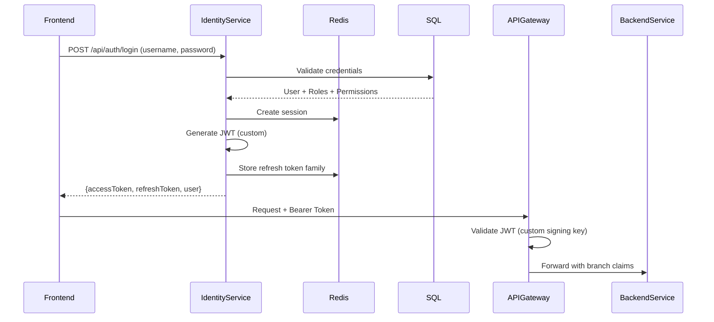

# Identity & Access Management (IAM) - Brownfield Assessment

## Document Scope

This document assesses the CURRENT STATE of authentication, authorization, and identity management within the Intellifin Loan Management System. It identifies gaps between existing implementation and the target IAM module requirements, serving as the foundation for IAM enhancement planning.

**Focus Area:** Identity Service, Keycloak infrastructure, API Gateway authentication, and identity-related patterns across the system.

## Change Log

| Date       | Version | Description                    | Author    |
|------------|---------|--------------------------------|-----------|
| 2025-10-15 | 1.0     | Initial brownfield assessment  | Architect |

---

## Executive Summary

### Current State Overview

The Intellifin system has **TWO PARALLEL** identity systems running:

1. **Custom JWT Identity Service** (`IntelliFin.IdentityService`) - Application-level authentication with comprehensive RBAC
2. **Keycloak** - Deployed infrastructure with OIDC capability, integrated at API Gateway level only

**Critical Finding:** These systems are NOT integrated. The Identity Service uses custom JWT tokens, while Keycloak is deployed but unused by the Identity Service itself. The API Gateway can validate Keycloak JWTs, but the Identity Service generates its own tokens.

### Key Gaps vs. Target Requirements

| Requirement | Status | Gap |
|------------|--------|-----|
| OIDC with Keycloak | ⚠️ Partial | Keycloak deployed but not integrated with Identity Service |
| JWT Validation | ✅ Implemented | Works but only for custom tokens |
| RBAC/Permissions | ✅ Implemented | Comprehensive system in place |
| Tenancy Model | ❌ Missing | No multi-tenant support |
| User Lifecycle | ⚠️ Partial | Basic CRUD, missing provisioning workflows |
| Service-to-Service Auth | ❌ Missing | No client credentials flow |
| SCIM/Webhooks | ❌ Missing | No automated provisioning |
| SoD Rules | ⚠️ Partial | Rule engine exists but SoD not enforced |
| Migration/Seed | ⚠️ Partial | No baseline roles seeded |

---

## Quick Reference - Key Files

### Identity Service Core Files

**Critical Implementation Files:**
- **Entry Point:** `apps/IntelliFin.IdentityService/Program.cs`
- **Service Registration:** `apps/IntelliFin.IdentityService/Extensions/ServiceCollectionExtensions.cs`
- **Authentication Controller:** `apps/IntelliFin.IdentityService/Controllers/AuthController.cs`
- **JWT Token Service:** `apps/IntelliFin.IdentityService/Services/JwtTokenService.cs` (inferred)
- **Permission System:** `apps/IntelliFin.IdentityService/Constants/SystemPermissions.cs`
- **Configuration:** `apps/IntelliFin.IdentityService/appsettings.json`

### API Gateway (Keycloak Integration)

**Keycloak Integration Files:**
- **Gateway Entry:** `apps/IntelliFin.ApiGateway/Program.cs`
- **Keycloak Options:** `apps/IntelliFin.ApiGateway/Options/KeycloakJwtOptions.cs`
- **Keycloak Validator:** `apps/IntelliFin.ApiGateway/Options/KeycloakJwtOptionsValidator.cs`

### Keycloak Infrastructure

**Deployment Files:**
- **Keycloak Deployment:** `infra/keycloak/keycloak-deployment.yaml`
- **Bootstrap Job:** `infra/keycloak/keycloak-admin-bootstrap-job.yaml`
- **Ingress:** `infra/keycloak/keycloak-ingress.yaml`
- **PostgreSQL:** `infra/keycloak/postgres-statefulset.yaml`

### Shared Libraries

- **Shared Auth Library:** `libs/IntelliFin.Shared.Authentication/` (currently empty stub)
- **Shared Domain Models:** `libs/IntelliFin.Shared.DomainModels/`
- **Audit Library:** `libs/IntelliFin.Shared.Audit/`

---

## High Level Architecture

### Current Identity Architecture (AS-IS)

```
┌──────────────────────────────────────────────────────────────┐
│                        Frontend Apps                          │
│         (Admin UI, Loan Officer Portal, etc.)                │
└───────────────────┬──────────────────────────────────────────┘
                    │
                    │ HTTP + JWT (Keycloak OR Custom)
                    ▼
┌──────────────────────────────────────────────────────────────┐
│              API Gateway (YARP) - Port 8080                   │
│  ┌────────────────────────────────────────────────────┐      │
│  │   Keycloak JWT Validation Middleware               │      │
│  │   - Authority: keycloak.intellifin.local           │      │
│  │   - Validates OIDC tokens from Keycloak            │      │
│  │   - Extracts branch claims                         │      │
│  └────────────────────────────────────────────────────┘      │
└───────┬──────────────────────────────────────────────────────┘
        │
        │ Proxies to backend services
        │
        ├─────────────────┬───────────────────┬─────────────────┐
        ▼                 ▼                   ▼                 ▼
┌──────────────────┐ ┌──────────────┐ ┌──────────────┐ ┌──────────────┐
│ Identity Service │ │ Loan Service │ │ Client Mgmt  │ │ Other Svcs   │
│                  │ │              │ │              │ │              │
│ Custom JWT Auth  │ │              │ │              │ │              │
│ ✗ NO Keycloak    │ │              │ │              │ │              │
└──────┬───────────┘ └──────────────┘ └──────────────┘ └──────────────┘
       │
       │ SQL + Redis
       ▼
┌──────────────────────────────────────────────────────────────┐
│              Data Layer                                       │
│  - SQL Server (LmsDbContext) - Users, Roles, Permissions     │
│  - Redis - Sessions, Token Revocation                        │
└──────────────────────────────────────────────────────────────┘


┌──────────────────────────────────────────────────────────────┐
│          Keycloak (DEPLOYED BUT ISOLATED)                     │
│  - Realm: IntelliFin                                          │
│  - PostgreSQL backend                                         │
│  - 3 replicas                                                 │
│  - OIDC endpoints available at keycloak.intellifin.local      │
│  ✗ NOT used by Identity Service                              │
└──────────────────────────────────────────────────────────────┘
```

### Problem: Dual Identity Systems

**Issue:** The system has two disconnected identity providers:

1. **Custom Identity Service** generates and validates its own JWTs
2. **Keycloak** is deployed and ready but only used by API Gateway for validation (not generation)

**Impact:**
- No OIDC flows
- No single source of truth for identities
- Duplicate user management
- Cannot leverage Keycloak features (SSO, Federation, Social Login, MFA)

---

## Technical Stack Analysis

### Identity Service (.NET 9.0)

| Category | Technology | Version | Purpose | Notes |
|----------|-----------|---------|---------|-------|
| Runtime | .NET | 9.0 | Web API host | Latest LTS |
| Framework | ASP.NET Core | 9.0 | Web framework | - |
| Database | SQL Server | Azure SQL | User/role storage | Via LmsDbContext |
| ORM | Entity Framework Core | 9.0.8 | Data access | - |
| Caching | Redis | - | Session/token cache | StackExchange.Redis 2.8.16 |
| Auth Framework | ASP.NET Identity | 9.0.0 | User/role management | ApplicationUser, ApplicationRole |
| JWT | JwtBearer + System.IdentityModel.Tokens.Jwt | 9.0.0 / 8.14.0 | Token generation/validation | Custom implementation |
| Password Hashing | BCrypt.Net-Next | 4.0.3 | Secure password storage | - |
| Validation | FluentValidation | 11.3.0 | Input validation | - |
| Logging | Serilog | 8.0.4 | Structured logging | Console + File sinks |
| Observability | OpenTelemetry | - | Distributed tracing | Shared.Observability |
| CQRS | MediatR | 12.4.1 | Command/query separation | - |
| **Missing** | **Keycloak Client** | **❌** | **OIDC integration** | **Not present** |

### Keycloak Infrastructure

| Component | Technology | Version | Purpose | Status |
|-----------|-----------|---------|---------|--------|
| Identity Provider | Keycloak | 24.0.4 | OIDC/SAML provider | ✅ Deployed |
| Database | PostgreSQL | 13+ | Keycloak storage | ✅ Deployed (StatefulSet) |
| Replicas | 3 | - | High availability | ✅ Configured |
| Cache | Infinispan | Built-in | Distributed cache | ✅ Kubernetes stack |
| Features | Token Exchange, Fine-grained AuthZ | Enabled | Advanced features | ⚠️ Not utilized |
| Ingress | Nginx/Istio | - | External access | ✅ keycloak.intellifin.local |
| Monitoring | Prometheus | - | Metrics collection | ✅ ServiceMonitor |

### API Gateway (YARP)

| Component | Technology | Version | Purpose | Notes |
|-----------|-----------|---------|---------|-------|
| Reverse Proxy | YARP | Latest | Gateway routing | Microsoft's proxy |
| Auth | JwtBearer (Keycloak) | 9.0.0 | Keycloak JWT validation | ✅ Integrated |
| Rate Limiting | ASP.NET Core | 9.0 | API protection | 100 req/min per user |
| Observability | OpenTelemetry | - | Tracing | - |

---

## Current Implementation Deep Dive

### 1. Custom JWT Authentication System

**Location:** `IntelliFin.IdentityService`

#### How It Works (Current)



#### JWT Configuration (Custom)

From `appsettings.json`:

```json
{
  "Jwt": {
    "Issuer": "IntelliFin.Identity",
    "Audience": "intellifin-api",
    "SigningKey": "dev-super-secret-signing-key-change-me-please-1234567890",
    "AccessTokenMinutes": 15,
    "RefreshTokenDays": 7,
    "ValidateIssuer": true,
    "ValidateAudience": true,
    "ValidateLifetime": true
  }
}
```

#### Token Features

✅ **Implemented:**
- Access tokens (JWT, 15-minute lifetime)
- Refresh tokens (7-day lifetime)
- Token families (rotation detection)
- Token revocation (Redis denylist)
- Session tracking
- Claims: userId, username, email, roles, permissions, branchId, branchName, branchRegion

❌ **Missing:**
- OIDC standard claims
- `id_token` (only access/refresh)
- Token introspection endpoint
- JWKS endpoint for public key distribution
- OAuth2 scopes

### 2. Role-Based Access Control (RBAC)

**Location:** `IntelliFin.IdentityService/Constants/SystemPermissions.cs`

#### Permission Catalog

The system has a **comprehensive permission model** with 80+ atomic permissions organized by domain:

**Permission Categories:**
- Client Management (8 permissions)
- Loan Management (11 permissions)
- Loan Applications (4 permissions)
- Credit Assessment (5 permissions)
- Collections & Payments (8 permissions)
- General Ledger (7 permissions)
- Reporting (7 permissions)
- Communications (4 permissions)
- System Administration (7 permissions)
- Audit & Compliance (5 permissions)
- Branch Operations (4 permissions)
- Digital Banking (3 permissions)
- **Platform Administration** (5 permissions) - for multi-tenant operations

**Example Permissions:**
```csharp
// Client Management
public const string ClientsView = "clients:view";
public const string ClientsCreate = "clients:create";
public const string ClientsViewPii = "clients:view_pii";

// Loan Management
public const string LoansApprove = "loans:approve";
public const string LoansApproveHighValue = "loans:approve_high_value";
public const string LoansWriteOff = "loans:write_off";

// Platform (Multi-tenant)
public const string PlatformTenantsManage = "platform:tenants_manage";
public const string PlatformEmergencyAccess = "platform:emergency_access";
```

#### Role Composition Service

✅ **Implemented:**
- `IRoleCompositionService` - Compose roles from permissions
- `IRoleTemplateService` - Role templates
- `IPermissionRoleBridgeService` - Permission-role mapping
- Role hierarchy and composition

**Example Controllers:**
- `RoleController` - Role CRUD
- `PermissionCatalogController` - Permission queries
- `RoleCompositionController` - Role composition
- `Platform/PlatformPermissionCatalogController` - Platform-level permissions

### 3. Rule-Based Authorization

**Location:** Services

✅ **Implemented:**
- `IRuleEngineService` - Dynamic rule evaluation
- `IRuleTemplateService` - Rule template management
- `IUserRuleService` - User-specific rules
- Rule models and templates

⚠️ **Partial:** 
- Rules exist but **Separation of Duties (SoD)** not explicitly implemented
- No pre-seeded SoD rules for sensitive operations

From `Constants/SystemRules.cs` (inferred), rules can be created but SoD enforcement is manual.

### 4. Session Management

**Location:** `SessionService`

✅ **Implemented:**
- Redis-backed sessions
- Concurrent session limits (max 3 per user)
- Session timeout (30 minutes)
- Activity tracking
- Device-based session management

**Configuration:**
```json
{
  "Session": {
    "TimeoutMinutes": 30,
    "MaxConcurrentSessions": 3,
    "RequireUniqueSession": false,
    "TrackUserActivity": true
  }
}
```

### 5. Account Lockout & Security

**Location:** `AccountLockoutService`

✅ **Implemented:**
- Failed attempt tracking (max 5 attempts)
- Progressive lockout durations (15, 30, 60, 120, 240 minutes)
- Lockout notifications
- IP-based tracking
- Manual unlock option

### 6. Password Management

**Location:** `PasswordService`

✅ **Implemented:**
- BCrypt hashing (12 rounds)
- Password complexity rules
- Password history (5 previous passwords)
- Password age policy (90 days)
- Common password blacklist

### 7. Audit Logging

**Location:** `AuditService`

✅ **Implemented:**
- All authentication events logged
- Integration with `IntelliFin.Shared.Audit`
- Sends audit events to Admin Service (`https://admin.intellifin.local`)
- Structured audit events

**Audit Model:**
```csharp
// apps/IntelliFin.IdentityService/Models/AuditEvent.cs
public class AuditEvent
{
    public string ActorId { get; set; }
    public string Action { get; set; }
    public string Entity { get; set; }
    public string EntityId { get; set; }
    public DateTime Timestamp { get; set; }
    public string IpAddress { get; set; }
    public string DetailsJson { get; set; }
    public string BranchId { get; set; }
}
```

### 8. User Management

**Location:** `UserService`

✅ **Implemented:**
- User CRUD operations
- Role assignment
- Permission resolution
- Branch context
- Last login tracking
- User activation/deactivation

⚠️ **Partial:**
- Basic CRUD only
- No automated provisioning workflows
- No SCIM support
- No group management API
- No user import/export
- No self-service password reset flow

---

## Keycloak Infrastructure Assessment

### Deployment Configuration

**Cluster:** `keycloak` namespace
**Replicas:** 3 pods
**Database:** PostgreSQL StatefulSet (keycloak-postgresql)
**Version:** Keycloak 24.0.4

#### Key Features Enabled

```yaml
KC_FEATURES: "token-exchange,admin-fine-grained-authz"
KC_PROXY: edge
KC_HOSTNAME_URL: https://keycloak.intellifin.local
KC_HOSTNAME_ADMIN_URL: https://keycloak.intellifin.local/admin
```

#### Realm Configuration

**Realm Name:** `IntelliFin`
**Realm Import:** `/opt/keycloak/data/import/IntelliFin-realm.json` (ConfigMap: `keycloak-realm-config`)

**Bootstrap Roles Created:**
- `system-administrator` - Full admin rights
- `audit-viewer` - Read-only audit access

**Bootstrap User:**
- Username: `keycloak-admin`
- Role: `system-administrator` + `realm-admin`
- MFA: TOTP required (`CONFIGURE_TOTP` action)

#### High Availability Setup

✅ **Production-Ready:**
- 3 replicas with pod anti-affinity
- Topology spread constraints
- PostgreSQL StatefulSet for persistence
- Infinispan distributed cache (Kubernetes stack)
- Health/readiness/startup probes
- Resource limits (CPU: 500m-2, Memory: 2Gi-4Gi)
- Prometheus ServiceMonitor
- PodDisruptionBudget

#### SMTP Configuration

```yaml
KC_SPI_EMAIL_SMTP_HOST: smtp.intellifin.local
KC_SPI_EMAIL_SMTP_PORT: 587
KC_SPI_EMAIL_SMTP_STARTTLS: true
```

### Current Usage Status

❌ **NOT USED BY IDENTITY SERVICE**
- Keycloak is deployed but Identity Service doesn't call it
- No OIDC flows configured
- No client registration for Identity Service
- No user sync between Keycloak and SQL Server

✅ **USED BY API GATEWAY**
- API Gateway validates Keycloak JWTs
- Configuration in `appsettings.json`:

```json
{
  "Authentication": {
    "KeycloakJwt": {
      "Authority": "https://keycloak.intellifin.local/realms/IntelliFin",
      "Issuer": "https://keycloak.intellifin.local/realms/IntelliFin",
      "Audience": "account",
      "MetadataAddress": "https://keycloak.intellifin.local/realms/IntelliFin/.well-known/openid-configuration",
      "RequireHttps": true
    }
  }
}
```

---

## API Gateway Integration

### YARP Configuration

**Location:** `apps/IntelliFin.ApiGateway/Program.cs`

#### Authentication Flow (Keycloak JWT)

```csharp
builder.Services.AddAuthentication(options =>
{
    options.DefaultScheme = "Keycloak";
    options.DefaultChallengeScheme = "Keycloak";
})
.AddJwtBearer("Keycloak", options =>
{
    options.Authority = keycloakOptions.Authority;
    options.RequireHttpsMetadata = keycloakOptions.RequireHttps;
    options.SaveToken = true;
    options.MetadataAddress = keycloakOptions.MetadataAddress;
    options.Audience = keycloakOptions.Audience;
    // Token validation via OIDC discovery
});
```

#### Request Transformations

The Gateway **extracts branch context** from JWT claims and forwards as headers:

```csharp
transformContext.ProxyRequest.Headers.Add("X-Branch-Id", branchId);
transformContext.ProxyRequest.Headers.Add("X-Branch-Name", branchName);
transformContext.ProxyRequest.Headers.Add("X-Branch-Region", branchRegion);
transformContext.ProxyRequest.Headers.Add("X-Token-Type", "Keycloak");
```

**Branch Claim Extraction:**
- Tries `branchId` or `branch_id` claim
- Tries `branchName` or `branch_name` claim
- Tries `branchRegion` or `branch_region` claim

**Issue:** Gateway expects these claims to exist in Keycloak tokens, but Identity Service doesn't push users/claims to Keycloak.

---

## Gap Analysis

### 1. OIDC Integration - ❌ **CRITICAL GAP**

**Requirement:** Integrate Identity Service with Keycloak via OIDC flows.

**Current State:**
- Keycloak deployed but isolated
- Identity Service uses custom JWT, not OIDC
- No Authorization Code flow
- No Client Credentials flow
- No Token Exchange

**What's Missing:**
- Keycloak client registration for Identity Service
- OIDC client library in Identity Service (e.g., `IdentityModel`, `Keycloak.AuthServices`)
- `/authorize` endpoint redirect logic
- OIDC callback handling
- ID token parsing and validation
- OIDC logout (RP-initiated logout)
- User provisioning to Keycloak
- Claims mapping strategy

**Impact:** Cannot leverage Keycloak's OIDC features, SSO, or federated identity.

---

### 2. Tenancy Model - ❌ **MISSING**

**Requirement:** Multi-tenant architecture with tenant/org boundaries and user-to-tenant membership.

**Current State:**
- **Branch context** exists (branchId, branchName, branchRegion in JWT claims)
- Branch is used for data isolation
- No formal "tenant" or "organization" concept
- No tenant-specific configuration
- No tenant-specific roles/permissions
- Users belong to branches, not tenants

**What's Missing:**
- Tenant entity/table
- Organization hierarchy (tenant > branches)
- User-to-tenant membership (many-to-many)
- Tenant-scoped permissions
- Tenant-specific configuration (branding, policies, features)
- Tenant isolation enforcement
- Tenant provisioning workflows
- Multi-tenancy in Keycloak (sub-realms or client scopes)

**Database Schema Needed:**
```sql
Tenants (
  TenantId UNIQUEIDENTIFIER PRIMARY KEY,
  Name NVARCHAR(200),
  Code NVARCHAR(50) UNIQUE,
  IsActive BIT,
  CreatedAt DATETIME2,
  Settings NVARCHAR(MAX) -- JSON
)

TenantUsers (
  TenantId UNIQUEIDENTIFIER,
  UserId UNIQUEIDENTIFIER,
  Role NVARCHAR(100), -- Tenant-specific role
  PRIMARY KEY (TenantId, UserId)
)

TenantBranches (
  TenantId UNIQUEIDENTIFIER,
  BranchId UNIQUEIDENTIFIER,
  PRIMARY KEY (TenantId, BranchId)
)
```

**Impact:** Cannot support multi-org deployments, tenant isolation, or SaaS model.

---

### 3. Service-to-Service Authentication - ❌ **MISSING**

**Requirement:** Client credentials flow for service-to-service auth with scopes and token rotation.

**Current State:**
- Services call each other but authentication mechanism unclear
- No OAuth2 client credentials flow
- No service principals
- No token scopes for service identity
- No certificate-based auth for services

**What's Missing:**
- Keycloak service clients with client credentials grant
- Service identity registration
- Token scopes for service operations
- mTLS or certificate-based auth
- Token rotation strategy for service accounts
- Service-to-service audit trails

**Impact:** Services may be calling each other without proper authentication, or using shared secrets.

---

### 4. User Provisioning & Lifecycle - ⚠️ **PARTIAL**

**Requirement:** Automated provisioning, profile management, deactivation, password reset, SCIM/webhooks.

**Current State:**
- ✅ Basic user CRUD via `UserService`
- ✅ User activation/deactivation
- ✅ Last login tracking
- ❌ No self-service password reset flow (requires manual intervention)
- ❌ No account activation emails
- ❌ No SCIM endpoints
- ❌ No Keycloak webhooks or event listeners
- ❌ No automated user import/sync

**What's Missing:**
- Self-service password reset flow (email verification)
- Account verification emails
- User profile self-management UI
- SCIM 2.0 endpoints for external provisioning
- Keycloak event listeners for user lifecycle events
- User import/export utilities
- Automated user sync between Keycloak and SQL

**Impact:** Manual user management overhead, no external provisioning integration.

---

### 5. Separation of Duties (SoD) - ⚠️ **PARTIAL**

**Requirement:** Enforce SoD rules to prevent conflicting role assignments.

**Current State:**
- ✅ Rule engine infrastructure exists (`IRuleEngineService`, `IUserRuleService`)
- ✅ Permission catalog with fine-grained permissions
- ❌ No pre-defined SoD rules
- ❌ No SoD enforcement during role assignment
- ❌ No SoD validation in authorization middleware

**What's Missing:**
- SoD rule definitions (e.g., "Loan Approver" cannot be "Loan Creator")
- SoD validation during role assignment
- SoD violation detection and alerting
- SoD override workflow (with approval)
- Pre-seeded SoD rules for sensitive operations

**Example SoD Rules Needed:**
```csharp
// Prevent same user from creating AND approving loans
{
  "rule": "sod-loan-approval",
  "conflictingPermissions": ["loans:create", "loans:approve"],
  "enforcement": "strict" // or "warning"
}

// Prevent same user from posting AND reversing GL entries
{
  "rule": "sod-gl-posting",
  "conflictingPermissions": ["gl:post", "gl:reverse"],
  "enforcement": "strict"
}
```

**Impact:** Risk of fraud, regulatory compliance issues.

---

### 6. Migration & Seed Data - ⚠️ **PARTIAL**

**Requirement:** Baseline roles and admin user bindings seeded.

**Current State:**
- ✅ Keycloak bootstrap job creates `keycloak-admin` user with `system-administrator` role
- ❌ No baseline roles seeded in Identity Service SQL database
- ❌ No default role templates
- ❌ No migration scripts for role/permission data

**What's Missing:**
- EF Core migrations for identity tables
- Seed data for baseline roles:
  - `System Administrator`
  - `Loan Officer`
  - `Underwriter`
  - `Finance Manager`
  - `Collections Officer`
  - `Compliance Officer`
- Seed data for permission-role mappings
- Admin user creation script for Identity Service
- Data sync strategy between Keycloak and SQL

**Impact:** Manual role setup on every deployment.

---

### 7. Public APIs - ⚠️ **PARTIAL**

**Requirement:** APIs for user directory, roles/permissions queries, token introspection, group membership.

**Current State:**
- ✅ `/api/auth/login` - Login
- ✅ `/api/auth/refresh` - Token refresh
- ✅ `/api/users` - User CRUD (implied)
- ✅ `/api/roles` - Role CRUD
- ✅ `/api/permissioncatalog` - Permission catalog
- ✅ `/api/rolecomposition` - Role composition
- ❌ No token introspection endpoint (`/api/auth/introspect`)
- ❌ No user directory/search API
- ❌ No group membership API
- ❌ No permission check API (`/api/auth/check-permission`)

**Missing APIs:**
```http
# Token Introspection (RFC 7662)
POST /api/auth/introspect
{
  "token": "...",
  "token_type_hint": "access_token"
}

# User Directory
GET /api/users/directory?query={search}&tenant={id}

# Group Membership
GET /api/users/{id}/groups
POST /api/users/{id}/groups
DELETE /api/users/{id}/groups/{groupId}

# Permission Check
POST /api/auth/check-permission
{
  "userId": "...",
  "permission": "loans:approve",
  "context": { "branchId": "..." }
}
```

**Impact:** Downstream services cannot validate tokens or query identity data easily.

---

### 8. Database Schema - ⚠️ **PARTIAL**

**Requirement:** Identity-related reference tables in SQL Server, separate from Keycloak's DB.

**Current State:**
- ✅ Uses `LmsDbContext` (shared with other services)
- ✅ ASP.NET Identity tables (AspNetUsers, AspNetRoles, AspNetUserRoles, etc.)
- ✅ Custom extensions likely (UserClaims model with branch context)
- ❌ No dedicated identity database
- ❌ No tenancy tables
- ❌ No service principal tables
- ❌ No audit event tables (audit sent to Admin Service, not stored locally)

**What's Missing:**
- Dedicated `IdentityDb` database (optional, but recommended for isolation)
- Tenancy tables (Tenants, TenantUsers, TenantBranches)
- Service principal tables (ServiceAccounts, ServiceCredentials)
- Local audit event storage (for quick queries)
- Token revocation table (currently Redis-only)
- SoD rules table
- Role templates table

**Impact:** Identity data scattered across LmsDbContext, difficult to audit and isolate.

---

### 9. Observability & Compliance - ✅ **GOOD**

**Requirement:** Audit events, metrics, alerts.

**Current State:**
- ✅ Structured logging with Serilog
- ✅ OpenTelemetry distributed tracing
- ✅ Audit events sent to Admin Service
- ✅ Metrics endpoint on Keycloak
- ✅ Prometheus ServiceMonitor for Keycloak
- ✅ Health checks

**What Could Be Better:**
- Dedicated identity-specific dashboards
- Alerts for suspicious authentication patterns
- Login success/failure metrics
- Token generation rate metrics
- SoD violation alerts

**Impact:** Good foundation, minor enhancements needed.

---

### 10. Tests - ❌ **UNCLEAR**

**Requirement:** Unit and integration tests for JWT validation, policy enforcement.

**Current State:**
- ⚠️ Test project exists: `tests/IntelliFin.IdentityService.Tests/`
- ❌ Unknown test coverage
- ❌ No test files found in initial scan

**What's Missing:**
- Unit tests for:
  - JWT token generation/validation
  - Password hashing
  - Permission resolution
  - Rule engine
  - SoD validation
- Integration tests for:
  - Login flow
  - Token refresh flow
  - Token revocation
  - Keycloak integration (once implemented)

**Impact:** Risk of regressions, difficult to refactor safely.

---

## Technical Debt & Workarounds

### 1. Dual Identity Systems

**Issue:** Two parallel identity systems (Custom JWT + Keycloak) with no integration.

**Workaround:** API Gateway validates Keycloak tokens, but Identity Service still issues custom tokens.

**Impact:**
- Confusion about which tokens to use
- Cannot leverage Keycloak features
- Duplicate user management
- Difficult to implement SSO

**Recommendation:** Migrate to Keycloak as primary IdP, deprecate custom JWT.

---

### 2. Shared Database Context

**Issue:** Identity Service uses `LmsDbContext` shared with other services.

**Workaround:** All services share same DbContext and connection string.

**Impact:**
- Tight coupling
- Difficult to isolate identity data
- Schema changes affect all services
- Cannot scale identity service independently

**Recommendation:** Create dedicated `IdentityDbContext` and `IdentityDb` database.

---

### 3. Redis-Only Token Revocation

**Issue:** Token revocation list stored only in Redis, not persisted to SQL.

**Workaround:** Works for short-lived tokens, but no audit trail.

**Impact:**
- If Redis crashes, revocation list lost
- No historical revocation data for compliance
- Difficult to query revoked tokens

**Recommendation:** Store revocation events in SQL for audit trail, use Redis for performance.

---

### 4. No Tenant Isolation

**Issue:** Branch context used for data isolation, but no formal tenant concept.

**Workaround:** Branch IDs in JWT claims and database queries.

**Impact:**
- Cannot support multi-org scenarios
- Difficult to onboard new customers
- No tenant-specific configuration

**Recommendation:** Implement tenancy model on top of branch system.

---

### 5. Manual Role Setup

**Issue:** No seed data for roles, must be created manually.

**Workaround:** Manual database inserts or API calls.

**Impact:**
- Inconsistent role setup across environments
- Deployment overhead
- Risk of missing permissions

**Recommendation:** Create EF Core migrations with seed data for baseline roles.

---

## Integration Points

### Current Integrations

| System | Integration Type | Status | Notes |
|--------|------------------|--------|-------|
| API Gateway | JWT validation | ✅ | Validates Keycloak JWTs |
| Backend Services | JWT bearer | ✅ | Accept custom JWTs |
| Admin Service | HTTP API | ✅ | Audit event sink |
| Redis | Direct | ✅ | Session + token cache |
| SQL Server | EF Core | ✅ | User/role storage |
| Vault | Credentials | ✅ | DB credential rotation |

### Missing Integrations

| System | Integration Type | Status | Required For |
|--------|------------------|--------|--------------|
| Keycloak | OIDC client | ❌ | OIDC flows |
| Keycloak Admin API | HTTP client | ❌ | User provisioning |
| SCIM Providers | SCIM 2.0 | ❌ | External provisioning |
| SMTP | Email | ⚠️ | Password reset (Keycloak has it) |
| Message Bus | Event publisher | ❌ | Identity lifecycle events |

---

## Migration Strategy Considerations

### Option A: Full Keycloak Migration (Recommended)

**Approach:** Deprecate custom JWT, use Keycloak as primary IdP.

**Steps:**
1. Sync existing users from SQL to Keycloak
2. Configure Keycloak realm with IntelliFin-specific settings
3. Implement OIDC Authorization Code flow in Identity Service
4. Update API Gateway to only accept Keycloak tokens
5. Migrate roles/permissions to Keycloak role/group model
6. Implement Keycloak event listeners for audit
7. Deprecate custom JWT endpoints

**Pros:**
- Industry-standard OIDC
- SSO capability
- Federation support (LDAP, SAML, Social)
- Mature MFA support
- Centralized identity management

**Cons:**
- Major refactoring required
- Potential downtime during migration
- Learning curve for team
- Risk of breaking existing integrations

---

### Option B: Hybrid Approach

**Approach:** Keep custom JWT for internal services, use Keycloak for external/SSO.

**Steps:**
1. Implement Keycloak integration alongside existing JWT
2. Use Keycloak for Admin UI and external integrations
3. Use custom JWT for service-to-service
4. Sync users between both systems
5. Gradual migration over time

**Pros:**
- Lower risk
- Incremental migration
- Backwards compatibility

**Cons:**
- Maintains dual identity systems
- Increased complexity
- User sync overhead
- Technical debt persists

---

### Option C: Enhance Custom JWT

**Approach:** Keep custom JWT, add OIDC compliance.

**Steps:**
1. Add OIDC endpoints to Identity Service (`/authorize`, `/token`, `/.well-known/openid-configuration`)
2. Implement JWKS endpoint for public key distribution
3. Add `id_token` support
4. Implement OAuth2 scopes
5. Enhance with Keycloak-like features

**Pros:**
- Full control over implementation
- No dependency on Keycloak
- Can optimize for specific needs

**Cons:**
- Reinventing the wheel
- Maintenance burden
- Missing Keycloak's advanced features
- Not industry-standard

---

## Recommendations

### Priority 1: Critical (Must Have)

1. **Integrate Identity Service with Keycloak**
   - Implement OIDC Authorization Code flow
   - Sync users to Keycloak
   - Use Keycloak as primary IdP
   - **Effort:** 3-4 sprints

2. **Implement Tenancy Model**
   - Add tenant tables to SQL
   - Implement tenant context in JWT
   - Add tenant isolation to API Gateway
   - **Effort:** 2 sprints

3. **Implement Service-to-Service Auth**
   - Configure Keycloak service clients
   - Implement client credentials flow
   - Add token scopes
   - **Effort:** 1 sprint

4. **Seed Baseline Roles**
   - Create EF Core migrations with seed data
   - Define standard role templates
   - Map permissions to roles
   - **Effort:** 1 sprint

### Priority 2: High (Should Have)

5. **Add SoD Enforcement**
   - Define SoD rules
   - Implement SoD validation
   - Add override workflow
   - **Effort:** 1 sprint

6. **Implement User Provisioning APIs**
   - Self-service password reset
   - Account verification emails
   - User import/export
   - **Effort:** 1-2 sprints

7. **Add Token Introspection**
   - `/api/auth/introspect` endpoint
   - Permission check API
   - Group membership API
   - **Effort:** 1 sprint

8. **Create Dedicated Identity Database**
   - Split `IdentityDbContext` from `LmsDbContext`
   - Migrate identity tables
   - Update connection strings
   - **Effort:** 1 sprint

### Priority 3: Nice to Have

9. **Implement SCIM 2.0**
   - SCIM endpoints for external provisioning
   - Keycloak webhook integration
   - **Effort:** 2 sprints

10. **Enhance Tests**
    - Unit tests for all services
    - Integration tests for OIDC flows
    - Load tests for authentication
    - **Effort:** 1-2 sprints

11. **Add Identity Dashboards**
    - Grafana dashboards for auth metrics
    - Alerts for suspicious activity
    - **Effort:** 0.5 sprint

---

## Next Steps

### Immediate Actions

1. **Decision:** Choose migration strategy (Option A recommended)
2. **Planning:** Create detailed PRD for IAM enhancement
3. **Architecture:** Design Keycloak integration architecture
4. **POC:** Build proof-of-concept for OIDC flow

### Documentation Needed

Once strategy is decided, create:

1. **IAM Architecture Document** - Target state design
2. **IAM Integration Specification** - API contracts and flows
3. **IAM Migration Plan** - Step-by-step migration guide
4. **IAM Security Policy** - Security requirements and compliance
5. **IAM Operations Runbook** - Deployment and troubleshooting

---

## Appendix

### Useful Commands

**Identity Service:**
```bash
# Run Identity Service
cd apps/IntelliFin.IdentityService
dotnet run

# Run tests
cd tests/IntelliFin.IdentityService.Tests
dotnet test
```

**Keycloak:**
```bash
# Check Keycloak pods
kubectl get pods -n keycloak

# Keycloak logs
kubectl logs -n keycloak deployment/keycloak -f

# Access Keycloak admin
kubectl port-forward -n keycloak svc/keycloak 8080:8080
# Then open: http://localhost:8080/admin
```

**API Gateway:**
```bash
# Run API Gateway
cd apps/IntelliFin.ApiGateway
dotnet run
```

### Key Documentation References

- **Keycloak Admin API:** https://www.keycloak.org/docs-api/latest/rest-api/
- **OIDC Specification:** https://openid.net/specs/openid-connect-core-1_0.html
- **SCIM 2.0:** https://datatracker.ietf.org/doc/html/rfc7644
- **OAuth2 Client Credentials:** https://datatracker.ietf.org/doc/html/rfc6749#section-4.4

### Contact Points

- **Identity Service Code:** `apps/IntelliFin.IdentityService/`
- **API Gateway Code:** `apps/IntelliFin.ApiGateway/`
- **Keycloak Infra:** `infra/keycloak/`
- **Architecture Docs:** `docs/architecture/`

---

**End of Assessment**

This document provides a comprehensive snapshot of the current IAM state. Use this as input for the next workflow phases: PRD creation and architecture design.
