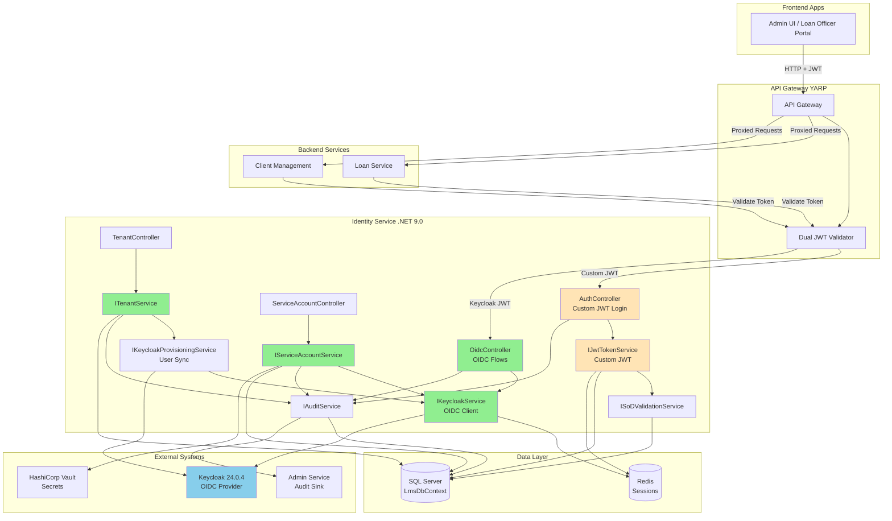

# Identity & Access Management (IAM) Enhancement Architecture

## Document Information

**Project:** Intellifin Loan Management System  
**Module:** Identity & Access Management (IAM)  
**Document Type:** Architecture Document  
**Version:** 1.0  
**Date:** 2025-10-15  
**Author:** Architect (Winston)

---

## Change Log

| Date | Version | Description | Author |
|------|---------|-------------|--------|
| 2025-10-15 | 1.0 | Initial IAM Enhancement Architecture | Architect (Winston) |
| 2025-10-15 | 0.9 | IAM Enhancement PRD Completed | PM (John) |
| 2025-10-15 | 0.8 | IAM Brownfield Assessment Completed | Architect (Winston) |

---

# 1. Introduction

This document outlines the architectural approach for enhancing **Intellifin Loan Management System** with **Keycloak Integration and Multi-Tenancy support**. Its primary goal is to serve as the guiding architectural blueprint for AI-driven development of new IAM features while ensuring seamless integration with the existing system.

**Relationship to Existing Architecture:**  
This document supplements existing project architecture by defining how new IAM components will integrate with current Identity Service, API Gateway, and backend services. Where conflicts arise between new OIDC patterns and existing custom JWT patterns, this document provides guidance on maintaining consistency during the migration period.

## 1.1 Existing Project Analysis

### Current Project State

- **Primary Purpose:** Loan Management System with custom JWT authentication
- **Current Tech Stack:** .NET 9.0, ASP.NET Core, Entity Framework Core 9.0.8, SQL Server, Redis, Keycloak 24.0.4 (deployed, not integrated)
- **Architecture Style:** Microservices with YARP API Gateway, Kubernetes deployment, Linkerd service mesh
- **Deployment Method:** Kubernetes cluster (3+ nodes), blue-green deployment, HashiCorp Vault for secrets

### Available Documentation

- **Brownfield Assessment:** `domains/identity-access-management/iam-brownfield-assessment.md` - Comprehensive 1,186-line analysis of current IAM state, gaps, and migration strategies
- **Enhancement PRD:** `domains/identity-access-management/iam-enhancement-prd.md` - 20 functional requirements, 13 user stories, success metrics
- **System Architecture:** `docs/architecture/system-architecture.md` - Overall system design
- **Tech Stack Documentation:** `docs/architecture/tech-stack.md`
- **Keycloak Infrastructure:** `infra/keycloak/keycloak-deployment.yaml` - Production-ready 3-replica HA setup

### Identified Constraints

- **Zero Downtime Requirement:** 99.9% uptime must be maintained during migration
- **Shared DbContext:** Identity Service uses `LmsDbContext` shared with other services (tight coupling)
- **Backward Compatibility:** Custom JWT tokens must remain valid for 30-day migration window
- **Permission Model Preservation:** 80+ atomic permissions must be maintained
- **Redis Dependency:** Session management relies on Redis cluster
- **Branch Context:** Existing branch-based data isolation (branchId, branchName, branchRegion) must be preserved
- **No Keycloak Libraries:** Currently missing OIDC client libraries (must be added)
- **Dual Identity Systems:** Custom JWT and Keycloak must coexist during migration

---

# 2. Enhancement Scope and Integration Strategy

## 2.1 Enhancement Overview

**Enhancement Type:** Integration with New Systems + Major Feature Modification

**Scope:** Transform Identity Service from custom JWT authentication to industry-standard OIDC with Keycloak while adding multi-tenancy, service-to-service auth, and SoD enforcement

**Integration Impact:** **Major Impact** - Requires architectural changes, database extensions, new services, and phased migration

## 2.2 Integration Approach

### Code Integration Strategy

**Phased Integration - Additive Pattern:**
1. **Phase 1 - Foundation:** Add new components alongside existing (no modifications to existing auth flows)
2. **Phase 2 - Dual Operation:** Both custom JWT and Keycloak OIDC active simultaneously
3. **Phase 3 - Migration:** Gradual cutover from custom JWT to Keycloak (30-day window)
4. **Phase 4 - Deprecation:** Remove custom JWT after full migration

**Key Principles:**
- New code in separate files/folders (minimal existing file modifications)
- Feature flags control activation of new features
- Existing `IJwtTokenService` remains functional during migration
- New `IKeycloakService` operates in parallel

### Database Integration

**Additive Schema Pattern:**
- **Approach:** Extend existing `LmsDbContext` with new tables via EF Core migrations
- **No Breaking Changes:** Existing ASP.NET Identity tables (AspNetUsers, AspNetRoles, etc.) remain unchanged
- **New Tables:** Tenants, TenantUsers, TenantBranches, ServiceAccounts, ServiceCredentials, SoDRules, AuditEvents, TokenRevocations
- **Dual Storage:** User data maintained in both SQL Server (authoritative) and Keycloak (identity provider)
- **Sync Mechanism:** Keycloak Admin API + Event Listeners for bidirectional sync

### API Integration

**Backward-Compatible API Evolution:**
- **Existing Endpoints Preserved:** `/api/auth/login`, `/api/auth/refresh` continue to work (custom JWT)
- **New Endpoints Added:** `/api/auth/oidc/login`, `/api/auth/oidc/callback` for Keycloak flows
- **API Gateway Dual Validation:** YARP validates both custom JWT (iss: IntelliFin.Identity) and Keycloak JWT (iss: https://keycloak.intellifin.local/realms/IntelliFin)
- **Transparent Migration:** Clients can migrate at their own pace during 30-day window

### UI Integration

**Minimal UI Changes:**
- **Phase 1:** Existing login form posts to `/api/auth/login` (no change)
- **Phase 2:** Admin UI updated to support tenant management
- **Phase 3:** Login redirects to Keycloak for OIDC flow (configurable)
- **Phase 4:** Self-service features (password reset, profile management) use Keycloak UI

## 2.3 Compatibility Requirements

### Existing API Compatibility
- **100% Response Format Compatibility:** All existing endpoints return identical JSON structures
- **Claims Compatibility:** Tokens contain all existing claims plus new tenant claims
- **Error Handling:** Maintain existing error response formats

### Database Schema Compatibility
- **Additive Only:** No deletions, no column modifications in existing tables
- **Foreign Keys:** New tables reference existing AspNetUsers.Id
- **Indexes:** New indexes on new tables only

### UI/UX Consistency
- **Visual Consistency:** Keycloak login page styled with IntelliFin branding
- **User Flow:** Login experience remains similar (username/password form)
- **Transparency:** Users unaware of backend migration (except for new self-service features)

### Performance Impact
- **Authentication Latency:** <50ms difference between custom JWT and Keycloak tokens
- **Database Queries:** New indexes ensure query performance maintained
- **Redis Load:** Dual token caching with distinct key prefixes (no collisions)

---

# 3. Tech Stack Alignment

## 3.1 Existing Technology Stack

| Category | Current Technology | Version | Usage in Enhancement | Notes |
|----------|-------------------|---------|---------------------|-------|
| **Runtime** | .NET | 9.0 | ✅ Maintained | All new services use .NET 9.0 |
| **Framework** | ASP.NET Core | 9.0 | ✅ Maintained | Web API framework |
| **ORM** | Entity Framework Core | 9.0.8 | ✅ Maintained | New migrations for IAM tables |
| **Database** | SQL Server (Azure SQL) | - | ✅ Maintained | Extended with new tables |
| **Database** | PostgreSQL | 13+ | ✅ Maintained | Keycloak backend (existing) |
| **Cache** | Redis | - | ✅ Maintained | Extended for dual-token caching |
| **Identity Framework** | ASP.NET Identity | 9.0.0 | ✅ Maintained | Existing user/role management |
| **Auth** | JwtBearer | 9.0.0 | ✅ Maintained | Used for custom JWT validation |
| **Auth** | Keycloak | 24.0.4 | ✅ Maintained | Deployed, now integrated |
| **Password Hashing** | BCrypt.Net-Next | 4.0.3 | ✅ Maintained | Continues for custom auth |
| **Validation** | FluentValidation | 11.3.0 | ✅ Maintained | Input validation |
| **Logging** | Serilog | 8.0.4 | ✅ Maintained | Structured logging |
| **Observability** | OpenTelemetry | - | ✅ Maintained | Distributed tracing |
| **CQRS** | MediatR | 12.4.1 | ✅ Maintained | Command/query separation |
| **Gateway** | YARP | Latest | ✅ Extended | Dual JWT validation added |
| **Secrets** | HashiCorp Vault | - | ✅ Maintained | Keycloak client secret stored |
| **Service Mesh** | Linkerd | - | ✅ Maintained | mTLS between services |

## 3.2 New Technology Additions

| Technology | Version | Purpose | Rationale | Integration Method |
|-----------|---------|---------|-----------|-------------------|
| **Keycloak.AuthServices.Authentication** | Latest stable | OIDC client for .NET | Industry-standard Keycloak integration library for ASP.NET Core | NuGet package, configured in `ServiceCollectionExtensions.cs` |
| **Keycloak.AuthServices.Sdk** | Latest stable | Keycloak Admin API client | Official SDK for user provisioning and admin operations | NuGet package, used by `KeycloakProvisioningService` |
| **IdentityModel** | Latest stable | OAuth2/OIDC protocol utilities | Token handling, discovery document parsing, JWKS | NuGet package, used by OIDC flow implementation |

**Justification for New Libraries:**
- **Keycloak.AuthServices:** Microsoft-recommended library for Keycloak integration with .NET
- **IdentityModel:** Industry-standard library for OAuth2/OIDC (maintained by Duende Software)
- **No Additional Infrastructure:** Leverage existing Keycloak deployment, no new services required

---

# 4. Data Models and Schema Changes

## 4.1 New Data Models

### Model 1: Tenant

**Purpose:** Represent organizational tenants in multi-tenant architecture

**Integration:** Links to existing Users (AspNetUsers) and Branches

**Key Attributes:**
- `TenantId`: Guid - Primary key, unique identifier
- `Name`: String(200) - Display name of tenant organization
- `Code`: String(50) - Unique alphanumeric code for tenant (URL-safe)
- `IsActive`: Boolean - Soft delete flag
- `CreatedAt`: DateTime2 - Audit timestamp
- `Settings`: String(MAX) - JSON blob for tenant-specific configuration (branding, features, policies)

**Relationships:**
- **With Existing:** 1-to-many with AspNetUsers via TenantUsers (users belong to tenants)
- **With Existing:** 1-to-many with Branches via TenantBranches (tenants own branches)
- **With New:** 1-to-many with TenantUsers (user memberships)

**SQL Schema:**
```sql
CREATE TABLE Tenants (
    TenantId UNIQUEIDENTIFIER PRIMARY KEY DEFAULT NEWID(),
    Name NVARCHAR(200) NOT NULL,
    Code NVARCHAR(50) NOT NULL UNIQUE,
    IsActive BIT NOT NULL DEFAULT 1,
    CreatedAt DATETIME2 NOT NULL DEFAULT GETUTCDATE(),
    Settings NVARCHAR(MAX) NULL
);
```

---

### Model 2: TenantUser

**Purpose:** Many-to-many relationship between Tenants and Users with role context

**Integration:** Bridges AspNetUsers and Tenants tables

**Key Attributes:**
- `TenantId`: Guid - Foreign key to Tenants
- `UserId`: String - Foreign key to AspNetUsers.Id
- `Role`: String(100) - Tenant-specific role (e.g., "TenantAdmin", "TenantUser")
- `AssignedAt`: DateTime2 - When user was added to tenant
- `AssignedBy`: String - UserId of admin who assigned (audit trail)

**Relationships:**
- **With Existing:** Many-to-1 with AspNetUsers (UserId FK)
- **With New:** Many-to-1 with Tenants (TenantId FK)

**SQL Schema:**
```sql
CREATE TABLE TenantUsers (
    TenantId UNIQUEIDENTIFIER NOT NULL,
    UserId NVARCHAR(450) NOT NULL,
    Role NVARCHAR(100) NULL,
    AssignedAt DATETIME2 NOT NULL DEFAULT GETUTCDATE(),
    AssignedBy NVARCHAR(450) NULL,
    CONSTRAINT PK_TenantUsers PRIMARY KEY (TenantId, UserId),
    CONSTRAINT FK_TenantUsers_Tenants FOREIGN KEY (TenantId) REFERENCES Tenants(TenantId) ON DELETE CASCADE,
    CONSTRAINT FK_TenantUsers_AspNetUsers FOREIGN KEY (UserId) REFERENCES AspNetUsers(Id) ON DELETE CASCADE
);

CREATE NONCLUSTERED INDEX IX_TenantUsers_UserId ON TenantUsers(UserId);
```

---

### Model 3: TenantBranch

**Purpose:** Associate branches with tenants for organizational hierarchy

**Integration:** Links branches to tenant ownership

**Key Attributes:**
- `TenantId`: Guid - Foreign key to Tenants
- `BranchId`: Guid - Foreign key to Branches (existing table)
- `CreatedAt`: DateTime2 - When branch was added to tenant

**Relationships:**
- **With Existing:** Many-to-1 with Branches (BranchId FK)
- **With New:** Many-to-1 with Tenants (TenantId FK)

**SQL Schema:**
```sql
CREATE TABLE TenantBranches (
    TenantId UNIQUEIDENTIFIER NOT NULL,
    BranchId UNIQUEIDENTIFIER NOT NULL,
    CreatedAt DATETIME2 NOT NULL DEFAULT GETUTCDATE(),
    CONSTRAINT PK_TenantBranches PRIMARY KEY (TenantId, BranchId),
    CONSTRAINT FK_TenantBranches_Tenants FOREIGN KEY (TenantId) REFERENCES Tenants(TenantId) ON DELETE CASCADE
);
```

---

### Model 4: ServiceAccount

**Purpose:** Service principals for service-to-service authentication

**Integration:** Represents non-human identities (services, batch jobs) with OAuth2 client credentials

**Key Attributes:**
- `ServiceAccountId`: Guid - Primary key
- `ClientId`: String(100) - Unique OAuth2 client ID (used in tokens)
- `Name`: String(200) - Human-readable service name
- `Description`: String(500) - Purpose of service account
- `IsActive`: Boolean - Enable/disable flag
- `CreatedAt`: DateTime2 - Audit timestamp
- `CreatedBy`: String - UserId of admin who created

**Relationships:**
- **With Existing:** None (service accounts are separate from users)
- **With New:** 1-to-many with ServiceCredentials (rotation history)

**SQL Schema:**
```sql
CREATE TABLE ServiceAccounts (
    ServiceAccountId UNIQUEIDENTIFIER PRIMARY KEY DEFAULT NEWID(),
    ClientId NVARCHAR(100) NOT NULL UNIQUE,
    Name NVARCHAR(200) NOT NULL,
    Description NVARCHAR(500) NULL,
    IsActive BIT NOT NULL DEFAULT 1,
    CreatedAt DATETIME2 NOT NULL DEFAULT GETUTCDATE(),
    CreatedBy NVARCHAR(450) NULL
);

CREATE NONCLUSTERED INDEX IX_ServiceAccounts_ClientId ON ServiceAccounts(ClientId);
```

---

### Model 5: ServiceCredential

**Purpose:** Store service account credentials (client secrets) with rotation history

**Integration:** Child records of ServiceAccounts

**Key Attributes:**
- `CredentialId`: Guid - Primary key
- `ServiceAccountId`: Guid - Foreign key to ServiceAccounts
- `SecretHash`: String(500) - BCrypt hash of client secret
- `ExpiresAt`: DateTime2 - Credential expiration (for rotation)
- `CreatedAt`: DateTime2 - When credential was created
- `RevokedAt`: DateTime2 (nullable) - If credential was manually revoked

**Relationships:**
- **With New:** Many-to-1 with ServiceAccounts

**SQL Schema:**
```sql
CREATE TABLE ServiceCredentials (
    CredentialId UNIQUEIDENTIFIER PRIMARY KEY DEFAULT NEWID(),
    ServiceAccountId UNIQUEIDENTIFIER NOT NULL,
    SecretHash NVARCHAR(500) NOT NULL,
    ExpiresAt DATETIME2 NULL,
    CreatedAt DATETIME2 NOT NULL DEFAULT GETUTCDATE(),
    RevokedAt DATETIME2 NULL,
    CONSTRAINT FK_ServiceCredentials_ServiceAccounts FOREIGN KEY (ServiceAccountId) REFERENCES ServiceAccounts(ServiceAccountId) ON DELETE CASCADE
);
```

---

### Model 6: SoDRule

**Purpose:** Define Separation of Duties rules to prevent conflicting permission assignments

**Integration:** Validates role assignments in UserService

**Key Attributes:**
- `RuleId`: Guid - Primary key
- `RuleName`: String(100) - Unique rule identifier (e.g., "sod-loan-approval")
- `ConflictingPermissions`: String(MAX) - JSON array of conflicting permissions
- `Enforcement`: String(20) - "strict" (block) or "warning" (log only)
- `IsActive`: Boolean - Enable/disable rule
- `Description`: String(500) - Human-readable explanation

**Relationships:**
- **With Existing:** Validates against AspNetUserRoles and AspNetRoleClaims (permissions)
- **With New:** None (validation rules)

**SQL Schema:**
```sql
CREATE TABLE SoDRules (
    RuleId UNIQUEIDENTIFIER PRIMARY KEY DEFAULT NEWID(),
    RuleName NVARCHAR(100) NOT NULL UNIQUE,
    ConflictingPermissions NVARCHAR(MAX) NOT NULL,
    Enforcement NVARCHAR(20) NOT NULL DEFAULT 'strict',
    IsActive BIT NOT NULL DEFAULT 1,
    Description NVARCHAR(500) NULL
);
```

**Example Data:**
```json
{
  "RuleName": "sod-loan-approval",
  "ConflictingPermissions": ["loans:create", "loans:approve"],
  "Enforcement": "strict",
  "Description": "Prevent same user from creating and approving loans"
}
```

---

### Model 7: AuditEvent

**Purpose:** Local storage of authentication/authorization events for compliance

**Integration:** Supplement existing audit forwarding to Admin Service with local persistence

**Key Attributes:**
- `EventId`: Guid - Primary key
- `ActorId`: String - UserId or ServiceAccountId performing action
- `Action`: String(100) - Action performed (e.g., "Login", "RoleAssigned")
- `Entity`: String(100) - Entity type affected (e.g., "User", "Tenant")
- `EntityId`: String(450) - ID of affected entity
- `Timestamp`: DateTime2 - When event occurred
- `IpAddress`: String(50) - Source IP address
- `Details`: String(MAX) - JSON with additional context
- `BranchId`: Guid (nullable) - Branch context if applicable
- `TenantId`: Guid (nullable) - Tenant context if applicable

**Relationships:**
- **With Existing:** References AspNetUsers.Id (ActorId)
- **With New:** References Tenants.TenantId (TenantId)

**SQL Schema:**
```sql
CREATE TABLE AuditEvents (
    EventId UNIQUEIDENTIFIER PRIMARY KEY DEFAULT NEWID(),
    ActorId NVARCHAR(450) NOT NULL,
    Action NVARCHAR(100) NOT NULL,
    Entity NVARCHAR(100) NOT NULL,
    EntityId NVARCHAR(450) NOT NULL,
    Timestamp DATETIME2 NOT NULL DEFAULT GETUTCDATE(),
    IpAddress NVARCHAR(50) NULL,
    Details NVARCHAR(MAX) NULL,
    BranchId UNIQUEIDENTIFIER NULL,
    TenantId UNIQUEIDENTIFIER NULL
);

CREATE NONCLUSTERED INDEX IX_AuditEvents_Timestamp ON AuditEvents(Timestamp DESC);
CREATE NONCLUSTERED INDEX IX_AuditEvents_ActorId ON AuditEvents(ActorId);
CREATE NONCLUSTERED INDEX IX_AuditEvents_TenantId ON AuditEvents(TenantId) WHERE TenantId IS NOT NULL;
```

---

### Model 8: TokenRevocation

**Purpose:** Persistent storage of revoked tokens (supplement Redis denylist)

**Integration:** Dual-write pattern with Redis for performance + SQL for persistence

**Key Attributes:**
- `RevocationId`: Guid - Primary key
- `TokenId`: String(100) - JWT "jti" claim (token identifier)
- `UserId`: String(450) - User who owned the token
- `RevokedAt`: DateTime2 - When token was revoked
- `RevokedBy`: String(450) - Admin who revoked (if manual)
- `Reason`: String(200) - Revocation reason (e.g., "SessionExpired", "AdminRevoke")
- `ExpiresAt`: DateTime2 - When token would have naturally expired

**Relationships:**
- **With Existing:** References AspNetUsers.Id (UserId, RevokedBy)

**SQL Schema:**
```sql
CREATE TABLE TokenRevocations (
    RevocationId UNIQUEIDENTIFIER PRIMARY KEY DEFAULT NEWID(),
    TokenId NVARCHAR(100) NOT NULL UNIQUE,
    UserId NVARCHAR(450) NOT NULL,
    RevokedAt DATETIME2 NOT NULL DEFAULT GETUTCDATE(),
    RevokedBy NVARCHAR(450) NULL,
    Reason NVARCHAR(200) NULL,
    ExpiresAt DATETIME2 NOT NULL
);

CREATE UNIQUE NONCLUSTERED INDEX IX_TokenRevocations_TokenId ON TokenRevocations(TokenId);
CREATE NONCLUSTERED INDEX IX_TokenRevocations_ExpiresAt ON TokenRevocations(ExpiresAt);
```

**Cleanup Strategy:** Periodic job deletes rows where `ExpiresAt < GETUTCDATE()` (revoked tokens past natural expiry)

---

## 4.2 Schema Integration Strategy

### Database Changes Required

**New Tables:**
1. Tenants
2. TenantUsers
3. TenantBranches
4. ServiceAccounts
5. ServiceCredentials
6. SoDRules
7. AuditEvents
8. TokenRevocations

**Modified Tables:** None (existing tables unchanged)

**New Indexes:**
- `IX_TenantUsers_UserId` - Lookup user's tenants
- `IX_ServiceAccounts_ClientId` - Service authentication
- `IX_AuditEvents_Timestamp` - Time-range audit queries
- `IX_AuditEvents_ActorId` - User audit history
- `IX_TokenRevocations_TokenId` - Token revocation check

**Migration Strategy:**
- **EF Core Code-First Migrations:** All tables created via `Add-Migration IAMEnhancement` command
- **Idempotent Migrations:** Safe to run multiple times (checks for existence)
- **Rollback Support:** Down() methods for complete rollback
- **Seed Data:** Baseline roles and SoD rules seeded in separate migration

### Backward Compatibility

**Measures to Ensure Compatibility:**
1. **Additive Only:** No deletions, no column modifications in existing tables
2. **Nullable Foreign Keys:** TenantId nullable in AuditEvents (existing events have no tenant)
3. **Default Values:** New columns have defaults (e.g., IsActive BIT DEFAULT 1)
4. **Cascading Deletes:** ON DELETE CASCADE for child tables (TenantUsers, TenantBranches)
5. **Index Placement:** New indexes on new tables only (no impact to existing query plans)
6. **Transaction Isolation:** Migrations run in transaction (all-or-nothing)

**Verification:**
- Run existing unit tests after migration
- Compare query execution plans before/after
- Load test authentication flow (latency should not change)

---

# 5. Component Architecture

## 5.1 New Components

### Component 1: KeycloakService

**Responsibility:** Orchestrate OIDC flows with Keycloak (authorization code, token exchange, logout)

**Integration Points:**
- **Keycloak:** OIDC endpoints (authorize, token, userinfo, logout)
- **Redis:** Store PKCE code verifiers, state parameters
- **AuditService:** Log authentication events

**Key Interfaces:**
```csharp
public interface IKeycloakService
{
    Task<string> GenerateAuthorizationUrlAsync(string redirectUri, string state, string codeVerifier);
    Task<OidcTokenResponse> ExchangeCodeForTokensAsync(string code, string codeVerifier, string redirectUri);
    Task<UserInfo> GetUserInfoAsync(string accessToken);
    Task<string> GetLogoutUrlAsync(string idToken, string redirectUri);
    Task<bool> IntrospectTokenAsync(string token);
}
```

**Dependencies:**
- **Existing Components:** None (standalone)
- **New Components:** KeycloakConfiguration (config)
- **External:** Keycloak OIDC endpoints

**Technology Stack:** ASP.NET Core, Keycloak.AuthServices.Authentication, HttpClient

---

### Component 2: KeycloakProvisioningService

**Responsibility:** Synchronize users from SQL Server to Keycloak via Admin API

**Integration Points:**
- **SQL Server:** Read AspNetUsers, AspNetUserRoles, AspNetUserClaims, TenantUsers
- **Keycloak Admin API:** Create/update users, assign roles, set attributes
- **AuditService:** Log provisioning operations

**Key Interfaces:**
```csharp
public interface IKeycloakUserProvisioningService
{
    Task<ProvisioningResult> ProvisionUserAsync(string userId, CancellationToken cancellationToken = default);
    Task<ProvisioningResult> SyncUserAsync(string userId, CancellationToken cancellationToken = default);
    Task<BulkProvisioningResult> ProvisionAllUsersAsync(bool dryRun = false, CancellationToken cancellationToken = default);
}
```

**Dependencies:**
- **Existing Components:** IUserRepository (read users), IUserService (get roles/permissions)
- **New Components:** IKeycloakService (Admin API client)
- **External:** Keycloak Admin REST API

**Technology Stack:** ASP.NET Core, Keycloak.AuthServices.Sdk, Polly (retry/circuit breaker)

---

### Component 3: TenantService

**Responsibility:** Manage tenant CRUD operations and user-tenant memberships

**Integration Points:**
- **SQL Server:** Tenants, TenantUsers, TenantBranches tables
- **Keycloak:** Sync tenant membership as user attributes
- **AuditService:** Log tenant operations

**Key Interfaces:**
```csharp
public interface ITenantService
{
    Task<Tenant> CreateTenantAsync(TenantCreateRequest request, CancellationToken cancellationToken = default);
    Task<Tenant> GetTenantByIdAsync(Guid tenantId, CancellationToken cancellationToken = default);
    Task<PagedResult<Tenant>> ListTenantsAsync(int page, int pageSize, CancellationToken cancellationToken = default);
    Task AssignUserToTenantAsync(Guid tenantId, string userId, string role, CancellationToken cancellationToken = default);
    Task RemoveUserFromTenantAsync(Guid tenantId, string userId, CancellationToken cancellationToken = default);
}
```

**Dependencies:**
- **Existing Components:** LmsDbContext (database access)
- **New Components:** IKeycloakProvisioningService (sync tenant membership to Keycloak)

**Technology Stack:** ASP.NET Core, Entity Framework Core

---

### Component 4: ServiceAccountService

**Responsibility:** Manage service account lifecycle (create, rotate secrets, issue tokens)

**Integration Points:**
- **SQL Server:** ServiceAccounts, ServiceCredentials tables
- **Keycloak:** Create service clients with client credentials grant
- **Vault:** Store Keycloak client secrets
- **AuditService:** Log service auth events

**Key Interfaces:**
```csharp
public interface IServiceAccountService
{
    Task<ServiceAccount> CreateServiceAccountAsync(ServiceAccountCreateRequest request, CancellationToken cancellationToken = default);
    Task<ServiceCredential> RotateSecretAsync(Guid serviceAccountId, CancellationToken cancellationToken = default);
    Task<string> GenerateServiceTokenAsync(string clientId, string clientSecret, string[] scopes, CancellationToken cancellationToken = default);
    Task RevokeServiceAccountAsync(Guid serviceAccountId, CancellationToken cancellationToken = default);
}
```

**Dependencies:**
- **Existing Components:** LmsDbContext, IVaultService (secret storage)
- **New Components:** IKeycloakService (client registration)

**Technology Stack:** ASP.NET Core, BCrypt.Net (secret hashing), Keycloak.AuthServices.Sdk

---

### Component 5: SoDValidationService

**Responsibility:** Enforce Separation of Duties rules during role assignments

**Integration Points:**
- **SQL Server:** SoDRules, AspNetUserRoles, AspNetRoleClaims tables
- **UserService:** Hook into AddToRoleAsync() method
- **AuditService:** Log SoD violations

**Key Interfaces:**
```csharp
public interface ISoDValidationService
{
    Task<SoDValidationResult> ValidateRoleAssignmentAsync(string userId, string roleId, CancellationToken cancellationToken = default);
    Task<SoDValidationResult> ValidatePermissionConflictsAsync(string userId, string[] newPermissions, CancellationToken cancellationToken = default);
    Task<List<string>> GetConflictingRolesAsync(string roleId, CancellationToken cancellationToken = default);
    Task<SoDViolationReport> DetectViolationsAsync(CancellationToken cancellationToken = default);
}
```

**Dependencies:**
- **Existing Components:** UserManager<ApplicationUser>, RoleManager<ApplicationRole>
- **New Components:** None

**Technology Stack:** ASP.NET Core, Entity Framework Core

---

### Component 6: OidcController

**Responsibility:** Handle OIDC callback flow (authorization code exchange, session creation)

**Integration Points:**
- **Keycloak:** Token endpoint (exchange code for tokens)
- **SessionService:** Create authenticated session
- **Redis:** Store tokens
- **Frontend:** Redirect after successful authentication

**Key Endpoints:**
```csharp
[HttpGet("/api/auth/oidc/login")]
public Task<IActionResult> InitiateLoginAsync(string? returnUrl);

[HttpGet("/api/auth/oidc/callback")]
public Task<IActionResult> CallbackAsync(string code, string state);

[HttpPost("/api/auth/oidc/logout")]
public Task<IActionResult> LogoutAsync(string idToken);
```

**Dependencies:**
- **Existing Components:** ISessionService, IJwtTokenService (for session tokens)
- **New Components:** IKeycloakService

**Technology Stack:** ASP.NET Core MVC

---

### Component 7: TenantController

**Responsibility:** REST API for tenant management

**Integration Points:**
- **TenantService:** Business logic for tenant operations
- **Authorization:** Requires `platform:tenants_manage` permission

**Key Endpoints:**
```csharp
[HttpPost("/api/tenants")]
public Task<IActionResult> CreateTenantAsync([FromBody] TenantCreateRequest request);

[HttpGet("/api/tenants")]
public Task<IActionResult> ListTenantsAsync(int page = 1, int pageSize = 20);

[HttpPost("/api/tenants/{tenantId}/users")]
public Task<IActionResult> AssignUserAsync(Guid tenantId, [FromBody] UserAssignmentRequest request);
```

**Dependencies:**
- **New Components:** ITenantService

**Technology Stack:** ASP.NET Core Web API

---

### Component 8: ServiceAccountController

**Responsibility:** REST API for service account management

**Integration Points:**
- **ServiceAccountService:** Business logic for service accounts
- **Authorization:** Requires `system:service_accounts_manage` permission

**Key Endpoints:**
```csharp
[HttpPost("/api/service-accounts")]
public Task<IActionResult> CreateServiceAccountAsync([FromBody] ServiceAccountCreateRequest request);

[HttpPost("/api/service-accounts/{id}/rotate-secret")]
public Task<IActionResult> RotateSecretAsync(Guid id);

[HttpPost("/api/auth/service-token")]
public Task<IActionResult> GenerateTokenAsync([FromBody] ClientCredentialsRequest request);
```

**Dependencies:**
- **New Components:** IServiceAccountService

**Technology Stack:** ASP.NET Core Web API

---

## 5.2 Component Interaction Diagram



**Legend:**
- 🟢 Green: New components for IAM enhancement
- 🟡 Yellow: Existing components (maintained during migration)
- 🔵 Blue: External systems

---

# 6. API Design and Integration

## 6.1 API Integration Strategy

**API Integration Strategy:** Backward-compatible additive pattern - new endpoints added, existing endpoints preserved

**Authentication:** Dual JWT validation in API Gateway (custom JWT issuer: `IntelliFin.Identity`, Keycloak issuer: `https://keycloak.intellifin.local/realms/IntelliFin`)

**Versioning:** No versioning required (additive changes only). Future breaking changes would use `/api/v2/` prefix.

## 6.2 New API Endpoints

### Endpoint Group 1: OIDC Authentication

#### Endpoint: Initiate OIDC Login

- **Method:** GET
- **Endpoint:** `/api/auth/oidc/login`
- **Purpose:** Redirect user to Keycloak for authentication
- **Integration:** Generates OIDC authorization URL with PKCE, stores state in Redis, redirects browser

**Request:**
```http
GET /api/auth/oidc/login?returnUrl=/dashboard HTTP/1.1
Host: identity.intellifin.local
```

**Response:**
```http
HTTP/1.1 302 Found
Location: https://keycloak.intellifin.local/realms/IntelliFin/protocol/openid-connect/auth?
  client_id=intellifin-identity-service
  &redirect_uri=https://identity.intellifin.local/api/auth/oidc/callback
  &response_type=code
  &scope=openid profile email branch-context tenant-context permissions
  &state=abc123xyz
  &code_challenge=BASE64URL(SHA256(code_verifier))
  &code_challenge_method=S256
```

---

#### Endpoint: OIDC Callback

- **Method:** GET
- **Endpoint:** `/api/auth/oidc/callback`
- **Purpose:** Handle authorization code from Keycloak, exchange for tokens, create session
- **Integration:** Exchanges code for access_token + id_token, creates user session, issues session JWT

**Request:**
```http
GET /api/auth/oidc/callback?code=AUTH_CODE&state=abc123xyz HTTP/1.1
Host: identity.intellifin.local
```

**Response:**
```json
{
  "accessToken": "eyJhbGciOiJSUzI1NiIsInR5cCI6IkpXVCJ9...",
  "refreshToken": "eyJhbGciOiJSUzI1NiIsInR5cCI6IkpXVCJ9...",
  "idToken": "eyJhbGciOiJSUzI1NiIsInR5cCI6IkpXVCJ9...",
  "expiresIn": 3600,
  "tokenType": "Bearer",
  "user": {
    "id": "550e8400-e29b-41d4-a716-446655440000",
    "username": "john.doe",
    "email": "john.doe@intellifin.com",
    "firstName": "John",
    "lastName": "Doe",
    "roles": ["LoanOfficer"],
    "permissions": ["loans:create", "loans:view"],
    "branchId": "123e4567-e89b-12d3-a456-426614174000",
    "branchName": "Lusaka Branch",
    "branchRegion": "Central",
    "tenantId": "789e0123-e45b-67c8-d901-234567890abc",
    "tenantName": "IntelliFin Financial Services"
  }
}
```

---

### Endpoint Group 2: Tenant Management

#### Endpoint: Create Tenant

- **Method:** POST
- **Endpoint:** `/api/tenants`
- **Purpose:** Create new organizational tenant
- **Integration:** Creates tenant record, optionally assigns initial admin

**Request:**
```json
{
  "name": "ABC Microfinance",
  "code": "abc-mfi",
  "settings": {
    "branding": {
      "primaryColor": "#007bff",
      "logoUrl": "https://cdn.intellifin.com/tenants/abc-mfi/logo.png"
    },
    "features": {
      "multiCurrencyEnabled": true,
      "mobileAppEnabled": false
    }
  }
}
```

**Response:**
```json
{
  "tenantId": "789e0123-e45b-67c8-d901-234567890abc",
  "name": "ABC Microfinance",
  "code": "abc-mfi",
  "isActive": true,
  "createdAt": "2025-10-15T10:00:00Z",
  "settings": { ... }
}
```

---

#### Endpoint: Assign User to Tenant

- **Method:** POST
- **Endpoint:** `/api/tenants/{tenantId}/users`
- **Purpose:** Add user to tenant with specific role
- **Integration:** Creates TenantUser record, syncs to Keycloak user attributes

**Request:**
```json
{
  "userId": "550e8400-e29b-41d4-a716-446655440000",
  "role": "TenantAdmin"
}
```

**Response:**
```json
{
  "tenantId": "789e0123-e45b-67c8-d901-234567890abc",
  "userId": "550e8400-e29b-41d4-a716-446655440000",
  "role": "TenantAdmin",
  "assignedAt": "2025-10-15T10:05:00Z",
  "assignedBy": "admin-user-id"
}
```

---

### Endpoint Group 3: Service Accounts

#### Endpoint: Create Service Account

- **Method:** POST
- **Endpoint:** `/api/service-accounts`
- **Purpose:** Register new service account for service-to-service auth
- **Integration:** Creates ServiceAccount + ServiceCredential records, registers client in Keycloak

**Request:**
```json
{
  "name": "Loan Origination Service",
  "description": "Service account for LoanOriginationService to call other APIs",
  "scopes": ["service:read", "service:write"]
}
```

**Response:**
```json
{
  "serviceAccountId": "456e7890-ab12-cd34-ef56-7890abcdef12",
  "clientId": "loan-origination-service",
  "clientSecret": "GENERATED_SECRET_SHOW_ONCE",
  "name": "Loan Origination Service",
  "description": "Service account for LoanOriginationService to call other APIs",
  "isActive": true,
  "createdAt": "2025-10-15T10:10:00Z"
}
```

---

#### Endpoint: Generate Service Token

- **Method:** POST
- **Endpoint:** `/api/auth/service-token`
- **Purpose:** OAuth2 client credentials flow - exchange client ID/secret for access token
- **Integration:** Validates credentials, calls Keycloak token endpoint, returns token

**Request:**
```json
{
  "clientId": "loan-origination-service",
  "clientSecret": "CLIENT_SECRET",
  "scopes": ["service:read", "service:write"]
}
```

**Response:**
```json
{
  "accessToken": "eyJhbGciOiJSUzI1NiIsInR5cCI6IkpXVCJ9...",
  "expiresIn": 3600,
  "tokenType": "Bearer",
  "scope": "service:read service:write"
}
```

---

### Endpoint Group 4: Token Introspection & Permission Checks

#### Endpoint: Token Introspection (RFC 7662)

- **Method:** POST
- **Endpoint:** `/api/auth/introspect`
- **Purpose:** Validate token and retrieve claims (for downstream services)
- **Integration:** Checks token against Redis denylist + TokenRevocations table, returns claims

**Request:**
```json
{
  "token": "eyJhbGciOiJSUzI1NiIsInR5cCI6IkpXVCJ9...",
  "tokenTypeHint": "access_token"
}
```

**Response:**
```json
{
  "active": true,
  "sub": "550e8400-e29b-41d4-a716-446655440000",
  "username": "john.doe",
  "email": "john.doe@intellifin.com",
  "roles": ["LoanOfficer"],
  "permissions": ["loans:create", "loans:view"],
  "branchId": "123e4567-e89b-12d3-a456-426614174000",
  "tenantId": "789e0123-e45b-67c8-d901-234567890abc",
  "exp": 1697382000,
  "iat": 1697378400,
  "iss": "https://keycloak.intellifin.local/realms/IntelliFin"
}
```

---

#### Endpoint: Permission Check

- **Method:** POST
- **Endpoint:** `/api/auth/check-permission`
- **Purpose:** Check if user has specific permission with context
- **Integration:** Queries AspNetUserRoles + AspNetRoleClaims, applies context filters (branch, tenant), returns boolean

**Request:**
```json
{
  "userId": "550e8400-e29b-41d4-a716-446655440000",
  "permission": "loans:approve",
  "context": {
    "branchId": "123e4567-e89b-12d3-a456-426614174000",
    "tenantId": "789e0123-e45b-67c8-d901-234567890abc"
  }
}
```

**Response:**
```json
{
  "allowed": true,
  "reason": "User has 'Underwriter' role with 'loans:approve' permission in specified branch and tenant"
}
```

---

### Endpoint Group 5: User Directory

#### Endpoint: User Directory Search

- **Method:** GET
- **Endpoint:** `/api/users/directory`
- **Purpose:** Searchable user directory with filtering
- **Integration:** Queries AspNetUsers + TenantUsers + AspNetUserRoles, returns paginated results

**Request:**
```http
GET /api/users/directory?query=john&tenant=789e0123-e45b-67c8-d901-234567890abc&page=1&pageSize=20 HTTP/1.1
```

**Response:**
```json
{
  "page": 1,
  "pageSize": 20,
  "totalCount": 42,
  "totalPages": 3,
  "users": [
    {
      "id": "550e8400-e29b-41d4-a716-446655440000",
      "username": "john.doe",
      "email": "john.doe@intellifin.com",
      "firstName": "John",
      "lastName": "Doe",
      "roles": ["LoanOfficer"],
      "isActive": true,
      "tenants": [
        {
          "tenantId": "789e0123-e45b-67c8-d901-234567890abc",
          "tenantName": "ABC Microfinance",
          "role": "TenantUser"
        }
      ]
    }
  ]
}
```

---

# 7. External API Integration

## 7.1 Keycloak Admin REST API

- **Purpose:** User provisioning, client management, role assignment
- **Documentation:** https://www.keycloak.org/docs-api/latest/rest-api/
- **Base URL:** `https://keycloak.intellifin.local/admin/realms/IntelliFin`
- **Authentication:** Service account with client credentials grant (client: `intellifin-identity-service`, roles: `manage-users`, `view-users`, `manage-clients`)
- **Integration Method:** `Keycloak.AuthServices.Sdk` NuGet package

**Key Endpoints Used:**
- `POST /users` - Create user in Keycloak
- `GET /users/{id}` - Retrieve user by ID
- `PUT /users/{id}` - Update user attributes (branch, tenant)
- `POST /users/{id}/role-mappings/realm` - Assign realm roles
- `POST /clients` - Register service account clients
- `GET /clients/{id}/service-account-user` - Get service account user for role assignment

**Error Handling:** 
- Retry with exponential backoff (3 attempts)
- Circuit breaker after 5 consecutive failures
- Fallback: Queue provisioning request for later retry
- Alert: Notify admins if Keycloak unavailable > 5 minutes

---

# 8. Source Tree Integration

## 8.1 Existing Project Structure (Relevant Parts)

```
IntelliFin.IdentityService/
├── Controllers/
│   ├── AuthController.cs              # Existing - custom JWT login
│   ├── UserController.cs              # Existing - user CRUD
│   ├── RoleController.cs              # Existing - role CRUD
│   ├── PermissionCatalogController.cs # Existing - permission queries
│   └── Platform/                      # Existing - platform admin APIs
├── Services/
│   ├── IJwtTokenService.cs            # Existing - custom JWT generation
│   ├── IUserService.cs                # Existing - user business logic
│   ├── IPasswordService.cs            # Existing - password hashing/validation
│   ├── ISessionService.cs             # Existing - session management
│   ├── IAccountLockoutService.cs      # Existing - lockout logic
│   └── IRoleService.cs                # Existing - role management
├── Models/
│   ├── ApplicationUser.cs             # Existing - extends IdentityUser
│   ├── ApplicationRole.cs             # Existing - extends IdentityRole
│   ├── LoginRequest.cs                # Existing - login DTO
│   └── TokenResponse.cs               # Existing - auth response DTO
├── Configuration/
│   ├── JwtConfiguration.cs            # Existing - JWT settings
│   ├── PasswordConfiguration.cs       # Existing - password rules
│   └── RedisConfiguration.cs          # Existing - Redis settings
└── Extensions/
    ├── ServiceCollectionExtensions.cs # Existing - DI setup
    └── WebApplicationExtensions.cs    # Existing - middleware pipeline
```

## 8.2 New File Organization

```
IntelliFin.IdentityService/
├── Controllers/
│   ├── OidcController.cs              # NEW - OIDC callbacks
│   ├── TenantController.cs            # NEW - tenant CRUD
│   ├── ServiceAccountController.cs    # NEW - service account management
│   └── AuthorizationController.cs     # EXISTING - extended for SoD
├── Services/
│   ├── IKeycloakService.cs            # NEW - OIDC client
│   ├── KeycloakService.cs             # NEW - implementation
│   ├── IKeycloakUserProvisioningService.cs  # NEW - user sync
│   ├── KeycloakProvisioningService.cs # NEW - implementation
│   ├── ITenantService.cs              # NEW - tenant logic
│   ├── TenantService.cs               # NEW - implementation
│   ├── IServiceAccountService.cs      # NEW - service accounts
│   ├── ServiceAccountService.cs       # NEW - implementation
│   ├── ISoDValidationService.cs       # NEW - SoD rules
│   └── SoDValidationService.cs        # NEW - implementation
├── Models/
│   ├── Domain/                        # NEW folder
│   │   ├── Tenant.cs                  # NEW - tenant entity
│   │   ├── TenantUser.cs              # NEW - user-tenant link
│   │   ├── TenantBranch.cs            # NEW - branch-tenant link
│   │   ├── ServiceAccount.cs          # NEW - service account entity
│   │   ├── ServiceCredential.cs       # NEW - service credential entity
│   │   ├── SoDRule.cs                 # NEW - SoD rule entity
│   │   ├── AuditEvent.cs              # EXISTING - moved to Domain/
│   │   └── TokenRevocation.cs         # NEW - revocation entity
│   └── DTOs/                          # NEW folder
│       ├── OidcLoginRequest.cs        # NEW - OIDC login DTO
│       ├── OidcTokenResponse.cs       # NEW - OIDC token DTO
│       ├── TenantDto.cs               # NEW - tenant DTO
│       ├── TenantCreateRequest.cs     # NEW - create tenant DTO
│       ├── ServiceAccountDto.cs       # NEW - service account DTO
│       └── ClientCredentialsRequest.cs # NEW - service token DTO
├── Configuration/
│   ├── KeycloakConfiguration.cs       # NEW - Keycloak settings
│   └── FeatureFlagsConfiguration.cs   # NEW - feature toggles
├── Data/
│   ├── Migrations/                    # NEW folder
│   │   └── 20251015_IAMEnhancement.cs # NEW - EF Core migration
│   └── Seeds/                         # NEW folder
│       ├── BaselineRolesSeed.cs       # NEW - seed baseline roles
│       └── SoDRulesSeed.cs            # NEW - seed SoD rules
└── Integration/                       # NEW folder
    └── Keycloak/
        ├── KeycloakAdminClient.cs     # NEW - Admin API wrapper
        └── KeycloakEventListener.cs   # NEW - webhook handler
```

## 8.3 Integration Guidelines

**File Naming:**
- Follow existing C# conventions (PascalCase for classes/interfaces)
- Interface prefix: `I` (e.g., `IKeycloakService`)
- Service suffix for implementations (e.g., `KeycloakService`)
- Controller suffix for API controllers (e.g., `OidcController`)

**Folder Organization:**
- Group by technical layer (Controllers, Services, Models, Configuration)
- NEW folders: `Data/Migrations`, `Data/Seeds`, `Integration/Keycloak`, `Models/Domain`, `Models/DTOs`
- Existing patterns maintained

**Import/Export Patterns:**
- Use `using IntelliFin.IdentityService.Services;` for service references
- Namespace matches folder structure: `IntelliFin.IdentityService.Models.Domain`
- Dependency injection via constructor injection (existing pattern)

---

# 9. Infrastructure and Deployment Integration

## 9.1 Existing Infrastructure

**Current Deployment:** Kubernetes cluster with 3+ nodes, Helm charts for deployment, ArgoCD for GitOps

**Infrastructure Tools:**
- **Container Orchestration:** Kubernetes 1.27+
- **Service Mesh:** Linkerd (mTLS between services)
- **API Gateway:** YARP (reverse proxy)
- **Secrets Management:** HashiCorp Vault (dynamic database credentials)
- **Monitoring:** Prometheus + Grafana
- **Logging:** Loki + Serilog
- **Tracing:** Jaeger + OpenTelemetry

**Environments:**
- **Development:** Local Kubernetes (Docker Desktop or Minikube)
- **Staging:** Azure Kubernetes Service (AKS) - Shared cluster
- **Production:** Azure Kubernetes Service (AKS) - Dedicated cluster

## 9.2 Enhancement Deployment Strategy

**Deployment Approach:** Blue-Green with Feature Flags

**Infrastructure Changes:**
- **None Required:** Leverage existing Keycloak deployment (already running 3 replicas)
- **Configuration Updates:** Add Keycloak client registration to realm ConfigMap
- **Feature Flags:** Add environment variables to Identity Service deployment:
  ```yaml
  env:
    - name: FeatureFlags__EnableKeycloakIntegration
      value: "false"  # Initially disabled
    - name: FeatureFlags__EnableDualTokenValidation
      value: "false"
    - name: FeatureFlags__EnableTenancyModel
      value: "false"
    - name: FeatureFlags__EnableSoDEnforcement
      value: "false"
  ```

**Pipeline Integration:**
- **Build:** Existing CI pipeline (GitHub Actions or Azure DevOps)
- **Test:** Add integration tests for Keycloak flows (test realm)
- **Deploy:** Existing CD pipeline with Helm chart updates
- **Migration:** EF Core migrations run as Kubernetes Job before deployment

**Deployment Phases:**
1. **Phase 0 - Preparation:** Deploy with all feature flags disabled, run database migrations
2. **Phase 1 - Enable Dual Validation:** Set `EnableDualTokenValidation=true`, test Keycloak tokens
3. **Phase 2 - User Provisioning:** Run bulk provisioning job (background)
4. **Phase 3 - Enable Keycloak for New Logins:** Set `EnableKeycloakIntegration=true`
5. **Phase 4 - Enable Tenancy:** Set `EnableTenancyModel=true` after testing
6. **Phase 5 - Enable SoD:** Set `EnableSoDEnforcement=true` after role seeding
7. **Phase 6 - Monitor (30 days):** Track legacy token usage, gradually migrate clients
8. **Phase 7 - Deprecate Custom JWT:** Remove custom JWT generation after migration complete

## 9.3 Rollback Strategy

**Rollback Method:** Feature flag toggle + Helm rollback

**Risk Mitigation:**
1. **Instant Rollback:** Set `EnableKeycloakIntegration=false` via ConfigMap update (no redeployment)
2. **Database Rollback:** Run EF Core `Down()` migration (reverts schema changes)
3. **Full Rollback:** Helm rollback to previous release (`helm rollback identity-service`)
4. **Session Preservation:** Existing custom JWT sessions remain valid during rollback

**Monitoring:**
- **Authentication Success Rate:** Alert if <99% (compared to baseline)
- **Keycloak Connectivity:** Alert if Keycloak unreachable > 2 minutes
- **Token Validation Latency:** Alert if p95 > 250ms (50ms tolerance above baseline)
- **Error Rate:** Alert if auth errors > 1% of total requests
- **User Provisioning Failures:** Alert if >5% provisioning failures

**Rollback Triggers:**
- Authentication success rate drops below 98%
- Keycloak cluster unavailable > 5 minutes
- Database migration failure
- Critical security vulnerability discovered
- User-facing errors > 2% of requests

---

# 10. Coding Standards and Conventions

## 10.1 Existing Standards Compliance

**Code Style:** C# coding conventions (PascalCase for public, camelCase for private, `_` prefix for private fields)

**Linting Rules:**
- **EditorConfig:** Existing `.editorconfig` enforces C# style rules
- **Roslyn Analyzers:** Microsoft.CodeAnalysis.NetAnalyzers enabled
- **SonarQube:** Static code analysis in CI pipeline

**Testing Patterns:**
- **Unit Tests:** xUnit framework, Moq for mocking, FluentAssertions for assertions
- **Test Organization:** Tests in separate project (`IntelliFin.IdentityService.Tests`)
- **Naming:** `MethodName_Scenario_ExpectedBehavior` pattern

**Documentation Style:**
- **XML Comments:** All public APIs documented with `/// <summary>`
- **README:** Architecture decisions documented in `docs/architecture/` folder
- **OpenAPI:** Swagger/OpenAPI spec generated from controller attributes

## 10.2 Enhancement-Specific Standards

- **Keycloak Integration:** All Keycloak API calls wrapped in Polly retry policies (3 attempts, exponential backoff)
- **Feature Flags:** Check feature flag at service level, not controller level (centralized control)
- **Dual Token Support:** All auth methods support both token types transparently (detect via `iss` claim)
- **Tenant Context:** Tenant context passed via `TenantContext` class (not raw GUIDs)
- **Async All The Way:** All I/O operations async (no `.Result` or `.Wait()`)

## 10.3 Critical Integration Rules

**Existing API Compatibility:**
- All existing endpoints return identical JSON structures (no breaking changes)
- New fields added as nullable or with default values
- Error response format matches existing pattern (ProblemDetails RFC 7807)

**Database Integration:**
- All database operations use existing `LmsDbContext`
- New entities added to `DbSet<T>` properties
- Migrations use `Add-Migration` command (code-first)
- No raw SQL (use LINQ or EF Core methods)

**Error Handling:**
- Exceptions bubble to global exception handler (existing middleware)
- Custom exceptions inherit from `IdentityServiceException`
- Keycloak errors wrapped in `KeycloakIntegrationException`
- All exceptions logged with correlation ID

**Logging Consistency:**
- Use Serilog structured logging (existing)
- Log level conventions:
  - `Debug`: Detailed flow (disabled in production)
  - `Information`: Key events (login success, token generated)
  - `Warning`: Recoverable issues (retry after failure)
  - `Error`: Unrecoverable errors (provisioning failed)
  - `Fatal`: System-critical failures (Keycloak unreachable)
- Include correlation ID in all logs (`LogContext.PushProperty("CorrelationId", ...)`)

---

# 11. Testing Strategy

## 11.1 Integration with Existing Tests

**Existing Test Framework:** xUnit + Moq + FluentAssertions

**Test Organization:**
- **Project:** `IntelliFin.IdentityService.Tests`
- **Structure:** Mirrors source code structure (Controllers/, Services/, Models/)
- **Naming:** `{ClassName}Tests.cs` (e.g., `OidcControllerTests.cs`)

**Coverage Requirements:** Maintain ≥80% code coverage (existing target)

## 11.2 New Testing Requirements

### Unit Tests for New Components

**Framework:** xUnit

**Location:** `IntelliFin.IdentityService.Tests/Services/`

**Coverage Target:** ≥85% for new services

**Integration with Existing:**
- Use existing test infrastructure (test fixtures, mocks)
- Share common test data builders
- Follow existing naming conventions

**Key Test Classes:**
```
KeycloakServiceTests.cs
  - GenerateAuthorizationUrlAsync_ValidInputs_ReturnsCorrectUrl
  - ExchangeCodeForTokensAsync_ValidCode_ReturnsTokens
  - GetUserInfoAsync_ValidToken_ReturnsUserInfo
  
TenantServiceTests.cs
  - CreateTenantAsync_ValidRequest_CreatesTenant
  - AssignUserToTenantAsync_ValidUser_CreatesAssignment
  - GetTenantByIdAsync_NonExistentTenant_ThrowsNotFoundException

ServiceAccountServiceTests.cs
  - CreateServiceAccountAsync_ValidRequest_CreatesAccountAndKeycloakClient
  - RotateSecretAsync_ValidAccount_GeneratesNewSecret
  - GenerateServiceTokenAsync_ValidCredentials_ReturnsToken

SoDValidationServiceTests.cs
  - ValidateRoleAssignmentAsync_ConflictingRoles_ReturnsViolation
  - ValidateRoleAssignmentAsync_NoConflict_ReturnsSuccess
  - DetectViolationsAsync_ExistingViolations_ReturnsReport
```

### Integration Tests

**Scope:** End-to-end flows with real Keycloak (test realm)

**Existing System Verification:**
- Run full regression suite after IAM deployment
- Verify existing auth flows (custom JWT login/refresh)
- Verify existing user/role APIs unchanged

**New Feature Testing:**
- **OIDC Flow:** Initiate login, callback, token exchange, session creation
- **User Provisioning:** Provision user to Keycloak, verify attributes sync
- **Dual Token Validation:** Validate both custom JWT and Keycloak JWT in API Gateway
- **Tenant Management:** Create tenant, assign users, verify tenant context in JWT
- **Service Auth:** Register service account, generate token, validate token
- **SoD Enforcement:** Attempt conflicting role assignment, verify block

**Test Setup:**
- **Keycloak Test Realm:** `IntelliFin-Test` realm with test users
- **Test Database:** In-memory SQL Server (EF Core In-Memory provider)
- **Test Redis:** Redis running in Docker container

### Regression Testing

**Existing Feature Verification:**
- All existing Identity Service API tests pass
- Authentication success rate unchanged (baseline comparison)
- Authorization checks (permissions) unchanged
- Session management unchanged

**Automated Regression Suite:**
- Run existing test suite on every deployment
- Performance tests: Token generation latency (baseline ±10%)
- Load tests: 100 req/sec sustained for 5 minutes (no errors)

**Manual Testing Requirements:**
- **UI Flow:** Manual login via Admin UI (both custom JWT and Keycloak)
- **Self-Service:** Password reset email delivery and reset flow
- **Multi-Browser:** Test OIDC flow in Chrome, Firefox, Edge
- **Mobile:** Test authentication on mobile browsers (responsive)

---

# 12. Security Integration

## 12.1 Existing Security Measures

**Authentication:** Custom JWT with BCrypt password hashing (12 rounds)

**Authorization:** Role-Based Access Control (RBAC) with 80+ atomic permissions

**Data Protection:**
- TLS 1.3 for all HTTP traffic
- AES-256 encryption at rest (SQL Server Transparent Data Encryption)
- Field-level encryption for sensitive PII (credit card numbers, SSN)

**Security Tools:**
- **Dependency Scanning:** Dependabot (GitHub) or Snyk
- **SAST:** SonarQube static analysis
- **Secret Scanning:** GitGuardian
- **WAF:** Azure Application Gateway with OWASP rules

## 12.2 Enhancement Security Requirements

**New Security Measures:**
- **OIDC Standard:** Industry-standard authentication (OAuth2 + OIDC)
- **PKCE:** Proof Key for Code Exchange (prevents authorization code interception)
- **Client Secret Storage:** Keycloak client secret in HashiCorp Vault (never in code)
- **Service Account Secrets:** BCrypt-hashed in SQL Server, plain secret shown once
- **Token Revocation:** Dual storage (Redis + SQL) for audit trail

**Integration Points:**
- **Keycloak mTLS:** Service-to-Keycloak communication via Linkerd service mesh (mTLS)
- **API Gateway:** Dual JWT validation maintains existing security posture
- **Session Security:** HttpOnly, Secure, SameSite=Strict cookies
- **CORS:** Existing CORS policy maintained (AllowedOrigins from config)

**Compliance Requirements:**
- **GDPR:** Tenant data isolation, right to erasure (soft delete)
- **OWASP Top 10:** JWT expiration, injection prevention (parameterized queries), security headers
- **Zambian Data Protection Act:** Audit logging, data residency (Azure South Africa regions)

## 12.3 Security Testing

**Existing Security Tests:**
- **Authentication:** Password strength, lockout after 5 attempts, session timeout
- **Authorization:** Permission checks, role-based access
- **Injection:** SQL injection tests (parameterized queries)

**New Security Test Requirements:**
- **OIDC Security:** Test PKCE validation, state parameter validation, token expiration
- **Token Revocation:** Verify revoked tokens rejected
- **SoD Enforcement:** Test conflicting role prevention
- **Service Auth:** Test client secret validation, token scope enforcement

**Penetration Testing:**
- **Scope:** OIDC flows, token introspection, service-to-service auth
- **Timing:** Before production deployment
- **Focus Areas:**
  - Authorization bypass attempts
  - Token theft and replay
  - CSRF on OIDC callback
  - Keycloak misconfiguration
  - Tenant isolation bypass

---

# 13. Next Steps

## 13.1 Story Manager Handoff

**Reference:** This architecture document (`domains/identity-access-management/iam-enhancement-architecture.md`) and PRD (`domains/identity-access-management/iam-enhancement-prd.md`)

**Key Integration Requirements Validated:**
- ✅ Dual identity system coexistence (custom JWT + Keycloak)
- ✅ Backward compatibility (30-day migration window)
- ✅ Zero downtime deployment (blue-green + feature flags)
- ✅ Shared LmsDbContext extension (additive schema changes)

**Existing System Constraints:**
- Must maintain 99.9% uptime
- Cannot modify existing ASP.NET Identity tables
- Must preserve 80+ permission model
- Branch context (branchId, branchName, branchRegion) required in all tokens

**First Story to Implement:** Story 1.1 - Database Schema Extensions

**Integration Checkpoints:**
- After migration: Run existing unit tests (all pass)
- After migration: Compare query performance (no degradation)
- After migration: Verify existing auth flow (custom JWT login works)

**Emphasis on System Integrity:**
- Each story includes "Integration Verification" section (5 checkpoints)
- Feature flags allow instant rollback
- Dual-token support ensures gradual migration
- No breaking changes to existing APIs

---

## 13.2 Developer Handoff

**Reference:** 
- Architecture: `domains/identity-access-management/iam-enhancement-architecture.md`
- PRD: `domains/identity-access-management/iam-enhancement-prd.md`
- Coding Standards: Section 10 of this document
- Existing Standards: `.editorconfig`, `docs/architecture/coding-standards.md`

**Integration Requirements:**
- **Extend LmsDbContext:** Add new DbSet<T> properties for new entities
- **Feature Flags:** Check `IOptions<FeatureFlagsConfiguration>` before new code paths
- **Dual Token Support:** Use `HttpContext.Items["TokenType"]` to detect token type
- **Keycloak Integration:** Use `IKeycloakService` interface (never call Keycloak directly)
- **Error Handling:** Wrap Keycloak calls in Polly retry policies

**Key Technical Decisions:**
1. **Migration Strategy:** Phased migration with feature flags (not big-bang cutover)
2. **Token Validation:** Issuer-based routing in API Gateway (`iss` claim)
3. **User Sync:** Keycloak as identity provider, SQL Server as authoritative source
4. **Tenant Model:** Additive on top of existing branch system
5. **SoD Enforcement:** Validation hook in UserManager.AddToRoleAsync()

**Existing System Compatibility Requirements:**
- **API Responses:** Must match existing format (test with JSON schema comparison)
- **Database Schema:** Additive only (no ALTER TABLE on existing tables)
- **Session Management:** Dual storage (Redis for both token types with key prefixes)
- **Audit Logging:** Continue forwarding to Admin Service + new local storage

**Clear Sequencing:**
1. **Database First:** Migrations before any code (Story 1.1)
2. **Configuration:** Keycloak client registration (Story 1.3)
3. **Libraries:** Install OIDC packages (Story 1.4)
4. **Dual Validation:** API Gateway before Identity Service changes (Story 1.5)
5. **User Provisioning:** Sync existing users before enabling Keycloak (Story 1.6)
6. **Feature Rollout:** Enable features one at a time (tenancy, SoD, etc.)

**Verification Steps:**
- After each story: Run integration verification tests (5 per story)
- After each story: Check authentication latency (should not increase)
- Before merge: Run full test suite (existing + new tests)
- Before deployment: Load test with dual tokens (100 req/sec, 5 min)

---

**END OF ARCHITECTURE DOCUMENT**

This architecture document is ready to guide implementation of the IAM enhancement. All integration points with the existing system have been validated and designed to minimize risk while delivering industry-standard OIDC authentication with Keycloak.
