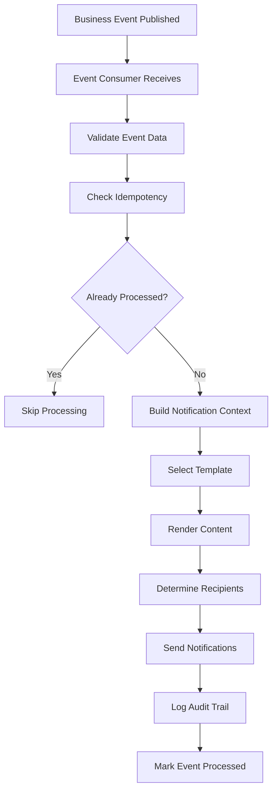

# Event Processing Architecture

## Overview
The event processing architecture transforms business events into multi-channel notifications using MassTransit consumers, template rendering, and personalization services. This builds upon the existing MassTransit infrastructure while adding comprehensive business event processing capabilities.

## Current MassTransit Infrastructure

### Existing Setup (To Be Enhanced)
```csharp
// Current MassTransit configuration to build upon
services.AddMassTransit(x =>
{
    x.AddConsumer<LoanApplicationCreatedConsumer>(); // Existing stub to complete

    x.UsingRabbitMQ((context, cfg) =>
    {
        cfg.Host("localhost", "/", h =>
        {
            h.Username("guest");
            h.Password("guest");
        });

        cfg.ConfigureEndpoints(context);
    });
});
```

### Enhancement Strategy
- **Complete Existing Consumers**: Transform stub implementations into full processors
- **Add New Consumers**: Implement additional business event consumers
- **Event-to-Notification Flow**: End-to-end processing with audit trail
- **Idempotency Handling**: Prevent duplicate notification processing

## Business Event Processing Pattern

### Core Processing Flow


### Base Consumer Pattern
```csharp
public abstract class BaseNotificationConsumer<TEvent> : IConsumer<TEvent>
    where TEvent : class, IBusinessEvent
{
    protected readonly INotificationRepository _notificationRepository;
    protected readonly ITemplateRenderingEngine _templateEngine;
    protected readonly IPersonalizationService _personalizationService;
    protected readonly INotificationRoutingService _routingService;
    protected readonly ILogger<BaseNotificationConsumer<TEvent>> _logger;

    protected BaseNotificationConsumer(
        INotificationRepository notificationRepository,
        ITemplateRenderingEngine templateEngine,
        IPersonalizationService personalizationService,
        INotificationRoutingService routingService,
        ILogger<BaseNotificationConsumer<TEvent>> logger)
    {
        _notificationRepository = notificationRepository;
        _templateEngine = templateEngine;
        _personalizationService = personalizationService;
        _routingService = routingService;
        _logger = logger;
    }

    public async Task Consume(ConsumeContext<TEvent> context)
    {
        var eventData = context.Message;

        try
        {
            // Check idempotency
            if (await _notificationRepository.IsEventProcessedAsync(eventData.EventId))
            {
                _logger.LogInformation("Event {EventId} already processed, skipping", eventData.EventId);
                return;
            }

            // Process the event
            await ProcessEventAsync(eventData, context);

            // Mark as processed
            await _notificationRepository.MarkEventProcessedAsync(
                eventData.EventId,
                typeof(TEvent).Name,
                success: true);
        }
        catch (Exception ex)
        {
            _logger.LogError(ex, "Failed to process event {EventId} of type {EventType}",
                eventData.EventId, typeof(TEvent).Name);

            // Mark as failed
            await _notificationRepository.MarkEventProcessedAsync(
                eventData.EventId,
                typeof(TEvent).Name,
                success: false,
                error: ex.Message);

            throw; // Re-throw to trigger MassTransit retry logic
        }
    }

    protected abstract Task ProcessEventAsync(TEvent eventData, ConsumeContext<TEvent> context);

    protected async Task<List<NotificationRequest>> BuildNotificationRequestsAsync(
        TEvent eventData,
        string templateCategory)
    {
        var requests = new List<NotificationRequest>();

        // Get notification routing rules for this event type
        var routingRules = await _routingService.GetRoutingRulesAsync(
            typeof(TEvent).Name,
            templateCategory);

        foreach (var rule in routingRules)
        {
            var context = await _personalizationService.BuildContextAsync(
                rule.RecipientId,
                typeof(TEvent).Name,
                eventData);

            var request = new NotificationRequest
            {
                EventId = eventData.EventId,
                RecipientId = rule.RecipientId,
                RecipientType = rule.RecipientType,
                Channel = rule.Channel,
                TemplateCategory = templateCategory,
                Priority = rule.Priority,
                PersonalizationContext = context
            };

            requests.Add(request);
        }

        return requests;
    }
}
```

## Event Consumer Implementations

### LoanApplicationCreated Consumer (Enhancement)
```csharp
public class LoanApplicationCreatedConsumer : BaseNotificationConsumer<LoanApplicationCreated>
{
    private readonly ICustomerService _customerService;
    private readonly ILoanOfficerService _loanOfficerService;

    public LoanApplicationCreatedConsumer(
        INotificationRepository notificationRepository,
        ITemplateRenderingEngine templateEngine,
        IPersonalizationService personalizationService,
        INotificationRoutingService routingService,
        ICustomerService customerService,
        ILoanOfficerService loanOfficerService,
        ILogger<LoanApplicationCreatedConsumer> logger)
        : base(notificationRepository, templateEngine, personalizationService, routingService, logger)
    {
        _customerService = customerService;
        _loanOfficerService = loanOfficerService;
    }

    protected override async Task ProcessEventAsync(
        LoanApplicationCreated eventData,
        ConsumeContext<LoanApplicationCreated> context)
    {
        _logger.LogInformation("Processing loan application created event {EventId} for application {ApplicationId}",
            eventData.EventId, eventData.ApplicationId);

        // Build notification requests
        var notificationRequests = new List<NotificationRequest>();

        // Customer notification
        var customerContext = await _personalizationService.BuildContextAsync(
            eventData.CustomerId,
            "LoanApplicationCreated",
            eventData);

        notificationRequests.Add(new NotificationRequest
        {
            EventId = eventData.EventId,
            RecipientId = eventData.CustomerId,
            RecipientType = "Customer",
            Channel = "SMS",
            TemplateCategory = "LoanOrigination",
            TemplateName = "application-received-customer",
            Priority = NotificationPriority.Normal,
            PersonalizationContext = customerContext
        });

        // Loan officer notification
        var loanOfficer = await _loanOfficerService.GetAssignedOfficerAsync(eventData.BranchId);
        if (loanOfficer != null)
        {
            var officerContext = await _personalizationService.BuildContextAsync(
                loanOfficer.Id,
                "LoanApplicationCreated",
                eventData);

            notificationRequests.Add(new NotificationRequest
            {
                EventId = eventData.EventId,
                RecipientId = loanOfficer.Id,
                RecipientType = "LoanOfficer",
                Channel = "InApp",
                TemplateCategory = "LoanOrigination",
                TemplateName = "application-received-officer",
                Priority = GetPriorityForAmount(eventData.RequestedAmount),
                PersonalizationContext = officerContext
            });
        }

        // Branch manager notification for high-value applications
        if (eventData.RequestedAmount > 100000) // K100,000 threshold
        {
            var branchManager = await _loanOfficerService.GetBranchManagerAsync(eventData.BranchId);
            if (branchManager != null)
            {
                var managerContext = await _personalizationService.BuildContextAsync(
                    branchManager.Id,
                    "LoanApplicationCreated",
                    eventData);

                notificationRequests.Add(new NotificationRequest
                {
                    EventId = eventData.EventId,
                    RecipientId = branchManager.Id,
                    RecipientType = "BranchManager",
                    Channel = "InApp",
                    TemplateCategory = "LoanOrigination",
                    TemplateName = "high-value-application",
                    Priority = NotificationPriority.High,
                    PersonalizationContext = managerContext
                });
            }
        }

        // Send all notifications
        await SendNotificationsAsync(notificationRequests);
    }

    private NotificationPriority GetPriorityForAmount(decimal amount)
    {
        return amount switch
        {
            > 500000 => NotificationPriority.Critical,
            > 100000 => NotificationPriority.High,
            > 50000 => NotificationPriority.Normal,
            _ => NotificationPriority.Low
        };
    }
}
```

### LoanApproved Consumer (New Implementation)
```csharp
public class LoanApprovedConsumer : BaseNotificationConsumer<LoanApproved>
{
    public LoanApprovedConsumer(
        INotificationRepository notificationRepository,
        ITemplateRenderingEngine templateEngine,
        IPersonalizationService personalizationService,
        INotificationRoutingService routingService,
        ILogger<LoanApprovedConsumer> logger)
        : base(notificationRepository, templateEngine, personalizationService, routingService, logger)
    {
    }

    protected override async Task ProcessEventAsync(
        LoanApproved eventData,
        ConsumeContext<LoanApproved> context)
    {
        _logger.LogInformation("Processing loan approved event {EventId} for loan {LoanId}",
            eventData.EventId, eventData.LoanId);

        var notificationRequests = new List<NotificationRequest>();

        // Customer SMS notification
        var customerContext = await _personalizationService.BuildContextAsync(
            eventData.CustomerId,
            "LoanApproved",
            eventData);

        notificationRequests.Add(new NotificationRequest
        {
            EventId = eventData.EventId,
            RecipientId = eventData.CustomerId,
            RecipientType = "Customer",
            Channel = "SMS",
            TemplateCategory = "LoanOrigination",
            TemplateName = "loan-approved-sms",
            Priority = NotificationPriority.High,
            PersonalizationContext = customerContext
        });

        // Customer email notification (if email available)
        if (!string.IsNullOrEmpty(eventData.CustomerEmail))
        {
            notificationRequests.Add(new NotificationRequest
            {
                EventId = eventData.EventId,
                RecipientId = eventData.CustomerId,
                RecipientType = "Customer",
                Channel = "Email",
                TemplateCategory = "LoanOrigination",
                TemplateName = "loan-approved-email",
                Priority = NotificationPriority.High,
                PersonalizationContext = customerContext
            });
        }

        // Loan officer notification
        var officerContext = await _personalizationService.BuildContextAsync(
            eventData.ApprovedBy,
            "LoanApproved",
            eventData);

        notificationRequests.Add(new NotificationRequest
        {
            EventId = eventData.EventId,
            RecipientId = eventData.ApprovedBy,
            RecipientType = "LoanOfficer",
            Channel = "InApp",
            TemplateCategory = "LoanOrigination",
            TemplateName = "loan-approved-officer",
            Priority = NotificationPriority.Normal,
            PersonalizationContext = officerContext
        });

        await SendNotificationsAsync(notificationRequests);
    }
}
```

### PaymentOverdue Consumer (New Implementation)
```csharp
public class PaymentOverdueConsumer : BaseNotificationConsumer<PaymentOverdue>
{
    private readonly ICollectionsService _collectionsService;

    public PaymentOverdueConsumer(
        INotificationRepository notificationRepository,
        ITemplateRenderingEngine templateEngine,
        IPersonalizationService personalizationService,
        INotificationRoutingService routingService,
        ICollectionsService collectionsService,
        ILogger<PaymentOverdueConsumer> logger)
        : base(notificationRepository, templateEngine, personalizationService, routingService, logger)
    {
        _collectionsService = collectionsService;
    }

    protected override async Task ProcessEventAsync(
        PaymentOverdue eventData,
        ConsumeContext<PaymentOverdue> context)
    {
        _logger.LogInformation("Processing payment overdue event {EventId} for loan {LoanId}, DPD: {DPD}",
            eventData.EventId, eventData.LoanId, eventData.DaysPastDue);

        var notificationRequests = new List<NotificationRequest>();

        // Customer notification with escalating tone based on DPD
        var templateName = GetOverdueTemplateName(eventData.DaysPastDue);
        var priority = GetOverduePriority(eventData.DaysPastDue);

        var customerContext = await _personalizationService.BuildContextAsync(
            eventData.CustomerId,
            "PaymentOverdue",
            eventData);

        notificationRequests.Add(new NotificationRequest
        {
            EventId = eventData.EventId,
            RecipientId = eventData.CustomerId,
            RecipientType = "Customer",
            Channel = "SMS",
            TemplateCategory = "Collections",
            TemplateName = templateName,
            Priority = priority,
            PersonalizationContext = customerContext
        });

        // Collections officer notification for significant overdue amounts
        if (eventData.DaysPastDue >= 7 || eventData.OverdueAmount > 10000)
        {
            var collectionsOfficer = await _collectionsService.GetAssignedOfficerAsync(eventData.LoanId);
            if (collectionsOfficer != null)
            {
                var officerContext = await _personalizationService.BuildContextAsync(
                    collectionsOfficer.Id,
                    "PaymentOverdue",
                    eventData);

                notificationRequests.Add(new NotificationRequest
                {
                    EventId = eventData.EventId,
                    RecipientId = collectionsOfficer.Id,
                    RecipientType = "CollectionsOfficer",
                    Channel = "InApp",
                    TemplateCategory = "Collections",
                    TemplateName = "overdue-collections-alert",
                    Priority = priority,
                    PersonalizationContext = officerContext
                });
            }
        }

        await SendNotificationsAsync(notificationRequests);
    }

    private string GetOverdueTemplateName(int daysPastDue)
    {
        return daysPastDue switch
        {
            1 => "payment-overdue-gentle",
            <= 7 => "payment-overdue-reminder",
            <= 30 => "payment-overdue-urgent",
            <= 60 => "payment-overdue-final-notice",
            _ => "payment-overdue-serious-delinquency"
        };
    }

    private NotificationPriority GetOverduePriority(int daysPastDue)
    {
        return daysPastDue switch
        {
            1 => NotificationPriority.Low,
            <= 7 => NotificationPriority.Normal,
            <= 30 => NotificationPriority.High,
            _ => NotificationPriority.Critical
        };
    }
}
```

## Notification Processing Service

### INotificationProcessingService
```csharp
public interface INotificationProcessingService
{
    Task SendNotificationsAsync(List<NotificationRequest> requests, CancellationToken cancellationToken = default);
    Task SendNotificationAsync(NotificationRequest request, CancellationToken cancellationToken = default);
    Task RetryFailedNotificationsAsync(CancellationToken cancellationToken = default);
}

public class NotificationProcessingService : INotificationProcessingService
{
    private readonly ITemplateRenderingEngine _templateEngine;
    private readonly ISmsService _smsService;
    private readonly IEmailService _emailService;
    private readonly IInAppNotificationService _inAppService;
    private readonly INotificationRepository _repository;
    private readonly ILogger<NotificationProcessingService> _logger;

    public async Task SendNotificationAsync(NotificationRequest request, CancellationToken cancellationToken = default)
    {
        // Create notification log entry
        var notificationLog = new NotificationLog
        {
            EventId = request.EventId,
            RecipientId = request.RecipientId,
            RecipientType = request.RecipientType,
            Channel = request.Channel,
            Status = NotificationStatus.Pending,
            BranchId = GetBranchId(request),
            CreatedBy = "System"
        };

        try
        {
            // Render content using template
            var content = await _templateEngine.RenderAsync(
                request.TemplateName ?? request.TemplateCategory,
                request.PersonalizationContext);

            notificationLog.Content = content;
            notificationLog.PersonalizationData = JsonSerializer.Serialize(request.PersonalizationContext);

            // Save initial log entry
            await _repository.CreateAsync(notificationLog, cancellationToken);

            // Send via appropriate channel
            var success = await SendViaChannelAsync(request.Channel, content, request, cancellationToken);

            // Update status
            var status = success ? NotificationStatus.Sent : NotificationStatus.Failed;
            await _repository.UpdateStatusAsync(notificationLog.Id, status, cancellationToken: cancellationToken);
        }
        catch (Exception ex)
        {
            _logger.LogError(ex, "Failed to send notification for event {EventId}", request.EventId);

            await _repository.UpdateStatusAsync(
                notificationLog.Id,
                NotificationStatus.Failed,
                failureReason: ex.Message,
                cancellationToken: cancellationToken);

            throw;
        }
    }

    private async Task<bool> SendViaChannelAsync(string channel, string content, NotificationRequest request, CancellationToken cancellationToken)
    {
        return channel.ToUpper() switch
        {
            "SMS" => await SendSmsAsync(content, request, cancellationToken),
            "EMAIL" => await SendEmailAsync(content, request, cancellationToken),
            "INAPP" => await SendInAppAsync(content, request, cancellationToken),
            _ => throw new ArgumentException($"Unknown notification channel: {channel}")
        };
    }

    private async Task<bool> SendSmsAsync(string content, NotificationRequest request, CancellationToken cancellationToken)
    {
        var smsRequest = new SmsRequest
        {
            To = await GetRecipientPhoneAsync(request.RecipientId),
            Message = content,
            Metadata = new Dictionary<string, object>
            {
                ["EventId"] = request.EventId,
                ["RecipientType"] = request.RecipientType,
                ["Priority"] = request.Priority.ToString()
            }
        };

        var result = await _smsService.SendAsync(smsRequest);
        return result.Success;
    }
}
```

## Event Model Definitions

### Base Event Interface
```csharp
public interface IBusinessEvent
{
    Guid EventId { get; }
    DateTime EventTimestamp { get; }
    string EventType { get; }
    string SourceService { get; }
}
```

### Loan-Related Events
```csharp
public record LoanApplicationCreated : IBusinessEvent
{
    public Guid EventId { get; init; }
    public DateTime EventTimestamp { get; init; }
    public string EventType => "LoanApplicationCreated";
    public string SourceService => "LoanOrigination";

    public string ApplicationId { get; init; } = string.Empty;
    public string CustomerId { get; init; } = string.Empty;
    public decimal RequestedAmount { get; init; }
    public string ProductType { get; init; } = string.Empty;
    public int BranchId { get; init; }
    public string CustomerName { get; init; } = string.Empty;
    public string CustomerPhone { get; init; } = string.Empty;
    public string? CustomerEmail { get; init; }
}

public record LoanApproved : IBusinessEvent
{
    public Guid EventId { get; init; }
    public DateTime EventTimestamp { get; init; }
    public string EventType => "LoanApproved";
    public string SourceService => "LoanOrigination";

    public string LoanId { get; init; } = string.Empty;
    public string CustomerId { get; init; } = string.Empty;
    public decimal ApprovedAmount { get; init; }
    public string ApprovedBy { get; init; } = string.Empty;
    public DateTime ApprovalDate { get; init; }
    public string CustomerName { get; init; } = string.Empty;
    public string CustomerPhone { get; init; } = string.Empty;
    public string? CustomerEmail { get; init; }
    public int BranchId { get; init; }
}

public record PaymentOverdue : IBusinessEvent
{
    public Guid EventId { get; init; }
    public DateTime EventTimestamp { get; init; }
    public string EventType => "PaymentOverdue";
    public string SourceService => "Collections";

    public string LoanId { get; init; } = string.Empty;
    public string CustomerId { get; init; } = string.Empty;
    public int DaysPastDue { get; init; }
    public decimal OverdueAmount { get; init; }
    public decimal TotalArrears { get; init; }
    public DateTime DueDate { get; init; }
    public string CustomerName { get; init; } = string.Empty;
    public string CustomerPhone { get; init; } = string.Empty;
}
```

## Configuration and Registration

### Service Registration
```csharp
public static class ServiceCollectionExtensions
{
    public static IServiceCollection AddEventProcessing(this IServiceCollection services, IConfiguration configuration)
    {
        // Register consumers
        services.AddScoped<LoanApplicationCreatedConsumer>();
        services.AddScoped<LoanApprovedConsumer>();
        services.AddScoped<LoanDeclinedConsumer>();
        services.AddScoped<LoanDisbursedConsumer>();
        services.AddScoped<PaymentOverdueConsumer>();
        services.AddScoped<PaymentReceivedConsumer>();

        // Register processing services
        services.AddScoped<INotificationProcessingService, NotificationProcessingService>();
        services.AddScoped<INotificationRoutingService, NotificationRoutingService>();

        // Configure MassTransit
        services.AddMassTransit(x =>
        {
            x.AddConsumer<LoanApplicationCreatedConsumer>();
            x.AddConsumer<LoanApprovedConsumer>();
            x.AddConsumer<LoanDeclinedConsumer>();
            x.AddConsumer<LoanDisbursedConsumer>();
            x.AddConsumer<PaymentOverdueConsumer>();
            x.AddConsumer<PaymentReceivedConsumer>();

            x.UsingRabbitMq((context, cfg) =>
            {
                cfg.Host(configuration.GetConnectionString("RabbitMQ"));
                cfg.ConfigureEndpoints(context);

                // Configure retry policy
                cfg.UseRetry(r => r.Interval(3, TimeSpan.FromSeconds(5)));

                // Configure error handling
                cfg.UseInMemoryOutbox();
            });
        });

        return services;
    }
}
```

This event processing architecture provides a robust foundation for transforming business events into personalized, multi-channel notifications while maintaining idempotency and comprehensive audit trails.