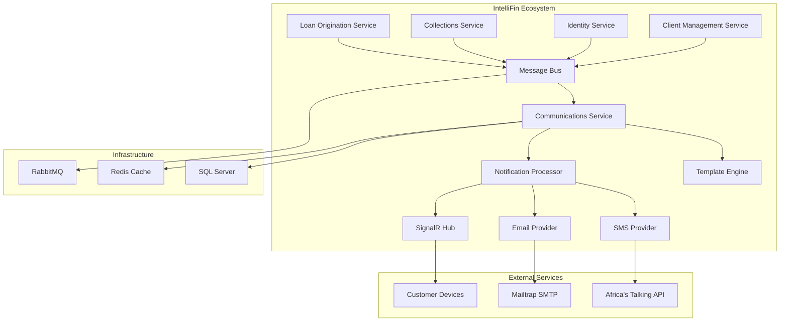

# Integration Patterns

## Overview
The integration patterns document defines how the enhanced Communications service integrates with existing IntelliFin microservices, external providers, and infrastructure components while maintaining loose coupling and high availability.

## Service Integration Architecture

### Microservice Communication Patterns


### Event-Driven Communication Pattern
```csharp
// Event publishing from source services
public class LoanOriginationService
{
    private readonly IMessageBus _messageBus;

    public async Task ProcessLoanApplicationAsync(LoanApplication application)
    {
        // Business logic processing
        await ProcessApplication(application);

        // Publish domain event
        var domainEvent = new LoanApplicationCreated
        {
            EventId = Guid.NewGuid(),
            EventTimestamp = DateTime.UtcNow,
            ApplicationId = application.Id,
            CustomerId = application.CustomerId,
            RequestedAmount = application.RequestedAmount,
            ProductType = application.ProductType,
            BranchId = application.BranchId,
            CustomerName = application.Customer.FullName,
            CustomerPhone = application.Customer.PhoneNumber,
            CustomerEmail = application.Customer.Email
        };

        await _messageBus.PublishAsync(domainEvent);
    }
}

// Event consumption in Communications service
[Consumer]
public class LoanApplicationCreatedConsumer : IConsumer<LoanApplicationCreated>
{
    public async Task Consume(ConsumeContext<LoanApplicationCreated> context)
    {
        var eventData = context.Message;

        // Build notification requests
        var notifications = await BuildNotificationRequestsAsync(eventData);

        // Process notifications
        await ProcessNotificationsAsync(notifications);
    }
}
```

## Database Integration Patterns

### Repository Pattern with Unit of Work
```csharp
public interface IUnitOfWork : IDisposable
{
    INotificationRepository Notifications { get; }
    ITemplateRepository Templates { get; }
    IUserPreferencesRepository UserPreferences { get; }
    IEventProcessingRepository EventProcessing { get; }

    Task<int> SaveChangesAsync(CancellationToken cancellationToken = default);
    Task BeginTransactionAsync(CancellationToken cancellationToken = default);
    Task CommitTransactionAsync(CancellationToken cancellationToken = default);
    Task RollbackTransactionAsync(CancellationToken cancellationToken = default);
}

public class UnitOfWork : IUnitOfWork
{
    private readonly LmsDbContext _context;
    private IDbContextTransaction? _transaction;

    public UnitOfWork(LmsDbContext context)
    {
        _context = context;
        Notifications = new NotificationRepository(_context);
        Templates = new TemplateRepository(_context);
        UserPreferences = new UserPreferencesRepository(_context);
        EventProcessing = new EventProcessingRepository(_context);
    }

    public INotificationRepository Notifications { get; }
    public ITemplateRepository Templates { get; }
    public IUserPreferencesRepository UserPreferences { get; }
    public IEventProcessingRepository EventProcessing { get; }

    public async Task<int> SaveChangesAsync(CancellationToken cancellationToken = default)
    {
        try
        {
            return await _context.SaveChangesAsync(cancellationToken);
        }
        catch (DbUpdateConcurrencyException ex)
        {
            // Handle optimistic concurrency conflicts
            throw new ConcurrencyException("Data was modified by another process", ex);
        }
    }
}
```

### CQRS Pattern Implementation
```csharp
// Command side - Write operations
public class SendNotificationCommand : IRequest<SendNotificationResult>
{
    public Guid EventId { get; set; }
    public string RecipientId { get; set; } = string.Empty;
    public string Channel { get; set; } = string.Empty;
    public string TemplateCategory { get; set; } = string.Empty;
    public object PersonalizationContext { get; set; } = new();
}

public class SendNotificationCommandHandler : IRequestHandler<SendNotificationCommand, SendNotificationResult>
{
    private readonly IUnitOfWork _unitOfWork;
    private readonly INotificationProcessingService _processingService;

    public async Task<SendNotificationResult> Handle(SendNotificationCommand request, CancellationToken cancellationToken)
    {
        // Create notification log
        var notification = new NotificationLog
        {
            EventId = request.EventId,
            RecipientId = request.RecipientId,
            Channel = request.Channel,
            Status = NotificationStatus.Pending,
            CreatedAt = DateTimeOffset.UtcNow
        };

        await _unitOfWork.Notifications.CreateAsync(notification, cancellationToken);
        await _unitOfWork.SaveChangesAsync(cancellationToken);

        // Process notification asynchronously
        _ = Task.Run(async () =>
        {
            await _processingService.ProcessNotificationAsync(notification.Id);
        }, cancellationToken);

        return new SendNotificationResult { NotificationId = notification.Id, Success = true };
    }
}

// Query side - Read operations
public class GetNotificationHistoryQuery : IRequest<List<NotificationHistoryDto>>
{
    public string RecipientId { get; set; } = string.Empty;
    public string? Channel { get; set; }
    public DateTime? FromDate { get; set; }
    public DateTime? ToDate { get; set; }
    public int Page { get; set; } = 1;
    public int PageSize { get; set; } = 20;
}

public class GetNotificationHistoryQueryHandler : IRequestHandler<GetNotificationHistoryQuery, List<NotificationHistoryDto>>
{
    private readonly IReadOnlyDbContext _readContext;

    public async Task<List<NotificationHistoryDto>> Handle(GetNotificationHistoryQuery request, CancellationToken cancellationToken)
    {
        var query = _readContext.NotificationLogs
            .Where(n => n.RecipientId == request.RecipientId);

        if (!string.IsNullOrEmpty(request.Channel))
            query = query.Where(n => n.Channel == request.Channel);

        if (request.FromDate.HasValue)
            query = query.Where(n => n.CreatedAt >= request.FromDate);

        if (request.ToDate.HasValue)
            query = query.Where(n => n.CreatedAt <= request.ToDate);

        return await query
            .OrderByDescending(n => n.CreatedAt)
            .Skip((request.Page - 1) * request.PageSize)
            .Take(request.PageSize)
            .Select(n => new NotificationHistoryDto
            {
                Id = n.Id,
                Channel = n.Channel,
                Content = n.Content,
                Status = n.Status.ToString(),
                CreatedAt = n.CreatedAt,
                DeliveredAt = n.DeliveredAt
            })
            .ToListAsync(cancellationToken);
    }
}
```

## Caching Integration Patterns

### Multi-Level Caching Strategy
```csharp
public interface ICacheService
{
    Task<T?> GetAsync<T>(string key, CancellationToken cancellationToken = default);
    Task SetAsync<T>(string key, T value, TimeSpan? expiry = null, CancellationToken cancellationToken = default);
    Task RemoveAsync(string key, CancellationToken cancellationToken = default);
    Task RemoveByPatternAsync(string pattern, CancellationToken cancellationToken = default);
}

public class HybridCacheService : ICacheService
{
    private readonly IMemoryCache _memoryCache;
    private readonly IDistributedCache _distributedCache;
    private readonly ILogger<HybridCacheService> _logger;

    public async Task<T?> GetAsync<T>(string key, CancellationToken cancellationToken = default)
    {
        // Try L1 cache (memory) first
        if (_memoryCache.TryGetValue(key, out T? cachedValue))
        {
            return cachedValue;
        }

        // Try L2 cache (Redis)
        try
        {
            var distributedValue = await _distributedCache.GetStringAsync(key, cancellationToken);
            if (distributedValue != null)
            {
                var deserializedValue = JsonSerializer.Deserialize<T>(distributedValue);

                // Populate L1 cache
                _memoryCache.Set(key, deserializedValue, TimeSpan.FromMinutes(5));

                return deserializedValue;
            }
        }
        catch (Exception ex)
        {
            _logger.LogWarning(ex, "Failed to retrieve from distributed cache: {Key}", key);
        }

        return default;
    }

    public async Task SetAsync<T>(string key, T value, TimeSpan? expiry = null, CancellationToken cancellationToken = default)
    {
        var effectiveExpiry = expiry ?? TimeSpan.FromHours(1);

        // Set in L1 cache (shorter expiry)
        _memoryCache.Set(key, value, TimeSpan.FromMinutes(Math.Min(effectiveExpiry.TotalMinutes, 10)));

        // Set in L2 cache
        try
        {
            var serializedValue = JsonSerializer.Serialize(value);
            var options = new DistributedCacheEntryOptions
            {
                AbsoluteExpirationRelativeToNow = effectiveExpiry
            };

            await _distributedCache.SetStringAsync(key, serializedValue, options, cancellationToken);
        }
        catch (Exception ex)
        {
            _logger.LogWarning(ex, "Failed to set distributed cache: {Key}", key);
        }
    }
}

// Template caching with cache-aside pattern
public class CachedTemplateRepository : ITemplateRepository
{
    private readonly ITemplateRepository _baseRepository;
    private readonly ICacheService _cache;

    public async Task<NotificationTemplate?> GetByIdAsync(int id, CancellationToken cancellationToken = default)
    {
        var cacheKey = $"template:{id}";

        // Try cache first
        var cached = await _cache.GetAsync<NotificationTemplate>(cacheKey, cancellationToken);
        if (cached != null)
        {
            return cached;
        }

        // Load from database
        var template = await _baseRepository.GetByIdAsync(id, cancellationToken);
        if (template != null)
        {
            // Cache for 1 hour
            await _cache.SetAsync(cacheKey, template, TimeSpan.FromHours(1), cancellationToken);
        }

        return template;
    }

    public async Task<NotificationTemplate> CreateAsync(NotificationTemplate template, CancellationToken cancellationToken = default)
    {
        var created = await _baseRepository.CreateAsync(template, cancellationToken);

        // Cache the new template
        var cacheKey = $"template:{created.Id}";
        await _cache.SetAsync(cacheKey, created, TimeSpan.FromHours(1), cancellationToken);

        // Invalidate related caches
        await _cache.RemoveByPatternAsync($"template:category:{created.Category}*", cancellationToken);

        return created;
    }
}
```

## External Service Integration Patterns

### Circuit Breaker Pattern for External APIs
```csharp
public class ResilientSmsProvider : ISmsProvider
{
    private readonly ISmsProvider _innerProvider;
    private readonly ICircuitBreakerPolicy _circuitBreaker;
    private readonly IRetryPolicy _retryPolicy;
    private readonly ILogger<ResilientSmsProvider> _logger;

    public ResilientSmsProvider(
        ISmsProvider innerProvider,
        ICircuitBreakerPolicy circuitBreaker,
        IRetryPolicy retryPolicy,
        ILogger<ResilientSmsProvider> logger)
    {
        _innerProvider = innerProvider;
        _circuitBreaker = circuitBreaker;
        _retryPolicy = retryPolicy;
        _logger = logger;
    }

    public async Task<SmsResult> SendAsync(SmsRequest request, CancellationToken cancellationToken = default)
    {
        try
        {
            var result = await _circuitBreaker.ExecuteAsync(async () =>
            {
                return await _retryPolicy.ExecuteAsync(async () =>
                {
                    return await _innerProvider.SendAsync(request, cancellationToken);
                });
            });

            return result;
        }
        catch (CircuitBreakerOpenException)
        {
            _logger.LogWarning("SMS provider circuit breaker is open, failing fast");

            return new SmsResult
            {
                Success = false,
                ErrorMessage = "SMS service temporarily unavailable"
            };
        }
        catch (Exception ex)
        {
            _logger.LogError(ex, "Failed to send SMS after all retry attempts");

            return new SmsResult
            {
                Success = false,
                ErrorMessage = ex.Message
            };
        }
    }
}

// Circuit breaker configuration
public static class ResilienceConfiguration
{
    public static IServiceCollection AddResiliencePolicies(this IServiceCollection services)
    {
        services.AddSingleton<ICircuitBreakerPolicy>(provider =>
        {
            return Policy
                .Handle<HttpRequestException>()
                .Or<TaskCanceledException>()
                .CircuitBreakerAsync(
                    handledEventsAllowedBeforeBreaking: 5,
                    durationOfBreak: TimeSpan.FromSeconds(30),
                    onBreak: (exception, duration) =>
                    {
                        var logger = provider.GetService<ILogger<ResilienceConfiguration>>();
                        logger?.LogWarning("Circuit breaker opened for {Duration} due to {Exception}", duration, exception.Message);
                    },
                    onReset: () =>
                    {
                        var logger = provider.GetService<ILogger<ResilienceConfiguration>>();
                        logger?.LogInformation("Circuit breaker reset");
                    });
        });

        services.AddSingleton<IRetryPolicy>(provider =>
        {
            return Policy
                .Handle<HttpRequestException>()
                .Or<TaskCanceledException>()
                .WaitAndRetryAsync(
                    retryCount: 3,
                    sleepDurationProvider: retryAttempt => TimeSpan.FromSeconds(Math.Pow(2, retryAttempt)),
                    onRetry: (outcome, timespan, retryCount, context) =>
                    {
                        var logger = provider.GetService<ILogger<ResilienceConfiguration>>();
                        logger?.LogInformation("Retry attempt {RetryCount} in {Delay}ms", retryCount, timespan.TotalMilliseconds);
                    });
        });

        return services;
    }
}
```

### Adapter Pattern for Provider Abstraction
```csharp
// Common interface for all SMS providers
public interface ISmsProvider
{
    Task<SmsResult> SendAsync(SmsRequest request, CancellationToken cancellationToken = default);
    Task<SmsStatusResult> GetStatusAsync(string messageId, CancellationToken cancellationToken = default);
    Task<List<SmsResult>> SendBulkAsync(List<SmsRequest> requests, CancellationToken cancellationToken = default);
}

// Africa's Talking adapter
public class AfricasTalkingAdapter : ISmsProvider
{
    private readonly HttpClient _httpClient;
    private readonly AfricasTalkingConfig _config;

    public async Task<SmsResult> SendAsync(SmsRequest request, CancellationToken cancellationToken = default)
    {
        var africasTalkingRequest = new AfricasTalkingSendRequest
        {
            Username = _config.Username,
            To = request.To,
            Message = request.Message,
            From = _config.SenderId
        };

        var response = await _httpClient.PostAsJsonAsync("/messaging", africasTalkingRequest, cancellationToken);
        var africasTalkingResponse = await response.Content.ReadFromJsonAsync<AfricasTalkingSendResponse>(cancellationToken);

        // Adapt Africa's Talking response to common format
        return AdaptResponse(africasTalkingResponse);
    }

    private SmsResult AdaptResponse(AfricasTalkingSendResponse response)
    {
        var recipient = response.SMSMessageData.Recipients.FirstOrDefault();
        if (recipient == null)
        {
            return new SmsResult { Success = false, ErrorMessage = "No recipient data received" };
        }

        return new SmsResult
        {
            Success = recipient.StatusCode == 101 || recipient.StatusCode == 102,
            MessageId = recipient.MessageId,
            ErrorMessage = recipient.StatusCode != 101 && recipient.StatusCode != 102 ? recipient.Status : null,
            Cost = decimal.TryParse(recipient.Cost.Replace("ZMW ", ""), out var cost) ? cost : null
        };
    }
}

// Legacy provider adapter
public class LegacyProviderAdapter : ISmsProvider
{
    private readonly ILegacySmsService _legacyService;

    public async Task<SmsResult> SendAsync(SmsRequest request, CancellationToken cancellationToken = default)
    {
        var legacyRequest = new LegacySmsRequest
        {
            PhoneNumber = request.To,
            MessageText = request.Message,
            Sender = request.From ?? "IntelliFin"
        };

        var legacyResponse = await _legacyService.SendMessageAsync(legacyRequest);

        // Adapt legacy response to common format
        return new SmsResult
        {
            Success = legacyResponse.IsSuccess,
            MessageId = legacyResponse.TransactionId,
            ErrorMessage = legacyResponse.IsSuccess ? null : legacyResponse.ErrorDescription,
            Cost = legacyResponse.ChargedAmount
        };
    }
}
```

## API Gateway Integration

### API Gateway Configuration
```csharp
public class CommunicationsApiModule : IApiModule
{
    public void ConfigureServices(IServiceCollection services, IConfiguration configuration)
    {
        services.AddScoped<ICommunicationsService, CommunicationsService>();
        services.AddScoped<ITemplateManagementService, TemplateManagementService>();

        // Rate limiting
        services.Configure<IpRateLimitOptions>(configuration.GetSection("IpRateLimit"));
        services.AddInMemoryRateLimiting();

        // CORS
        services.AddCors(options =>
        {
            options.AddPolicy("CommunicationsPolicy", builder =>
            {
                builder.WithOrigins("https://portal.intellifin.com")
                       .AllowAnyMethod()
                       .AllowAnyHeader()
                       .AllowCredentials();
            });
        });
    }

    public void Configure(IApplicationBuilder app, IWebHostEnvironment env)
    {
        app.UseIpRateLimiting();
        app.UseCors("CommunicationsPolicy");

        // API versioning
        app.UseApiVersioning();

        // Request/response logging
        app.UseMiddleware<CommunicationsLoggingMiddleware>();
    }
}

// Custom middleware for communications logging
public class CommunicationsLoggingMiddleware
{
    private readonly RequestDelegate _next;
    private readonly ILogger<CommunicationsLoggingMiddleware> _logger;

    public async Task InvokeAsync(HttpContext context)
    {
        var stopwatch = Stopwatch.StartNew();

        // Log request
        _logger.LogInformation("Communications API request: {Method} {Path} from {UserAgent}",
            context.Request.Method,
            context.Request.Path,
            context.Request.Headers.UserAgent);

        await _next(context);

        stopwatch.Stop();

        // Log response
        _logger.LogInformation("Communications API response: {StatusCode} in {ElapsedMs}ms",
            context.Response.StatusCode,
            stopwatch.ElapsedMilliseconds);

        // Log to metrics
        CommunicationsMetrics.RecordApiCall(
            context.Request.Path,
            context.Request.Method,
            context.Response.StatusCode,
            stopwatch.ElapsedMilliseconds);
    }
}
```

## Message Bus Integration Patterns

### Outbox Pattern Implementation
```csharp
public class OutboxService : IOutboxService
{
    private readonly LmsDbContext _context;
    private readonly IMessageBus _messageBus;

    public async Task PublishDomainEventsAsync(CancellationToken cancellationToken = default)
    {
        var outboxEvents = await _context.OutboxEvents
            .Where(e => !e.Published)
            .OrderBy(e => e.CreatedAt)
            .Take(100)
            .ToListAsync(cancellationToken);

        foreach (var outboxEvent in outboxEvents)
        {
            try
            {
                var domainEvent = JsonSerializer.Deserialize(outboxEvent.EventData, Type.GetType(outboxEvent.EventType));
                await _messageBus.PublishAsync(domainEvent, cancellationToken);

                outboxEvent.Published = true;
                outboxEvent.PublishedAt = DateTimeOffset.UtcNow;
            }
            catch (Exception ex)
            {
                outboxEvent.Error = ex.Message;
                outboxEvent.RetryCount++;
            }
        }

        await _context.SaveChangesAsync(cancellationToken);
    }
}

// Domain event storage
public class OutboxEvent
{
    public int Id { get; set; }
    public Guid EventId { get; set; }
    public string EventType { get; set; } = string.Empty;
    public string EventData { get; set; } = string.Empty;
    public DateTimeOffset CreatedAt { get; set; }
    public bool Published { get; set; }
    public DateTimeOffset? PublishedAt { get; set; }
    public string? Error { get; set; }
    public int RetryCount { get; set; }
}
```

### Saga Pattern for Complex Workflows
```csharp
public class NotificationWorkflowSaga : ISaga<NotificationWorkflowState>
{
    public async Task Consume(ConsumeContext<LoanApplicationCreated> context)
    {
        var state = context.Saga;
        state.ApplicationId = context.Message.ApplicationId;
        state.CustomerId = context.Message.CustomerId;
        state.CurrentStep = WorkflowStep.CustomerNotification;

        // Send customer notification
        await context.Publish(new SendNotificationCommand
        {
            RecipientId = context.Message.CustomerId,
            Channel = "SMS",
            TemplateCategory = "LoanOrigination",
            TemplateName = "application-received"
        });
    }

    public async Task Consume(ConsumeContext<NotificationSent> context)
    {
        var state = context.Saga;

        if (state.CurrentStep == WorkflowStep.CustomerNotification)
        {
            state.CustomerNotificationSent = true;
            state.CurrentStep = WorkflowStep.StaffNotification;

            // Send staff notification
            await context.Publish(new SendStaffNotificationCommand
            {
                ApplicationId = state.ApplicationId,
                NotificationType = "NewApplication"
            });
        }
        else if (state.CurrentStep == WorkflowStep.StaffNotification)
        {
            state.StaffNotificationSent = true;
            state.CurrentStep = WorkflowStep.Completed;
            state.CompletedAt = DateTimeOffset.UtcNow;
        }
    }
}

public class NotificationWorkflowState : SagaStateMachineInstance
{
    public Guid CorrelationId { get; set; }
    public string ApplicationId { get; set; } = string.Empty;
    public string CustomerId { get; set; } = string.Empty;
    public WorkflowStep CurrentStep { get; set; }
    public bool CustomerNotificationSent { get; set; }
    public bool StaffNotificationSent { get; set; }
    public DateTimeOffset? CompletedAt { get; set; }
}
```

This integration patterns document provides comprehensive guidance for implementing robust, maintainable integrations between the Communications service and all other system components.