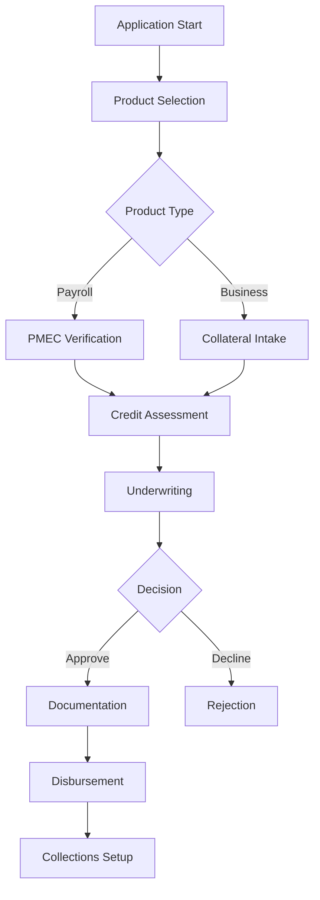
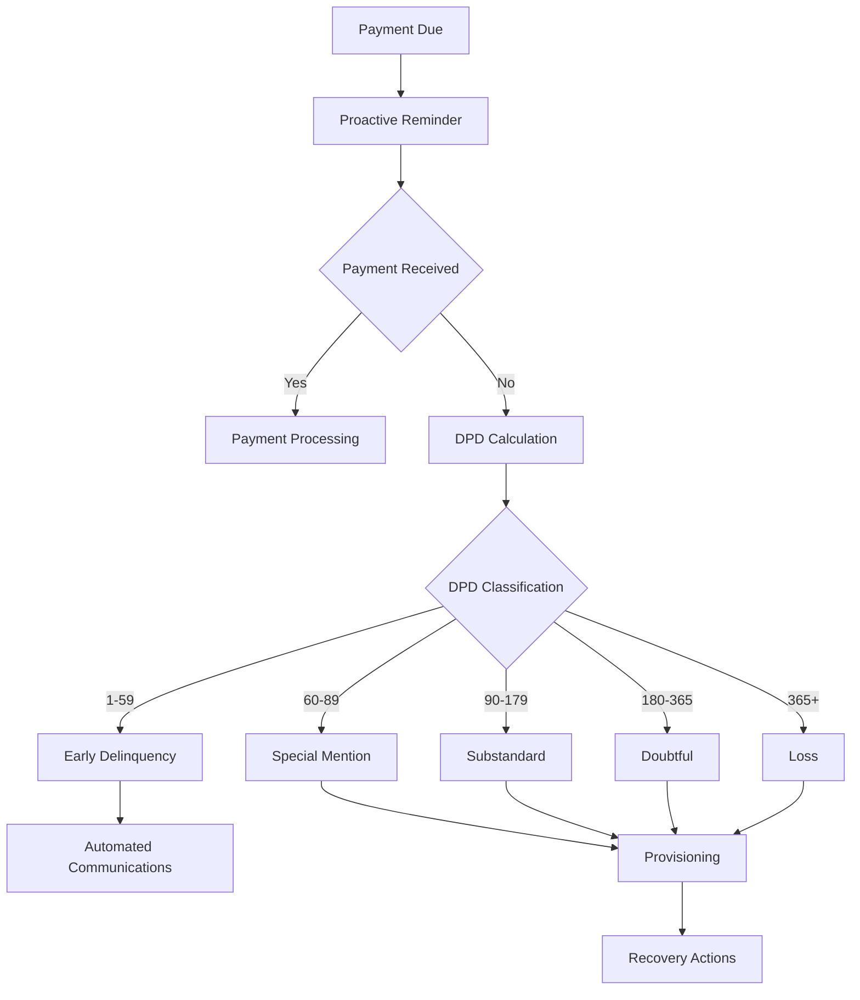
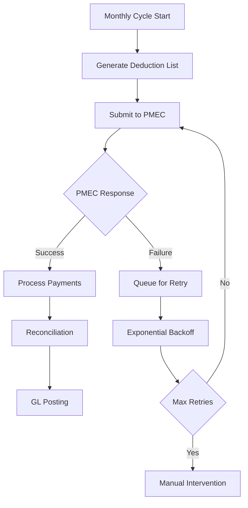
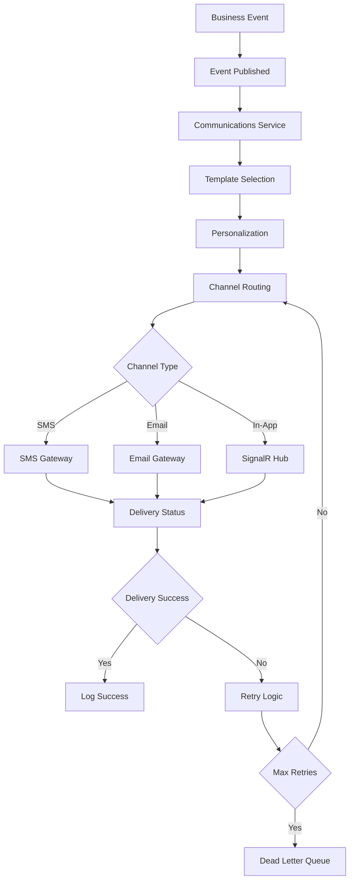

# System Architecture

### Core Microservices Architecture

#### 1. Identity Service
**Purpose:** User authentication, authorization, and session management
**Key Features:**
- JWT-based authentication with refresh tokens
- Step-up authentication for sensitive operations
- Role-based access control (RBAC) with branch context
- Session management with Redis-based token revocation
- Audit logging for all authentication events

**Business Rules Integration:**
- CEO authorization workflows for offline operations
- Branch-specific access controls
- Dual-control authentication for sensitive operations
- Compliance with Zambian Data Protection Act

#### 2. Client Management Service
**Purpose:** Customer profile management, KYC/AML compliance, and document handling
**Key Features:**
- Comprehensive customer profile management
- KYC document validation and storage
- Government employee verification via PMEC
- Document access logging for compliance
- 10-year retention policy enforcement

**Business Rules Integration:**
- BoZ KYC requirements enforcement
- PMEC employee verification workflows
- Document lifecycle management
- Cross-branch customer access with attribution

#### 3. Loan Origination Service
**Purpose:** Multi-product loan application processing and approval workflows
**Key Features:**
- Payroll-based (MOU) loan processing
- Collateral-based business loan processing
- Automated underwriting workflows
- Document management and validation
- Interest rate cap compliance (48% EAR)

**Business Rules Integration:**
- Money Lenders Act compliance (interest rate caps)
- Product-specific workflow orchestration
- Collateral management and valuation
- CEO offline authorization workflows

#### 4. Credit Assessment Service
**Purpose:** Credit bureau integration and risk assessment
**Key Features:**
- TransUnion Zambia API integration
- First-time applicant credit checks only
- Automated credit scoring
- Queue-based processing for reliability
- Cost optimization through intelligent routing

**Business Rules Integration:**
- First-time applicant classification
- Credit bureau cost management
- Automated retry mechanisms
- Audit trail for all credit decisions

#### 5. General Ledger Service
**Purpose:** Double-entry accounting and BoZ compliance
**Key Features:**
- Automated transaction posting
- BoZ-compliant chart of accounts
- Real-time balance calculations
- Automated provisioning calculations
- Regulatory reporting preparation

**Business Rules Integration:**
- Transaction processing rules enforcement
- BoZ prudential guidelines compliance
- Automated loan classification and provisioning
- Non-accrual status management

#### 6. PMEC Anti-Corruption Layer
**Purpose:** Government payroll system integration with resilience
**Key Features:**
- PMEC system integration
- Queue-based processing for downtime resilience
- Automated retry mechanisms
- Data transformation and validation
- Comprehensive audit logging

**Business Rules Integration:**
- Government employee verification
- Payroll deduction processing
- Exception handling and manual overrides
- Compliance with government data requirements

#### 7. Collections Service
**Purpose:** Automated collections lifecycle management
**Key Features:**
- Automated DPD calculation and classification
- BoZ-compliant loan classification
- Automated provisioning calculations
- Communication workflows
- Recovery process management

**Business Rules Integration:**
- BoZ loan classification rules (Current, Special Mention, Substandard, Doubtful, Loss)
- Automated provisioning rates (1%, 25%, 50%, 100%)
- Non-accrual status management
- Collections communication workflows

#### 8. Communications Service
**Purpose:** Centralized notification and communication management
**Key Features:**
- Multi-channel communication (SMS, Email, In-App, Push)
- Template management with personalization
- Event-driven and scheduled communication triggers
- Delivery status tracking and retry logic
- Customer communication preferences management

**Business Rules Integration:**
- Automated payment reminders and overdue notifications
- Loan origination workflow communications
- Collections lifecycle communication automation
- Regulatory compliance communication requirements
- Customer opt-out and preference management

#### 9. Reporting Service
**Purpose:** Regulatory and business reporting
**Key Features:**
- JasperReports Server integration
- BoZ prudential reporting
- Automated report scheduling
- Parameterized report generation
- Audit trail for all reports

**Business Rules Integration:**
- BoZ reporting requirements
- Automated report generation and submission
- Report access controls and audit trails
- Compliance monitoring and alerting

### Workflow Orchestration with Camunda 8

#### Business Process Models

**1. Loan Origination Workflow**


**2. Collections Lifecycle Workflow**


**3. PMEC Integration Workflow**


**4. Communications Workflow**


### Data Architecture

#### Core Data Models

**Client Management:**
```sql
-- Core client information
Client (id, nrc, firstName, lastName, dob, branchId, status, createdAt, updatedAt)
GovernmentEmployment (clientId, pmecNumber, employerId, salary, verifiedAt)
KycDocument (id, clientId, type, objectKey, checksum, retentionAt, createdBy, createdAt)
Address (id, clientId, type, address, city, province, postalCode, isPrimary)
Contact (id, clientId, type, value, isPrimary, verifiedAt)
```

**Loan Origination:**
```sql
-- Loan application and processing
LoanApplication (id, clientId, productType, principal, termMonths, rateAPR, status, createdAt, approvedAt)
LoanProduct (id, name, type, maxAmount, minAmount, maxTerm, minTerm, rateAPR, fees)
CollateralAsset (id, applicationId, type, description, value, insuredUntil, status)
UnderwritingNote (id, applicationId, underwriterId, decision, notes, createdAt)
ApprovalStep (id, applicationId, approverId, level, decision, comments, timestamp)
```

**Credit Assessment:**
```sql
-- Credit bureau integration
CreditReport (id, clientId, score, rawBlobKey, cost, requestedAt, returnedAt, status)
CreditAssessment (id, applicationId, reportId, decision, riskLevel, createdAt)
```

**General Ledger:**
```sql
-- Double-entry accounting
GLAccount (id, code, name, type, parentId, branchId, isActive)
JournalEntry (id, debitAccountId, creditAccountId, amount, currency, valueDate, ref, description, createdAt)
PostingRule (id, eventType, mappingJson, isActive)
```

**Collections:**
```sql
-- Collections lifecycle management
DeductionCycle (id, period, status, createdAt, completedAt)
DeductionItem (id, cycleId, loanId, expected, actual, variance, status)
Payment (id, loanId, amount, method, externalRef, postedAt, reconciledAt)
```

**Communications:**
```sql
-- Notification and communication management
CommunicationsLog (id, eventId, recipientId, recipientType, channel, templateId, content, personalizationData, status, gatewayResponse, createdAt, sentAt, deliveredAt, failureReason, retryCount, maxRetries)
NotificationTemplates (id, name, category, channel, language, subject, content, personalizationTokens, isActive, createdBy, createdAt, updatedBy, updatedAt, version)
InAppNotifications (id, userId, title, message, notificationType, actionUrl, isRead, createdAt, readAt, expiresAt)
CommunicationRouting (id, eventType, recipientType, channel, templateId, priority, isActive, createdAt)
CustomerCommunicationPreferences (id, customerId, preferenceType, enabled, channels, frequency, optOutDate, createdAt, updatedAt)
```

**Audit and Compliance:**
```sql
-- Comprehensive audit trail
AuditEvent (id, actorId, action, entity, entityId, timestamp, ip, detailsJson, branchId)
```

#### Data Storage Strategy

**Primary Database:** SQL Server Always On with primary and read replica
**Audit Database:** Separate database for compliance isolation
**Caching:** Redis for frequently accessed data (client lookups, GL balances)
**Document Storage:** MinIO with comprehensive access logging
**Backup Strategy:** Hourly backups with 1-hour RPO to secondary data center

### API Architecture

#### Internal API Design

**Client Management APIs:**
```http
GET /api/clients?query={search}&branchId={id}&page={n}&pageSize={n}
POST /api/clients
GET /api/clients/{id}
POST /api/clients/{id}/documents
PUT /api/clients/{id}/kyc
```

**Loan Origination APIs:**
```http
POST /api/origination/applications
GET /api/origination/applications/{id}
POST /api/origination/applications/{id}/approve
POST /api/origination/applications/{id}/documents
GET /api/origination/workflows/{instanceId}
```

**Collections APIs:**
```http
POST /api/collections/pemc/cycles
GET /api/collections/exceptions
POST /api/collections/payments
GET /api/collections/reports/dpd
```

**Communications APIs:**
```http
POST /api/communications/send
GET /api/communications/templates
POST /api/communications/templates
PUT /api/communications/templates/{id}
GET /api/communications/logs
GET /api/communications/preferences/{customerId}
PUT /api/communications/preferences/{customerId}
GET /api/communications/notifications
PUT /api/communications/notifications/{id}/read
```

**General Ledger APIs:**
```http
GET /api/gl/accounts/{id}/balance?asOf={date}
POST /api/gl/postings
GET /api/gl/reports/provisioning
GET /api/gl/reports/boz
```

#### External Integration APIs

**PMEC Integration:**
- VerifyEmployee: Government employee verification
- SubmitDeductions: Monthly payroll deduction submission
- FetchResults: Deduction processing results

**TransUnion Integration:**
- CreditReport: Credit bureau data retrieval
- Cost optimization through intelligent routing

**Tingg Payment Gateway:**
- PaymentIntents: Mobile money payment processing
- Payouts: Disbursement processing
- Webhooks: Payment status notifications

**SMS Gateway (Africa's Talking):**
- SendSMS: Customer notification delivery
- DeliveryStatus: Webhook callbacks for delivery confirmation
- Cost tracking and usage monitoring

### Security Architecture

#### Authentication and Authorization

**Multi-Factor Authentication:**
- Primary: Username/password with JWT tokens
- Step-up: TOTP or WebAuthn for sensitive operations
- Offline: Dual-control authentication for CEO operations

**Role-Based Access Control:**
- Loan Officer: Application processing, customer management
- Underwriter: Credit decisions, approval workflows
- Finance: GL management, reporting
- Collections: Payment processing, recovery actions
- Compliance: Audit access, regulatory reporting
- CEO: Offline authorization, risk limit configuration
- Admin: System configuration, user management

#### Data Security

**Encryption:**
- TLS 1.3 for all data in transit
- AES-256 encryption for data at rest
- Field-level encryption for sensitive PII
- SQLCipher for offline database encryption

**Access Controls:**
- Branch-context enforcement
- Principle of least privilege
- Regular access reviews
- Automated privilege escalation detection

### Infrastructure Architecture

#### Kubernetes Deployment

**Cluster Configuration:**
- 3+ nodes per data center
- Horizontal Pod Autoscaling (HPA)
- Resource quotas and limits
- Health checks and readiness probes

**Service Mesh:**
- Istio for service-to-service communication
- Traffic management and load balancing
- Security policies and mTLS
- Observability and monitoring

#### Data Center Architecture

**Primary Data Center (Infratel):**
- SQL Server Always On primary
- Redis cluster
- RabbitMQ cluster
- MinIO cluster
- HashiCorp Vault HA

**Secondary Data Center (Paratus):**
- SQL Server Always On secondary (async replication)
- Backup instances of all services
- 1-hour RPO with manual failover
- Semi-annual disaster recovery testing

### Monitoring and Observability

#### Application Monitoring

**Metrics Collection:**
- Application Insights for .NET services
- Custom metrics for business KPIs
- Performance counters and health checks
- User experience monitoring

**Logging Strategy:**
- Structured logging with Serilog
- Centralized log aggregation with ELK stack
- Log retention policies for compliance
- Real-time log analysis and alerting

#### Business Monitoring

**Compliance Monitoring:**
- Real-time BoZ compliance metrics
- Automated alerting for threshold breaches
- Regulatory reporting status tracking
- Audit trail monitoring

**Operational Monitoring:**
- Loan processing pipeline health
- PMEC integration status
- Collections performance metrics
- System availability and performance

