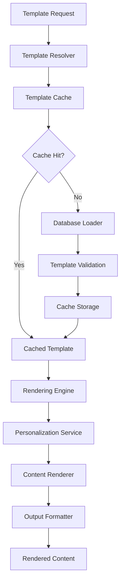

# Template Architecture

## Overview
The template architecture provides a comprehensive template management and rendering system with advanced personalization, multi-format support, conditional content, and A/B testing capabilities.

## Template System Architecture

### Core Components


### Template Rendering Engine
```csharp
public interface ITemplateRenderingEngine
{
    Task<string> RenderAsync(string templateContent, object context, CancellationToken cancellationToken = default);
    Task<string> RenderAsync(int templateId, object context, CancellationToken cancellationToken = default);
    Task<TemplateValidationResult> ValidateAsync(string templateContent, CancellationToken cancellationToken = default);
    Task<string> PreviewAsync(string templateContent, object sampleContext, CancellationToken cancellationToken = default);
}

public class TemplateRenderingEngine : ITemplateRenderingEngine
{
    private readonly ITemplateRepository _templateRepository;
    private readonly IPersonalizationService _personalizationService;
    private readonly ITemplateCache _templateCache;
    private readonly ILogger<TemplateRenderingEngine> _logger;

    public async Task<string> RenderAsync(int templateId, object context, CancellationToken cancellationToken = default)
    {
        // Get template from cache or database
        var template = await GetTemplateAsync(templateId, cancellationToken);
        if (template == null)
        {
            throw new TemplateNotFoundException($"Template with ID {templateId} not found");
        }

        return await RenderAsync(template.Content, context, cancellationToken);
    }

    public async Task<string> RenderAsync(string templateContent, object context, CancellationToken cancellationToken = default)
    {
        try
        {
            // Replace personalization tokens
            var personalizedContent = await _personalizationService.RenderTokensAsync(templateContent, context);

            // Process conditional content
            var finalContent = ProcessConditionalContent(personalizedContent, context);

            // Format based on output type
            return FormatContent(finalContent, context);
        }
        catch (Exception ex)
        {
            _logger.LogError(ex, "Failed to render template content");
            throw new TemplateRenderingException("Template rendering failed", ex);
        }
    }

    private string ProcessConditionalContent(string content, object context)
    {
        // Process {{#if}} blocks
        var ifPattern = @"\{\{#if\s+(.+?)\}\}([\s\S]*?)\{\{/if\}\}";
        content = Regex.Replace(content, ifPattern, match =>
        {
            var condition = match.Groups[1].Value.Trim();
            var blockContent = match.Groups[2].Value;

            return EvaluateCondition(condition, context) ? blockContent : string.Empty;
        }, RegexOptions.IgnoreCase);

        // Process {{#if}}...{{else}}...{{/if}} blocks
        var ifElsePattern = @"\{\{#if\s+(.+?)\}\}([\s\S]*?)\{\{else\}\}([\s\S]*?)\{\{/if\}\}";
        content = Regex.Replace(content, ifElsePattern, match =>
        {
            var condition = match.Groups[1].Value.Trim();
            var ifContent = match.Groups[2].Value;
            var elseContent = match.Groups[3].Value;

            return EvaluateCondition(condition, context) ? ifContent : elseContent;
        }, RegexOptions.IgnoreCase);

        return content;
    }

    private bool EvaluateCondition(string condition, object context)
    {
        // Simple condition evaluation
        // Supports: field == "value", field > number, field != null, etc.

        var contextDict = ConvertToStringDictionary(context);

        // Handle equality conditions: field == "value"
        var equalityMatch = Regex.Match(condition, @"(\w+)\s*==\s*[""']([^""']*)[""']");
        if (equalityMatch.Success)
        {
            var field = equalityMatch.Groups[1].Value;
            var expectedValue = equalityMatch.Groups[2].Value;

            return contextDict.TryGetValue(field, out var actualValue) &&
                   string.Equals(actualValue, expectedValue, StringComparison.OrdinalIgnoreCase);
        }

        // Handle numeric comparisons: field > number
        var numericMatch = Regex.Match(condition, @"(\w+)\s*([><=!]+)\s*(\d+)");
        if (numericMatch.Success)
        {
            var field = numericMatch.Groups[1].Value;
            var operatorValue = numericMatch.Groups[2].Value;
            var expectedNumber = decimal.Parse(numericMatch.Groups[3].Value);

            if (contextDict.TryGetValue(field, out var actualValue) &&
                decimal.TryParse(actualValue, out var actualNumber))
            {
                return operatorValue switch
                {
                    ">" => actualNumber > expectedNumber,
                    ">=" => actualNumber >= expectedNumber,
                    "<" => actualNumber < expectedNumber,
                    "<=" => actualNumber <= expectedNumber,
                    "==" => actualNumber == expectedNumber,
                    "!=" => actualNumber != expectedNumber,
                    _ => false
                };
            }
        }

        // Handle null checks: field != null
        var nullMatch = Regex.Match(condition, @"(\w+)\s*(!=|==)\s*null");
        if (nullMatch.Success)
        {
            var field = nullMatch.Groups[1].Value;
            var operatorValue = nullMatch.Groups[2].Value;

            var hasValue = contextDict.TryGetValue(field, out var value) && !string.IsNullOrEmpty(value);
            return operatorValue == "!=" ? hasValue : !hasValue;
        }

        return false;
    }
}
```

## Personalization Service

### IPersonalizationService Interface
```csharp
public interface IPersonalizationService
{
    Task<object> BuildContextAsync(string recipientId, string eventType, object? eventData = null);
    Task<string> RenderTokensAsync(string content, object context);
    List<string> ExtractTokens(string content);
    object CreateSampleContext(string templateCategory);
    Task<Dictionary<string, object>> GetCustomerContextAsync(string customerId);
    Task<Dictionary<string, object>> GetLoanContextAsync(string loanId);
    Task<Dictionary<string, object>> GetSystemContextAsync();
}

public class PersonalizationService : IPersonalizationService
{
    private readonly ICustomerService _customerService;
    private readonly ILoanService _loanService;
    private readonly IConfigurationService _configService;
    private readonly ILogger<PersonalizationService> _logger;

    public async Task<object> BuildContextAsync(string recipientId, string eventType, object? eventData = null)
    {
        var context = new Dictionary<string, object>();

        try
        {
            // Add system context
            var systemContext = await GetSystemContextAsync();
            foreach (var kvp in systemContext)
            {
                context[kvp.Key] = kvp.Value;
            }

            // Add customer context
            var customerContext = await GetCustomerContextAsync(recipientId);
            foreach (var kvp in customerContext)
            {
                context[kvp.Key] = kvp.Value;
            }

            // Add event-specific context
            if (eventData != null)
            {
                var eventContext = ExtractEventContext(eventData, eventType);
                foreach (var kvp in eventContext)
                {
                    context[kvp.Key] = kvp.Value;
                }
            }

            return context;
        }
        catch (Exception ex)
        {
            _logger.LogError(ex, "Failed to build personalization context for recipient {RecipientId}", recipientId);

            // Return minimal context to prevent total failure
            return new Dictionary<string, object>
            {
                ["customer_name"] = "Valued Customer",
                ["company_name"] = "IntelliFin Microfinance",
                ["current_date"] = DateTime.Now.ToString("dd MMMM yyyy")
            };
        }
    }

    public async Task<string> RenderTokensAsync(string content, object context)
    {
        var contextDict = ConvertToStringDictionary(context);

        // Replace all {{token}} patterns
        var tokenPattern = @"\{\{([^}]+)\}\}";
        var result = Regex.Replace(content, tokenPattern, match =>
        {
            var tokenName = match.Groups[1].Value.Trim();

            if (contextDict.TryGetValue(tokenName, out var value))
            {
                return value ?? string.Empty;
            }

            // Log missing token but don't fail
            _logger.LogWarning("Token {TokenName} not found in context", tokenName);
            return $"[{tokenName}]"; // Placeholder for missing tokens
        });

        return result;
    }

    public async Task<Dictionary<string, object>> GetCustomerContextAsync(string customerId)
    {
        var customer = await _customerService.GetByIdAsync(customerId);
        if (customer == null)
        {
            return new Dictionary<string, object>
            {
                ["customer_name"] = "Valued Customer",
                ["customer_first_name"] = "Customer"
            };
        }

        return new Dictionary<string, object>
        {
            ["customer_name"] = $"{customer.FirstName} {customer.LastName}",
            ["customer_first_name"] = customer.FirstName,
            ["customer_last_name"] = customer.LastName,
            ["customer_nrc"] = customer.NrcNumber,
            ["customer_phone"] = customer.PhoneNumber,
            ["customer_email"] = customer.Email ?? string.Empty,
            ["customer_branch"] = customer.BranchName
        };
    }

    public async Task<Dictionary<string, object>> GetLoanContextAsync(string loanId)
    {
        var loan = await _loanService.GetByIdAsync(loanId);
        if (loan == null)
        {
            return new Dictionary<string, object>();
        }

        return new Dictionary<string, object>
        {
            ["loan_reference"] = loan.ReferenceNumber,
            ["loan_amount"] = FormatCurrency(loan.PrincipalAmount),
            ["loan_balance"] = FormatCurrency(loan.OutstandingBalance),
            ["loan_type"] = loan.ProductType,
            ["due_date"] = loan.NextPaymentDate?.ToString("dd MMM yyyy") ?? "N/A",
            ["next_payment"] = FormatCurrency(loan.NextPaymentAmount),
            ["dpd_days"] = loan.DaysPastDue.ToString(),
            ["total_arrears"] = FormatCurrency(loan.ArrearsAmount)
        };
    }

    public async Task<Dictionary<string, object>> GetSystemContextAsync()
    {
        var config = await _configService.GetSystemConfigAsync();

        return new Dictionary<string, object>
        {
            ["company_name"] = config.CompanyName,
            ["company_phone"] = config.ContactPhone,
            ["company_email"] = config.ContactEmail,
            ["portal_url"] = config.PortalUrl,
            ["current_date"] = DateTime.Now.ToString("dd MMMM yyyy"),
            ["current_time"] = DateTime.Now.ToString("HH:mm"),
            ["business_hours"] = config.BusinessHours
        };
    }

    private string FormatCurrency(decimal amount)
    {
        return $"K {amount:N2}";
    }
}
```

## Template Management Service

### Template CRUD Operations
```csharp
public interface ITemplateManagementService
{
    Task<NotificationTemplate> CreateAsync(CreateTemplateRequest request, CancellationToken cancellationToken = default);
    Task<NotificationTemplate> UpdateAsync(int id, UpdateTemplateRequest request, CancellationToken cancellationToken = default);
    Task<NotificationTemplate?> GetByIdAsync(int id, CancellationToken cancellationToken = default);
    Task<List<NotificationTemplate>> GetByCategoryAsync(string category, string? channel = null, CancellationToken cancellationToken = default);
    Task<NotificationTemplate?> GetActiveVersionAsync(string name, CancellationToken cancellationToken = default);
    Task<TemplateTestResult> SendTestAsync(int templateId, string recipientId, CancellationToken cancellationToken = default);
    Task<List<NotificationTemplate>> GetAllVersionsAsync(string name, CancellationToken cancellationToken = default);
    Task<NotificationTemplate> CloneTemplateAsync(int sourceId, string newName, CancellationToken cancellationToken = default);
}

public class TemplateManagementService : ITemplateManagementService
{
    private readonly ITemplateRepository _templateRepository;
    private readonly ITemplateRenderingEngine _renderingEngine;
    private readonly IPersonalizationService _personalizationService;
    private readonly INotificationProcessingService _notificationService;
    private readonly ITemplateCache _templateCache;

    public async Task<NotificationTemplate> CreateAsync(CreateTemplateRequest request, CancellationToken cancellationToken = default)
    {
        // Validate template content
        var validationResult = await _renderingEngine.ValidateAsync(request.Content, cancellationToken);
        if (!validationResult.IsValid)
        {
            throw new TemplateValidationException("Template validation failed", validationResult.Errors);
        }

        // Check for existing template with same name
        var existingTemplate = await _templateRepository.GetByNameAsync(request.Name, cancellationToken);
        var version = existingTemplate?.Max(t => t.Version) + 1 ?? 1;

        var template = new NotificationTemplate
        {
            Name = request.Name,
            Category = request.Category,
            Channel = request.Channel,
            Language = request.Language ?? "en",
            Subject = request.Subject,
            Content = request.Content,
            PersonalizationTokens = JsonSerializer.Serialize(ExtractTokens(request.Content)),
            IsActive = request.IsActive,
            CreatedBy = request.CreatedBy,
            Version = version
        };

        var createdTemplate = await _templateRepository.CreateAsync(template, cancellationToken);

        // Invalidate cache
        await _templateCache.InvalidateAsync($"template:{createdTemplate.Name}", cancellationToken);

        return createdTemplate;
    }

    public async Task<TemplateTestResult> SendTestAsync(int templateId, string recipientId, CancellationToken cancellationToken = default)
    {
        var template = await _templateRepository.GetByIdAsync(templateId, cancellationToken);
        if (template == null)
        {
            return new TemplateTestResult
            {
                Success = false,
                ErrorMessage = "Template not found"
            };
        }

        try
        {
            // Build test context
            var context = await _personalizationService.BuildContextAsync(recipientId, "Test");

            // Render template
            var renderedContent = await _renderingEngine.RenderAsync(template.Content, context, cancellationToken);

            // Send test notification
            var notificationRequest = new NotificationRequest
            {
                EventId = Guid.NewGuid(),
                RecipientId = recipientId,
                RecipientType = "Test",
                Channel = template.Channel,
                TemplateId = templateId,
                PersonalizationContext = context,
                IsTest = true
            };

            await _notificationService.SendNotificationAsync(notificationRequest, cancellationToken);

            return new TemplateTestResult
            {
                Success = true,
                RenderedContent = renderedContent,
                TestNotificationSent = true
            };
        }
        catch (Exception ex)
        {
            return new TemplateTestResult
            {
                Success = false,
                ErrorMessage = ex.Message,
                RenderedContent = null
            };
        }
    }

    private List<string> ExtractTokens(string content)
    {
        var tokenPattern = @"\{\{([^}]+)\}\}";
        var matches = Regex.Matches(content, tokenPattern);

        return matches
            .Cast<Match>()
            .Select(m => m.Groups[1].Value.Trim())
            .Where(token => !token.StartsWith("#") && !token.StartsWith("/")) // Exclude conditionals
            .Distinct()
            .ToList();
    }
}
```

## Template Models and DTOs

### Template Request/Response Models
```csharp
public class CreateTemplateRequest
{
    public string Name { get; set; } = string.Empty;
    public string Category { get; set; } = string.Empty;
    public string Channel { get; set; } = string.Empty;
    public string? Language { get; set; }
    public string? Subject { get; set; }
    public string Content { get; set; } = string.Empty;
    public bool IsActive { get; set; } = true;
    public string CreatedBy { get; set; } = string.Empty;
}

public class UpdateTemplateRequest
{
    public string? Subject { get; set; }
    public string? Content { get; set; }
    public bool? IsActive { get; set; }
    public string UpdatedBy { get; set; } = string.Empty;
}

public class TemplateValidationResult
{
    public bool IsValid { get; set; }
    public List<string> Errors { get; set; } = new();
    public List<string> Warnings { get; set; } = new();
    public List<string> ExtractedTokens { get; set; } = new();
}

public class TemplateTestResult
{
    public bool Success { get; set; }
    public string? ErrorMessage { get; set; }
    public string? RenderedContent { get; set; }
    public bool TestNotificationSent { get; set; }
}
```

## Template Caching Strategy

### ITemplateCache Interface
```csharp
public interface ITemplateCache
{
    Task<NotificationTemplate?> GetAsync(string key, CancellationToken cancellationToken = default);
    Task SetAsync(string key, NotificationTemplate template, TimeSpan? expiry = null, CancellationToken cancellationToken = default);
    Task InvalidateAsync(string key, CancellationToken cancellationToken = default);
    Task InvalidateByPatternAsync(string pattern, CancellationToken cancellationToken = default);
}

public class RedisTemplateCache : ITemplateCache
{
    private readonly IDatabase _database;
    private readonly ILogger<RedisTemplateCache> _logger;
    private readonly JsonSerializerOptions _jsonOptions;

    public async Task<NotificationTemplate?> GetAsync(string key, CancellationToken cancellationToken = default)
    {
        try
        {
            var cached = await _database.StringGetAsync(key);
            if (cached.HasValue)
            {
                return JsonSerializer.Deserialize<NotificationTemplate>(cached, _jsonOptions);
            }
        }
        catch (Exception ex)
        {
            _logger.LogWarning(ex, "Failed to get template from cache: {Key}", key);
        }

        return null;
    }

    public async Task SetAsync(string key, NotificationTemplate template, TimeSpan? expiry = null, CancellationToken cancellationToken = default)
    {
        try
        {
            var serialized = JsonSerializer.Serialize(template, _jsonOptions);
            await _database.StringSetAsync(key, serialized, expiry ?? TimeSpan.FromHours(1));
        }
        catch (Exception ex)
        {
            _logger.LogWarning(ex, "Failed to cache template: {Key}", key);
        }
    }
}
```

## A/B Testing Framework

### Template Variant Management
```csharp
public class TemplateVariant
{
    public int Id { get; set; }
    public int TemplateId { get; set; }
    public string Name { get; set; } = string.Empty;
    public string Content { get; set; } = string.Empty;
    public decimal TrafficPercentage { get; set; }
    public bool IsActive { get; set; }
    public DateTime CreatedAt { get; set; }
    public TemplateVariantMetrics Metrics { get; set; } = new();
}

public class TemplateVariantMetrics
{
    public int SentCount { get; set; }
    public int DeliveredCount { get; set; }
    public int ClickCount { get; set; }
    public int ResponseCount { get; set; }
    public decimal DeliveryRate => SentCount > 0 ? (decimal)DeliveredCount / SentCount * 100 : 0;
    public decimal ClickRate => DeliveredCount > 0 ? (decimal)ClickCount / DeliveredCount * 100 : 0;
    public decimal ResponseRate => DeliveredCount > 0 ? (decimal)ResponseCount / DeliveredCount * 100 : 0;
}

public interface ITemplateVariantService
{
    Task<TemplateVariant> CreateVariantAsync(int templateId, string name, string content, decimal trafficPercentage);
    Task<TemplateVariant?> SelectVariantAsync(int templateId, string recipientId);
    Task RecordMetricAsync(int variantId, string metricType, int count = 1);
    Task<List<TemplateVariantMetrics>> GetVariantMetricsAsync(int templateId, DateTime fromDate, DateTime toDate);
}

public class TemplateVariantService : ITemplateVariantService
{
    public async Task<TemplateVariant?> SelectVariantAsync(int templateId, string recipientId)
    {
        var variants = await GetActiveVariantsAsync(templateId);
        if (!variants.Any())
        {
            return null;
        }

        // Use consistent hash to ensure same user gets same variant
        var hash = Math.Abs(recipientId.GetHashCode());
        var selector = hash % 100;

        decimal cumulativePercentage = 0;
        foreach (var variant in variants.OrderBy(v => v.Id))
        {
            cumulativePercentage += variant.TrafficPercentage;
            if (selector < cumulativePercentage)
            {
                return variant;
            }
        }

        // Fallback to first variant
        return variants.First();
    }
}
```

## Template Examples

### SMS Templates
```text
// Loan Application Received (Customer)
Dear {{customer_name}},

Your loan application for {{loan_amount}} has been received successfully.

Reference: {{loan_reference}}
Expected response: 48 hours

Track your application at {{portal_url}}

{{company_name}}
{{company_phone}}

// Payment Overdue (Escalating Tone)
{{#if dpd_days == 1}}
Dear {{customer_name}}, your payment of {{next_payment}} was due yesterday. Please pay today to avoid charges.
{{else if dpd_days <= 7}}
REMINDER: Your loan payment of {{next_payment}} is {{dpd_days}} days overdue. Please pay immediately.
{{else}}
URGENT: Your loan is {{dpd_days}} days overdue. Amount due: {{total_arrears}}. Contact us immediately at {{company_phone}}.
{{/if}}

Reference: {{loan_reference}}
{{company_name}}
```

### Email Templates
```html
<!-- Loan Approval Email -->
<!DOCTYPE html>
<html>
<head>
    <meta charset="utf-8">
    <title>Loan Approved - {{company_name}}</title>
</head>
<body>
    <div style="font-family: Arial, sans-serif; max-width: 600px; margin: 0 auto;">
        <h2 style="color: #2c5aa0;">Congratulations {{customer_name}}!</h2>

        <p>We are pleased to inform you that your loan application has been <strong>approved</strong>.</p>

        <div style="background-color: #f8f9fa; padding: 20px; border-radius: 5px; margin: 20px 0;">
            <h3>Loan Details:</h3>
            <ul>
                <li>Loan Amount: <strong>{{loan_amount}}</strong></li>
                <li>Reference Number: <strong>{{loan_reference}}</strong></li>
                <li>Product Type: <strong>{{loan_type}}</strong></li>
            </ul>
        </div>

        <h3>Next Steps:</h3>
        <ol>
            <li>Visit our {{customer_branch}} branch for document completion</li>
            <li>Bring your NRC ({{customer_nrc}}) and required documents</li>
            <li>Funds will be disbursed within 24 hours</li>
        </ol>

        <p>Questions? Contact us at {{company_phone}} during {{business_hours}}.</p>

        <p>Best regards,<br>{{company_name}} Team</p>
    </div>
</body>
</html>
```

This template architecture provides a robust, scalable foundation for managing and rendering personalized notifications across multiple channels while supporting advanced features like A/B testing and conditional content.