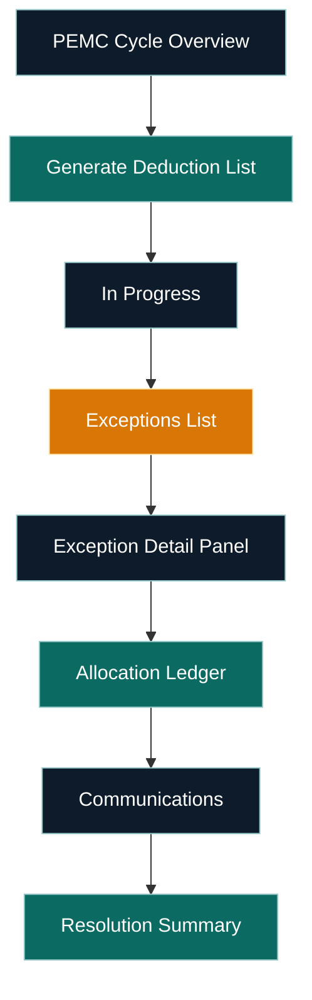
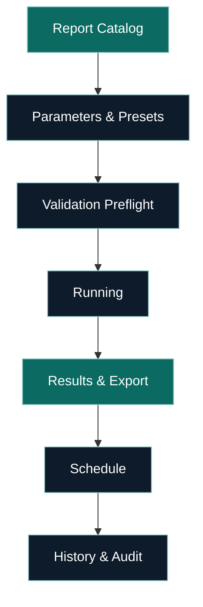

# LMS Clickable Prototype Map

This prototype map links the key flows to detailed screen/state specs in the State Brief. Open alongside the State Brief for smooth navigation.

Key docs:
- State Brief — file:///d:/Projects/LMS/lms-state-brief.md
- Style Guide — file:///d:/Projects/LMS/lms-ux-style-guide.md

Tip: Click any node (in supported Mermaid viewers) or the markdown links below to jump to the corresponding section.

---

## Priority Flow 1 — Multi-Product Origination

```mermaid
graph TD
  %% Classes
  classDef primary fill:#0B6B62,stroke:#93C5C6,color:#FFFFFF;
  classDef default fill:#0D1B2A,stroke:#93C5C6,color:#FFFFFF;
  classDef warn fill:#D97706,stroke:#FFE8B3,color:#FFFFFF;
  classDef alt fill:#334155,stroke:#CBD5E1,color:#FFFFFF;

  A[Start Application]:::primary --> B[Product Selection]:::primary
  B --> C1[Payroll (MOU) Path]:::default
  B --> C2[Business (Collateral) Path]:::alt

  %% Payroll path
  C1 --> D1[Consent & PEMC Authorization]:::default
  D1 --> E1[PEMC Verification]:::default
  E1 --> F1[Affordability & Limits]:::default
  F1 --> G1[Documents Checklist]:::default
  G1 --> H1[Underwriting]:::default
  H1 --> I1[Approval]:::primary
  I1 --> J1[Disbursement Handoff]:::primary

  %% Business path
  C2 --> D2[Collateral Intake]:::alt
  D2 --> E2[Valuation & Insurance]:::alt
  E2 --> H2[Underwriting]:::alt
  H2 --> I2[Approval]:::primary
  I2 --> J2[Disbursement Handoff]:::primary

  %% Clickable links
  click A "file:///d:/Projects/LMS/lms-state-brief.md#screen-start-application" "Open Start Application"
  click B "file:///d:/Projects/LMS/lms-state-brief.md#screen-start-application" "Open Product Selection"
  click C1 "file:///d:/Projects/LMS/lms-state-brief.md#multi-product-loan-origination-back-office" "Open Payroll path section"
  click C2 "file:///d:/Projects/LMS/lms-state-brief.md#multi-product-loan-origination-back-office" "Open Business path section"
  click D1 "file:///d:/Projects/LMS/lms-state-brief.md#screen-payroll-path--pemc-verification" "Open Consent"
  click E1 "file:///d:/Projects/LMS/lms-state-brief.md#screen-payroll-path--pemc-verification" "Open PEMC Verification"
  click F1 "file:///d:/Projects/LMS/lms-state-brief.md#multi-product-loan-origination-back-office" "Open Affordability"
  click G1 "file:///d:/Projects/LMS/lms-state-brief.md#multi-product-loan-origination-back-office" "Open Documents"
  click H1 "file:///d:/Projects/LMS/lms-state-brief.md#multi-product-loan-origination-back-office" "Open Underwriting"
  click I1 "file:///d:/Projects/LMS/lms-state-brief.md#multi-product-loan-origination-back-office" "Open Approval"
  click J1 "file:///d:/Projects/LMS/lms-state-brief.md#multi-product-loan-origination-back-office" "Open Disbursement Handoff"

  click D2 "file:///d:/Projects/LMS/lms-state-brief.md#screen-business-path--collateral-intake" "Open Collateral Intake"
  click E2 "file:///d:/Projects/LMS/lms-state-brief.md#screen-business-path--collateral-intake" "Open Valuation & Insurance"
  click H2 "file:///d:/Projects/LMS/lms-state-brief.md#multi-product-loan-origination-back-office" "Open Underwriting"
  click I2 "file:///d:/Projects/LMS/lms-state-brief.md#multi-product-loan-origination-back-office" "Open Approval"
  click J2 "file:///d:/Projects/LMS/lms-state-brief.md#multi-product-loan-origination-back-office" "Open Disbursement Handoff"
```

Markdown quick links:
- Start/Application & Product Selection — file:///d:/Projects/LMS/lms-state-brief.md#screen-start-application
- Payroll Path (Consent, PEMC, Affordability, Docs, UW, Approval, Handoff) — file:///d:/Projects/LMS/lms-state-brief.md#screen-payroll-path--pemc-verification
- Business Path (Collateral, Valuation, UW, Approval, Handoff) — file:///d:/Projects/LMS/lms-state-brief.md#screen-business-path--collateral-intake

---

## Priority Flow 2 — PEMC Exceptions Workbench



Markdown quick links:
- Cycle Overview — file:///d:/Projects/LMS/lms-state-brief.md#screen-pemc-cycle-overview
- Exceptions Workbench — file:///d:/Projects/LMS/lms-state-brief.md#screen-exceptions-workbench

---

## Priority Flow 3 — Reporting Catalog with Product Filters



Markdown quick links:
- Report Catalog — file:///d:/Projects/LMS/lms-state-brief.md#screen-report-catalog-jasperreports
- Report Run (Params, Preflight, Running, Results, Schedule, History) — file:///d:/Projects/LMS/lms-state-brief.md#screen-report-run

---

## Global Navigation Map

- KYC & Client Profile — file:///d:/Projects/LMS/lms-state-brief.md#boz-compliant-client-management--kyc
- Credit Assessment — file:///d:/Projects/LMS/lms-state-brief.md#credit-assessment-first-time-applicants-only
- Multi-Product Origination — file:///d:/Projects/LMS/lms-state-brief.md#multi-product-loan-origination-back-office
- Disbursement & Reconciliation — file:///d:/Projects/LMS/lms-state-brief.md#traditional-disbursement--payment-processing
- Multi-Branch — file:///d:/Projects/LMS/lms-state-brief.md#multi-branch-architecture-future-ready
- General Ledger — file:///d:/Projects/LMS/lms-state-brief.md#boz-compliant-integrated-general-ledger
- Collections & Recovery (PEMC) — file:///d:/Projects/LMS/lms-state-brief.md#collections--recovery-government-employee-focused
- Collateral Management — file:///d:/Projects/LMS/lms-state-brief.md#collateral-management--documentation
- Reporting Suite (Jasper) — file:///d:/Projects/LMS/lms-state-brief.md#comprehensive-reporting-suite
- CEO Offline Command Center — file:///d:/Projects/LMS/lms-state-brief.md#ceo-secure-offline-command-center
- Data Protection & Compliance — file:///d:/Projects/LMS/lms-state-brief.md#data-protection--zambian-compliance

---

## Notes
- Colors and motion adhere to the Style Guide (focus rings #14B8A6, transitions 200–360ms ease-out/spring).
- If diagram node clicks aren’t supported in your viewer, use the markdown quick links below each diagram.
